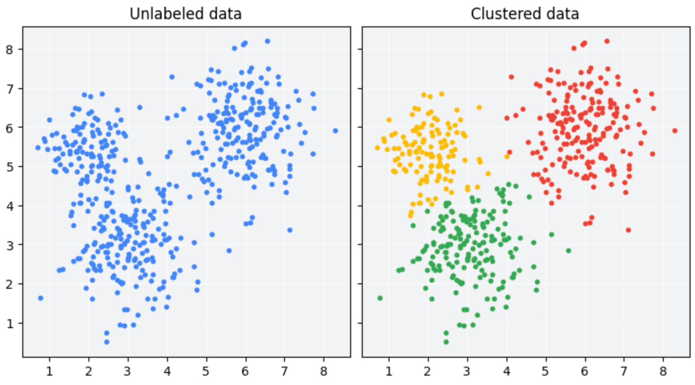
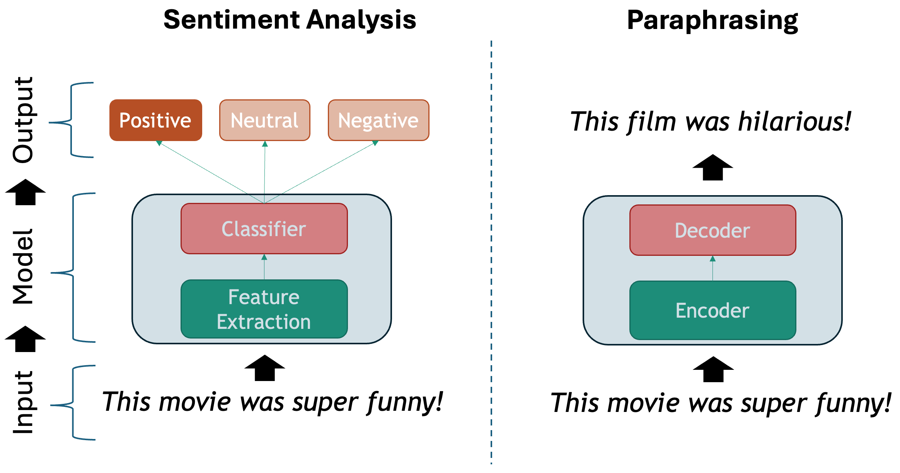
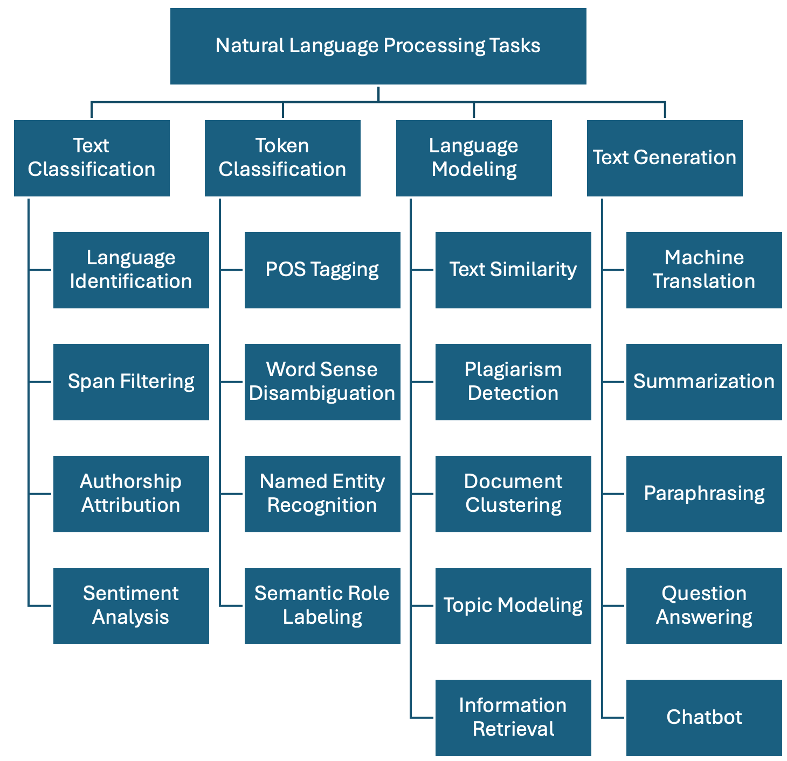
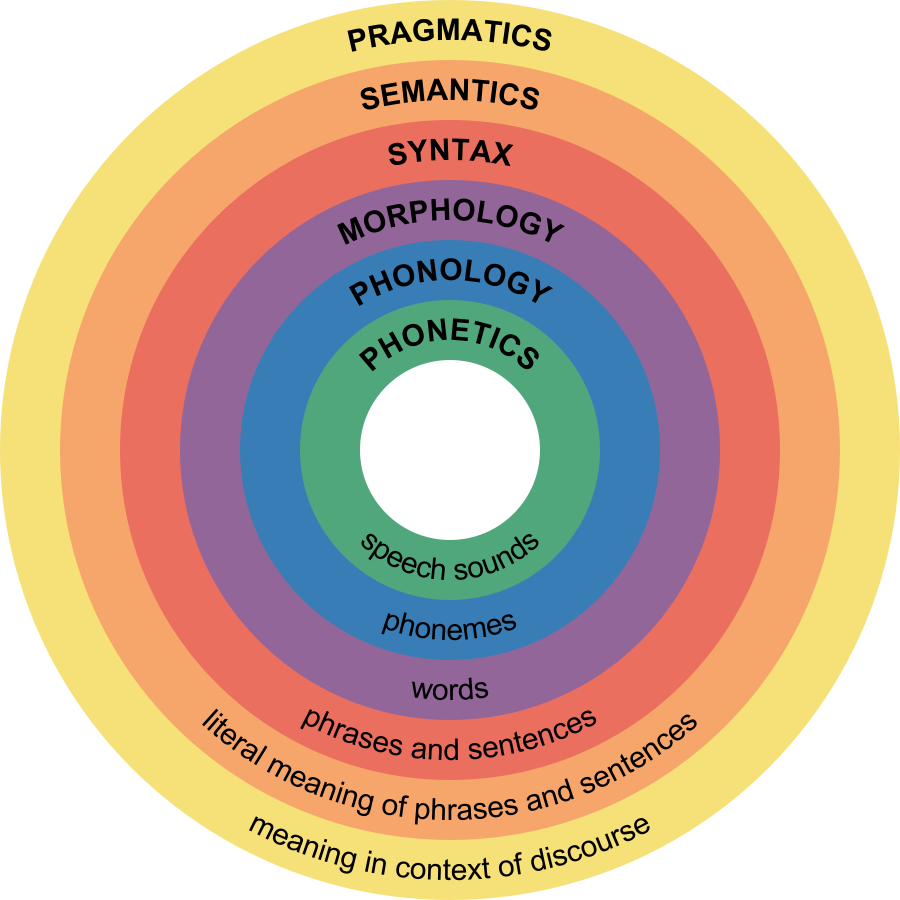
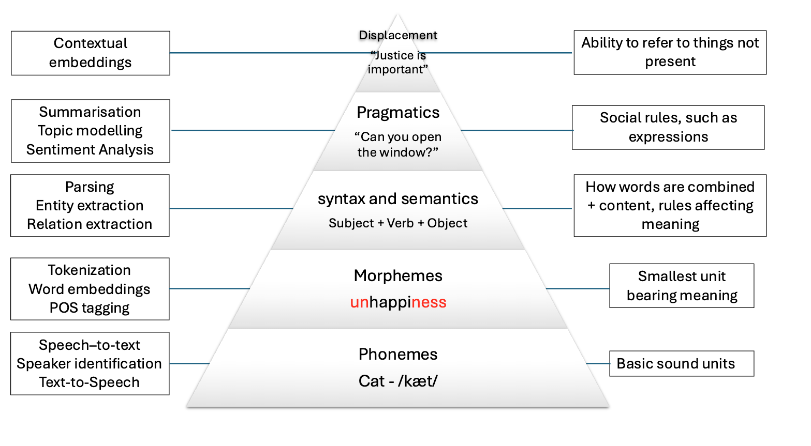

::: questions
-   How is language approached from a Machine Learning perspective?
-   What makes text different from other data?
-   What linguistic properties should we consider when dealing with texts? 
:::

::: objectives
-   Learn a taxonomy of NLP tasks
-   Identify basic linguistic concepts in NLP
:::

Natural language exhibits a set of properties that make it more challenging to process than other types of data such as tables, spreadsheets or time series. To address this, we can first visit the existing different ways of abstracting the problems when dealing with texts. This is what is called an NLP task: deciding on the important aspects that interest us in a the text and how to extract them. We will then revisit basic linguistic concepts that make text processing difficult in general. **Language is hard to process because it is compositional, ambiguous, discrete and sparse**. Let's visit each of these concepts and understand them.

## NLP tasks

There are several ways to describe the tasks that NLP solves. From the Machine Learning perspective, we have:

-   Unsupervised tasks: exploiting existing patterns from large amounts of text.

{width="582"}

-   Supervised tasks: learning to classify texts given a labeled set of examples

{width="605"}


Regardless of the chosen method, we show one possible taxonomy of NLP tasks below. The tasks are grouped together with some of their most prominent applications. This is a non-exhaustive list, as in reality there are hundreds of them, but it is a good start:

{width="630"}

-   **Text Classification**: Assign one or more labels to a given piece of text. This text is usually referred to as a *document* and in our context this can be a sentence, a paragraph, a book chapter, etc...

    -   **Language Identification**: determining the language in which a particular input text is written.
    -   **Spam Filtering**: classifying emails into spam or not spam based on their content.
    -   **Authorship Attribution**: determining the author of a text based on its style and content (based on the assumption that each author has a unique writing style).
    -   **Sentiment Analysis**: classifying text into positive, negative or neutral sentiment. For example, in the sentence "I love this product!", the model would classify it as positive sentiment.

-   **Token Classification**: The task of individually assigning one label to each word in a document. This is a one-to-one mapping; however, because words do not occur in isolation and their meaning depend on the sequence of words to the left or the right of them, this is also called Word-In-Context Classification or Sequence Labeling and usually involves syntactic and semantic analysis.

    -   **Part-Of-Speech Tagging**: is the task of assigning a part-of-speech label (e.g., noun, verb, adjective) to each word in a sentence.
    -   **Chunking**: splitting a running text into "chunks" of words that together represent a meaningful unit: phrases, sentences, paragraphs, etc.
    -   **Word Sense Disambiguation**: based on the context what does a word mean (think of "book" in "I read a book." vs "I want to book a flight.")
    -   **Named Entity Recognition**: recognize world entities in text, e.g. Persons, Locations, Book Titles, or many others. For example "Mary Shelley" is a person, "Frankenstein or the Modern Prometheus" is a book, etc.
    -   **Semantic Role Labeling**: the task of finding out "Who did what to whom?" in a sentence: information from events such as agents, participants, circumstances, subject-verb-object triples etc.
    -   **Relation Extraction**: the task of identifying named relationships between entities in a text, e.g. "Apple is based in California" has the relation (Apple, based_in, California).
    -   **Co-reference Resolution**: the task of determining which words refer to the same entity in a text, e.g. "Mary is a doctor. She works at the hospital." Here "She" refers to "Mary".
    -   **Entity Linking**: the task of disambiguation of named entities in a text, linking them to their corresponding entries in a knowledge base, e.g. Mary Shelley's biography in Wikipedia.

-   **Language Modeling**: Given a sequence of words, the model predicts the next word. For example, in the sentence "The capital of France is \_\_\_\_\_", the model should predict "Paris" based on the context. This task was initially useful for building solutions that require speech and optical character recognition (even handwriting), language translation and spelling correction. Nowadays this has scaled up to the LLMs that we know. A byproduct of pre-trained Language Modeling is the **vectorized representation** of texts which allows to perform specific tasks such as:

    -   **Text Similarity**: The task of determining how similar two pieces of text are.
    -   **Plagiarism detection**: determining whether a piece of text, B, is close enough to another known piece of text, A, which increases the likelihood that it was plagiarized.
    -   **Document clustering**: grouping similar texts together based on their content.
    -   **Topic modelling**: a specific instance of clustering, here we automatically identify abstract "topics" that occur in a set of documents, where each topic is represented as a cluster of words that frequently appear together.
    -   **Information Retrieval**: this is the task of finding relevant information or documents from a large collection of unstructured data based on user's query, e.g., "What's the best restaurant near me?".

-   **Text Generation**: the task of generating text based on a given input. This is usually done by generating the output word by word, conditioned on both the input and the output so far. The difference with Language Modeling is that for generation there are higher-level generation objectives such as:

    -   **Machine Translation**: translating text from one language to another, e.g., "Hello" in English to "Que tal" in Spanish.
    -   **Summarization**: generating a concise summary of a longer text. It can be abstractive (generating new sentences that capture the main ideas of the original text) but also extractive (selecting important sentences from the original text).
    -   **Paraphrasing**: generating a new sentence that conveys the same meaning as the original sentence, e.g., "The cat is on the mat." to "The mat has a cat on it.".
    -   **Question Answering**: given a question and a context, the model generates an answer. For example, given the question "What is the capital of France?" and the Wikipedia article about France as the context, the model should answer "Paris". This task can be approached as a text classification problem (where the answer is one of the predefined options) or as a generative task (where the model generates the answer from scratch).
    -   **Conversational Agent (ChatBot)**: Building a system that interacts with a user via natural language, e.g., "What's the weather today, Siri?". These agents are widely used to improve user experience in customer service, personal assistance and many other domains.


## Compositionality

The basic elements of written languages are characters, a sequence of characters form words, and words in turn denote objects, concepts, events, actions and ideas (Goldberg, 2016). Subsequently, words form phrases and sentences which are used in communication and depend on the context in which they are used. We as humans derive the meaning of utterances from interpreting contextual information that is present at different levels at the same time:

{width="573"}

The first two levels refer to spoken language only, and the other four levels are present in both speech and text. Because in principle machines do not have access to the same levels of information that we do (they can only have independent audio, textual or visual inputs), we need to come up with clever methods to overcome this significant limitation. Knowing the levels of language is important so we consider what kind of problems we are facing when attempting to solve our NLP task at hand.

## Ambiguity

The disambiguation of meaning is usually a by-product of the context in which utterances are expressed and also of the historic accumulation of interactions which are transmitted across generations (think for instance to idioms -- these are usually meaningless phrases that acquire meaning only if situated within their historical and societal context). These characteristics make NLP a particularly challenging field to work in.

We cannot expect a machine to process human language and simply understand it as it is. We need a systematic, scientific approach to deal with it. It's within this premise that the field of NLP is born, primarily interested in converting the building blocks of human/natural language into something that a machine can understand.

The image below shows how the levels of language relate to a few NLP applications:



:::: challenge
### Levels of ambiguity

Discuss what the following sentences mean. What level of ambiguity do they represent?:

-   "The door is unlockable from the inside." vs "Unfortunately, the cabinet is unlockable, so we can't secure it"
-   "I saw the *cat with the stripes*" vs "I saw the cat *with the telescope*"
-   "Please don’t drive the cat to the vet!" vs "Please don’t drive the car tomorrow!"

-   "I never said she stole my money." (re-write this sentence multiple times and each time emphasize a different word in uppercases).

::: solution
This is why the previous statements were difficult:

-   "Un-lockable vs Unlock-able" is a **Morphological** ambiguity: Same word form, two possible meanings
-   "I saw the cat with the telescope" has a **Syntactic** ambiguity: Same sentence structure, different properties
-   "drive the cat" vs "drive the car" shows a **Semantic** ambiguity: Syntactically identical sentences that imply quite different actions.
-   "I NEVER said she stole MY money." is a **Pragmatic** ambiguity: Meaning relies on word emphasis
:::
::::

Whenever you are solving a specific task, you should ask yourself what kind of ambiguity can affect your results, and to what degrees? At what level are your assumptions operating when defining your research questions? Having the answers to this can save you a lot of time when debugging your models. Sometimes the most innocent assumptions (for example using the wrong tokenizer) can create enormous performance drops even when the higher level assumptions were correct.

## Sparsity

Another key property of linguistic data is its sparsity. This means that if we are hunting for a specific phenomenon, we may often realize it barely occurs inside a vast amount of text. Imagine we have the following brief text and we are interested in *pizzas* and *hamburgers*:

``` python
# A mini-corpus where our target words appear
text = """
I am hungry. Should I eat delicious pizza?
Or maybe I should eat a juicy hamburger instead.
Many people like to eat pizza because is tasty, they think pizza is delicious as hell!
My friend prefers to eat a hamburger and I agree with him.
We will drive our car to the restaurant to get the succulent hamburger.
Right now, our cat sleeps on the mat so we won't take him.
I did not wash my car, but at least the car has gasoline.
Perhaps when we come back we will take out the cat for a walk.
The cat will be happy then.
"""
```

We can first use spaCy to tokenize the text and do some direct word count:

``` python
import spacy
nlp = spacy.load("en_core_web_sm")

doc = nlp(text)
words = [token.lower_ for token in doc if token.is_alpha]  # Filter out punctuation and new lines
print(words)
print(len(words))
```

We have in total 104 words, but we actually want to know how many times each word appears. For that we use the Python Counter and then we can visualize it inside a chart with matplotlib:

``` python
from collections import Counter
import matplotlib.pyplot as plt

word_count = Counter(words).most_common()
tokens = [item[0] for item in word_count]
frequencies = [item[1] for item in word_count]

plt.figure(figsize=(18, 6))
plt.bar(tokens, frequencies)
plt.xticks(rotation=90)
plt.show()
```

This bar chart shows us several things about sparsity, even with such a small text:

-   The most common words are filler words such as "the", "of", "not" etc. These are known as **stopwords** because such words by themselves generally do not hold a lot of information about the meaning of the piece of text.

-   The two concepts (hamburger and pizza) we are interested in, appear only 3 times each, out of 104 words (comprising only \~3% of our corpus). This number only goes lower as the corpus size increases

-   There is a long tail in the distribution, where actually a lot of meaningful words are located.


::: callout
### Stop Words
The most frequent words in texts are those which contribute little semantic value on their own: articles ('the', 'a', 'an'), conjunctions ('and', 'or', 'but'), prepositions ('on', 'by'), auxiliary verbs ('is', 'am'), pronouns ('he', 'which'), or any highly frequent word that might not be of interest in several *content-only* related tasks.

**Stop words** are extremely frequent syntactic filler words that not always provide relevant semantic information for our use case. For some use cases it is better to ignore them in order to fight the sparsity phenomenon. However, consider that in many other use cases the syntactic information that stop words provide is crucial to solve the task.

SpaCy has a pre-defined list of stopwords per language. To explicitly load the English stop words we can do:

``` python
from spacy.lang.en.stop_words import STOP_WORDS
print(STOP_WORDS)  # a set of common stopwords
print(len(STOP_WORDS)) # There are 326 words considered in this list
```

You can also manually extend the list of stop words if you are interested in ignoring other unlisted terms that you encounter in your data.

Alternatively, you can filter out stop words when iterating your tokens (remember the spaCy token properties!) like this:

``` python
doc = nlp(text)
content_words = [token.text for token in doc if token.is_alpha and not token.is_stop]  # Filter out stop words and punctuation
print(content_words)
```

There is no canonical definition of stop words because what you consider to be a stop word is directly linked to the objective of your task at hand. For example, pronouns are usually considered stopwords, but if you want to do gender bias analysis then pronouns are actually a key element of your text processing pipeline. Similarly, removing articles and prepositions from text is obviously not advised if you are doing _dependency parsing_ (the task of identifying the parts of speech in a given text).

Another special case is the word 'not' which may encode the semantic notion of _negation_. Removing such tokens can drastically change the meaning of sentences and therefore affect the accuracy of models for which negation is important to preserve (e.g., sentiment classification "this movie was NOT great" vs. "this movie was great").
:::


::: callout
Sparsity is closely related to what is frequently called **domain-specific data**. The discourse context in which language is used varies importantly across disciplines (domains). Take for example law texts and medical texts which are typically filled with domain-specific jargon. We should expect the top part of the distribution to contain mostly the same words as they tend to be stop words. But once we remove the stop words, the top of the distribution will contain very different content words. 

Also, the meaning of concepts described in each domain might significantly differ. For example the word "trial" refers to a procedure for examining evidence in court, but in the medical domain this could refer to a clinical "trial" which is a procedure to test the efficacy and safety of treatments on patients. For this reason there are specialized models and corpora that model language use in specific domains. The concept of fine-tuning a general purpose model with domain-specific data is also popular, even when using LLMs.
:::

## Discreteness

There is no inherent relationship between the form of a word and its meaning. For this reason, by syntactic or lexical analysis alone, there is no automatic way of knowing if two words are similar in meaning or how they relate semantically to each other. For example, "car" and "cat" appear to be very closely related at the morphological level, only one letter needs to change to convert one word into the other. But the two words represent concepts or entities in the world which are very different. Conversely, "pizza" and "hamburger" look very different (they only share one letter in common) but are more closely related semantically, because they both refer to typical fast foods.

How can we automatically know that "pizza" and "hamburger" share more semantic properties than "car" and "cat"? One way is by looking at the **context** (neighboring words) of these words. This idea is the principle behind **distributional semantics**, and aims to look at the statistical properties of language, such as word co-occurrences (what words are typically located nearby a given word in a given corpus of text), to understand how words relate to each other.

Let's keep using the list of words from our mini corpus:

``` python
words = [token.lower_ for token in doc if token.is_alpha]
```

Now we will create a dictionary where we accumulate the words that appear around our words of interest. In this case we want to find out, according to our corpus, the most frequent words that occur around *pizza*, *hamburger*, *car* and *cat*:

``` python
target_words = ["pizza", "hamburger", "car", "cat"] # words we want to analyze
co_occurrence = {word: [] for word in target_words}
co_occurrence
```

We iterate over each word in our corpus, collecting its surrounding words within a defined window. A window consists of a set number of words to the left and right of the target word, as determined by the window_size parameter. For example, with `window_size = 3`, a word `W` has a window of six neighboring words—three preceding and three following—excluding `W` itself:

``` python
window_size = 3 # How many words to look at on each side
for i, word in enumerate(words):
    # If the current word is one of our target words...
    if word in target_words:
        start = max(0, i - window_size) # get the start index of the window
        end = min(len(words), i + 1 + window_size) # get the end index of the window
        context = words[start:i] + words[i+1:end]  # Exclude the target word itself
        co_occurrence[word].extend(context)

print(co_occurrence)
```

We call the words that fall inside this window the `context` of a target word. We can already see other interesting related words in the context of each target word, but a lot of non interesting stuff is in there. To obtain even nicer results, we can delete the stop words from the context window before adding it to the dictionary. You can define your own stop words, here we use the STOP_WORDS list provided by spaCy:

``` python
from spacy.lang.en.stop_words import STOP_WORDS

co_occurrence = {word: [] for word in target_words} # Empty the dictionary

window_size = 3 # How many words to look at on each side
for i, word in enumerate(words):
    # If the current word is one of our target words...
    if word in target_words:
        start = max(0, i - window_size) # get the start index of the window
        end = min(len(words), i + 1 + window_size) # get the end index of the window
        context = words[start:i] + words[i+1:end]  # Exclude the target word itself
        context = [w for w in context if w not in STOP_WORDS] # Filter out stop words
        co_occurrence[word].extend(context)

print(co_occurrence)
```

Our dictionary keys represent each word of interest, and the values are a list of the words that occur within *window_size* distance of the word. Now we use a Counter to get the most common items:

``` python
# Print the most common context words for each target word
print("Contextual Fingerprints:\n")
for word, context_list in co_occurrence.items():
    # We use Counter to get a frequency count of context words
    fingerprint = Counter(context_list).most_common(5)
    print(f"'{word}': {fingerprint}")
```

``` output
Contextual Fingerprints:

'pizza': [('eat', 2), ('delicious', 2), ('tasty', 2), ('maybe', 1), ('like', 1)]
'hamburger': [('eat', 2), ('juicy', 1), ('instead', 1), ('people', 1), ('agree', 1)]
'car': [('drive', 1), ('restaurant', 1), ('wash', 1), ('gasoline', 1)]
'cat': [('walk', 2), ('right', 1), ('sleeps', 1), ('happy', 1)]
```

As our mini experiment demonstrates, discreteness can be combatted with statistical co-occurrence: words with similar meaning will occur around similar concepts, giving us an idea of similarity that has nothing to do with syntactic or lexical form of words. This is the core idea behind most modern semantic representation models in NLP.


::: callout
### Linguistic Resources

There are also several curated resources (textual data) that can help solve your NLP-related tasks, specifically when you need highly specialized definitions. An exhaustive list would be impossible as there are thousands of them, and also them being language and domain dependent. Below we mention some of the most prominent, just to give you an idea of the kind of resources you can find, so you don't need to reinvent the wheel every time you start a project:

-   [HuggingFace Datasets](https://huggingface.co/datasets): A large collection of datasets for NLP tasks, including text classification, question answering, and language modeling.
-   [WordNet](https://wordnet.princeton.edu/): A large lexical database of English, where words are grouped into sets of synonyms (synsets) and linked by semantic relations.
-   [Europarl](https://www.europarl.europa.eu/ep-search/search.do?language=en): A parallel corpus of the proceedings of the European Parliament, available in 21 languages, which can be used for machine translation and cross-lingual NLP tasks.
-   [Universal Dependencies](https://universaldependencies.org/): A collection of syntactically annotated treebanks across 100+ languages, providing a consistent annotation scheme for syntactic and morphological properties of words, which can be used for cross-lingual NLP tasks.
-   [PropBank](https://propbank.github.io/): A corpus of texts annotated with information about basic semantic propositions, which can be used for English semantic tasks.
-   [FrameNet](https://framenet.icsi.berkeley.edu/fndrupal/): A lexical resource that provides information about the semantic frames that underlie the meanings of words (mainly verbs and nouns), including their roles and relations.
-   [BabelNet](https://babelnet.org/): A multilingual lexical resource that combines WordNet and Wikipedia, providing a large number of concepts and their relations in multiple languages.
-   [Wikidata](https://www.wikidata.org/): A free and open knowledge base initially derived from Wikipedia, that contains structured data about entities, their properties and relations, which can be used to enrich NLP applications.
-   [Dolma](https://github.com/allenai/dolma): An open dataset of 3 trillion tokens from a diverse mix of clean web content, academic publications, code, books, and encyclopedic materials, used to train English large language models.
:::


What did we learn in this lesson?


::: keypoints

- Deep learning has significantly advanced NLP, but the challenge remains in processing the discrete and ambiguous nature of language. 

- The ultimate goal of NLP is to enable machines to understand and process language as humans do.

- Key tasks include text classification, token classification, language modeling and text generation. 
:::
