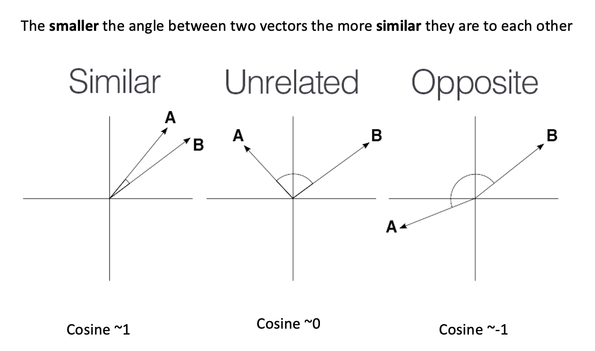

::: questions
-   What operations should I perform to get clean text?
-   What properties do word embeddings have?
-   What is a word2vec model?
-   What insights can I get from word embeddings?
-   How do I train my own word2vec model?

:::

::: objectives
After following this lesson, learners will be able to:

-   Learn basic preprocessing operations
-   Implement a basic NLP Pipeline
-   Understand the concept of word embeddings
-   Use and Explore word2vec models
-   Train your own word2vec
:::

## Introduction

In this episode, we will learn to apply preprocessing operations to our text files. We will visit the concept of NLP Pipelines and learn about their basic components.

We will then explain the transition from text-based NLP into word embeddings. We will visit the Word2Vec vector space, a method to represent words proposed in 2013 by [Mikolov et al](https://arxiv.org/pdf/1301.3781), where instead of counting word co-occurrences they trained a neural network on large amounts of text to predict the context windows. By doing this, they obtained continuous vectors that represent words, which hold interesting semantic properties.

## Preprocessing Operations

As in most data science and machine learning scenarios, usually your text data sources won't be in the exact shape that you need. Preprocessing operations in NLP are analogue to the data cleaning and sanitation step in any Machine Learning task. Whether you need to perform certain preprocessing operations and the order of them will depend on your NLP task at hand.

Also note that preprocessing can differ significantly if you work with different languages. This is both in terms of which steps to apply, but also which methods to use for a specific step.

Here we will analyze with more detail the most common pre-processing steps when dealing with unstructured English text data:


### Data Formatting
Text comes in different formats (Microsoft Word documents, PDF documents, ePub files, plain text etc...). The first step is to obtain a clean text representation that can be transferred into python UTF-8 strings that our scripts can manipulate.

Take a look at the `episodes/data/84_frankenstein_or_the_modern_prometheus.txt` file: 

```python
filename = "data/84_frankenstein_or_the_modern_prometheus.txt"
with open(filename, 'r', encoding='utf-8') as file:
    text = file.read()

print(text[:300]) # print the first 300 characters
```

Our file is already in plain text so it might seem we do not need to do anything; however, if we look closer we see new line characters separating not only paragraphs but breaking the lines in the middle of sentences. While this is useful to keep the text in a narrow space to help the human reader, it introduces artificial breaks that can confuse any automatic analysis (for example to identify where sentences start and end). 

One straightforward way is to replace the new lines with spaces so all the text is in a single line:

```python
text_flat = text.replace("\n", " ")
print(text_flat[:300]) # print the first 300 characters
```

Other data formatting operations might include:
- Remove special or noisy characters (think of documents obtained by OCR)
- Remove HTML tags
- Strip non-meaningful punctuation (think of dashes separating words when the line ends)
- Strip footnotes and headers
- Remove URLs or phone numbers

::: callout
Another important choice at the data formatting level is to decide at what granularity do you need to perform the NLP task: 

- Are you analyzing phenomena at the **word level**? 
- Do you need to first extract sentences from the text and do analysis at the **sentence level**? 
- Do you need full **chunks of text**? (e.g. paragraphs or chapters?)
- Or perhaps you want to extract patterns at the **document level**? For example each book should have a genre tag.

Sometimes your data will be already available at the desired granularity level. If this is not the case, then during the tokenization step you will need to figure out how to obtain the desired granularity level.
:::

### Tokenization 

Tokenization is essential in NLP, as it helps to create structure from raw text. It involves the segmentation of the text into smaller units referred as `tokens`. Tokens can be sentences (e.g. `'the happy cat'`), words (`'the', 'happy', 'cat'`), subwords (`'un', 'happiness'`) or characters (`'c','a', 't'`). The choice of tokens depends by the requirement of the model used for training, and the text.

Python strings are by definition sequences of characters, thus we can iterate the string char by char:

```python
print(type(text_flat))  # Should be <class 'str'>
for ch in text_flat:
    print(ch)
```

 However, it is more advantageous if our atomic units are words. As we know already, the task of extracting words from texts is not trivial, therefore pre-trained models such as sPaCy can help us with this step. In this case we will use the small English model that was trained on a web corpus:

```python
import spacy
nlp = spacy.load("en_core_web_sm")

doc = nlp(text)
print(type(doc))  # Should be <class 'spacy.tokens.doc.Doc'>
print(len(doc))
print(doc)
```

::: callout
A good word tokenizer for example, does not simply break up a text based on spaces and punctuation, but it should be able to distinguish:

-   abbreviations that include points (e.g.: *e.g.*)
-   times (*11:15*) and dates written in various formats (*01/01/2024* or *01-01-2024*)
-   word contractions such as *don't*, these should be split into *do* and *n't*
-   URLs

Many older tokenizers are rule-based, meaning that they iterate over a number of predefined rules to split the text into tokens, which is useful for splitting text into word tokens for example. Modern large language models use subword tokenization, which learn to break text into pieces that are statistically convenient, this makes them more flexible but less human-readable.
:::

We can access the tokens by iterating the document and getting its `.text` property:

``` python
tokens_txt = [token.text for token in doc]
print(tokens_txt[:15])
```

``` output
['Letter', '1', '\n\n\n', 'St.', 'Petersburgh', ',', 'Dec.', '11th', ',', '17', '-', '-', '\n\n', 'TO', 'Mrs.']
```

This shows us the individual tokens, including new lines and punctuation (in case we didn't run the previous cleaning step). SpaCy allows us to filter based in token properties. For example, assume we are not interested in the newlines, punctuation nor in numeric tokens, so in one single step we can keep only the token objects that contain alphabetical:

``` python
tokens = [token for token in doc if token.is_alpha]
print(tokens[:15])
```

``` output
[Letter, Petersburgh, TO, Saville, England, You, will, rejoice, to, hear, that, no, disaster, has, accompanied]
```

We do not have to depend necessarily on the `Doc` and `Token` spaCy objects. Once we tokenized the text with the spaCy model, we can extract the list of words as a list of strings and continue our text analysis:

```python
words = [token.text for token in doc]
print(words[:20])
```

Again, it all depends on what your requirements are. For example, sometimes it is more useful if our atomic units are sentences. Think of the NLP task of classifying each whole sentence inside a text as Positive/Negative/Neutral. SpaCy also helps with this using a sentence segmentation model:

```python
sentences = [sent.text for sent in doc.sents]
[print(s) for s in sentences[:5]]
```

Note that in this case each sentence is an untokenized string. If you later are interested in accessing the tokens inside each sentence, you have to run a word tokenizer on each sentence.

### Lowercasing

Removing uppercases to e.g. avoid treating "Dog" and "dog" as two different words is also a common step, for example to train word vector representations, we want to merge both occurrences as they represent exactly the same concept. Lowercasing can be done with python directly as:

```python
lower_text = text_flat.lower()
lower_text[:100] # Beware that this is a python string operation
```

Beware that lowercasing the whole string as a first step might affect the tokenizer since tokenization benefits from information provided by case-sensitive strings. We can therefore tokenize first using spaCy and then obtain the lowercase strings of each token using the `.lower_` property:

```python
lower_text = [token.lower_ for token in doc]
lower_text[:10] # Beware that this is a list of strings now!
```

In other cases, such as with Named Entity Recognition, lowercasing can actually damage the performance of your model, since words that start with an uppercase (not preceded by a period) tend to be proper nouns that map into Entities, for example:

```text
My next laptop will be from Apple, Will said.

my next laptop will be from apple, will said.
```

### Lemmatization 
Although it has become less frequent, normalizing words into their *dictionary form* can help to focus on relevant aspects of text. Think how "eating", "ate", "eaten" are all a variation of the verb "eat".

Lemmatization is a NLP task on its own therefore we also tend to use ready pre-trained models to obtain the lemmas. Using spaCy we can access the lemmmatized version of each token with the `lemma_` (notice the underscore!) property:

```python
lemmas = [token.lemma_ for token in doc]
print(lemmas)
```

Note that the list of lemmas is now a list of strings.

Having a lemmatized text allows us to merge into a single token the different surface occurrences of the same concept. This can be very useful for count based methods, or for generating word representations. For example, you can have a single vector for `eat` instead of one vector per verb tense. 

As with each preprocessing operation, this step is optional. Think for example, the cases where the differences of verb usage according to tense is informative, or the difference between singular and plural usage of nouns, in those cases lemmatizing will get rid of important information for your task. 


### Stop Word Removal
The most frequent words in texts are those which contribute little semantic value on their own: articles ('the', 'a', 'an'), conjunctions ('and', 'or', 'but'), prepositions ('on', 'by'), auxiliary verbs ('is', 'am'), pronouns ('he', 'which'), or any highly frequent word that might not be of interest in several *content-only* related tasks. Let's define a small list of stop words for this specific case:

```python
STOP_WORDS = ["the", "you", "will"] # This list can be customized to your needs...
```

Using python directly, we need to manually define a list of what we consider to be stop words and directly filter the tokens that match this. Note that doing the lemmatization step was crucial to get more coverage with the stop word filtering:

```python
lemmas = [token.lemma_ for token in doc]
content_words = []
for lemma in lemmas:
    if lemma not in STOP_WORDS:
        content_words.append(lemma)
print(content_words[:20])
```

Using spaCy we can filter the stop words based on the token properties:

``` python
tokens_nostop = [token for token in tokens if not token.is_stop]
print(tokens[:15])
```

There is no canonical definition of stop words because what you consider to be a stop word is directly linked to the objective of your task at hand. For example, pronouns are usually considered stopwords, but if you want to do gender bias analysis then pronouns are actually a key element of your text processing pipeline. 

Another special case is the word 'not' which carries a highly significant semantic value, the mere presence of this token changes the meaning of the sentences.

## NLP Pipeline

The concept of NLP pipeline refers to the sequence of operations that we apply to our data in order to go from the original data (e.g. original raw documents) to the expected outputs of our NLP Task at hand. The components of the pipeline refer to any manipulation we apply to the text, and do not necessarily need to be complex models, they involve preprocessing operations, application of rules or machine learning models, as well as formatting the outputs in a desired way.

### A simple rule-based classifier
Imagine we want to build a very lightweight sentiment classifier. A basic approach is to design the following pipeline: 

1. Clean Original Text File
2. Apply a sentence segmentation model
3. Define a set of positive and negative words
4. For each sentence: 
    - If it contains one or more of the positive words, classify as `POSITIVE`
    - If it contains one or more of the negative words, classify as `NEGATIVE`
    - Otherwise classify as `NEUTRAL`
5. Output a table with the original sentence and the assigned label


This is implemented with the following code:

1. Read the text and normalize it into a single line

```python
import spacy
nlp = spacy.load("en_core_web_sm")

filename = "data/84_frankenstein_or_the_modern_prometheus.txt"
with open(filename, 'r', encoding='utf-8') as file:
    text = file.read()

text = text.replace("\n", " ")
```

2. Apply Sentence segmentation

```python
doc = nlp(text)
sentences = [sent.text for sent in doc.sents]
```

3. Define the positive and negative words you care about:

```python
positive_words = ["happy", "excited", "delighted", "content", "love", "enjoyment"]
negative_words = ["unhappy", "sad", "anxious", "miserable", "fear", "horror"]
```

4. Apply the rules to each sentence and collect the labels

```python
classified_sentences = []

for sent in sentences:
    if any(word in sent.lower() for word in positive_words):
        classified_sentences.append((sent, 'POSITIVE'))
    elif any(word in sent.lower() for word in negative_words):
        classified_sentences.append((sent, 'NEGATIVE'))
    else:
        classified_sentences.append((sent, 'NEUTRAL'))
```

5. Save the classified data

```python
import pandas as pd
df = pd.DataFrame(classified_sentences, columns=['sentence', 'label'])
df.to_csv('results_naive_rule_classifier.csv', sep='\t')
```

:::: challenge
Discuss the pros and cons of the proposed NLP pipeline: 
1. Do you think it will give accurate results?
2. What do you think about the coverage of this approach? What cases will it miss? 
3. Think of possible drawbacks of chaining components in a pipeline.

::: solution
1. This classifier only considers the presence of one word to apply a label. It does not analyze sentence semantics or even syntax.
2. Given how the rules are defined, if both positive and negative words are present in the same sentence it will assign the `POSITIVE` label. It will generate a lot of false positives because of the simplistic rules
3. The errors from previous steps get carried over to the next steps increasing the likelihood of noisy outputs.
:::

::::


So far we’ve seen how to format and segment the text to have atomic data at the word level or sentence level.
We then apply operations to the word and sentence strings. This approach still depends on counting and exact keyword matching. And as we have already seen it has several limitations. 

One way to combat this is by transforming each word into numeric representations and then perform math operations on them. We then can define similarity measures for the word representations which will allow more advance models, such as machine learning models, exploit patterns beyond the sting matching level. This is where the concept of word embeddings comes in handy.


## Word Embeddings

As we have seen, count-based methods can be directly applied to learn statistical co-occurrences in raw texts. Count-based methods are limited because they rapidly become unmanageable. The idea behind word embeddings is built on top of exploiting statistical co-occurrences in context but **instead of holding explicit counts for every single word and document, a neural network is trained to predict missing words in context**. 

A shallow neural network is optimized with the task of language modeling and the final trained network holds vectors of a fixed size whose values can be mapped into linguistic properties (since the training objective was language modeling). Since similar words occur in similar contexts, or have same characteristics, a properly trained model will learn to assign similar vectors to similar words.

By representing words with vectors, we can mathematically manipulate them through vector arithmetic and express semantic similarity in terms of vector distance. Because the size of the learned vectors is not proportional to the amount of documents we can learn the representations from larger collections of texts, obtaining more robust representations, that are less corpus-dependent.

## The Word2Vec Vector Space

There are two main architectures for training Word2Vec:

-   Continuous Bag-of-Words (CBOW): Predicts a target word based on its surrounding context words.
-   Continuous Skip-Gram: Predicts surrounding context words given a target word.


::: callout
CBOW is faster to train, while Skip-Gram is more effective for infrequent words. Increasing context size improves embeddings but increases training time.
:::

The python module `gensim` offers a very useful interface to interact with pre-trained word2vec models and also to train our own. First we will explore the model from the original Word2Vec paper, which was trained on a big corpus from Google News. We will see what functionalities are available to explore a vector space. Then we will step by step prepare our own text to train our own word2vec models and save them.

### Load the embeddings and inspect them

The library `gensim` has a repository with English pre-trained models. We can take a look at the models:

``` python
import gensim.downloader
available_models = gensim.downloader.info()['models'].keys()
print(list(available_models))
```

We will download the google News model with:

``` python
w2v_model = gensim.downloader.load('word2vec-google-news-300')
```

We can do some basic checkups such as showing how many words are in the vocabulary (i.e. for how many words do we have an available vector), what is the dimension of each vector and pick at how the vectors look inside:

``` python
print(len(w2v_model.key_to_index.keys())) # 3 million words
print(w2v_model.vector_size) # 300 dimensions. This can be chosen when training your own model
print(w2v_model['car'][:10]) # The first 10 dimensions of the vector representing 'car'.
print(w2v_model['cat'][:10]) # The first 10 dimensions of the vector representing 'cat'.
```

``` output
3000000
300
[ 0.13085938  0.00842285  0.03344727 -0.05883789  0.04003906 -0.14257812
  0.04931641 -0.16894531  0.20898438  0.11962891]
[ 0.0123291   0.20410156 -0.28515625  0.21679688  0.11816406  0.08300781
  0.04980469 -0.00952148  0.22070312 -0.12597656]
```

This is a very big model with 3 million words and the dimensionality chosen at training time was 300, thus each word will have a 300-dimension vector associated to it.

Even with such a big vocabulary we can always find a word that won't be in there:

``` python
print(w2v_model['bazzinga'][:10])
```

This will throw a `KeyError` as the model does not know that word. Unfortunately this is a limitation that word2vec cannot solve.

Now let's talk about the vectors themselves. They are not easy to interpret as they are a bunch of floating point numbers. These are the weights that the network learned when optimizing for language modelling. As the vectors are hard to interpret, we rely on a mathematical method to compute how similar two vectors are. The best metric for measuring similarity between two high-dimensional vectors is cosine similarity.

::: callout
[cosine similarity](https://en.wikipedia.org/wiki/Cosine_similarity) ranges between [`-1` and `1`]. It is the cosine of the angle between two vectors, divided by the product of their length. Mathematically speaking, when two vectors point in exactly the same direction their cosine will be 1, and when they point in the opposite direction their cosine will be -1. In python we can use Numpy to compute the cosine similarity of vectors.

{alt=""}
:::

We can use `sklearn` learn to measure any pair of high-dimensional vectors:

``` python
from sklearn.metrics.pairwise import cosine_similarity

car_vector = w2v_model['car']
cat_vector = w2v_model['cat']

similarity = cosine_similarity([car_vector], [cat_vector])
print(f"Cosine similarity between 'car' and 'cat': {similarity[0][0]}")

similarity = cosine_similarity([w2v_model['hamburger']], [w2v_model['pizza']])
print(f"Cosine similarity between 'hamburger' and 'pizza': {similarity[0][0]}")
```

``` python

Cosine similarity between 'car' and 'cat': 0.21528185904026031
Cosine similarity between 'hamburger' and 'pizza': 0.6153676509857178
```

Or you can use directly the `w2v_model.similarity('car', 'cat')` function which gives the same result.

The higher similarity score between the hamburger and pizza indicates they are more similar based on the contexts where they appear in the training data. Even though is hard to read all the floating numbers in the vectors, we can trust this metric to always give us a hint of which words are semantically closer than others

:::: challenge
Think of different word pairs and try to guess how close or distant they will be from each other. Use the similarity measure from the word2vec module to compute the metric and discuss if this fits your expectations. If not, can you come up with a reason why this was not the case?

::: solution
Interesting cases are synonyms, antonyms and morphologically related words:

``` python
print(w2v_model.similarity('democracy', 'democratic'))
print(w2v_model.similarity('queen', 'princess'))
print(w2v_model.similarity('love', 'hate')) #!! (think of "I love X" and "I hate X")
print(w2v_model.similarity('love', 'lover'))
```

``` output
0.86444813
0.7070532
0.6003957
0.48608577
```
:::
::::

### Vector Neighborhoods

Now that we have a metric we can trust, we can retrieve neighborhoods of vectors that are close to a given word. This is analogous to retrieving semantically related terms to a target term. Let's explore the neighborhood around \`pizza\` using the `most_similar()` method:

``` python
print(w2v_model.most_similar('pizza', topn=10))
```

This returns a list of ranked tuples with the form (word, similarity_score). The list is already ordered in descent, so the first element is the closest vector in the vector space, the second element is the second closest word and so on...

``` output
[('pizzas', 0.7863470911979675), 
('Domino_pizza', 0.7342829704284668), 
('Pizza', 0.6988078355789185), 
('pepperoni_pizza', 0.6902607083320618), 
('sandwich', 0.6840401887893677), 
('burger', 0.6569692492485046), 
('sandwiches', 0.6495091319084167), 
('takeout_pizza', 0.6491535902023315), 
('gourmet_pizza', 0.6400628089904785), 
('meatball_sandwich', 0.6377009749412537)]
```

Exploring neighborhoods can help us understand why some vectors are closer (or not so much). Take the case of *love* and *lover*, originally we might think these should be very close to each other but by looking at their neighborhoods we understand why this is not the case:

``` python
print(w2v_model.most_similar('love', topn=10))
print(w2v_model.most_similar('lover', topn=10))
```

This returns a list of ranked tuples with the form (word, similarity_score). The list is already ordered in descent, so the first element is the closest vector in the vector space, the second element is the second closest word and so on...

``` output
[('loved', 0.6907791495323181), ('adore', 0.6816874146461487), ('loves', 0.6618633270263672), ('passion', 0.6100709438323975), ('hate', 0.6003956198692322), ('loving', 0.5886634588241577), ('Ilove', 0.5702950954437256), ('affection', 0.5664337873458862), ('undying_love', 0.5547305345535278), ('absolutely_adore', 0.5536840558052063)]

[('paramour', 0.6798686385154724), ('mistress', 0.6387110352516174), ('boyfriend', 0.6375402212142944), ('lovers', 0.6339589953422546), ('girlfriend', 0.6140860915184021), ('beau', 0.609399676322937), ('fiancé', 0.5994566679000854), ('soulmate', 0.5993717312812805), ('hubby', 0.5904166102409363), ('fiancée', 0.5888950228691101)]
```

The first word is a noun or a verb (depending on the context) that denotes affection to someone/something , so it is associated with other concepts of affection (positive or negative). The case of *lover* is used to describe a person, hence the associated concepts are descriptors of people with whom the lover can be associated.

### Word Analogies with Vectors

Another powerful property that word embeddings show is that vector algebra can preserve semantic analogy. An analogy is a comparison between two different things based on their similar features or relationships, for example king is to queen as man is to woman. We can mimic this operations directly on the vectors using the `most_similar()` method with the `positive` and `negative` parameters:

``` python
# king is to man as what is to woman?
# king + woman - man = queen
w2v_model.most_similar(positive=['king', 'woman'], negative=['man'])
```

``` output
[('queen', 0.7118192911148071),
 ('monarch', 0.6189674735069275),
 ('princess', 0.5902431011199951),
 ('crown_prince', 0.5499460697174072),
 ('prince', 0.5377321243286133),
 ('kings', 0.5236844420433044),
 ('Queen_Consort', 0.5235945582389832),
 ('queens', 0.5181134343147278),
 ('sultan', 0.5098593235015869),
 ('monarchy', 0.5087411403656006)]
```

## Train your own Word2Vec

The `gensim` package has implemented everything for us, this means we have to focus mostly on obtaining clean data and then calling the `Word2Vec` object to train our own model with our own data. This can be done like follows:

``` python
import gensim 
from gensim.models import Word2Vec 

model = Word2Vec([clean_tokens], sg=0 , vector_size=300, window=5, min_count=1, workers=4)
```

With this line code we are configuring our whole Word2Vec training schema. We will be using CBOW (`sg=0` means CBOW, `sg=1` means Skip-gram). We are interested in having vectors with 300 dimensions `vector_size=300` and a context size of 5 surrounding words `window=5`. Because we already filtered our tokens, we include all words present in the filtered corpora, regardless of their frequency of occurrence `min_count=1`. The last parameters tells python to use 4 CPU cores for training.

See the Gensim [documentation](https://radimrehurek.com/gensim/models/word2vec.html) for more training options.

### Save and Retrieve your model

Once your model is trained it is useful to save the checkpoint in order to retrieve it next time instead of having to train it every time. You can save it with:

```python
model.save("word2vec_mini_books.model")
```

Let's put everything together. We have now the following NLP task: train our own Word2Vec model. We are interested on having vectors for content words only, so even though our preprocessing will unfortunately loose a lot of the original information, in exchange we will be able manipulate the most relevant conceptual words as individual numeric representations. 


:::: challenge
Let's apply this step by step on a longer text. In this case, because we are learning the process, our corpus will be only one book but in reality we would like to train a network with thousands of them. We will use two books: Frankenstein and Dracula to train a model of word vectors.

Write the code to follow the proposed pipeline and train the word2vec model. The proposed pipeline for this task is: 

- load the text files
- tokenize files
- keep only alphanumerical tokens
- lowercase words
- lemmatize words
- Remove stop words
- Train a Word2Vec model (feed the clean tokens to the `Word2Vec` object)
- Save the trained model

::: solution
```python
pass
```
:::

::::

To load back the pre-trained vectors you just created you can use the following code:

```python
model = Word2Vec.load("word2vec_mini_books.model")
w2v = model.wv
# Test:
w2v.most_similar('monster')
```


::: callout
## Dataset size in training

To obtain your own high-quality embeddings, the size/length of the training dataset plays a crucial role. Generally [tens of thousands of documents](https://cs.stanford.edu/~quocle/paragraph_vector.pdf) are considered a reasonable amount of data for decent results.

Is there however a strict minimum? Not really. Things to keep in mind is that `vocabulary size`, `document length` and `desired vector size` interacts with each other. The higher the dimensional vectors (e.g. 200-300 dimensions) the more data is required, and of high quality, i.e. that allows the learning of words in a variety of contexts.

While word2vec models typically perform better with large datasets containing millions of words, using a single page is sufficient for demonstration and learning purposes. This smaller dataset allows us to train the model quickly and understand how word2vec works without the need for extensive computational resources.
:::


::: keypoints
-   We can represent text as vectors of numbers (which makes it interpretable for machines)
-   We can run a preprocessing pipeline to obtain clear words that can be used as features
-   We can easily compute how words are similar to each other with the cosine similarity
-   Using gensim we can train our own word2vec models
:::
