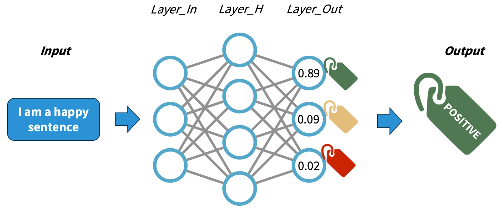
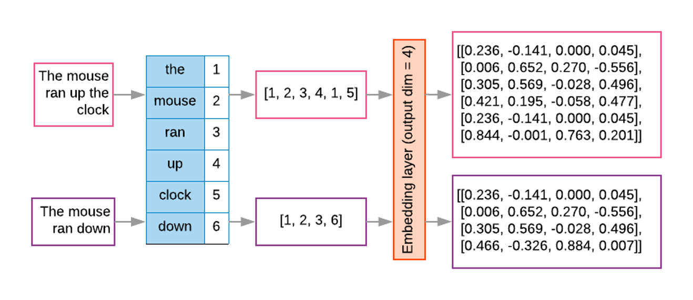
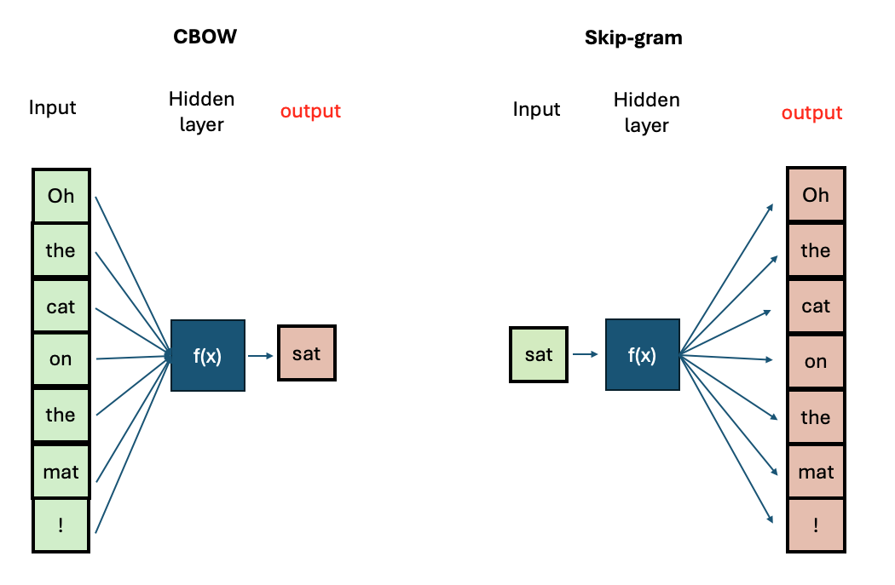
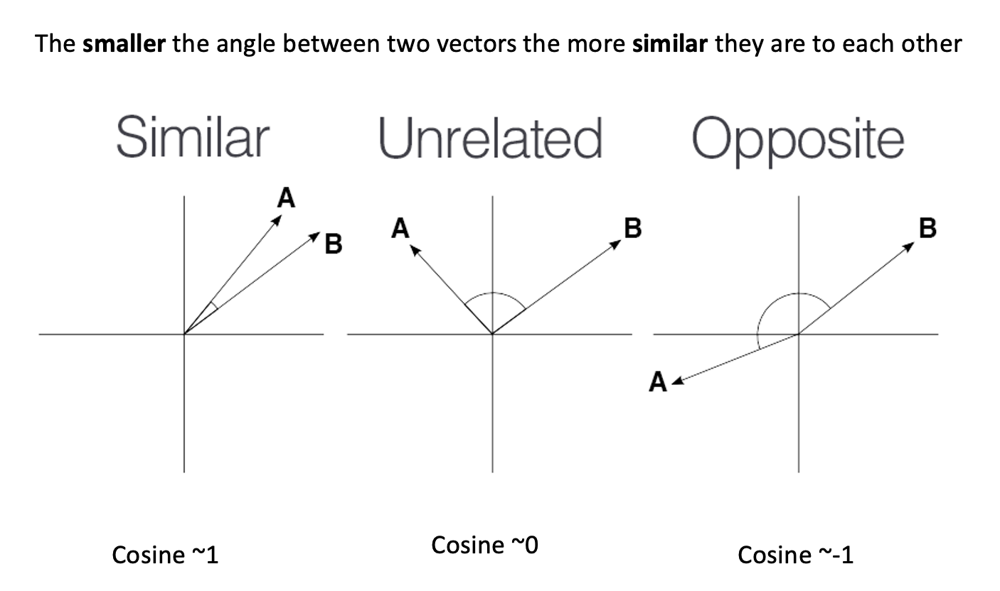
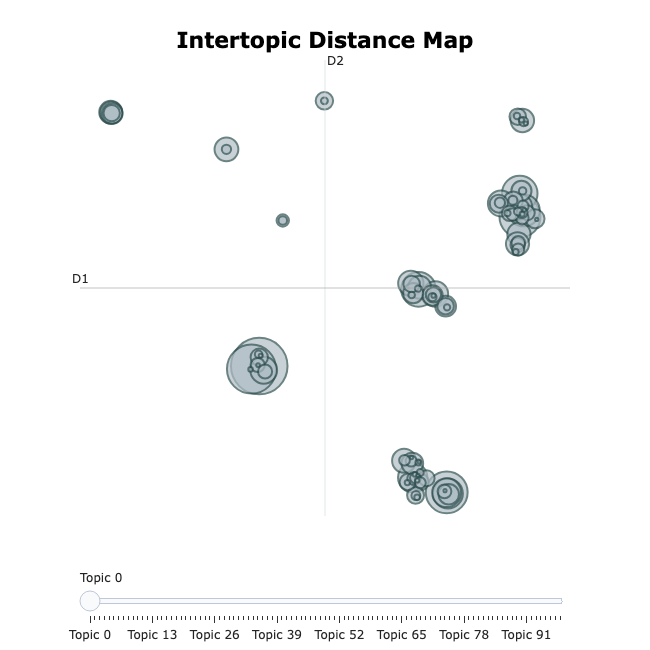
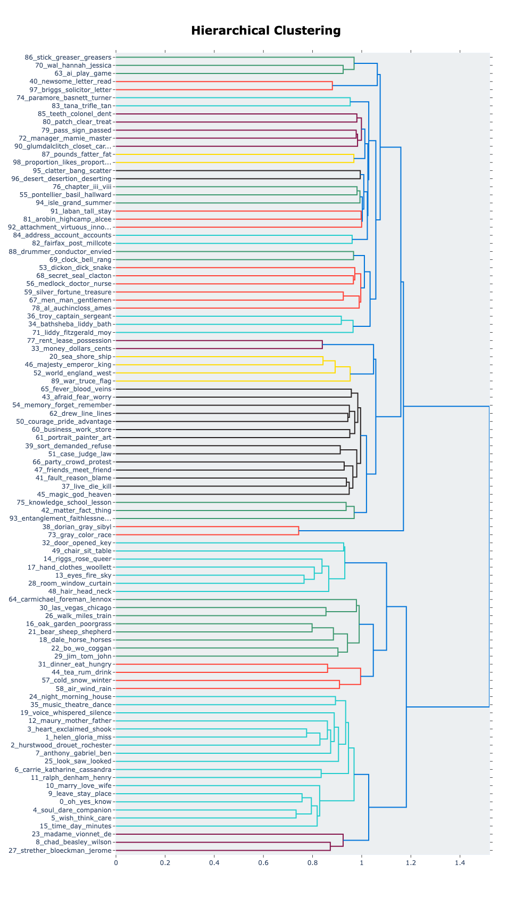
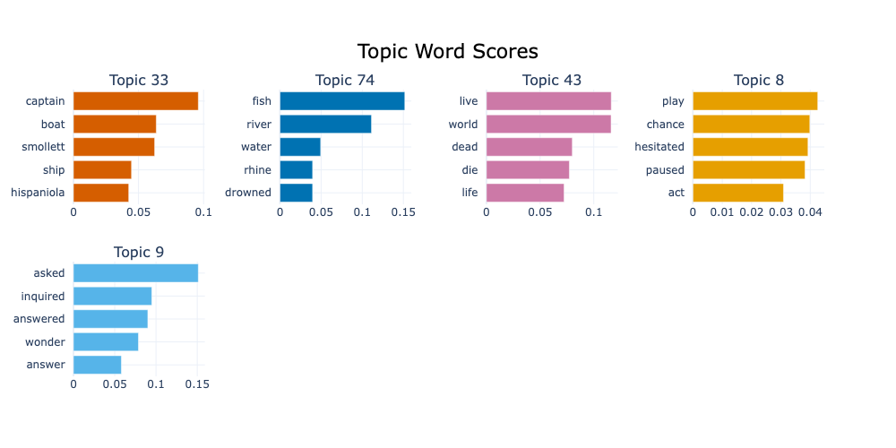

::: questions

- What are the steps that matter for defining an NLP task?
- How can words be represented as numbers that capture meaning?
- What kinds of semantic relationships can word embeddings encode?
- What are the limitations of static word representations like Word2Vec?
- How can we train our own Word2Vec model?
- How can we automatically discover hidden topics in a collection of texts?

:::

::: objectives
After following this lesson, learners will be able to:

- Implement a basic NLP Pipeline.
- Explain the motivation for vectorisation in modern NLP.
- Describe the kinds of semantic relationships captured by Word2Vec.
- Explain the limitations of the Word2Vec representation by way of example.
- Train a custom Word2Vec model using the Gensim library.
- Apply Topic Modelling to a text corpus using BERTopic.
:::

## Setup

If you haven't done it already during the workshop setup, please run `invoke download-litbank` to download the data that we are going to use for this episode.

## Introduction

In this episode, we will learn about the importance of preprocessing text in NLP, and how to apply common preprocessing operations to text files. We will also learn more about _NLP Pipelines_, learn about their basic components and how to construct such pipelines.

We will then address the transition from rule-based NLP to distributional semantics approaches which encode text into numerical representations based on statistical relationships between tokens. We will introduce one particular algorithm for this kind of encoding called Word2Vec, which was proposed in 2013 by [Mikolov et al](https://arxiv.org/pdf/1301.3781). We will show what kind of useful semantic relationships these representations encode in text, and how we can use them to solve specific NLP tasks. We will also discuss some of the limitations of Word2Vec which are addressed in the next lesson on transformers before concluding with a summary of what we covered in this lesson.

## NLP Pipeline

The concept of NLP pipeline refers to the sequence of operations that we apply to our data in order to go from the original data (e.g. original raw documents) to the expected outputs of our NLP task at hand. The components of the pipeline refer to any manipulation we apply to the text, and do not necessarily need to be complex models. They involve preprocessing operations, application of rules or machine learning models, as well as formatting the outputs in a desired way.

### A simple rule-based classifier

Imagine that we want to build a very lightweight sentiment classifier. A basic approach is to design the following pipeline:

1. Clean the original text file (as we saw in the Data Formatting section)
2. Apply a sentence segmentation or tokenisation model
3. Define a set of positive and negative words (a hardcoded dictionary)
4. For each sentence:
    - If it contains one or more of the positive words, classify as `POSITIVE`
    - If it contains one or more of the negative words, classify as `NEGATIVE`
    - Otherwise classify as `NEUTRAL`
5. Output a table with the original sentence and the assigned label

This is implemented with the following code:

1. Read the text and normalise it into a single line

```python
import spacy
nlp = spacy.load("en_core_web_sm")

filename = "data/84_frankenstein_or_the_modern_prometheus.txt"
with open(filename, 'r', encoding='utf-8') as file:
    text = file.read()

text = text.replace("\n", " ") # some cleaning by removing new line characters
```

2. Apply sentence segmentation

```python
doc = nlp(text)
sentences = [sent.text for sent in doc.sents]
```

3. Define the positive and negative words you care about:

```python
positive_words = ["happy", "excited", "delighted", "content", "love", "enjoyment"]
negative_words = ["unhappy", "sad", "anxious", "miserable", "fear", "horror"]
```

4. Apply the rules to each sentence and collect the labels

```python
classified_sentences = []

for sent in sentences:
    if any(word in sent.lower() for word in positive_words):
        classified_sentences.append((sent, 'POSITIVE'))
    elif any(word in sent.lower() for word in negative_words):
        classified_sentences.append((sent, 'NEGATIVE'))
    else:
        classified_sentences.append((sent, 'NEUTRAL'))
```

5. Save the classified data

```python
import pandas as pd
df = pd.DataFrame(classified_sentences, columns=['sentence', 'label'])
df.to_csv('results_naive_rule_classifier.csv', sep='\t')
```

:::: challenge
Discuss the pros and cons of the proposed NLP pipeline:

1. Do you think it will give accurate results?
2. What do you think about the coverage of this approach? What cases will it miss?
3. Think of possible drawbacks of chaining components in a pipeline.

::: solution

1. This classifier only considers the presence of one word to apply a label. It does not analyze sentence semantics or even syntax.
2. Given how the rules are defined, if both positive and negative words are present in the same sentence it will assign the `POSITIVE` label. It will generate a lot of false positives because of the simplistic rules.
3. The errors from previous steps get carried over to the next steps increasing the likelihood of noisy outputs.

:::

::::

So far, we’ve seen how to format and segment the text to have atomic data at the word level or sentence level. We then apply operations to the word and sentence strings. This approach still depends on counting and exact keyword matching. And as we have already seen it has several limitations. The method cannot interpret words outside the dictionary defined for example.

One way to combat this is by transforming each word into numeric representation and study statistical patterns in how these words are distributed in text. For example, what words tend to occur "close" to a given word in my data? For example, if we analyze restaurant menus we find that "cheese", "mozzarella", "base" etc. frequently occur near the token "pizza". We can then exploit these statistical patterns to inform various NLP tasks. This concept is commonly known as [distributional semantics](https://arxiv.org/pdf/1905.01896). It is based on the assumption "words that appear in similar contexts have similar meanings.”

This concept is powerful for enabling, for example, the measurement of semantic similarity of words, sentences, phrases etc. in text. And this, in turn, can help with other downstream NLP tasks, as we shall see in the next section on word embeddings.

## Word Embeddings

### Reminder: Neural Networks

Understanding how neural networks (NNs) work is out of the scope of this course. For our purposes, we will simplify the explanation in order to conceptually understand how NNs work. A NN is a pattern-finding machine with layers (a _deep_ NN is the same concept but scaled to dozens or even hundreds of layers). In a NN, each layer has several interconnected _neurons_, each one corresponding to a random number initially. The deeper the network is, the more complex patterns it can learn. As the NN gets trained (that is, as it sees several labelled examples that we provide), each neuron value will be updated in order to maximise the probability of getting the answers right. A well-trained NN will be able to predict the right labels on completely new data with a certain accuracy.



The main difference with traditional machine learning models is that we do not need to design explicitly any features, rather the network will _adjust itself_ by looking at the data alone and executing the back-propagation algorithm. The main job when using NNs is to encode our data properly so it can be fed into the network.

### Rationale behind Embeddings

**A word embedding is a numeric vector that represents a word**. Word2Vec exploits the "feature-agnostic" power of NNs to transform word strings into trained word numeric representations. Hence we still use words as features but instead of using the string directly, we transform that string into its corresponding vector in the pre-trained Word2Vec model. And because both the network input and output are the words themselves in text, we basically have billions of _labeled_ training datapoints for free.



To obtained the word embeddings, a shallow NN is optimised with the task of language modeling. The final hidden layer inside the trained network holds the fixed-size vectors whose values can be mapped into linguistic properties (since the training objective was language modeling). Since similar words occur in similar contexts, or have same characteristics, a properly trained model will learn to assign similar vectors to similar words.

By representing words with vectors, we can mathematically manipulate them through vector arithmetic and express semantic similarity in terms of vector distance. Because the size of the learned vectors is not proportional to the amount of documents we can learn the representations from larger collections of texts, obtaining more robust representations, that are less corpus-dependent.

There are two main algorithms for training Word2Vec:

- Continuous Bag-of-Words (CBOW): Predicts a target word based on its surrounding context words.
- Continuous Skip-Gram: Predicts surrounding context words given a target word.



If you want to know more about the technical aspects of training Word2Vec, you can visit this [tutorial](https://mccormickml.com/2016/04/19/word2vec-tutorial-the-skip-gram-model/)

### The Word2Vec Vector Space

The python package `gensim` offers a user-friendly interface to interact with pre-trained Word2vec models and also to train our own. First, we will explore the model from the original Word2Vec paper, which was trained on a big corpus from Google News (English news articles). We will see what functionalities are available to explore a vector space. Then, we will prepare our own text step-by-step to train our own Word2vec models and save them.

### Load the embeddings and inspect them

The `gensim` package has a repository with pre-trained English models. We can take a look at the models:

```python
import gensim.downloader
available_models = gensim.downloader.info()['models'].keys()
print(list(available_models))
```

We will download the Google News model with:

```python
w2v_model = gensim.downloader.load('word2vec-google-news-300')
```

We can do some basic checks, such as showing how many words are in the vocabulary (i.e., for how many words do we have an available vector), what is the total number of dimensions in each vector, and print the components of a vector for a given word:

```python
print(len(w2v_model.key_to_index.keys())) # 3 million words
print(w2v_model.vector_size) # 300 dimensions. This can be chosen when training your own model
print(w2v_model['car'][:10]) # The first 10 dimensions of the vector representing 'car'.
print(w2v_model['cat'][:10]) # The first 10 dimensions of the vector representing 'cat'.
```

```output
3000000
300
[ 0.13085938  0.00842285  0.03344727 -0.05883789  0.04003906 -0.14257812
  0.04931641 -0.16894531  0.20898438  0.11962891]
[ 0.0123291   0.20410156 -0.28515625  0.21679688  0.11816406  0.08300781
  0.04980469 -0.00952148  0.22070312 -0.12597656]
```

As we can see, this is a very large model with 3 million words, and the dimensionality chosen at training time was 300. Therefore, each word will have a 300-dimensional vector associated with it.

However, we can always find a word that is not contained even in a very large vocabulary:

```python
print(w2v_model['bazzinga'][:10])
```

This will throw a `KeyError` as the model does not know that word. Unfortunately, this is a limitation of Word2vec - unseen words (words that were not included in the training data) cannot be interpreted by the model.

Now, let's talk about the vectors themselves. They are not easy to interpret as they are a bunch of floating point numbers. These are the weights that the network learned when optimising for language modelling. As the vectors are hard to interpret, we rely on a mathematical method to compute how similar two vectors are. Generally speaking, the recommended metric for measuring similarity between two high-dimensional vectors is [cosine similarity](https://en.wikipedia.org/wiki/Cosine_similarity) .

::: callout
[cosine similarity](https://en.wikipedia.org/wiki/Cosine_similarity) ranges between [`-1` and `1`]. It is the cosine of the angle between two vectors, divided by the product of their lengths. Mathematically speaking, when two vectors point in exactly the same direction, their cosine similarity will be 1, and when they point in the opposite directions, their cosine similarity will be -1. In Python, we can use SKLearn to compute the cosine similarity of vectors.

{alt=""}

:::

We can use `sklearn` learn to measure any pair of high-dimensional vectors:

```python
from sklearn.metrics.pairwise import cosine_similarity

car_vector = w2v_model['car']
cat_vector = w2v_model['cat']

similarity = cosine_similarity([car_vector], [cat_vector])
print(f"Cosine similarity between 'car' and 'cat': {similarity[0][0]}")

similarity = cosine_similarity([w2v_model['hamburger']], [w2v_model['pizza']])
print(f"Cosine similarity between 'hamburger' and 'pizza': {similarity[0][0]}")
```

```python

Cosine similarity between 'car' and 'cat': 0.21528185904026031
Cosine similarity between 'hamburger' and 'pizza': 0.6153676509857178
```

Or you can use directly the `w2v_model.similarity('car', 'cat')` function which gives the same result.

The higher similarity score between the hamburger and pizza indicates they are more similar based on the contexts where they appear in the training data. Even though is hard to read all the floating numbers in the vectors, we can trust this metric to give us a hint of which words are semantically closer than others.

:::: challenge
Think of different word pairs and try to guess how close or distant they will be from each other. Use the similarity measure from the Word2Vec module to compute the metric and discuss if this fits your expectations. If not, can you come up with a reason why this was not the case?

::: solution
Some interesting cases include synonyms, antonyms and morphologically related words:

```python
print(w2v_model.similarity('democracy', 'democratic'))
print(w2v_model.similarity('queen', 'princess'))
print(w2v_model.similarity('love', 'hate')) #!! (think of "I love X" and "I hate X")
print(w2v_model.similarity('love', 'lover'))
```

```output
0.86444813
0.7070532
0.6003957
0.48608577
```

:::
::::

### Vector Neighborhoods

Now that we have a metric we can trust, we can retrieve neighborhoods of vectors that are close to a given word. This is analogous to retrieving semantically related terms to a target term. Let's explore the neighborhood around \`pizza\` using the `most_similar()` method:

```python
print(w2v_model.most_similar('pizza', topn=10))
```

This returns a list of ranked tuples with the form (word, similarity_score). The list is already sorted in descending order, so the first element is the closest vector in the vector space, the second element is the second closest word, and so on.

```output
[('pizzas', 0.7863470911979675),
('Domino_pizza', 0.7342829704284668),
('Pizza', 0.6988078355789185),
('pepperoni_pizza', 0.6902607083320618),
('sandwich', 0.6840401887893677),
('burger', 0.6569692492485046),
('sandwiches', 0.6495091319084167),
('takeout_pizza', 0.6491535902023315),
('gourmet_pizza', 0.6400628089904785),
('meatball_sandwich', 0.6377009749412537)]
```

Exploring neighborhoods can help us understand why some vectors are closer or further from each other. Take the case of _love_ and _lover_: at first, we might think these should be very close to each other, but by looking at their neighborhoods, we understand why this is not the case:

```python
print(w2v_model.most_similar('love', topn=10))
print(w2v_model.most_similar('lover', topn=10))
```

This returns a list of ranked tuples in the form of `(word, similarity_score)`. The list is already sorted in descending order, so the first element is the closest vector in the vector space, the second element is the second closest word, and so on.

```output
[('loved', 0.6907791495323181), ('adore', 0.6816874146461487), ('loves', 0.6618633270263672), ('passion', 0.6100709438323975), ('hate', 0.6003956198692322), ('loving', 0.5886634588241577), ('Ilove', 0.5702950954437256), ('affection', 0.5664337873458862), ('undying_love', 0.5547305345535278), ('absolutely_adore', 0.5536840558052063)]

[('paramour', 0.6798686385154724), ('mistress', 0.6387110352516174), ('boyfriend', 0.6375402212142944), ('lovers', 0.6339589953422546), ('girlfriend', 0.6140860915184021), ('beau', 0.609399676322937), ('fiancé', 0.5994566679000854), ('soulmate', 0.5993717312812805), ('hubby', 0.5904166102409363), ('fiancée', 0.5888950228691101)]
```

The first word is a noun or a verb (depending on the context) that denotes affection to someone/something, so it is associated with other concepts of affection (positive or negative). The case of _lover_ is used to describe a person, hence the associated concepts are descriptors of people with whom the lover can be associated.

### Word Analogies with Vectors

Another powerful property that word embeddings show is that vector algebra can preserve semantic analogy. An analogy is a comparison between two different things based on their similar features or relationships; for example, 'king' is to 'queen' as 'man' is to 'woman'. We can mimic this operation directly on the vectors using the `most_similar()` method with the `positive` and `negative` parameters:

```python
# king is to man as what is to woman?
# king + woman - man = queen
w2v_model.most_similar(positive=['king', 'woman'], negative=['man'])
```

```output
[('queen', 0.7118192911148071),
 ('monarch', 0.6189674735069275),
 ('princess', 0.5902431011199951),
 ('crown_prince', 0.5499460697174072),
 ('prince', 0.5377321243286133),
 ('kings', 0.5236844420433044),
 ('Queen_Consort', 0.5235945582389832),
 ('queens', 0.5181134343147278),
 ('sultan', 0.5098593235015869),
 ('monarchy', 0.5087411403656006)]
```

## Train your own Word2Vec

The `gensim` package has implemented everything for us, which means that we can focus on obtaining clean data and then calling the Word2Vec class to train our own model with our own data.

For this exercise, we will use the [LitBank](https://github.com/dbamman/litbank) corpus to train a Word2Vec model (if you haven't run the `invoke download-litbank` command from the setup instructions, please do so now). First, we will preprocess the sentences in all the books, storing each sentence on a single line into a file. This would give Gensim a convenient way to iterate over all examples without having to preprocess them again at each training epoch.

```python
import spacy
from tqdm import tqdm
from pathlib import Path

# Load the SpaCy model and enable the necessary pipes.
spacy_model = spacy.load("en_core_web_sm", disable=["tok2vec", "ner", "parser"])
spacy_model.add_pipe("sentencizer")

# Increase the allowed maximal length for the input text.
spacy_model.max_length = 2000000

def preprocess_corpus(collection: list[Path], output_file: Path):
    output_file.parent.mkdir(exist_ok=True, parents=True)
    with open(output_file, 'w') as of:
        for fpath in tqdm(collection):
            doc = spacy_model(fpath.read_text())
            for sent in doc.sents:
                tokens = [tok.text.lower() for tok in sent if tok.is_alpha and not tok.is_stop]
                of.write(' '.join(tokens) + "\n")

# The destination file for all the preprocessed text.
processed_file = Path("data/processed/litbank.txt")

# Make a list of all the files that need to be preprocessed.
collection = list(Path("data/litbank").glob("*.txt"))
preprocess_corpus(collection, processed_file)
```

Next, we will create a small reusable loader class to load sentences from the processed file:

```python
class CorpusLoader:
    def __init__(self, corpus: str | Path):
        self.corpus = corpus

    def __iter__(self):
        with open(self.corpus, 'r') as corpus:
            for line in corpus:
                yield line.split()

corpus = CorpusLoader(processed_file)
```

Finally, we will increase the verbosity of the default logger in order to monitor the training progress:

```python
import logging
logging.basicConfig(format='%(asctime)s : %(levelname)s : %(message)s', level=logging.INFO)
```

All that is left is to create a Word2Vec model and train it on our corpus:

```python
from gensim.models import Word2Vec

# Train a Word2Vec model
model = Word2Vec(sentences=corpus, sg=0, hs=1, vector_size=100, window=10, min_count=1, workers=4, epochs=10)
```

With this line of code, we are configuring our entire Word2Vec training schema with the following parameters:

- Continuous bag of words (CBOW), indicated by `sg=0` (`sg=1` means skip-gram).
- Hierarchical softmax (`hs=1`), which is a trick to speed up training over large categorical datasets.
- A vector dimensionality of `100` (`vector_size=100`).
- A context size (words surrounding the current one) of `10` (`window=10`).
- Since we have already filtered our tokens, we include all words present in the filtered corpora, regardless of their frequency of occurrence (`min_count=1`).
- `4` CPU cores for training (`workers=4`).
- `10` training epochs (`epochs=10`).

See the Gensim [documentation](https://radimrehurek.com/gensim/models/word2vec.html) for more training options.

### Save and Retrieve your model

Once your model is trained, it is useful to save the checkpoint in order to be able to load it again instead of having to train it every time. You can save it with:

```python
model.save("word2vec_litbank.model")
```

To load the pre-trained vectors that you just created, you can use the following code:

```python
model = Word2Vec.load("word2vec_litbank.model")
w2v = model.wv
# Test:
w2v.most_similar('home')
```

:::: challenge
Let's apply this step by step to a different task. In this case, we will train two separate models on different corpora: one containing books written by authors in the 18th century, and another containing books from the 20th century. Take care to ensure that the total size of the resulting corpora are roughly the same (you don't need to be too strict about this, but they should at least be the same order of magnitude in terms of number of words). We will then compare the outputs to see how words are embedded by the two models.

Write the code to follow the proposed pipeline and train the Word2Vec models. The proposed pipeline for this task is:

- Create two separate corpora: one containing books from the 18th century and another containing books from the 20th century.
- Keep all alphanumerical tokens (including stop words).
- Lemmatise words during the preprocessing step.
- Train a Word2Vec model for each corpus (feed the clean tokens to the `Word2Vec` object) with `vector_size=100`.
- Save the trained models.

The first steps towards the solution are provided below to get you started quickly. First, import everything that we are going to need.

```python
import spacy
from pathlib import Path
from tqdm import tqdm
from gensim.models import Word2Vec
from pprint import pp
```

Next, make separate collections for 18th- and 20th-century books:

```python
# LitBank: https://github.com/dbamman/litbank
# Collect the files
litbank_path = Path("data/litbank")

# Select books from the 18th century
books_18c = [
    "6053_evelina_or_the_history_of_a_young_ladys_entrance_into_the_world.txt",
    "521_the_life_and_adventures_of_robinson_crusoe.txt",
    "6593_history_of_tom_jones_a_foundling.txt",
    "3268_the_mysteries_of_udolpho.txt",
    "171_charlotte_temple.txt",
    "829_gullivers_travels_into_several_remote_nations_of_the_world.txt",
    "16357_mary_a_fiction.txt",
]

# Select books from the 20th century
books_20c = [
    "1245_night_and_day.txt",
    "2005_piccadilly_jim.txt",
    "541_the_age_of_innocence.txt",
    "8867_the_magnificent_ambersons.txt",
    "543_main_street.txt",
    "4300_ulysses.txt",
    "9830_the_beautiful_and_damned.txt",
]

books_18c_processed = Path("data/processed/books_18c.txt")
books_20c_processed = Path("data/processed/books_20c.txt")
```

Load the `SpaCy` model with the necessary pipes and prepare two separate corpora:

```python
# Load and tokenize the texts using SpaCy.
spacy_model = spacy.load("en_core_web_sm", disable=["tok2vec", "ner", "parser"])
sentenciser = spacy_model.add_pipe("sentencizer")

# Increase the allowed maximal length for the input text.
spacy_model.max_length = 2000000
```

The rest of the solution is available below.

::: solution

Now, we can preprocess the books:

```python
# The preprocessing function has been changed slightly.
def preprocess_corpus(collection: list[Path], output_file: Path):
    output_file.parent.mkdir(exist_ok=True, parents=True)
    with open(output_file, 'w') as of:
        for fpath in tqdm(collection):
            doc = spacy_model(fpath.read_text())
            for sent in doc.sents:
                lemmas = [tok.lemma_.lower() for tok in sent if tok.is_alpha]
                of.write(' '.join(lemmas) + "\n")

# Preprocess the corpora
preprocess_corpus([litbank_path / fname for fname in books_18c], books_18c_processed)
preprocess_corpus([litbank_path / fname for fname in books_20c], books_20c_processed)
```

Finally, prepare the two corpora and train two separate models:

```python
class CorpusLoader:
    def __init__(self, corpus: str | Path):
        self.corpus = corpus

    def __iter__(self):
        with open(self.corpus, 'r') as corpus:
            for line in corpus:
                yield line.split()

corpus_18c = CorpusLoader(books_18c_processed)
corpus_20c = CorpusLoader(books_20c_processed)

# Train the models (the parameters are the same as in the original example,
# except for the respective corpora).
model_18c = Word2Vec(sentences=corpus_18c, sg=0, hs=1, vector_size=100, window=10, min_count=1, workers=4, epochs=10)
model_20c = Word2Vec(sentences=corpus_20c, sg=0, hs=1, vector_size=100, window=10, min_count=1, workers=4, epochs=10)

# Save the models
model_18c.save("word2vec_books_18c.model")
model_20c.save("word2vec_books_20c.model")
```

Let's compare the top 10 most similar words to our test word:

```python
# Compare the top 10 similar words to our
# test word ('house') for the two models.
test_word = "house"

print(f"==[ Top similarities to '{test_word}' ]==")
print("\n18C corpus:\n")
pp(model_18c.wv.most_similar(test_word))
print("\n20C corpus:\n")
pp(model_20c.wv.most_similar(test_word))
```

:::

::::

::: callout

## Dataset size in training

To obtain your own high-quality embeddings, the size/length of the training dataset plays a crucial role. Generally [tens of thousands of documents](https://cs.stanford.edu/~quocle/paragraph_vector.pdf) are considered a reasonable amount of data for decent results.

Is there a strict minimum? Not really. It’s important to keep in mind that `vocabulary size`, `document length`, and `desired vector size` and `context window size` all interact with each other. Higher-dimensional vectors (e.g., 200–300 dimensions) and longer context windows (e.g., 20+ words) provide more features to capture a word’s meaning, resulting in higher-quality embeddings that can represent words across a finer-grained and more diverse set of contexts.

While Word2vec models typically perform better with large datasets containing millions of words, using a single page is sufficient for demonstration and learning purposes. This smaller dataset allows us to train the model quickly and understand how Word2Vec works without the need for extensive computational resources.
:::

## Topic Modelling


Another perspective on exploring a document collection is topic modelling.
This approach aims to discover which topics occur in these documents, bot.

### What is a Topic?

A proper linguistic definition of the abstract concept of _topic_ is difficult.
The definition of "what is being talked about" in a sentence or a paragraph is not fully represented through specific words, but is subject to broader context and interpretation.

For the sake of modelling, however, a topic is typically represented as a weighted list of _words_ like this:

| Topic 1 | Topic 2 | Topic ... |
| ------- | ------- | --- |
| cat     | boat    | ... |
| dog     | car     | ... |
| ...     | ...     | ... |

A document, on the other hand, is represented as a weighted list of _topics_, for instance:

| Document 1 | Document 2 | Document ... |
| ---------- | ---------- | ------------ |
| Topic 5    | Topic 8    | ... |
| Topic 1    | Topic 3    | ... |
| Topic 2    | Topic 5    | ... |

The term `document` is also under-specified in this context, but usually refers to a chunk of text, its size depending on the convenience of granularity (sentence, paragraph, book chapter, etc..)
A topic model typically uses sentences or paragraphs to approximate topics.
This is partly due to computational constraints: processing longer documents requires significantly more processing power and memory.

Another benefit of smaller text units come from linguistic insights: topics tend to be most consistent on the level of sentences or paragraphs, while they vary throughout a longer text.
While topic models do allow for texts to convey multiple topics, a model learns best if the topics are separated from each other as clearly as possible.

::: callout

### Unsupervised Learning

In machine learning terminology, topic modelling algorithms apply _unsupervised learning_:
they do not rely on any human annotations about the data that could be used to _supervise_ the modelling process.
Instead, topic modelling forms _clusters_ of data points by grouping similar documents together.

Clustering algorithms widely differ in how they measure similarity and how they form clusters.
Regardless, topic modelling algorithms have been applied in domains unrelated to linguistics, like [biological](https://link.springer.com/article/10.1007/s10661-025-14291-0) and [climate research](https://cnrs.hal.science/hal-04484617v1/file/Article_CMIP6_LDA-2.pdf).

:::

### Model Training

There are various implementations of topic modelling.
Before modern language models were available, models based on word co-occurrences were dominant, most prominently LDA (_Latent Dirichlet Allocation_).
In LDA each topic is represented as a probability distribution over words and conversely, each document has a probability distribution of topics, based on observed words and sampling from distributions across the full corpus.

::: callout

### Topic Model Implementations

Topic modelling has been a relevant tool for text analysis for decades.
Before modern (large) language models were available, algorithms like LSI (_Latent Semantic Indexing_) and LDA (_Latent Dirichlet Allocation_) have applied different statistical and probabilistic methods on word counts to generate word, document and topic representations from any document collection.
The Gensim library provides implementations for both [LSI](https://radimrehurek.com/gensim/models/lsimodel.html) and [LDA](https://radimrehurek.com/gensim/models/ldamodel.html).
Various flavours of these methods have implemented methods to consider, for instance, metadata or time sequences into the models.

The newer generation of topic modelling uses contextualized language models like BERT to generate contextual word representations.
Implementations include, apart from [BERTopic](https://maartengr.github.io/BERTopic/index.html), [Top2Vec](https://github.com/ddangelov/Top2Vec) and [TopicGPT](https://lmu-seminar-llms.github.io/TopicGPT/).
As opposed to count-based models, the underlying language models generate word representations that encode more knowledge than the document collection at hand can provide.

:::

[BERTopic](https://maartengr.github.io/BERTopic/index.html) (installed during this lesson's [setup](../learners/setup.md)), on the other hand, makes use of language models like BERT, that have been trained independently of the document collection at hand.
Language models can provide contextual knowledge that is not explicit in a specific document collection and therefore leads to better results in most cases.

To build our first topic model on the same data as above, we reuse the preprocessed data:

```python
DATA_DIR = Path("data")
PROCESSED_FILE = DATA_DIR / "processed/litbank.txt"

sentences = [line.strip() for line in open(PROCESSED_FILE, 'r')]
```

### Train a Topic Model

The following commands initialize a `BERTopic` object and train it.
Before the first training run, it downloads the language model; this and the training itself will take a few minutes.

```python
from bertopic import BERTopic

N_SENTENCES=100000

topic_model = BERTopic(nr_topics=100)
topics, probs = topic_model.fit_transform(sentences[:N_SENTENCES])
```

```output
Loading weights: 100%|██████████| 103/103 [00:00<00:00, 7405.86it/s]
BertModel LOAD REPORT from: sentence-transformers/all-MiniLM-L6-v2
Key                     | Status     |  | 
------------------------+------------+--+-
embeddings.position_ids | UNEXPECTED |  | 

Notes:
- UNEXPECTED:	can be ignored when loading from different task/architecture; not ok if you expect identical arch.
```

The `nr_topics=100` argument above is not strictly needed.
We use it in this example to keep the output manageable, because without the default settings result in approximately 900 different topics on this dataset.

Output the topics that the algorithm has identified:

```python
topic_model.get_topic_info()
```

```output
0 	-1 	34182 	-1_little_like_eyes_face 	[little, like, eyes, face, time, man, day, roo... 	[said thought day, rate little gentleman early...
1 	0 	10433 	0_oh_yes_know_asked 	[oh, yes, know, asked, mean, sir, come, ah, te... 	[oh, oh, oh come]
2 	1 	4930 	1_helen_gloria_miss_mary 	[helen, gloria, miss, mary, edna, jane, martha... 	[helen, helen, helen]
3 	2 	2471 	2_hurstwood_drouet_rochester_boldwood 	[hurstwood, drouet, rochester, boldwood, bilha... 	[said hurstwood, said hurstwood, said hurstwood]
4 	3 	2411 	3_heart_exclaimed_shook_cried 	[heart, exclaimed, shook, cried, tears, laugh,... 	[shook head, shook head, laughed shook head]
... 	... 	... 	... 	... 	...
95 	94 	11 	94_isle_grand_summer_drove 	[isle, grand, summer, drove, damsel, vacation,... 	[let mind wander stay grand isle tried discove...
96 	95 	11 	95_clatter_bang_scatter_lads 	[clatter, bang, scatter, lads, crash, find, sh... 	[clatter clatter clatter bang, clatter clatter...
97 	96 	11 	96_desert_desertion_deserting_tolerance 	[desert, desertion, deserting, tolerance, mise... 	[found safety desert, like desert, desert]
98 	97 	10 	97_briggs_solicitor_letter_vested 	[briggs, solicitor, letter, vested, urgency, l... 	[briggs solicitor street london, briggs london...
99 	98 	10 	98_proportion_likes_proportions_theirs 	[proportion, likes, proportions, theirs, large... 	[proportion shifting trouble likes, proportion...
```

Because the topic modelling algorithm has no information about the texts or topics to start with, it randomly assigns words to topics initially.
Therefore, the results are not entirely deterministic, the exact ordering and representations of the topics can be slightly different for each run.

For each topic, you see:

1. `Count`: the number of topics in which this topic is prevalent
2. `Name`: by default the topic index plus the four most representative words.
3. `Representation`: a list of the topic's most representative words
4. `Representative_Docs`: the topic's three most representative documents from the training data.

The first topic (`-1`) is a special case: the algorithms gathers outliers that it could not fit into any of the other topics. It is the most frequent topic in most text collections, and its representative words are typically a list of unconnected words.

### Visualization and Interpretation

The following command generates an interactive graph that visualizes the sizes and the relations between the topics:

```python
topic_model.visualize_topics()
```



This command visualizes the hierarchical relations between topics:

```python
topic_model.visualize_hierarchy()
```



To find topics that are associated to a particular term, use the `.find_topics()` method:

```python
sea_topics, probs = topic_model.find_topics("sea")
print(sea_topics)
```

Visualize the terms of the topics found:
```python
topic_model.visualize_barchart(sea_topics)
```



During the model training, all texts in the data have been assigned to a topic distribution.
You can also use the model to infer the topics of previously unseen texts based on the same model:

```python
topics, probs = topic_model.transform(["a short text about water"])
print(topics, probs)
```

```output
[20] [1.]
```

This example was assigned to topic 20, with a score of 1.0.
Again, these numbers can vary per run.
For less trivial sentences, the model can assign multiple topics to a text.
In that case, the `topics` and `probs` lists contain the according number of values.

::: challenge

### Explore Topics and Modelling Parameters

1. Pick three topics and assign a concise, descriptive label to it
2. Change the number and minimum size of topics (`BERTopic(nr_topics=..., min_topic_size=...)`) and observe how topics change
3. Think of a way to evaluate the topic model systematically.
:::
::: solution

1. There is no general 'true' label for a topic, but looking at the top word of a topic should give an idea of the concept(s) it refers to, for instance:
`[helen, gloria, miss, mary, edna, jane, martha, ...` -> 'female names and titles'
`[hurstwood, drouet, rochester, boldwood, ...` -> 'family names'
`[heart, exclaimed, shook, cried, tears, laugh, ...` -> 'emotions'

2.

- Omitting the number of topics (`nr_topics`) results in an 'optimal' number, according to the clustering algorithm.
- Limiting the number of topics forces the algorithm to merge similar topics.
- Minimum topic sizes prevents the algorithm to form clusters of very few documents.

3. Evaluation methods:

- Quantitative, extrinsic: apply model for downstream task, e.g. document classification, which can be evaluated empirically
- Quantitative, intrinsic, e.g.: measure overlap by words or documents, distance between topics
- Qualitative: define a research question; (how well) do the topics help you to approach it?

:::

### Step by Step

Under the hood, topic modelling means to create vector representations of topics.
Topics are (even) harder to define than words because topics are not visible on the surface of a text -- they are _latent_.

BERTopic provides reasonable defaults that typically provide a starting point that may work fine in many situations.
The individual components of BERTopic can be adapted, each of which has impact on the final results.
For that purpose, a deeper understanding of their inner workings allows you to adapt them to specific datasets or research questions.

#### 1. Document Embeddings

In the first step, we need a vector representation of each document that reflects their content.
BERTopic makes use of existing models for that purpose so that the specifics depend on the chosen model.
By default, it uses a [Sentence Transformers](https://sbert.net/) model called [`all-MiniLM-L6-v2`](https://huggingface.co/sentence-transformers/all-MiniLM-L6-v2), a model that has been trained to generate semantic representations for English texts with a maximum length of 256 word pieces; with a word comprising one or multiple pieces.
This model outputs vectors with 384 dimensions that represent an entire text sequence, like a sentence.
The distance between document-vectors in the vector space reflect the semantic similarity of the respective texts.

Alternative Sentence Transformer models that are available on the [HuggingFace](https://huggingface.co/) platform can be used through the `embedding_model` parameter in the `BERTopic` object initialization.
BERTopic can also use models provided by other popular NLP frameworks, including spaCy and Gensim.
Additionally, you can provide pre-computed embeddings per document.

By choosing a different language model you can adapt the BERTopic pipeline when other languages than English, longer texts, faster processing, higher accuracy, or different modelling algorithms are needed.

For corpora in which multiple languages occur, or languages for which no specific model is available, the `paraphrase-multilingual-MiniLM-L12-v2` model is recommended.
It is loaded automatically, if `language='multilingual'` is passed to the `BERTopic` object:

```python
topic_model = BERTopic(language='multilingual')
```

Any other model available on the HuggingFace platform can be loaded via `embedding_model` -- overriding the `language` argument:

```python
topic_model = BERTopic(embedding_model='paraphrase-multilingual-MiniLM-L12-v2')
```

The same parameter is used for models from other platforms too, but those models need to be initialized separately and passed as objects like this:

```python
import spacy

# skip unused processing steps to save time:
unused_components = ['tagger', 'parser', 'ner', 'attribute_ruler', 'lemmatizer']
nlp = spacy.load("en_core_web_md", exclude=unused_components)

topic_model = BERTopic(embedding_model=nlp)
```

#### 2. Reduce dimensionality

The document embeddings computed in the previous step are quite large.
To make the subsequent computations less costly regarding time and resources, the [UMAP](https://umap-learn.readthedocs.io/en/latest/) algorithm is applied to project vectors to a lower dimensionality while preserving their approximate mutual distance -- this is the crucial property used in the next following steps.
For instance, the 384-dimensional vectors generated by in the first step will be represented with five dimensions per documents.

Again, BERTopic offers using alternative algorithms like PCA (_Principal Component Analysis_), but UMAP provides the state-of-the-art algorithm for this specific task.
Furthermore, this step could be skipped entirely; however, that will require much more time and resources in the following steps.

By default, the UMAP model for transforming the document embeddings from step 1 to a lower dimensionality is computed on-the-fly.
The `umap_model` argument allows the specification of another model that has been pre-computed:

```python
my_umap_model = ...
topic_model = BERTopic(umap_model=my_umap_model)
```

In principle, any object can be passed here, as long as it has a `.transform(X)` method that takes a vector `X` as input, and outputs a vector.

#### 3. Clustering

Based on the representations computed in the previous steps, the documents are grouped into clusters by mutual distance -- hence the importance of preserving that property when reducing the dimensionality in step 2.

By default, BERTopic uses [HDBScan](https://hdbscan.readthedocs.io/en/latest/index.html) (_Hierarchical Density-Based Spatial Clustering of Applications with Noise_).

This option is customisable, too; any clustering algorithm provided by [scikit-learn](https://scikit-learn.org/stable/modules/clustering.html#clustering) can be used.
Initialize the respective object according to its specifics, and pass it to the `hdbscan_model` parameter:

```python
from bertopic import BERTopic
from sklearn.cluster import KMeans

cluster_model = KMeans(n_clusters=50)
topic_model = BERTopic(hdbscan_model=cluster_model)
```

Again, however, the default is the best algorithm in most cases.

#### 4. Topic Representation

Finally, a strong feat of topic modelling is that it extracts topics that are interpretable by humans, as opposed to numeric representations.
This goal has been approached by displaying a list of the most representative per topic by most topic modelling algorithms, including BERTopic.
For each topic, it calculates the most representative words through a class-based adaption of the TF-IDF algorithm, called `c-TD-IDF`.

TF-IDF means `Term Frequency - Inverse Document Frequency`, a metric that has been used for decades.
In search and information retrieval applications, TF-IDF estimates the relevancy of a term for a specific document in the context of a document collection, based on two factors:

1. How frequently does the term occur in the document at hand? The more frequent a word, the _higher_ its TF-IDF score for the document.
2. In how many _other_ documents in the collection does the term occur? The more documents contain a word, the _lower_ its TF-IDF score.

The c-TF-IDF adaptation interprets each topic cluster as a class.
For the score calculation, it views them as a single document and computes the cluster-specific TF-IDF values with the same factors as before:

1. If a term occurs frequently in the documents of a topic, it gets a _higher_ score.
2. If a term occurs in many topics, it gets a _lower_ score.

As a results, words that only occur in a single topic cluster are considered to be most representative for that topic.
Neverthless, it allows for the inherent ambiguity of words as they can be relevant for different topics.
The word `bank`, for instance, could have a high weight in a money-related topic as well as in a river-related topic if it occurs frequently enough in those clusters, but rarely in others.

At the same time, words that occur universally get a low score for all clusters for not being topic-specific.
Nevertheless, the calculation can suffer under extreme frequencies of words like `the` and `a` in English.
Therefore, BERTopic removes such stop words by default through a pre-defined list of English stop words.

In our case, however, no action is needed here because stop words have already been removed when the data was preprocessed above.

### Model Tuning

BERTopic provides numerous parameters to tune its behaviour during all the previously mentioned steps.
The most important of them are directly accessible through arguments when the `BERTopic` object is initialized.

1. Choose a different language model with `embedding_model`; see the [Document Embeddings](#document-embeddings) section above and the [HuggingFace model hub](https://huggingface.co/models?pipeline_tag=sentence-similarity) for suitable models that can be filtered by language, model size and other parameters.
2. Control the clustering parameters with
    1. `nr_topics`: split topic clusters until it reaches exactly the specified number, or use `auto` to use the HDBSCAN algorithm to guess the optimal number of topic clusters.
    2. `min_cluster_size` or `min_topic_size`: A topic cluster must contain at least the given number of document; otherwise, it is merged with an adjacent cluster. This prevents the formation of topics based on very few data points. The default is `5`.


::: keypoints

-   An NLP pipeline is a chain of steps from raw text to a structured task output.
-   Word embeddings represent words as dense numeric vectors. These are learned by training neural network(s) on a language modeling objective. Because similar words appear in similar contexts, semantically related words will have gemoetrically similar vectors.
-   Word2Vec is a popular word embedding model. It encodes semantic relationships in vector arithmetic: analogies like "king − man + woman ≈ queen" emerge naturally from the geometry of vectors.
-   Word2Vec has a key limitation: words unseen during training (out-of-vocabulary) cannot be represented, and each word receives one fixed vector regardless of context.
-   Cosine similarity measures the angle between two vectors and is the standard metric for comparing word embeddings: it captures semantic relatedness independently of vector magnitude, and returns values between -1 (not similar at all) and 1 (completely similar).
-   Topic modelling is an unsupervised method for discovering latent themes in a document collection, representing each topic as a weighted list of characteristic words and each document as a mixture of topics.
-   BERTopic builds on language model embeddings by chaining document vectorization (each document gets a single vector that represents it), dimensionality reduction (UMAP),
  clustering (HDBSCAN), and topic labeling (c-TF-IDF) — each component can be swapped to adapt to different languages, text lengths, or research goals.
:::
