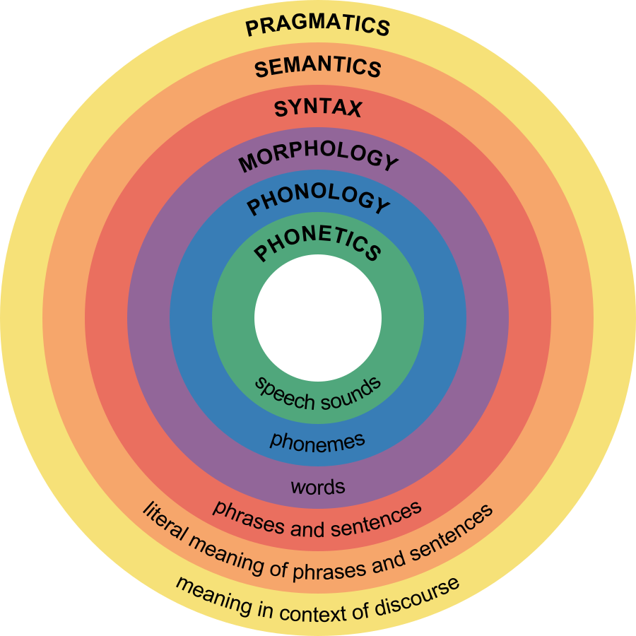
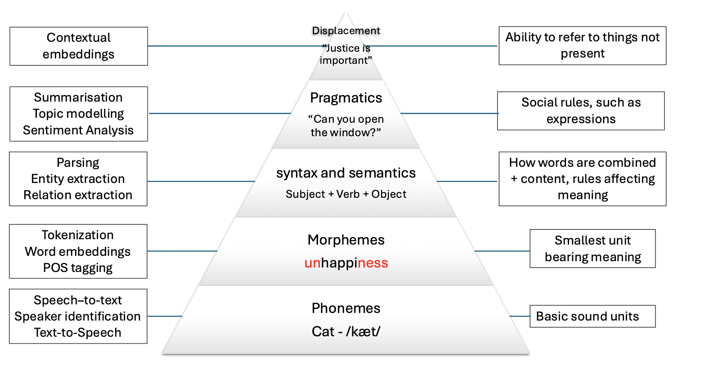

::: questions
-   What is NLP?
-   Why not just learn LLMs?
-   What are some common applications of NLP?
-   How does NLP relates to Linguistics?
-   How does NLP relates to Deep Learning and Machine Learning?
:::

::: objectives
-   Define Natural Language Processing
-   Show the most relevant NLP tasks and applications in practice
-   Describe the theoretical perspectives of NLP (from linguistics and machine learning)
:::

## What is NLP?

Natural language processing (NLP) is an area of research and application that focuses on making natural (i.e., human) language accessible to computers, so that they can perform useful tasks. The term "natural language" is used as opposed to "artificial language", such as programming languages, which are by design constructed to be easily understood by machines. On the contrary, natural languages are complex, ambiguous, and heavily context-dependent, making them challenging for computers to process. To complicate it more, there is not only a single **human language**, there are offically more than 7000 languages spoken around the world, each with its own grammar, vocabulary, and cultural context. In this course we will focus on English (we will sometimes see other languages in some specific examples as well), however this is only a convenience so we can focus on the technical aspects. While ideally most of the concepts from NLP apply to most languages, one should always be ware that certain languages require different approaches to solve seemingly similar problems.

::: callout
Even the most basic task of processing human language, such as tokenization (i.e., splitting a text into word units), can already be challenging when dealing with different languages.

Take the following example of the same sentence in English and Chinese:

``` python
english_sentence = "Tokenization isn't always trivial."
chinese_sentence = "标记化并不总是那么简单" # Translation: "Tokenization is not always simple"

english_words = english_sentence.split(" ")
print(english_words)
print(len(english_words))  # Output: 4

chinese_words = chinese_sentence.split(" ")
print(chinese_words)
print(len(chinese_words))  # Output: 1
```

While it is true that the English sentence words are not fully "clean", at least we get a rough count of the words present in the sentence. The same example however did not work in Chinese, because Chinese does not use spaces to separate words. We need to use a Chinese tokenizer to properly split the words:

``` python
import jieba  # A popular Chinese text segmentation library
chinese_sentence = "标记化并不总是那么简单"
chinese_words = jieba.lcut(chinese_sentence)
print(chinese_words)
print(len(chinese_words))  # Output: 7
```

Eventhough we don't speak chinese, because we are using a verified library, in this case we can trust that the output is a valid way to tokenize the sentence. Note that the Chinese sentence has more words than the English one, even though they convey the same meaning. We can also debate about how is the best approach to count the words in the English sentence, as it is not clear whether "isn't" should be counted as one or two words.
:::

NLP deals with the challenge of correctly processing and generating, this can be as simple as counting word frequencies to detect different writing styles, using statistical methods to classify texts into different categories based on pre-defined features, or using deep neural networks to generate human-like text by exploiting word co-occurrences in large amounts of texts.\
In the past decade, NLP has evolved significantly, especially in the field of deep learning, to the point that it has become embedded in our daily lives, one just needs to look at the term Large Language Models (LLMs), the latest generation of NLP models, which is now ubiquitous in news media and tech products we use on a daily basis.

### What is a word?

We just attempted to segment an English sentence into "words" and realized that splitting by spaces is not enough. Without going too deeply into what makes up a word, often in NLP we prefer to use the concept of "token" as the basic working unit. Originally the concept of token comprised both dictionary words, numeric symbols and punctuation. Nowadays, tokenization has also become an optimization task on it's own (How can we segment text in a way that neural networks learn optimally from text?) and a token might refer to a single character, or even a seemingly random substring that is only statistically meaningful to the model that uses such tokenizer (this is the source of the confusion in the previous exercise).  

::: callout
## Token vs Word
For simplicity, in the rest of the course we will use the terms "word" and "token" interchangeably, but have in mind that they do not always have the same granularity. Tokenizers always allow to "reconstruct back" to human-readable words even if internally they split the text differently, hence we can afford to use them as synonyms. We can visualize better different tokenizers [here](https://tiktokenizer.vercel.app/)   
:::

We will learn more advanced tokenizers in future lessons, for now we will use this opportunity to introduce the [spaCy]((https://github.com/explosion/spaCy) library and use it to obtain human-readable tokens. Let's first take a look at the text file. 
Note that the file contains a lot of new lines to improve "readability" that actually does not give any textual information. Therefore now we will first clean the new line characters so everything is separated by a single whitespace:


```python
import spacy
import re

with open("text1.txt") as f:
  text = f.read()

clean_text = re.sub(r'\s+', ' ', text) # Replace multiple whitespace and newline characters with a single space

print(clean_text[:100])
print("Length:", len(clean_text))
```

```output
Letter 1 St. Petersburgh, Dec. 11th, 17-- TO Mrs. Saville, England You will rejoice to hear that no 
Length: 6832
```

As we have seen already, splitting by white space still does not completely separate tokens from each other, for this we use spaCy to properly tokenize the text:

```python

print("\nProto-Tokens:")
proto_tokens = clean_text.split()
print(proto_tokens[:50])
print(len(proto_tokens))

nlp = spacy.load("en_core_web_sm")
doc = nlp(clean_text)

print("\nSpaCy-Tokens:")
tokens = [token.text for token in doc] # Note that spacy tokens are objects 
print(tokens[:50])
print(len(tokens))
```

```output
Proto-Tokens:
['Letter', '1', 'St.', 'Petersburgh,', 'Dec.', '11th,', '17--', 'TO', 'Mrs.', 'Saville,', 'England', 'You', 'will', 'rejoice', 'to', 'hear', 'that', 'no', 'disaster', 'has', 'accompanied', 'the', 'commencement', 'of', 'an', 'enterprise', 'which', 'you', 'have', 'regarded', 'with', 'such', 'evil', 'forebodings.', 'I', 'arrived', 'here', 'yesterday,', 'and', 'my', 'first', 'task', 'is', 'to', 'assure', 'my', 'dear', 'sister', 'of', 'my']
1198

SpaCy-Tokens:
[Letter, 1, St., Petersburgh, ,, Dec., 11th, ,, 17, -, -, TO, Mrs., Saville, ,, England, You, will, rejoice, to, hear, that, no, disaster, has, accompanied, the, commencement, of, an, enterprise, which, you, have, regarded, with, such, evil, forebodings, ., I, arrived, here, yesterday, ,, and, my, first, task, is]
1353
```

When we compare the split() approach with the spaCy tokenizer, we can see the advantages of using a proper tokenizer. There are also a bunch of properties that spaCy provides us with, for example we can get only symbols or only alphanumerical tokens, and more advanced linguistic properties that we will epxlore later.

```python
only_words = [token for token in doc if token.is_alpha]  # Only alphanumerical tokens
print(only_words[:50])
print(len(only_words))
```

```output
[Letter, Petersburgh, TO, Saville, England, You, will, rejoice, to, hear, that, no, disaster, has, accompanied, the, commencement, of, an, enterprise, which, you, have, regarded, with, such, evil, forebodings, I, arrived, here, yesterday, and, my, first, task, is, to, assure, my, dear, sister, of, my, welfare, and, increasing, confidence, in, the]
1199
```


## Why not just learn LLMs?

The term LLM now is often (and wrongly) used as a synonym of Artificial Intelligence. We could therefore think that we *just* need to learn how to manipulate LLMs in order to fullfil our research goals involving textual data. Language Modeling has always been part of the core tasks of NLP, therefore, by learning NLP you will understand better where are the core ideas behind LLMs coming from.


LLMs are nothing but an assembly of large neural networks that are trained on vast amounts of text data (nowadays some of them have even seen a snapshot of the whole Internet!) with the objective of generating human-like text. The surprising and fascinating properties that emerge from training models at this scale allows us to solve different complex tasks such as answer questions, translate languages, solve math problems, generate narratives that emulate reasoning, and many more with a single tool.

It is important, however, to undestand what is happening behind the scenes in order to **trace back sources of errors and biases** that get hidden in such complex models. The purpose of this course is precisely to take a step back, and understand that we also have a wide variety of tools at hand, beyond LLMs, that we can choose to solve our own problems, sometimes a much simpler and easier solution is enough to fulfill our purposes, instead of always using a black-box model and expecting nothing goes wrong with our use case.

The fact that LLMs can seemingly solve complex tasks in "just one step" hides the complexity of the underlying technology that is behind them in order to make them work. Moreover, because the content generate by this models are so good at imitating correct information, we need to know what is happening behind the scenes in order to understand the limitations and design **evaluation metrics** that give us a better understanding of the quality of the generated content.

For example, here is how ChatGPT will approach the tokenization example we just discussed:


We got what sounds like a straightforward confident answer. However, it is not clear how the model arrived at this solution. Second, we do not know whether the solution is correct or not. In this case ChatGPT made some assumptions for us, such as choosing a specific kind of tokenizer to give the answer, and since we do not speak the language, we do not know if this is indeed the best approach to tokenize Chinese text. If we understand the concept of Token (which we will today!), then we can be more informed about the quality of the answer, whether it is useful to us, and therefore make a better use of the model.

And by the way, ChatGPT was **almost** correct, in the specific case of the gpt-4 tokenizer, the model will return 12 tokens (not 11!) for the given Chinese sentence.


We can also argue if the statement "Chinese is generally tokenized character by character" is an overstatement. In any case the real question here is: Are we ok with *almost correct answers*?

## NLP tasks

:::: challenge
## NLP in the real world

Name three to five tools/products that you use on a daily basis and that you think leverage NLP techniques. To solve this exercise you can get some help from the web.

::: solution
These are some of the most popular NLP-based products that we use on a daily basis:

-   Voice-based assistants (e.g., Alexa, Siri, Cortana)
-   Machine translation (e.g., Google translate, Amazon translate)
-   Search engines (e.g., Google, Bing, DuckDuckGo)
-   Keyboard autocompletion on smartphones
-   Spam filtering
-   Spell and grammar checking apps
-   Customer care chatbots
-   Text summarization tools (e.g., news aggregators)
-   Sentiment analysis tools (e.g., social media monitoring)
:::
::::

The exercise above tells us that a great deal of NLP techniques is embedded in our daily life. Indeed NLP is an important component in a wide range of software applications that we use in our daily lives.

There are several ways to describe the tasks that NLP solves. From the Machine Learning perspective we have supervised (learning to classify given a labeled set of examples) and unsupervised tasks (exploiting existing patterns from large amounts of text). From the Deep Learning perspective we have different neural network architectures that help us solve tasks, such as Recurrent Neural Networks, LSTM's and Transformers. It is usually helpful to know these tasks because we can many times formulate our own research questions in similar terms and solve it using similar techniques as the prototypical tasks. Here we show one possible general NLP task taxonomy, together with some of their most prominent examples (this is definitely a non-exhaustive list, as in reality there are hundreds of them):

-   **Language Modeling**: Given a sequence of words, the model predicts the next word. For example, in the sentence "The capital of France is \_\_\_\_\_", the model might predict "Paris" based on the context. This task was initially useful for building solutions that require speech and optical character recognition (even handwriting), language translation and spelling correction. Nowadays this has scaled to the LLMs that we know today.

-   **Text Classification**: Assign one or more labels to a "Documents". A document in our context can mean a sentence, a paragraph, a book chapter, etc...

    -   **Language Identification**: determining the language of a given text.
    -   **Spam Filtering**: classifiying emails into spam or not spam based on their content.
    -   **Authorship Attribution**: detemrining the author of a text based on its style and content (based on the assumption that each author has a unique writing style).
    -   **Sentiment Analysis**: classifying text into positive, negative or neutral sentiment. For example, in the sentence "I love this product!", the model would classify it as positive sentiment.

-   **Token Classification**: The task of assigning label to words individually. Because words do not occur in isolation, their meaning depend on the sequence of words to the left or the right of them, this is also called Word-In-Context Classification or Sequence Labeling and usually involves syntactic and semantic analysis.
    -   **Part-Of-Speech Tagging**: is the task of assigning a part-of-speech label (e.g., noun, verb, adjective) to each word in a sentence.
    -   **Chunking**: splitting a running text into "chunks" of words that together represent a meaningful unit: phrases, sentences, paragraphs, etc.
    -   **Word Sense Disambiguation**: based on the context what does a word mean (think of "book" in "I read a book." vs "I want to book a flight.")
    -   **Named Entity Recognition**: recognize world entities in text, e.g. Persons, Locations, Book Titles, etc...
    -   **Semantic Role Labeling**: the task if finding out "Who did what to whom?" in a sentence: information from events such as agents, participants, circumstances, etc.
    -   **Relation Extraction**: the task of identifying named relationships between entities in a text, e.g. "Apple is based in California" has the relation (Apple, based_in, California).
    -   **Co-reference Resolution**: the task of determining which words refer to the same entity in a text, e.g. "Mary is a doctor. She works at the hospital." Here "She" refers to "Mary".

-   **Text Similarity**: The task of determining how similar two pieces of text are.

    -   **Plagiarism detection**: determining whether a piece of TextB is close enough to another known piece of TextA, which increments the likelihood that it was copied from it.
    -   **Document clustering**: grouping similar texts together based on their content.
    -   **Topic modelling**: A specific instance of clustering, here we automatically identify abstract "topics" that occur in a set of documents, where each topic is represented as a cluster of words that frequently appear together.
    -   **Information Retrieval**: This is the task of finding relevant information or documents from a large collection of unstructured data based on user's query, e.g., "What's the best restaurant near me?".

-   **Text Generation**: The task of generating text based on a given input. This can

    -   **Machine Translation**: translating text from one language to another, e.g., "Hello" in English to "Que tal" in Spanish.
    -   **Summarization**: generating a concise summary of a longer text. It can be abstractive (generating new sentences that capture the main ideas of the original text) but also extractive (selecting important sentences from the original text).
    -   **Paraphrasing**: generating a new sentence that conveys the same meaning as the original sentence, e.g., "The cat is on the mat." to "The mat has a cat on it.".
    -   **Question Answering**: Given a question and a context, the model generates an answer. For example, given the question "What is the capital of France?" and the Wikipedia article about France as the context, the model should answer "Paris". This task can be approached as a text classification problem (where the answer is one of the predefined options) or as a generative task (where the model generates the answer from scratch).
    -   **Conversational Agent (ChatBot)**: Building a system that interacts with a user via natural language, e.g., "What's the weather today, Siri?". These agents are widely used to improve user experience in customer service, personal assistance and many other domains.

::: callout
## NLP Libraries

Related to the need of shaping our problems into a known task, there are several existing NLP libraries which we can use out-of-the-box. We already used SpaCy for English and jieba for Chinese. Again, as a non-exhaustive list, we mention here some of the most used NLP libraries in python:

-   [NLTK](https://github.com/nltk/nltk)
-   [spaCy](https://github.com/explosion/spaCy)
-   [Gensim](https://github.com/RaRe-Technologies/gensim)
-   [Stanza](https://github.com/stanfordnlp/stanza)
-   [Flair](https://github.com/flairNLP/flair)
-   [FastText](https://github.com/facebookresearch/fastText)
-   [HuggingFace Transformers](https://github.com/huggingface/transformers)
:::

## Some Relevant Linguistic Aspects

Natural language exhibits a set fo properties that make it more challenging to process than other types of data such as tables, spreadsheets or databases. Language is discrete, ambiguous, compositional and sparse. The basic elements of written languages are characters, a sequence of characters form words, and words in turn denote objects objects, concepts, events, actions and ideas (Goldberg, 2016). Subsequently words form phrases and sentences which are used in communication and depend on the context in which they are used. We as humans derive the meaning of utterances from interpreting contextual information that is present at different levels at the same time:



The first two levels refer to spoken language only, and the other four levels are present also in text. Thus, because machines do not have access to the same levels of information that we do (they can only have independent audio, textual or visual inputs), we need to come up with clever methods to overcome this significant limitation. Knowing these levels of language is important to understand how we can use NLP to solve our problems. Let's see some of the properties of language that make it challenging to process.

### Ambiguity

As mentioned, the disambiguation of meaning is usually a by-product of the context in which utterances are expressed and also the historic accumulation of interactions which are transmitted across generations (think for instance to idioms -- these are usually meaningless phrases that acquire meaning only if situated within their historical and societal context). These characteristics make NLP a particularly challenging field to work in.

We cannot expect a machine to process human language and simply understand it as it is. We need a systematic, scientific approach to deal with it. It's within this premise that the field of NLP is born, primarily interested in converting the building blocks of human/natural language into something that a machine can understand.

The image below shows how the levels of language relate to a few NLP applications:



:::: challenge
## Levels of ambiguity

Discuss what do the following sentences mean. What level of ambiguity do they represent?:

-   "The door is unlockable from the inside." vs "Unfortunately, the cabinet is unlockable, so we can't secure it"
-   "I saw the *cat with the stripes*" vs "I saw the cat *with the telescope*"
-   "Colorless green ideas sleep furiously"
-   "I NEVER said she stole my money." vs "I never said she stole MY money."

::: solution
This is why the previous statements were difficult:

| Example | Type of Ambiguity | Explanation |
|:------------------------|:-----------------|:----------------------------|
| "Un-lockable vs Unlock-able" | **Morphological** | Same word form, two possible meanings |
| "I saw the cat with the telescope" | **Syntactic** | Same sentence structure, different properties |
| "Colorless green ideas sleep furiously" | **Semantic** | Grammatical but meaningless |
| "I never said she stole my money." | **Pragmatic** | Meaning relies on word emphasis |
:::
::::

Understanding the levels of languages is crucial for evaluation, whenever you are solving a specific task, you should ask yourself what kind of ambiguity can affect your results? At what level are your assumptions operating when defining your research questions? Having the answers to this kinds of questions can save you a lot of time when debugging your models. Sometimes the most innocent assumptions (for example using the wrong tokenizer) can create enormous performance drops even when the higher level assumptions were correct.

### Discreteness

There is no inherent relationship between the form of a word and its meaning. For the same reason, by textual means alone, there is no way of knowing if two words are similar or how do they relate to each other. Take the word "pizza" and "hamburger", how can we know that they share more properties than "car" and "cat"? We can only know this by looking at the context in which these words are used, and how they are related to each other. This is why we need to look at the statistical properties of language, such as word co-occurrences, to understand how words relate to each other.

Let's do a simple exercise:

``` python

from collections import Counter

# A mini-corpus where our target words appear
text = """
I am hungry . Should I eat delicious pizza ?
Or maybe I should eat a juicy hamburger instead .
Many people like to eat pizza because is tasty , they think pizza is delicious as hell !
My friend prefers to eat a hamburger and I agree with him .
We will drive our car to the restaurant to get the succulent hamburger .
Right now , our cat sleeps on the mat so we won't take him .
I did not wash my car , but at least the car has gasoline .
Perhaps when we come back we will take out the cat for a walk .
The cat will be happy to see us when we come back .
"""

words = [token.lower() for token in text.split()]

target_words = ["pizza", "hamburger", "car", "cat"] # words we want to analyze
stop_words = ["i", "am", "my", "to", "the", "a", "and", "is", "as", "at", "we", "will", "not", "our", "but", "least", "has", ".", ","] # words to ignore
co_occurrence = {word: [] for word in target_words}
window_size = 3 # How many words to look at on each side

# Find the context for each target word
for i, word in enumerate(words):
    if word in target_words:
        start = max(0, i - window_size)
        end = min(len(words), i + 1 + window_size)
        context = words[start:i] + words[i+1:end] # Exclude the target word itself
        context = [w for w in context if w not in stop_words] # Filter out stop words from context
        co_occurrence[word].extend(context)

# Print the most common context words for each target word
print("Contextual Fingerprints:\n")
for word, context_list in co_occurrence.items():
    # We use Counter to get a frequency count of context words
    fingerprint = Counter(context_list).most_common(5)
    print(f"'{word}': {fingerprint}")
```

::: callout
## Stop Words

Depending on the use case you will always perform some preprocessing steps in order to have the data as normalized and clean as possible before making any computations. These steps are not exhaustive and are task-dependent. In this case, we introduced the concept of "stop_words" (extremely common words that do not provide relevant information for our use case and, given their high frequency, they tend to obscure the results we are interested in). Of course, our list could have been much bigger, but it served the purpose for this toy example.

Spacy has a pre-defined list of stopwords per language. To explicitly load the English stop words we can do

```python
from spacy.lang.en.stop_words import STOP_WORDS
print(STOP_WORDS)  # a set of common stopwords
print(len(STOP_WORDS)) # There are 326 words considered in this list
```

Alternatively you can filter out stop words when iterating your tokens (remember the spacy token properties!) like this:

```python
doc = nlp(text)
content_words = [token.lower_ for token in doc if token.is_alpha and not token.is_stop]  # Filter out stop words and punctuation
print(content_words)
```
:::

### Sparsity

Another key property of linguistic data is its sparsity. This means that if we are hunting for a specific phenomenon we will realize it barely occurs inside a vast amount of text. Take the example of pizzas and hamburgers, it worked for us because our experiment was run in an extremely hand-crafted text for the purpose. However, if we want to scale this up, we would have to crawl across thousands of food reviews (for example) and filter the ones that are about hamburgers and pizzas so we will probably just get a dozen of examples out of the thousands of reviews.

## NLP = Linguistics + Machine Learning

introduce the link to ML and DL, describe what a model is in NLP, training data (input, output) pairs, what is domain-specific data/models

### Preprocessing Text

Some of the most common pre-processing steps might include: 
- Tokenization (splitting strings into meaningful/useful units) 
- Lowercasing (removing uppercases to e.g. avoid treating "Dog" and "dog" as two different words) 
- Stop Word Removal (removing semantically irrelevant words for our purposes) 
- Punctuation and Special Character Removal (keeping only alphanumerical content) 
- Lemmatization (a linguistic operation that normalizes the word into a single "dictionary entry". Think how "eating", "ate", "eaten" are all a variation of the verb "eat")

``` python
 "Here my python code using spacy..."
```

::: keypoints
-   NLP is embedded in numerous daily-use products
-   Key tasks include language modeling, text classification, information extraction, information retrieval, conversational agents, and topic modeling, each supporting various real-world applications.
-   NLP is a subfield of Artificial Intelligence (AI) that deals with approaches to process, understand and generate natural language
-   Deep learning has significantly advanced NLP, but the challenge remains in processing the discrete and ambiguous nature of language
-   The ultimate goal of NLP is to enable machines to understand and process language as humans do, but challenges in measuring and interpreting linguistic information still exist.
:::
