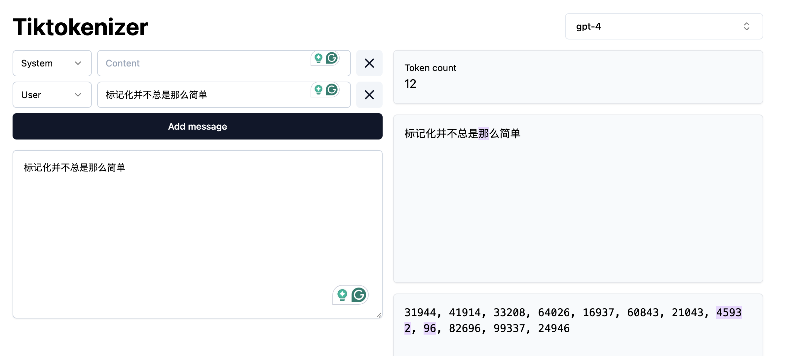

::: questions
-   What is Natural Language Processing?
-   What are some common applications of NLP?
-   What makes text different from other data?
-   Why not just learn Large Language Models?
-   What linguistic properties should we consider when dealing with texts?
-   How does NLP relates to Deep Learning methodologies?
:::

::: objectives
-   Define Natural Language Processing
-   Show the most relevant NLP tasks and applications in practice
-   Learn how to handle Linguistic Data and how is Linguistics relevant to NLP
-   Learn a general workflow for solving NLP tasks
:::

## What is NLP?

Natural language processing (NLP) is an area of research and application that focuses on making human languages accessible to computers, so that they can perform useful tasks. The term "natural language" is used as opposed to "artificial language", such as programming languages, which are by design constructed to be easily formalized into machine-readable instructions. On the contrary, natural languages are complex, ambiguous, and heavily context-dependent, making them challenging for computers to process. To complicate it more, there is not only a single *human language*, nowadays more than 7000 languages are spoken around the world, each with its own grammar, vocabulary, and cultural context.

In this course we will mainly focus on written English (we will sometimes see other languages in some specific examples as well), however this is only a convenience so we can concentrate on the technical aspects of processing textual data. While ideally most of the concepts from NLP apply to most languages, one should always be ware that certain languages require different approaches to solve seemingly similar problems.

We can already find differences on the most basic step to processing text. Take the problem of segmenting text into meaningful units, most of the times these units are words, in NLP this is the task of **tokenization**. A naive approach is to split text by spaces, as it seems obvious that we always separate words with spaces. Let's see how can we segment the same sentence in English and Chinese:

``` python
english_sentence = "Tokenization isn't always trivial."
chinese_sentence = "标记化并不总是那么简单" # Chinese Translation

english_words = english_sentence.split(" ")
print(english_words)
print(len(english_words))

chinese_words = chinese_sentence.split(" ")
print(chinese_words)
print(len(chinese_words))
```

``` output
['Tokenization', "isn't", 'always', 'trivial.']
4
['标记化并不总是那么简单']
1
```

Let's look first at the English sentence. Words are mostly well separated, we do not get fully "clean" words (and you can also debate what is the best way of segmenting "isn't"), but at least we get a rough count of the words present in the sentence. The same example however did not work in Chinese, because Chinese does not use spaces to separate words. We need to use a Chinese pre-trained tokenizer to properly split the words:

``` python
import jieba  # A popular Chinese text segmentation library
chinese_sentence = "标记化并不总是那么简单"
chinese_words = jieba.lcut(chinese_sentence)
print(chinese_words)
print(len(chinese_words))  # Output: 7
```

``` output
['标记', '化', '并', '不', '总是', '那么', '简单']
7
```

Even though we don't speak Chinese, because we are using a verified library, we can trust that the output is a valid way to tokenize the sentence. Another interesting aspect is that the Chinese sentence has more words than the English one, even though they convey the same meaning. This shows the complexity of dealing with more than one language at a time, like in Machine Translation.

::: callout
### Pre-trained and Fine-tunning Models

These two terms will appear very frequently when talking about NLP. The term *pre-trained* is taken from Machine Learning and refers to a model that has been already optimized using relevant data to perform a task. It is possible to directly load and use the model out-of-the-box to apply it to our own dataset. Ideally, released pre-trained models have already been tested for generalization and quality of outputs, but it is always important to double check the evaluation process they were subjected to before using them.

Sometimes a pre-trained model is of good quality, but it does not fit the nuances of our specific dataset. For example, the model was trained on newspaper articles but you are interested in poetry. In this case, it is common to perform *fine-tunning*, this means that instead of training your own model from scratch, you start with the knowledge obtained in the pre-trained model and adjust it (fine-tune it) with your specific data. If this is done well it leads to increased performance in the specific task you are trying to solve. The advantage of fine-tunning is that you do not need a large amount of data to improve the results, hence the popularity of the technique.
:::

In more general terms, NLP deals with the challenges of correctly processing and generating text, this can be as simple as counting word frequencies to detect different writing styles, using statistical methods to classify texts into different categories, or using deep neural networks to generate human-like text by exploiting word co-occurrences in large amounts of texts.

## Language as Data

From a more technical perspective, NLP focuses on applying Machine Learning techniques to linguistic data. This makes all the difference, since ML methods expect a structured dataset, with a well defined set of features that engineers can work with. The task of NLP practitioner is to understand what aspects of textual data are relevant for their problem and apply techniques to systematically extract meaningful features from unstructured data that can help solve our problem at hand.

:::: challenge
### NLP in the real world

Name three to five tools/products that you use on a daily basis and that you think leverage NLP techniques. To solve this exercise you can get some help from the web.

::: solution
These are some of the most popular NLP-based products that we use on a daily basis:

-   Voice-based assistants (e.g., Alexa, Siri, Cortana)
-   Machine translation (e.g., Google translate, Amazon translate)
-   Search engines (e.g., Google, Bing, DuckDuckGo)
-   Keyboard autocompletion on smartphones
-   Spam filtering
-   Spell and grammar checking apps
-   Customer care chatbots
-   Text summarization tools (e.g., news aggregators)
-   Sentiment analysis tools (e.g., social media monitoring)
:::
::::

### NLP tasks

The exercise above tells us that a great deal of NLP techniques is embedded in our daily life. Indeed NLP is an important component in a wide range of software applications that we use in our daily lives.

There are several ways to describe the tasks that NLP solves. From the Machine Learning perspective, we have supervised tasks (learning to classify texts given a labeled set of examples) and unsupervised tasks (exploiting existing patterns from large amounts of text). From the Deep Learning perspective we have different neural network architectures that we can use to solve different tasks, such as Recurrent Neural Networks, Convolutional Neural Networks, LSTM's, Transformers, etcetera.

We can also group tasks in terms of problem definition. It is useful to have a general taxonomy of NLP tasks in this manner, so we can identify if the problem we want to solve fits with one of the existing tasks and use the knowledge available in those paradigms.

Below we show one possible taxonomy of NLP tasks, grouped together with some of their most prominent applications (this is definitely a non-exhaustive list, as in reality there are hundreds of them):

-   **Language Modeling**: Given a sequence of words, the model predicts the next word. For example, in the sentence "The capital of France is \_\_\_\_\_", the model should predict "Paris" based on the context. This task was initially useful for building solutions that require speech and optical character recognition (even handwriting), language translation and spelling correction. Nowadays this has scaled up to the LLMs that we know.

-   **Text Classification**: Assign one or more labels to a "Documents". A document in our context can mean a sentence, a paragraph, a book chapter, etc...

    -   **Language Identification**: determining the language of a given text.
    -   **Spam Filtering**: classifiying emails into spam or not spam based on their content.
    -   **Authorship Attribution**: detemrining the author of a text based on its style and content (based on the assumption that each author has a unique writing style).
    -   **Sentiment Analysis**: classifying text into positive, negative or neutral sentiment. For example, in the sentence "I love this product!", the model would classify it as positive sentiment.

-   **Token Classification**: The task of assigning label to words individually. Because words do not occur in isolation, their meaning depend on the sequence of words to the left or the right of them, this is also called Word-In-Context Classification or Sequence Labeling and usually involves syntactic and semantic analysis.

    -   **Part-Of-Speech Tagging**: is the task of assigning a part-of-speech label (e.g., noun, verb, adjective) to each word in a sentence.
    -   **Chunking**: splitting a running text into "chunks" of words that together represent a meaningful unit: phrases, sentences, paragraphs, etc.
    -   **Word Sense Disambiguation**: based on the context what does a word mean (think of "book" in "I read a book." vs "I want to book a flight.")
    -   **Named Entity Recognition**: recognize world entities in text, e.g. Persons, Locations, Book Titles, or many others. For example "Mary Shelley" is a person, "Frankenstein or the Modern Prometeus" is a book, etc.
    -   **Semantic Role Labeling**: the task if finding out "Who did what to whom?" in a sentence: information from events such as agents, participants, circumstances, etc.
    -   **Relation Extraction**: the task of identifying named relationships between entities in a text, e.g. "Apple is based in California" has the relation (Apple, based_in, California).
    -   **Co-reference Resolution**: the task of determining which words refer to the same entity in a text, e.g. "Mary is a doctor. She works at the hospital." Here "She" refers to "Mary".
    -   **Entity Linking**: the task of disambiguation of named entities in a text, linking them to their corresponding entries in a knowledge base, e.g. Mary Shelley's biogrpaphy in Wikipedia.

-   **Text Similarity**: The task of determining how similar two pieces of text are.

    -   **Plagiarism detection**: determining whether a piece of TextB is close enough to another known piece of TextA, which increments the likelihood that it was copied from it.
    -   **Document clustering**: grouping similar texts together based on their content.
    -   **Topic modelling**: A specific instance of clustering, here we automatically identify abstract "topics" that occur in a set of documents, where each topic is represented as a cluster of words that frequently appear together.
    -   **Information Retrieval**: This is the task of finding relevant information or documents from a large collection of unstructured data based on user's query, e.g., "What's the best restaurant near me?".

-   **Text Generation**: The task of generating text based on a given input. This can

    -   **Machine Translation**: translating text from one language to another, e.g., "Hello" in English to "Que tal" in Spanish.
    -   **Summarization**: generating a concise summary of a longer text. It can be abstractive (generating new sentences that capture the main ideas of the original text) but also extractive (selecting important sentences from the original text).
    -   **Paraphrasing**: generating a new sentence that conveys the same meaning as the original sentence, e.g., "The cat is on the mat." to "The mat has a cat on it.".
    -   **Question Answering**: Given a question and a context, the model generates an answer. For example, given the question "What is the capital of France?" and the Wikipedia article about France as the context, the model should answer "Paris". This task can be approached as a text classification problem (where the answer is one of the predefined options) or as a generative task (where the model generates the answer from scratch).
    -   **Conversational Agent (ChatBot)**: Building a system that interacts with a user via natural language, e.g., "What's the weather today, Siri?". These agents are widely used to improve user experience in customer service, personal assistance and many other domains.

### What is a word?

When dealing with language we could say we are dealing with sequences of words and how do they relate to each other to generate meaning. We previously attempted to segment an English sentence into "words" and realized that splitting by spaces is not enough. Without going too deeply into what makes up a word, often in NLP we prefer to use the concept of "token" as the basic working unit. Originally the concept of token comprised dictionary words, numeric symbols and punctuation. Nowadays, tokenization has also evolved and became an optimization task on its own (How can we segment text in a way that neural networks learn optimally from text?) and a token might refer to a single character, or even a seemingly random substring that is only statistically meaningful to the internal state of model that uses such tokenizer.

::: callout
### Token vs Word

For simplicity, in the rest of the course we will use the terms "word" and "token" interchangeably, but as we just saw they do not always have the same granularity. Tokenizers always allow to "reconstruct back" tokens to human-readable words even if internally they split the text differently, hence we can afford to use them as synonyms. If you are curious, you can visualize how different state-of-the-art tokenizers work [here](https://tiktokenizer.vercel.app/)
:::

We will learn more advanced tokenizers in future lessons, for now we will use this opportunity to introduce the [spaCy]((<https://github.com/explosion/spaCy>) library and use it to obtain human-readable tokens (aka words!). Let's first see how does the content of a text file look.

``` python
with open("text1_clean.txt") as f:
  text = f.read()

print(text[:100])
print("Length:", len(text))
```

``` output
Letter 1 St. Petersburgh, Dec. 11th, 17-- TO Mrs. Saville, England You will rejoice to hear that no 
Length: 6832
```

As we have seen already, splitting by white space still does not completely separate tokens from each other, for this we use spaCy to properly tokenize the text. First we will download an appropriate model, in this case we only need the small pre-trained English version:

``` python
! python -m spacy download en_core_web_sm
```

This is a model that spaCy already trained for us on a subset of web English data. Hence, the model already "knows" how to tokenize into English words, and also solve some of the basic NLP tasks that provide more advanced linguistic properties of the text (such as part-of-speech tags, or named entities). Let's now import the model and use it to parse our document:

``` python
import spacy

nlp = spacy.load("en_core_web_sm") # we load the small English model for efficiency

doc = nlp(clean_text) # Doc is a python object with several methods to retrieve linguistic properties

print("\nSpaCy-Tokens:")
tokens = [token.text for token in doc] # Note that spacy tokens are also python objects 
print(tokens[:10])
print(len(tokens))
```

``` output
SpaCy-Tokens:
['Letter', '1', 'St.', 'Petersburgh', ',', 'Dec.', '11th', ',', '17', '-', '-', 'TO', 'Mrs.', 'Saville', ',', 'England', 'You', 'will', 'rejoice', 'to', 'hear', 'that', 'no', 'disaster', 'has', 'accompanied', 'the', 'commencement', 'of', 'an', 'enterprise', 'which', 'you', 'have', 'regarded', 'with', 'such', 'evil', 'forebodings', '.', 'I', 'arrived', 'here', 'yesterday', ',', 'and', 'my', 'first', 'task', 'is']
1353
```

When we compare the split() approach with the spaCy tokenizer, we can see the advantages of using a proper tokenizer. There are also a bunch of properties that spaCy provides us with, for example we can get only symbols or only alphanumerical tokens, and more advanced linguistic properties, for example we can remove punctuation and only keep alphanumerical tokens:

``` python
only_words = [token for token in doc if token.is_alpha]  # Only alphanumerical tokens
print(only_words[:50])
print(len(only_words))
```

``` output
[Letter, Petersburgh, TO, Saville, England, You, will, rejoice, to, hear]
1199
```

keep only the verbs from our text:

``` python
only_verbs = [token for token in doc if token.pos_ == "VERB"]  # Only verbs
print(only_verbs[:10])
print(len(only_verbs))
```

``` output
[rejoice, hear, accompanied, regarded, arrived, assure, increasing, walk, feel, braces]
150
```

or show the named entities that are mentioned in it:

``` python
for ent in doc.ents[:10]:
    print(ent.label_, ent.text)
```

``` output
DATE Dec. 11th
CARDINAL 17
PERSON Saville
GPE England
DATE yesterday
```

This are just basic tests to show you how you can right away structure text using existing NLP libraries. These libraries help you transform unstructured plain text files into structured data that you can manipulate and apply automated methods to analyze the content in your documents.

::: callout
### NLP Libraries

Related to the need of shaping our problems into a known task, there are several existing NLP libraries which provide a wide range of models that we can use out-of-the-box. We already saw simple examples using SpaCy for English and jieba for Chinese. Again, as a non-exhaustive list, we mention here some of the most used NLP libraries in python:

-   [NLTK](https://github.com/nltk/nltk)
-   [spaCy](https://github.com/explosion/spaCy)
-   [Gensim](https://github.com/RaRe-Technologies/gensim)
-   [Stanza](https://github.com/stanfordnlp/stanza)
-   [Flair](https://github.com/flairNLP/flair)
-   [FastText](https://github.com/facebookresearch/fastText)
-   [HuggingFace Transformers](https://github.com/huggingface/transformers)

### Linguistic Resources

There are also several curated resources that can help solve your NLP-related tasks, specifically when you need highly specialized definitions. An exhaustive list would be impossible as there are thousands of them, and also them being language and domain dependent. Below we mention some of the most prominent, just to give you an idea of the kind of resources you can find, so you don't need to reinvent the wheel every time you start a project:

-   [HuggingFace Datasets](https://huggingface.co/datasets): A large collection of datasets for NLP tasks, including text classification, question answering, and language modeling.
-   [WordNet](https://wordnet.princeton.edu/): A large lexical database of English, where words are grouped into sets of synonyms (synsets) and linked by semantic relations.
-   [Europarl](https://www.europarl.europa.eu/ep-search/search.do?language=en): A parallel corpus of the proceedings of the European Parliament, available in 21 languages, which can be used for machine translation and cross-lingual NLP tasks.
-   [Universal Dependencies](https://universaldependencies.org/): A collection of syntactically annotated treebanks across 100+ languages, providing a consistent annotation scheme for syntactic and morphological properties of words, which can be used for cross-lingual NLP tasks.
-   [PropBank](https://propbank.github.io/): A corpus of texts annotated with information about basic semantic propositions, which can be used for English semantic tasks.
-   [FrameNet](https://framenet.icsi.berkeley.edu/fndrupal/): A lexical resource that provides information about the semantic frames that underlie the meanings of words (mainly verbs and nouns), including their roles and relations.
-   [BabelNet](https://babelnet.org/): A multilingual lexical resource that combines WordNet and Wikipedia, providing a large number of concepts and their relations in multiple languages.
-   [Wikidata](https://www.wikidata.org/): A free and open knowledge base initially derived from Wikipedia, that contains structured data about entities, their properties and relations, which can be used to enrich NLP applications.
-   [Dolma](https://github.com/allenai/dolma): An open dataset of 3 trillion tokens from a diverse mix of clean web content, academic publications, code, books, and encyclopedic materials, used to train English large language models.
:::

## Why not just learn LLMs?

In the past decade, NLP has evolved significantly, especially in the field of deep learning, to the point that it has become embedded in our daily lives, one just needs to look at the term Large Language Models (LLMs), the latest generation of NLP models, which is now ubiquitous in news media and tech products we use on a daily basis.

The term LLM now is often (and wrongly) used as a synonym of Artificial Intelligence. We could therefore think that today we just need to learn how to manipulate LLMs in order to fullfil our research goals involving textual data. The truth is that Language Modeling has always been part of the core tasks of NLP, therefore, by learning NLP you will understand better where are the main ideas behind LLMs coming from.


LLMs are nothing but an assembly of large neural networks that are trained on vast amounts of text data (nowadays some of them have even seen a snapshot of the whole Internet!) with the objective of optimizing for language modeling and, once trained, they are used to generate human-like text or fine-tunned to perform much more advanced tasks. Indeed, the surprising and fascinating properties that emerge from training models at this scale allows us to solve different complex tasks such as answer elaborate questions, translate languages, solve complex problems, generate narratives that emulate reasoning, and many more, all of this with a single tool.

It is important, however, to understand what is happening behind the scenes in order to **trace back sources of errors and biases** that get hidden in the complexity of these models. The purpose of this course is precisely to take a step back, and understand that: - There is a wide variety of tools available, beyond LLMs, that do not require so much computing power. - Sometimes a much simpler and easier method is already available that can solve our problem at hand. - If we learn how previous approaches to solve linguistic problems were designed, we can better understand the limitations of LLMs and how to use them effectively. - LLMs excel at confidently delivering information, without any regards for correctness. This calls for a careful design of **evaluation metrics** that give us a better understanding of the quality of the generated content.

Let's go back to our problem of segmenting text and see what ChatGPT has to say about tokenizing Chinese text:


We got what sounds like a straightforward confident answer. However, it is not clear how the model arrived at this solution. Second, we do not know whether the solution is correct or not. In this case ChatGPT made some assumptions for us, such as choosing a specific kind of tokenizer to give the answer, and since we do not speak the language, we do not know if this is indeed the best approach to tokenize Chinese text. If we understand the concept of Token (which we will today!), then we can be more informed about the quality of the answer, whether it is useful to us, and therefore make a better use of the model.

And by the way, ChatGPT was **almost** correct, in the specific case of the gpt-4 tokenizer, the model will return 12 tokens (not 11!) for the given Chinese sentence.



We can also argue if the statement "Chinese is generally tokenized character by character" is an overstatement or not. In any case, the real question here is: Are we ok with *almost correct answers*? Please note that this is not a call to avoid using LLM's but a call for a careful consideration of usage and more importantly, an attempt to explain the mechanisms behind via NLP concepts.

## Relevant Linguistic Aspects

Natural language exhibits a set fo properties that make it more challenging to process than other types of data such as tables, spreadsheets or time series. **Language is hard to process because it is compositional, ambiguous, discrete and sparse**.

### Compositionality

The basic elements of written languages are characters, a sequence of characters form words, and words in turn denote objects, concepts, events, actions and ideas (Goldberg, 2016). Subsequently words form phrases and sentences which are used in communication and depend on the context in which they are used. We as humans derive the meaning of utterances from interpreting contextual information that is present at different levels at the same time:


The first two levels refer to spoken language only, and the other four levels are present in both speech and text. Because in principle machines do not have access to the same levels of information that we do (they can only have independent audio, textual or visual inputs), we need to come up with clever methods to overcome this significant limitation. Knowing the levels of language is important so we consider what kind of problems we are facing when attempting to solve our NLP task at hand.

### Ambiguity

The disambiguation of meaning is usually a by-product of the context in which utterances are expressed and also the historic accumulation of interactions which are transmitted across generations (think for instance to idioms -- these are usually meaningless phrases that acquire meaning only if situated within their historical and societal context). These characteristics make NLP a particularly challenging field to work in.

We cannot expect a machine to process human language and simply understand it as it is. We need a systematic, scientific approach to deal with it. It's within this premise that the field of NLP is born, primarily interested in converting the building blocks of human/natural language into something that a machine can understand.

The image below shows how the levels of language relate to a few NLP applications:


:::: challenge
## Levels of ambiguity

Discuss what do the following sentences mean. What level of ambiguity do they represent?:

-   "The door is unlockable from the inside." vs "Unfortunately, the cabinet is unlockable, so we can't secure it"
-   "I saw the *cat with the stripes*" vs "I saw the cat *with the telescope*"
-   "Colorless green ideas sleep furiously"
-   "I never said she stole my money." vs "I never said she stole my money."

::: solution
This is why the previous statements were difficult:

-   "Un-lockable vs Unlock-able" is a **Morphological** ambiguity: Same word form, two possible meanings
-   "I saw the cat with the telescope" is a **Syntactic** ambiguity: Same sentence structure, different properties
-   "Colorless green ideas sleep furiously" **Semantic** ambiguity: Grammatical but meaningless (ideas do not have color as a property. Even if this was true, they would be either colorless or green)
-   "I NEVER said she stole MY money." is a **Pragmatic** ambiguity: Meaning relies on word emphasis
:::
::::

Whenever you are solving a specific task, you should ask yourself what kind of ambiguity can affect your results? At what level are your assumptions operating when defining your research questions? Having the answers to this can save you a lot of time when debugging your models. Sometimes the most innocent assumptions (for example using the wrong tokenizer) can create enormous performance drops even when the higher level assumptions were correct.

### Discreteness

There is no inherent relationship between the form of a word and its meaning. For the same reason, by textual means alone, there is no way of knowing if two words are similar or how do they relate to each other. Take the word "pizza" and "hamburger", how can we automatically know that they share more properties than "car" and "cat"? One way is by looking at the context in which these words are used, and how they are related to each other. This idea is the principle behind **distributional semantics**, and aims to look at the statistical properties of language, such as word co-occurrences, to understand how words relate to each other.

Let's do a simple exercise:

``` python

from collections import Counter

# A mini-corpus where our target words appear
text = """
I am hungry . Should I eat delicious pizza ?
Or maybe I should eat a juicy hamburger instead .
Many people like to eat pizza because is tasty , they think pizza is delicious as hell !
My friend prefers to eat a hamburger and I agree with him .
We will drive our car to the restaurant to get the succulent hamburger .
Right now , our cat sleeps on the mat so we won't take him .
I did not wash my car , but at least the car has gasoline .
Perhaps when we come back we will take out the cat for a walk .
The cat will be happy to see us when we come back .
"""

words = [token.lower() for token in text.split()]

target_words = ["pizza", "hamburger", "car", "cat"] # words we want to analyze
stop_words = ["i", "am", "my", "to", "the", "a", "and", "is", "as", "at", "we", "will", "not", "our", "but", "least", "has", ".", ","] # words to ignore
co_occurrence = {word: [] for word in target_words}
window_size = 3 # How many words to look at on each side

# Find the context for each target word
for i, word in enumerate(words):
    if word in target_words:
        start = max(0, i - window_size)
        end = min(len(words), i + 1 + window_size)
        context = words[start:i] + words[i+1:end] # Exclude the target word itself
        context = [w for w in context if w not in stop_words] # Filter out stop words from context
        co_occurrence[word].extend(context)

# Print the most common context words for each target word
print("Contextual Fingerprints:\n")
for word, context_list in co_occurrence.items():
    # We use Counter to get a frequency count of context words
    fingerprint = Counter(context_list).most_common(5)
    print(f"'{word}': {fingerprint}")
```

::: callout
## Stop Words

Depending on the use case you will always perform some preprocessing steps in order to have the data as normalized and clean as possible before making any computations. These steps are not exhaustive and are task-dependent. In this case, we introduced the concept of "stop_words" (extremely common words that do not provide relevant information for our use case and, given their high frequency, they tend to obscure the results we are interested in). Of course, our list could have been much bigger, but it served the purpose for this toy example.

Spacy has a pre-defined list of stopwords per language. To explicitly load the English stop words we can do

``` python
from spacy.lang.en.stop_words import STOP_WORDS
print(STOP_WORDS)  # a set of common stopwords
print(len(STOP_WORDS)) # There are 326 words considered in this list
```

Alternatively you can filter out stop words when iterating your tokens (remember the spacy token properties!) like this:

``` python
doc = nlp(text)
content_words = [token.lower_ for token in doc if token.is_alpha and not token.is_stop]  # Filter out stop words and punctuation
print(content_words)
```
:::

### Sparsity

Another key property of linguistic data is its sparsity. This means that if we are hunting for a specific phenomenon, we will realize it barely occurs inside a enormous amount of text. Our previous example of *pizzas* and *hamburgers* worked for us because our experiment was run in an extremely hand-crafted text for the purpose. However, it would be hard to scale this up in a real setting, where we would possibly need to dive into public reviews that specifically mentions those two foods to construct a corpus.

Sparsity is tightly link to what is frequently called **domain-specific data**. The discourse context in which language is used varies importantly across disciplines (domains). Take for example law texts and medical texts, the meaning of concepts described in each domain will significantly differ. Another example would be to compare texts written in 16th century English vs 21st century English, where significant shifts have occurred at all linguistic levels. For this reason there are specialized models and corpora that model language use in specific domains. The concept of fine-tunning a general purpose model with domain-specific data is also popular.

While it's true that sparsity has been reduced after the era of LLMs and big training corpora, especially when dealing with general purpose tasks, if you have domain specific objectives you should take special care on the assumptions and results you get out of pre-trained models, including LLMs.

## NLP = Linguistics + Machine Learning

We have seen how NLP is built on top of ideas from Machine Learning, Deep Learning and Linguistics. A general workflow for solving an NLP task therefore looks quite close to the general Machine Learning Workflow:

1.  Formulate the problem
2.  Gather relevant data
3.  Data pre-processing
4.  Structure your Corpus (Inputs/Outputs)
5.  Split your Data (Train/Validation/Test)
6.  Choose Approach/Model/Architecture
7.  If necessary Train or Fine-tune a new Model
8.  Evaluate Results on Test Set
9.  Refine your approach
10. Share model/results

::: keypoints
-   NLP is embedded in numerous daily-use products
-   Key tasks include language modeling, text classification, information extraction, information retrieval, conversational agents, and topic modeling, each supporting various real-world applications.
-   NLP is a subfield of Artificial Intelligence (AI) that deals with approaches to process, understand and generate natural language
-   Deep learning has significantly advanced NLP, but the challenge remains in processing the discrete and ambiguous nature of language
-   The ultimate goal of NLP is to enable machines to understand and process language as humans do, but challenges in measuring and interpreting linguistic information still exist.
:::
