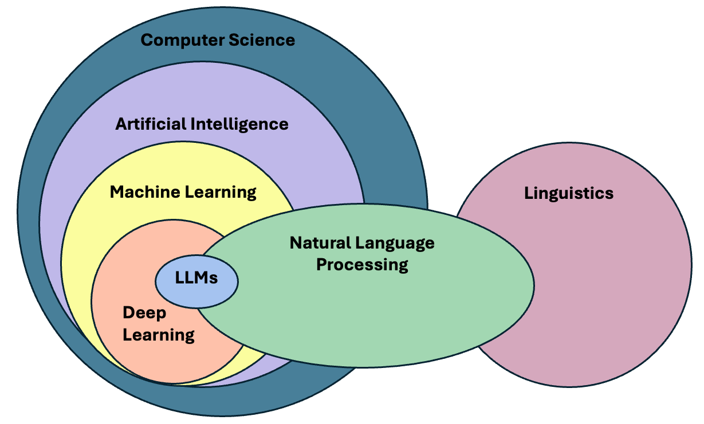
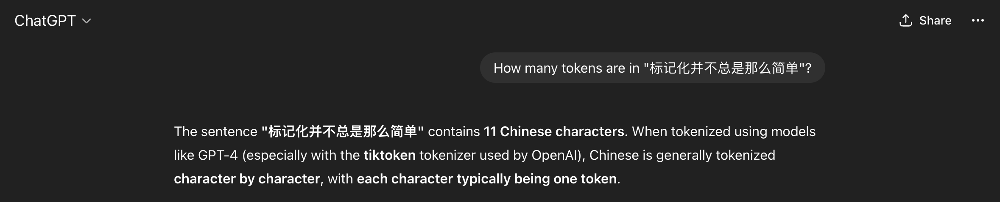
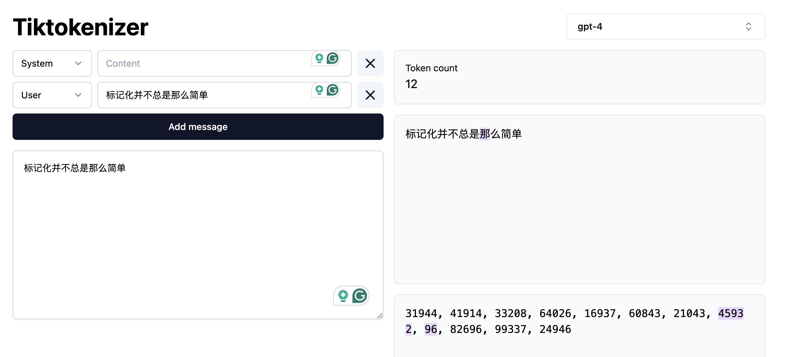
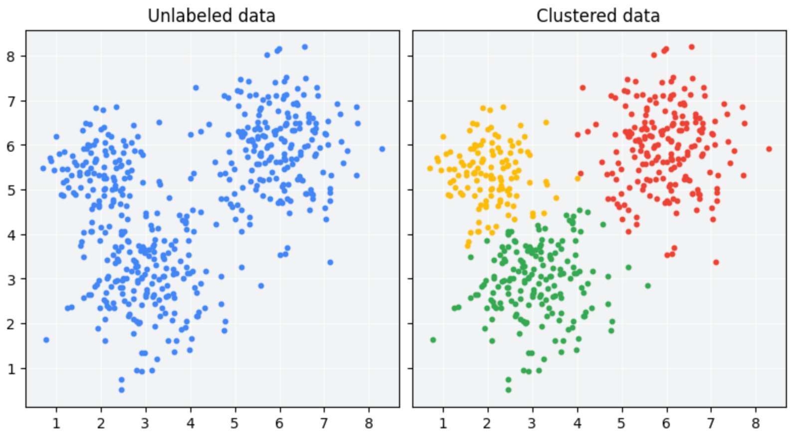
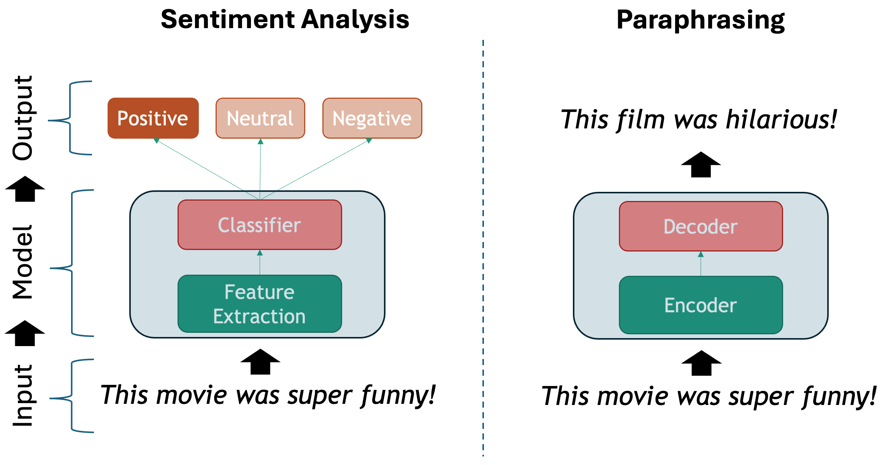
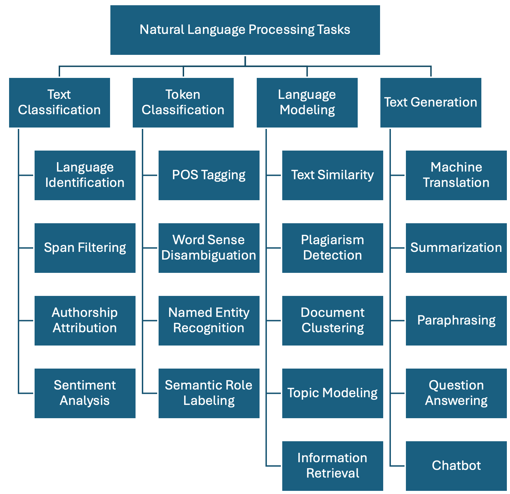
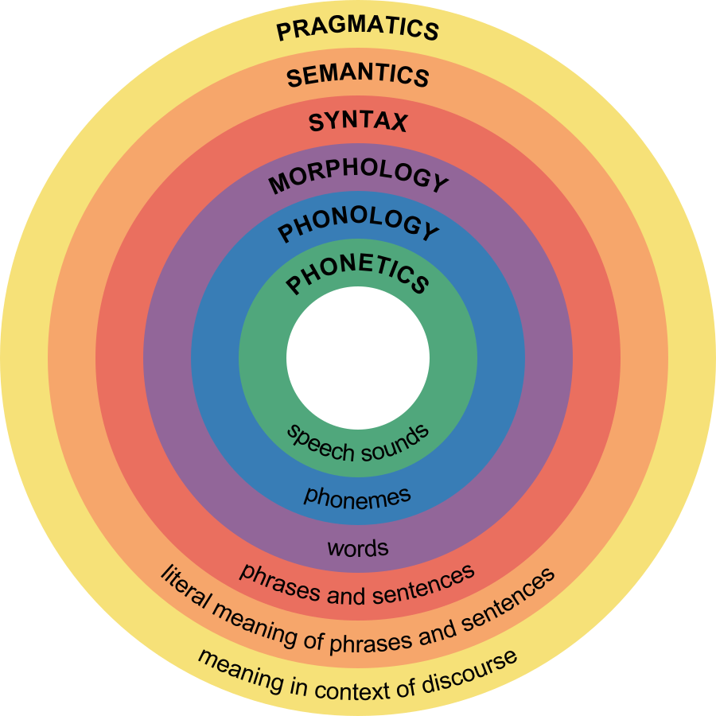
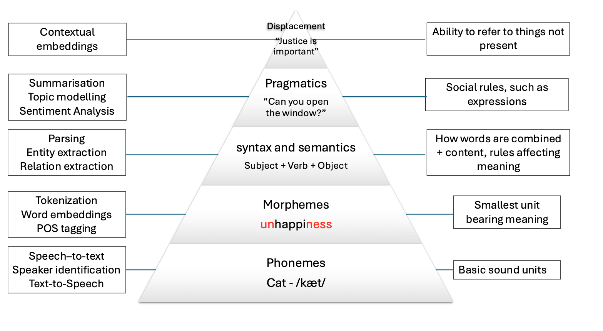

::: questions
-   What is Natural Language Processing?
-   What are some common applications of NLP?
-   What makes text different from other data?
-   Why not just learn Large Language Models?
-   What linguistic properties should we consider when dealing with texts?
-   How does NLP relates to Deep Learning methodologies?
:::

::: objectives
-   Define Natural Language Processing
-   Show the most relevant NLP tasks and applications in practice
-   Learn how to handle Linguistic Data and how is Linguistics relevant to NLP
-   Learn a general workflow for solving NLP tasks
:::

## What is NLP?

Natural language processing (NLP) is an area of research and application that focuses on making human languages accessible to computers, so that they can perform useful tasks. It is therefore not a single method, but a collection of techniques that help us deal with linguistic inputs. The range of techniques covers from simple word counts, to Machine Learning (ML) methods, and all the way into using complex Deep Learning (DL) architectures.

The term "natural language" is used as opposed to "artificial language", such as programming languages, which are by design constructed to be easily formalized into machine-readable instructions. On the contrary, natural languages are complex, ambiguous, and heavily context-dependent, making them challenging for computers to process. To complicate it more, there is not only a single *human language*, nowadays more than 7000 languages are spoken around the world, each with its own grammar, vocabulary, and cultural context.

In this course we will mainly focus on written English (and a few other languages in some specific examples as well), however this is only a convenience so we can concentrate on the technical aspects of processing textual data. While ideally most of the concepts from NLP apply to most languages, one should always be ware that certain languages require different approaches to solve seemingly similar problems. We would however like to encourage the usage of NLP tehcniques in your own languages, expecially if it is a minority language. You can read more about this topic [here](https://www.ruder.io/nlp-beyond-english/).

We can already find differences on the most basic step to processing text. Take the problem of segmenting text into meaningful units, most of the times these units are words, in NLP we call this task **tokenization**. A naive approach is to obtain individual words by splitting text by spaces, as it seems obvious that we always separate words with spaces. Let's see how can we segment a sentenc ein English and Chinese:

``` python
english_sentence = "Tokenization isn't always trivial."
english_words = english_sentence.split(" ")
print(english_words)
print(len(english_words))
```

``` output
['Tokenization', "isn't", 'always', 'trivial.']
4
```

Words are mostly well separated, however we do not get fully "clean" words (we have punctuation and also special cases such as "isn't"), but at least we get a rough count of the words present in the sentence. Let's now look at the same example in Chinese:

``` python
# Chinese Translation of "Tokenization is not always trivial"
chinese_sentence = "标记化并不总是那么简单" 

chinese_words = chinese_sentence.split(" ")
print(chinese_words)
print(len(chinese_words))
```

``` output
['标记化并不总是那么简单']
1
```

The same example however did not work in Chinese, because Chinese does not use spaces to separate words. We need to use a Chinese pre-trained tokenizer, which uses a dictionary-based approach to properly split the words:

``` python
import jieba  # A popular Chinese text segmentation library
chinese_sentence = "标记化并不总是那么简单"
chinese_words = jieba.lcut(chinese_sentence)
print(chinese_words)
print(len(chinese_words))  # Output: 7
```

``` output
['标记', '化', '并', '不', '总是', '那么', '简单']
7
```

We can trust that the output is valid because we are using a verified library, even though we don't speak Chinese. Another interesting aspect is that the Chinese sentence has more words than the English one, even though they convey the same meaning. This shows the complexity of dealing with more than one language at a time, like in Machine Translation.

::: callout
### Pre-trained Models and Fine-tunning

These two terms will appear very frequently when talking about NLP. The term *pre-trained* is taken from Machine Learning and refers to a model that has been already optimized using relevant data to perform a task. It is possible to directly load and use the model out-of-the-box to apply it to our own dataset. Ideally, released pre-trained models have already been tested for generalization and quality of outputs, but it is always important to double check the evaluation process they were subjected to before using them.

Sometimes a pre-trained model is of good quality, but it does not fit the nuances of our specific dataset. For example, the model was trained on newspaper articles but you are interested in poetry. In this case, it is common to perform *fine-tunning*, this means that instead of training your own model from scratch, you start with the knowledge obtained in the pre-trained model and adjust it (fine-tune it) with your specific data. If this is done well it leads to increased performance in the specific task you are trying to solve. The advantage of fine-tunning is that you do not need a large amount of data to improve the results, hence the popularity of the technique.
:::

Natural Language Processing deals with the challenges of correctly processing and generating text in any language. This can be as simple as counting word frequencies to detect different writing styles, using statistical methods to classify texts into different categories, or using deep neural networks to generate human-like text by exploiting word co-occurrences in large amounts of texts.

## Why should we learn NLP Fundamentals?

In the past decade, NLP has evolved significantly, especially in the field of deep learning, to the point that it has become embedded in our daily lives, one just needs to look at the term Large Language Models (LLMs), the latest generation of NLP models, which is now ubiquitous in news media and tech products we use on a daily basis.

The term LLM now is often (and wrongly) used as a synonym of Artificial Intelligence. We could therefore think that today we just need to learn how to manipulate LLMs in order to fulfill our research goals involving textual data. The truth is that Language Modeling has always been part of the core tasks of NLP, therefore, by learning NLP you will understand better where are the main ideas behind LLMs coming from.



LLM is a blanket term for an assembly of large neural networks that are trained on vast amounts of text data with the objective of optimizing for language modeling. Once they are trained, they are used to generate human-like text or fine-tunned to perform much more advanced tasks. Indeed, the surprising and fascinating properties that emerge from training models at this scale allows us to solve different complex tasks such as answer elaborate questions, translate languages, solve complex problems, generate narratives that emulate reasoning, and many more, all of this with a single tool.

It is important, however, to pay attention to what is happening behind the scenes in order to be able **trace sources of errors and biases** that get hidden in the complexity of these models. The purpose of this course is precisely to take a step back, and understand that: - There is a wide variety of tools available, beyond LLMs, that do not require so much computing power. - Sometimes a much simpler and easier method is already available that can solve our problem at hand. - If we learn how previous approaches to solve linguistic problems were designed, we can better understand the limitations of LLMs and how to use them effectively. - LLMs excel at confidently delivering information, without any regards for correctness. This calls for a careful design of **evaluation metrics** that give us a better understanding of the quality of the generated content.

Let's go back to our problem of segmenting text and see what ChatGPT has to say about tokenizing Chinese text:



We got what sounds like a straightforward confident answer. However, it is not clear how the model arrived at this solution. Second, we do not know whether the solution is correct or not. In this case ChatGPT made some assumptions for us, such as choosing a specific kind of tokenizer to give the answer, and since we do not speak the language, we do not know if this is indeed the best approach to tokenize Chinese text. If we understand the concept of Token (which we will today!), then we can be more informed about the quality of the answer, whether it is useful to us, and therefore make a better use of the model.

And by the way, ChatGPT was **almost** correct, in the specific case of the gpt-4 tokenizer, the model will return 12 tokens (not 11!) for the given Chinese sentence.



We can also argue if the statement "Chinese is generally tokenized character by character" is an overstatement or not. In any case, the real question here is: Are we ok with *almost correct answers*? Please note that this is not a call to avoid using LLM's but a call for a careful consideration of usage and more importantly, an attempt to explain the mechanisms behind via NLP concepts.

## Language as Data

From a more technical perspective, NLP focuses on applying advanced statistical techniques to linguistic data. This is a key factor, since we need a structured dataset with a well defined set of features in order to manipulate it numerically. Your first task as an NLP practitioner is to **understand what aspects of textual data are relevant for your application** and apply techniques to systematically extract meaningful features from unstructured data (if using statistics or Machine Learning) or choose an appropriate neural architecture (if using Deep Learning) that can help solve our problem at hand.

### What is a word?

When dealing with language our basic data unit is usually a word. We deal with sequences of words and with how they relate to each other to generate meaning in text pieces. Thus, our first step to load a text file and provide it with structure by chunking it into valid words (tokenization!).

::: callout
### Token vs Word

For simplicity, in the rest of the course we will use the terms "word" and "token" interchangeably, but as we just saw they do not always have the same granularity. Originally the concept of token comprised dictionary words, numeric symbols and punctuation. Nowadays, tokenization has also evolved and became an optimization task on its own (How can we segment text in a way that neural networks learn optimally from text?). Tokenizers always allow to "reconstruct back" tokens to human-readable words even if internally they split the text differently, hence we can afford to use them as synonyms. If you are curious, you can visualize how different state-of-the-art tokenizers work [here](https://tiktokenizer.vercel.app/)
:::

Let's open a file, read it into a string and split it by spaces. We will print the original text and the list of "words" to see how they look:

``` python
with open("text1_clean.txt") as f:
  text = f.read()

print(text[:100])
print("Length:", len(text))

proto_tokens = text.split()
print(proto_tokens[:40])
print(len(proto_tokens))
```

``` output
Letter 1 St. Petersburgh, Dec. 11th, 17-- TO Mrs. Saville, England You will rejoice to hear that no disaster has accompanied the commencement of an en
Length: 417931

Proto-Tokens:
['Letter', '1', 'St.', 'Petersburgh,', 'Dec.', '11th,', '17--', 'TO', 'Mrs.', 'Saville,', 'England', 'You', 'will', 'rejoice', 'to', 'hear', 'that', 'no', 'disaster', 'has', 'accompanied', 'the', 'commencement', 'of', 'an', 'enterprise', 'which', 'you', 'have', 'regarded', 'with', 'such', 'evil', 'forebodings.', 'I', 'arrived', 'here', 'yesterday,', 'and', 'my']
74942
```

Splitting by white space is possible but needs several extra steps to do get the clean words and separate the punctuation appropriately. Instead, we will introduce the [spaCy](https://github.com/explosion/spaCy) library to segment the text into human-readable tokens. First we will download the pre-trained model, in this case we only need the small English version:

``` python
! python -m spacy download en_core_web_sm
```

This is a model that spaCy already trained for us on a subset of web English data. Hence, the model already "knows" how to tokenize into English words. When the model processes a string, it does not only do the splitting for us but already provides more advanced linguistic properties of the tokens (such as part-of-speech tags, or named entities). Let's now import the model and use it to parse our document:

``` python
import spacy

nlp = spacy.load("en_core_web_sm") # we load the small English model for efficiency

doc = nlp(text) # Doc is a python object with several methods to retrieve linguistic properties

# SpaCy-Tokens
tokens = [token.text for token in doc] # Note that spacy tokens are also python objects 
print(tokens[:40])
print(len(tokens))
```

``` output
['Letter', '1', 'St.', 'Petersburgh', ',', 'Dec.', '11th', ',', '17', '-', '-', 'TO', 'Mrs.', 'Saville', ',', 'England', 'You', 'will', 'rejoice', 'to', 'hear', 'that', 'no', 'disaster', 'has', 'accompanied', 'the', 'commencement', 'of', 'an', 'enterprise', 'which', 'you', 'have', 'regarded', 'with', 'such', 'evil', 'forebodings', '.']
85713
```

The differences look subtle at the beginning, but if we carefully inspect the way spaCy splits the text, we can see the advantage of using a proper tokenizer. There are also a several of properties that spaCy provides us with, for example we can get only symbols or only alphanumerical tokens, and more advanced linguistic properties, for example we can remove punctuation and only keep alphanumerical tokens:

``` python
only_words = [token for token in doc if token.is_alpha]  # Only alphanumerical tokens
print(only_words[:50])
print(len(only_words))
```

``` output
[Letter, Petersburgh, TO, Saville, England, You, will, rejoice, to, hear]
1199
```

or keep only the verbs from our text:

``` python
only_verbs = [token for token in doc if token.pos_ == "VERB"]  # Only verbs
print(only_verbs[:10])
print(len(only_verbs))
```

``` output
[rejoice, hear, accompanied, regarded, arrived, assure, increasing, walk, feel, braces]
150
```

SpaCy also predicts the sentences under the hood for us. We can access them like this:

``` python
sentences = [sent.text for sent in doc.sents] # Sentences are also python objects
print(sentences[:5])
print(len(sentences))
```

``` output
Letter 1 St. Petersburgh, Dec. 11th, 17-- TO Mrs. Saville, England You will rejoice to hear that no disaster has accompanied the commencement of an enterprise which you have regarded with such evil forebodings.
I arrived here yesterday, and my first task is to assure my dear sister of my welfare and increasing confidence in the success of my undertaking.
I am already far north of London, and as I walk in the streets of Petersburgh, I feel a cold northern breeze play upon my cheeks, which braces my nerves and fills me with delight.
Do you understand this feeling?
This breeze, which has travelled from the regions towards which I am advancing, gives me a foretaste of those icy climes.
48
```

We can also see what named entities the model predicted:

``` python
print(len(doc.ents))
for ent in doc.ents[:5]:
    print(ent.label_, ent.text)
```

``` output
1713
DATE Dec. 11th
CARDINAL 17
PERSON Saville
GPE England
DATE yesterday
```

This are just basic tests to show you how you can right away structure text using existing NLP libraries. Of course we used a simplified model so the more complex the task the more errors will appear. The biggest advantage of using these existing libraries is that they help you transform unstructured plain text files into structured data that you can manipulate later for your own goals.

:::: challenge
### NLP in the real world

Name three to five tools/products that you use on a daily basis and that you think leverage NLP techniques. To solve this exercise you can get some help from the web.

::: solution
These are some of the most popular NLP-based products that we use on a daily basis:

-   Agentic Chatbots (ChatGPT, Perplexity)
-   Voice-based assistants (e.g., Alexa, Siri, Cortana)
-   Machine translation (e.g., Google translate, Amazon translate)
-   Search engines (e.g., Google, Bing, DuckDuckGo)
-   Keyboard autocompletion on smartphones
-   Spam filtering
-   Spell and grammar checking apps
-   Customer care chatbots
-   Text summarization tools (e.g., news aggregators)
-   Sentiment analysis tools (e.g., social media monitoring)
:::
::::

### NLP tasks

The previous exercise shows that a great deal of NLP techniques is embedded in our daily life. Indeed NLP is an important component in a wide range of software applications that we use in our day to day activities.

There are several ways to describe the tasks that NLP solves. From the Machine Learning perspective, we have:

-   Unsupervised tasks: exploiting existing patterns from large amounts of text.

{width="582"}

-   Supervised tasks: learning to classify texts given a labeled set of examples

{width="605"}

The Deep Learning perspective usually involves the selection of the right model among different neural network architectures to tackle an NLP task, such as:

-   Multi-layer Perceptron

-   Recurrent Neural Network

-   Convolutional Neural Network

-   LSTM

-   Transformer (including LLMs!)

Regardless of the chosen method, below we show one possible taxonomy of NLP tasks. The tasks are grouped together with some of their most prominent applications. This is definitely a non-exhaustive list, as in reality there are hundreds of them, but it is a good start:

{width="630"}

-   **Text Classification**: Assign one or more labels to a given piece of text. This text is usually referred as *document* and in our context this can be a sentence, a paragraph, a book chapter, etc...

    -   **Language Identification**: determining the language of a given text.
    -   **Spam Filtering**: classifying emails into spam or not spam based on their content.
    -   **Authorship Attribution**: determining the author of a text based on its style and content (based on the assumption that each author has a unique writing style).
    -   **Sentiment Analysis**: classifying text into positive, negative or neutral sentiment. For example, in the sentence "I love this product!", the model would classify it as positive sentiment.

-   **Token Classification**: The task of individually assigning one label to each word in a document. This is a one-to-one mapping; however, because words do not occur in isolation and their meaning depend on the sequence of words to the left or the right of them, this is also called Word-In-Context Classification or Sequence Labeling and usually involves syntactic and semantic analysis.

    -   **Part-Of-Speech Tagging**: is the task of assigning a part-of-speech label (e.g., noun, verb, adjective) to each word in a sentence.
    -   **Chunking**: splitting a running text into "chunks" of words that together represent a meaningful unit: phrases, sentences, paragraphs, etc.
    -   **Word Sense Disambiguation**: based on the context what does a word mean (think of "book" in "I read a book." vs "I want to book a flight.")
    -   **Named Entity Recognition**: recognize world entities in text, e.g. Persons, Locations, Book Titles, or many others. For example "Mary Shelley" is a person, "Frankenstein or the Modern Prometeus" is a book, etc.
    -   **Semantic Role Labeling**: the task if finding out "Who did what to whom?" in a sentence: information from events such as agents, participants, circumstances, etc.
    -   **Relation Extraction**: the task of identifying named relationships between entities in a text, e.g. "Apple is based in California" has the relation (Apple, based_in, California).
    -   **Co-reference Resolution**: the task of determining which words refer to the same entity in a text, e.g. "Mary is a doctor. She works at the hospital." Here "She" refers to "Mary".
    -   **Entity Linking**: the task of disambiguation of named entities in a text, linking them to their corresponding entries in a knowledge base, e.g. Mary Shelley's biogrpaphy in Wikipedia.

-   **Language Modeling**: Given a sequence of words, the model predicts the next word. For example, in the sentence "The capital of France is \_\_\_\_\_", the model should predict "Paris" based on the context. This task was initially useful for building solutions that require speech and optical character recognition (even handwriting), language translation and spelling correction. Nowadays this has scaled up to the LLMs that we know. A byproduct of pre-trained Language Modeling is the vectorized representation of texts which allows to perform specific tasks such as:

    -   **Text Similarity**: The task of determining how similar two pieces of text are.
    -   **Plagiarism detection**: determining whether a piece of TextB is close enough to another known piece of TextA, which increments the likelihood that it was copied from it.
    -   **Document clustering**: grouping similar texts together based on their content.
    -   **Topic modelling**: A specific instance of clustering, here we automatically identify abstract "topics" that occur in a set of documents, where each topic is represented as a cluster of words that frequently appear together.
    -   **Information Retrieval**: This is the task of finding relevant information or documents from a large collection of unstructured data based on user's query, e.g., "What's the best restaurant near me?".

-   **Text Generation**: The task of generating text based on a given input. This is usually done by generating the output word by word, conditioned on both the input and the output so far. The difference with Language Modeling is that for generation there are higher-level generation objectives such as:

    -   **Machine Translation**: translating text from one language to another, e.g., "Hello" in English to "Que tal" in Spanish.
    -   **Summarization**: generating a concise summary of a longer text. It can be abstractive (generating new sentences that capture the main ideas of the original text) but also extractive (selecting important sentences from the original text).
    -   **Paraphrasing**: generating a new sentence that conveys the same meaning as the original sentence, e.g., "The cat is on the mat." to "The mat has a cat on it.".
    -   **Question Answering**: Given a question and a context, the model generates an answer. For example, given the question "What is the capital of France?" and the Wikipedia article about France as the context, the model should answer "Paris". This task can be approached as a text classification problem (where the answer is one of the predefined options) or as a generative task (where the model generates the answer from scratch).
    -   **Conversational Agent (ChatBot)**: Building a system that interacts with a user via natural language, e.g., "What's the weather today, Siri?". These agents are widely used to improve user experience in customer service, personal assistance and many other domains.

For the purposes of this episode, we will focus on **supervised learning** tasks and we will emphasize how the **Transformer architecture** is used to tackle some of them.

:::: challenge
## Inputs and Outputs

Look at the NLP Task taxonomy described above and write down a couple of examples of (Input, Output) instance pairs that you would need in order to train a supervised model for your chosen task.

::: solution
Example: the task of Conversational agent. Here are 3 instances to provide supervision for a model:

**Input:** "Hello, how are you?" **Output:** "I am fine thanks!"

**Input:** "Do you know at what time is the Worldcup final today?" **Output:** "Yes, the Worldcup final will be at 6pm CET"

**Input:** "What color is my shirt?" **Output:** "Sorry, I am unable to see what you are wearing."
:::
::::

::: callout
### NLP Libraries

Related to the need of shaping our problems into a known task, there are several existing NLP libraries which provide a wide range of models that we can use out-of-the-box. We already saw simple examples using SpaCy for English and jieba for Chinese. Again, as a non-exhaustive list, we mention here some of the most used NLP libraries in python:

-   [NLTK](https://github.com/nltk/nltk)
-   [spaCy](https://github.com/explosion/spaCy)
-   [Gensim](https://github.com/RaRe-Technologies/gensim)
-   [Stanza](https://github.com/stanfordnlp/stanza)
-   [Flair](https://github.com/flairNLP/flair)
-   [FastText](https://github.com/facebookresearch/fastText)
-   [HuggingFace Transformers](https://github.com/huggingface/transformers)

### Linguistic Resources

There are also several curated resources that can help solve your NLP-related tasks, specifically when you need highly specialized definitions. An exhaustive list would be impossible as there are thousands of them, and also them being language and domain dependent. Below we mention some of the most prominent, just to give you an idea of the kind of resources you can find, so you don't need to reinvent the wheel every time you start a project:

-   [HuggingFace Datasets](https://huggingface.co/datasets): A large collection of datasets for NLP tasks, including text classification, question answering, and language modeling.
-   [WordNet](https://wordnet.princeton.edu/): A large lexical database of English, where words are grouped into sets of synonyms (synsets) and linked by semantic relations.
-   [Europarl](https://www.europarl.europa.eu/ep-search/search.do?language=en): A parallel corpus of the proceedings of the European Parliament, available in 21 languages, which can be used for machine translation and cross-lingual NLP tasks.
-   [Universal Dependencies](https://universaldependencies.org/): A collection of syntactically annotated treebanks across 100+ languages, providing a consistent annotation scheme for syntactic and morphological properties of words, which can be used for cross-lingual NLP tasks.
-   [PropBank](https://propbank.github.io/): A corpus of texts annotated with information about basic semantic propositions, which can be used for English semantic tasks.
-   [FrameNet](https://framenet.icsi.berkeley.edu/fndrupal/): A lexical resource that provides information about the semantic frames that underlie the meanings of words (mainly verbs and nouns), including their roles and relations.
-   [BabelNet](https://babelnet.org/): A multilingual lexical resource that combines WordNet and Wikipedia, providing a large number of concepts and their relations in multiple languages.
-   [Wikidata](https://www.wikidata.org/): A free and open knowledge base initially derived from Wikipedia, that contains structured data about entities, their properties and relations, which can be used to enrich NLP applications.
-   [Dolma](https://github.com/allenai/dolma): An open dataset of 3 trillion tokens from a diverse mix of clean web content, academic publications, code, books, and encyclopedic materials, used to train English large language models.
:::

## Relevant Linguistic Aspects

Natural language exhibits a set fo properties that make it more challenging to process than other types of data such as tables, spreadsheets or time series. **Language is hard to process because it is compositional, ambiguous, discrete and sparse**.

### Compositionality

The basic elements of written languages are characters, a sequence of characters form words, and words in turn denote objects, concepts, events, actions and ideas (Goldberg, 2016). Subsequently words form phrases and sentences which are used in communication and depend on the context in which they are used. We as humans derive the meaning of utterances from interpreting contextual information that is present at different levels at the same time:

{width="573"}

The first two levels refer to spoken language only, and the other four levels are present in both speech and text. Because in principle machines do not have access to the same levels of information that we do (they can only have independent audio, textual or visual inputs), we need to come up with clever methods to overcome this significant limitation. Knowing the levels of language is important so we consider what kind of problems we are facing when attempting to solve our NLP task at hand.

### Ambiguity

The disambiguation of meaning is usually a by-product of the context in which utterances are expressed and also the historic accumulation of interactions which are transmitted across generations (think for instance to idioms -- these are usually meaningless phrases that acquire meaning only if situated within their historical and societal context). These characteristics make NLP a particularly challenging field to work in.

We cannot expect a machine to process human language and simply understand it as it is. We need a systematic, scientific approach to deal with it. It's within this premise that the field of NLP is born, primarily interested in converting the building blocks of human/natural language into something that a machine can understand.

The image below shows how the levels of language relate to a few NLP applications:



:::: challenge
## Levels of ambiguity

Discuss what do the following sentences mean. What level of ambiguity do they represent?:

-   "The door is unlockable from the inside." vs "Unfortunately, the cabinet is unlockable, so we can't secure it"
-   "I saw the *cat with the stripes*" vs "I saw the cat *with the telescope*"
-   "Colorless green ideas sleep furiously"
-   "I never said she stole my money." vs "I never said she stole my money."

::: solution
This is why the previous statements were difficult:

-   "Un-lockable vs Unlock-able" is a **Morphological** ambiguity: Same word form, two possible meanings
-   "I saw the cat with the telescope" is a **Syntactic** ambiguity: Same sentence structure, different properties
-   "Colorless green ideas sleep furiously" **Semantic** ambiguity: Grammatical but meaningless (ideas do not have color as a property. Even if this was true, they would be either colorless or green)
-   "I NEVER said she stole MY money." is a **Pragmatic** ambiguity: Meaning relies on word emphasis
:::
::::

Whenever you are solving a specific task, you should ask yourself what kind of ambiguity can affect your results? At what level are your assumptions operating when defining your research questions? Having the answers to this can save you a lot of time when debugging your models. Sometimes the most innocent assumptions (for example using the wrong tokenizer) can create enormous performance drops even when the higher level assumptions were correct.

### Sparsity

Another key property of linguistic data is its sparsity. This means that if we are hunting for a specific phenomenon, we will realize it barely occurs inside a enormous amount of text. Imagine we have the following brief text and we are interested in *pizzas* and *hamburgers*:

``` python
# A mini-corpus where our target words appear
text = """
I am hungry. Should I eat delicious pizza?
Or maybe I should eat a juicy hamburger instead.
Many people like to eat pizza because is tasty, they think pizza is delicious as hell!
My friend prefers to eat a hamburger and I agree with him.
We will drive our car to the restaurant to get the succulent hamburger.
Right now, our cat sleeps on the mat so we won't take him.
I did not wash my car, but at least the car has gasoline.
Perhaps when we come back we will take out the cat for a walk.
The cat will be happy then.
"""
```

We should first use spacy to tokenize the text and do some direct word count:

``` python
import spacy
nlp = spacy.load("en_core_web_sm")

doc = nlp(text)
words = [token.lower_ for token in doc if token.is_alpha]  # Filter out punctuation and new lines
print(words)
print(len(words))
```

We have in total 104 words, but we actually want to know how many times each word appears. For that we use the python Counter and matplotlib to create a chart:

``` python
from collections import Counter
import matplotlib.pyplot as plt

word_count = Counter(words).most_common()
tokens = [item[0] for item in word_count]
frequencies = [item[1] for item in word_count]

plt.figure(figsize=(18, 6))
plt.bar(tokens, frequencies)
plt.xticks(rotation=90)
plt.show()
```

This bar chart shows us several things about sparsity, even with such a small text: - The most common words are filler words, which do not carry strong semantic meaning (they are known as stop words) - The two concepts we are interested in, appear only 3 times each, out of 104 words (comprising only of 3% our corpus). This number only goes lower as the corpus increases - There is a long tail in the distribution, where actually a lot of meaningful words are located

Sparsity is tightly link to what is frequently called **domain-specific data**. The discourse context in which language is used varies importantly across disciplines (domains). Take for example law texts and medical texts, we should expect the top part of the distirbution to contain very different content words. Also, the meaning of concepts described in each domain will significantly differ. For this reason there are specialized models and corpora that model language use in specific domains. The concept of fine-tunning a general purpose model with domain-specific data is also popular, even when using LLMs.

::: callout
## Stop Words

**Stop words** are extremely frequent syntactic filler words that do not provide relevant semantic information for our use case. For some use cases it is better to ignore them in order to fight the sparsity problem. However, consider that in many other use cases the syntactic information that stop words provide is crucial to solve the task.

Spacy has a pre-defined list of stopwords per language. To explicitly load the English stop words we can do

``` python
from spacy.lang.en.stop_words import STOP_WORDS
print(STOP_WORDS)  # a set of common stopwords
print(len(STOP_WORDS)) # There are 326 words considered in this list
```

You can also manually extend the list of stop words if you ar einterested in ignoring specific terms.

Alternatively you can filter out stop words when iterating your tokens (remember the spacy token properties!) like this:

``` python
doc = nlp(text)
content_words = [token.text for token in doc if token.is_alpha and not token.is_stop]  # Filter out stop words and punctuation
print(content_words)
```
:::

### Discreteness

There is no inherent relationship between the form of a word and its meaning. For the same reason, by textual means alone, there is no way of knowing if two words are similar or how do they relate to each other. How can we automatically know that "pizza" and "hamburger" share more properties than "car" and "cat"? One way is by looking at the context in which these words are used, and how they are related to each other. This idea is the principle behind **distributional semantics**, and aims to look at the statistical properties of language, such as word co-occurrences, to understand how words relate to each other.

Let's keep using our mini corpus. This time we only keep content words as we have very specific targets in mind

``` python
words = [token.lower_ for token in doc if token.is_alpha and not token.is_stop]  # Filter out punctuation and new lines
```

Now we will create a dictionary where we accumulate the words that appear around our words of interest. In this case we want to find out, according to our corpus, the most frequent words that occurr around *pizza*, *hamburger*, *car* and *cat*:

``` python
target_words = ["pizza", "hamburger", "car", "cat"] # words we want to analyze
co_occurrence = {word: [] for word in target_words}
co_occurrence
```

We iterate the content words, calculate a window of words arount each word and accumulate them:

``` python
window_size = 3 # How many words to look at on each side
for i, word in enumerate(words):
    # If the current word is one of our target words...
    if word in target_words:
        start = max(0, i - window_size) # get the start index of the window
        end = min(len(words), i + 1 + window_size) # get the end index of the window
        context = words[start:i] + words[i+1:end]  # Exclude the target word itself
        co_occurrence[word].extend(context)

print(co_occurrence)
```

As we can see, our dictionary has as keys each word of interest, and the values are a long list of the words that occur within *window_size* distance of the word. Now we use a Counter to get the most common items:

``` python
# Print the most common context words for each target word
print("Contextual Fingerprints:\n")
for word, context_list in co_occurrence.items():
    # We use Counter to get a frequency count of context words
    fingerprint = Counter(context_list).most_common(5)
    print(f"'{word}': {fingerprint}")
```

``` output
Contextual Fingerprints:

'pizza': [('eat', 2), ('delicious', 2), ('?', 1), ('or', 1), ('maybe', 1)]
'hamburger': [('eat', 2), ('juicy', 1), ('instead', 1), ('many', 1), ('agree', 1)]
'car': [('drive', 1), ('restaurant', 1), ('wash', 1), ('gasoline', 1)]
'cat': [('walk', 2), ('now', 1), ('sleeps', 1), ('on', 1), ('take', 1)]
```

As our tiny experiment show, discreteness can then be combatted with statistical co-occurrence: words with similar meaning will occur around similar concepts, giving us an idea of similarity that has nothing to do with how they are written. This is the core idea behind most modern meaning representation models in NLP.

:::: challenge
### Your first NLP Script

Choose one book file: dracula or frankenstein. Use what you have learned so far to count how many times the words "love" and "hate" appear in the book. What does this tell you about sparsity?

Then replicate the word co-ocurrence experiment using the book you chose.

Pair with someone that chose a different book and compare the most common words appearing around the two target terms. What can you conclude from this?

To do this experiment you should:

1.  Read the file and save it into a text variable
2.  Use spacy to load the text into a Doc object.
3.  Iterate the document and keep all tokens that are alphanumeric (use the token.is_alpha property), and are not stopwords (use the property token.is_stop).
4.  Lowercase all the tokens to merge the instances of "Love" and "love" into a single one.
5.  Iterate the tokens and count how many of them are exactly "love"
6.  Iterate the tokens and count how many of them are exactly "hate"
7.  You can use the following function to compute co-occurrence. You can play with the `window_size` or the `most_common_words` parameters to see how the results change.

``` python
def populate_co_occurrence(words, target_words, window_size=3, most_common_words=5):
    co_occurrence = {word: [] for word in target_words}
    for i, word in enumerate(words):
        if word in target_words:
            start = max(0, i - window_size)
            end = min(len(words), i + 1 + window_size)
            context = words[start:i] + words[i+1:end]
            co_occurrence[word].extend(context)
    # Print the most common context words for each target word
    print("Contextual Fingerprints:\n")
    for word, context_list in co_occurrence.items():
        fingerprint = Counter(context_list).most_common(most_common_words)
        print(f"'{word}': {fingerprint}")
```

::: solution
Following our preprocessing procedure with the *frankenstein book*, there are **30,500 content words**. The word **love appears 59 times** and the word **hate appears only 9 times**. These are 0.22% of the total words in the text. Even though intuitively these words should be quite common, in reality they occur only a handful of times. Code:

``` python
with open("84_frankenstein_clean.txt") as f:
  text = f.read()

doc = nlp(text)  # Process the text with SpaCy
words = [token.lower_ for token in doc if token.is_alpha and not token.is_stop]
print("Total Words:", len(words))

love_words = [word for word in words if "love" == word]
hate_words = [word for word in words if "hate" == word]

print("Love and Hate percentage:", (len(love_words) + len(hate_words)) / len(words) * 100, "% of content words")
```
:::
::::

::: keypoints
-   NLP is a subfield of Artificial Intelligence (AI) that, using the help of Linguistics, deals with approaches to process, understand and generate natural language
-   Linguistic Data has special properties that we should consider when modeling our solutions
-   Key tasks include language modeling, text classification, token classification and text generation
-   Deep learning has significantly advanced NLP, but the challenge remains in processing the discrete and ambiguous nature of language
-   The ultimate goal of NLP is to enable machines to understand and process language as humans do
:::
