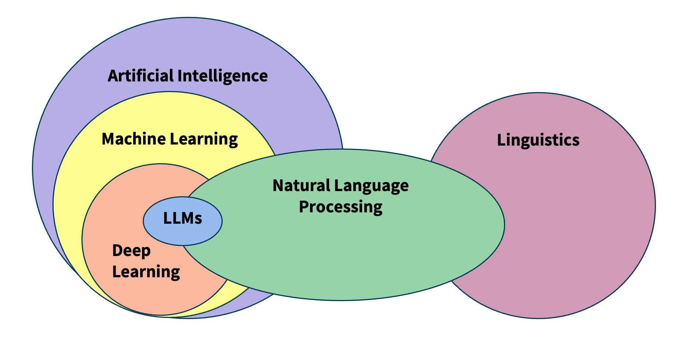
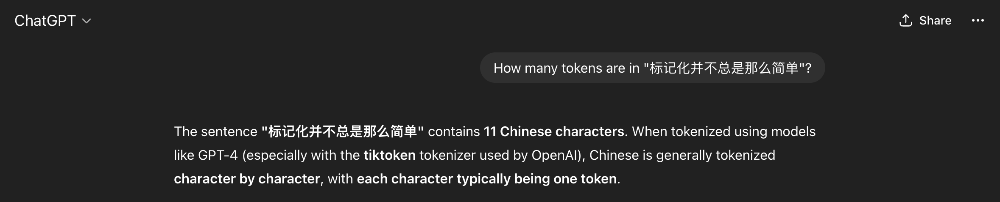
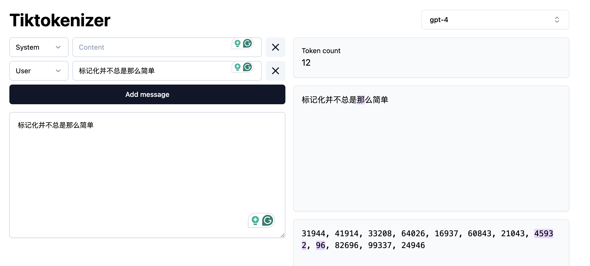

::: questions
-   What is Natural Language Processing?
-   Why not just learn Large Language Models?
-   How is text different from other data?
-   How can we extract structure from text?
:::

::: objectives
-   Define Natural Language Processing
-   Show the most relevant NLP tasks and applications
-   Understand the importance of NLP fundamentals
-   Learn how to manipulate linguistic data
:::

## What is NLP?

Natural language processing (NLP) is an area of research and application that focuses on making human languages processable for computers, so that they can perform useful tasks. It is therefore not a single method, but a collection of techniques that help us deal with linguistic inputs. The range of techniques spans from simple word counts, to Machine Learning (ML) methods, all the way up to complex Deep Learning (DL) architectures.

We use the term "natural language", as opposed to "artificial language" such as programming languages, which are by design constructed to be easily formalized into machine-readable instructions. In contrast to programming languages, natural languages are complex, ambiguous, and heavily context-dependent, making them challenging for computers to process. To complicate matters, there is not only a single *human language*. More than 7000 languages are spoken around the world, each with its own grammar, vocabulary, and cultural context.

In this course we will mainly focus on written language, specifically written English. We leave out audio and speech, as they require a different kind of input processing. But consider that we use English only as a convenience so we can address the technical aspects of processing textual data. While ideally most of the concepts from NLP apply to most languages, one should always be aware that certain languages require different approaches to solve seemingly similar problems. We would like to encourage the usage of NLP in other less widely known languages, especially if it is a minority language. You can read more about this topic in this [blogpost](https://www.ruder.io/nlp-beyond-english/).

:::: challenge
### NLP in the real world

Name three to five tools/products that you use on a daily basis and that you think leverage NLP techniques. To do this exercise you may make use of the Web.

::: solution
These are some of the most popular NLP-based products that we use on a daily basis:

-   Agentic Chatbots (ChatGPT, Perplexity)
-   Voice-based assistants (e.g., Alexa, Siri, Cortana)
-   Machine translation (e.g., Google translate, DeepL, Amazon translate)
-   Search engines (e.g., Google, Bing, DuckDuckGo)
-   Keyboard autocompletion on smartphones
-   Spam filtering
-   Spell and grammar checking apps
-   Customer care chatbots
-   Text summarization tools (e.g., news aggregators)
-   Sentiment analysis tools (e.g., social media monitoring)
:::
::::

We can already find differences between languages in the most basic step for processing text. Take the problem of segmenting text into meaningful units, most of the times these units are words, in NLP we call this task **tokenization**. A naive approach is to obtain individual words by splitting text by spaces, as it seems obvious that we always separate words with spaces. Just as human beings break up sentences into words, phrases and other units in order to learn about grammar and other structures of a language, NLP techniques achieve a similar goal through tokenization. Let's see how can we segment or **tokenize** a sentence in English:

``` python
english_sentence = "Tokenization isn't always trivial."
english_words = english_sentence.split(" ")
print(english_words)
print(len(english_words))
```

``` output
['Tokenization', "isn't", 'always', 'trivial.']
4
```

The words are mostly well separated, however we do not get fully formed words (we have punctuation with the period after "trivial" and also special cases such as the abbreviation of "is not" into "isn't"). But at least we get a rough count of the number of words present in the sentence. 

Let's now look at the same example in Chinese:

``` python
# Chinese Translation of "Tokenization is not always trivial"
chinese_sentence = "标记化并不总是那么简单" 

chinese_words = chinese_sentence.split(" ")
print(chinese_words)
print(len(chinese_words))
```

``` output
['标记化并不总是那么简单']
1
```

The same example however did not work in Chinese, because Chinese does not use spaces to separate words. This is an example of how the idiosyncrasies of human language affects how we can process them with computers. We therefore need to use a tokenizer specifically designed for Chinese to obtain the list of well-formed words in the text. Here we use a "pre-trained" tokenizer called **MicroTokenizer**, which uses a dictionary-based approach to correctly identify the distinct words:

``` python
import MicroTokenizer  # A popular Chinese text segmentation library
chinese_sentence = "标记化并不总是那么简单"
chinese_words = MicroTokenizer.cut(chinese_sentence)
print(chinese_words)
# ['mark', 'transform', 'and', 'no', 'always', 'so', 'simple']
print(len(chinese_words))  # Output: 7
```

``` output
['标记', '化', '并', '不', '总是', '那么', '简单']
7
```

We can trust that the output is valid because we are using a verified library - `MicroTokenizer`, even though we don't speak Chinese. Another interesting aspect is that the Chinese sentence has more words than the English one, even though they convey the same meaning. This shows the complexity of dealing with more than one language at a time, as is the case in task such as **Machine Translation** (using computers to translate speech or text from one human language to another).

::: callout
### A short history of word separation
As any historian would know, word separation in written texts is a relatively new development. You can check this yourself next time you visit a city with ancient monuments. Word separation, as oddly as it might sound today, is an example of technology.
:::

Natural Language Processing deals with the challenges of correctly processing and generating text in any language. This can be as simple as counting word frequencies to detect different writing styles, using statistical methods to classify texts into different categories, or using **deep neural networks** to generate human-like text by exploiting word co-occurrences in large amounts of texts.

## Why should we learn NLP Fundamentals?

In the past decade, NLP has evolved significantly, especially in the field of deep learning, to the point that it has become embedded in our daily lives. One just needs to look at the term Large Language Models (LLMs), the latest generation of NLP models, which is now ubiquitous in news media and tech products we use on a daily basis.

The term LLM now is often (and wrongly) used as a synonym of Artificial Intelligence. We could therefore think that today we just need to learn how to manipulate LLMs in order to fulfill our research goals involving textual data. The truth is that Language Modeling has always been part of the core tasks of NLP, therefore, by learning NLP you will understand better where are the main ideas behind LLMs coming from.



LLM is a blanket term for an assembly of large neural networks that are trained on vast amounts of text data with the objective of optimizing for language modeling. Once they are trained, they are used to generate human-like text or fine-tunned to perform much more advanced tasks. Indeed, the surprising and fascinating properties that emerge from training models at this scale allows us to solve different complex tasks such as answering elaborate questions, translating languages, solving complex problems, generating narratives that emulate reasoning, and many more. All of this with a single tool.

It is important, however, to pay attention to what is happening behind the scenes in order to be able **trace sources of errors and biases** that get hidden in the complexity of these models. The purpose of this course is precisely to take a step back and understand that:

-   There are a wide variety of tools available, beyond LLMs, that do not require so much computing power
-   Sometimes a much simpler method than an LLM is available that can solve our problem at hand
-   If we learn how previous approaches to solve linguistic problems were designed, we can better understand the limitations of LLMs and how to use them effectively
-   LLMs excel at confidently delivering information, without any regards for correctness. This calls for a careful design of **evaluation metrics** that give us a better understanding of the quality of the generated content.

Let's go back to our problem of segmenting text and see what ChatGPT has to say about tokenizing Chinese text:



We got what sounds like a straightforward confident answer. However, it is not clear how the model arrived at this solution. Second, we do not know whether the solution is correct or not. In this case ChatGPT made some assumptions for us, such as choosing a specific kind of tokenizer to give the answer, and since we do not speak the language, we do not know if this is indeed the best approach to tokenize Chinese text. If we understand the concept of Token (which we will today!), then we can be more informed about the quality of the answer, whether it is useful to us, and therefore make a better use of the model.

And by the way, ChatGPT was **almost** correct, in the specific case of the gpt-4 tokenizer, the model will return 12 tokens (not 11!) for the given Chinese sentence.



We can also argue if the statement "Chinese is generally tokenized character by character" is an overstatement or not. In any case, the real question here is: Are we ok with *almost correct answers*? Please note that this is not a call to avoid using LLM's but a call for a careful consideration of usage and more importantly, an attempt to explain the mechanisms behind via NLP concepts.

## Language as Data

From a more technical perspective, NLP focuses on applying advanced statistical techniques to linguistic data. This is a key factor, since we need a structured dataset with a well defined set of features in order to manipulate it numerically. Your first task as an NLP practitioner is to **understand what aspects of textual data are relevant for your application**. Afterwards you can apply techniques to systematically extract meaningful features from unstructured data (if using statistics or Machine Learning) or choose an appropriate neural architecture (if using Deep Learning) that can help solve our problem at hand.

### What is a word?

When dealing with language, our basic data unit is usually a word. We deal with sequences of words and with how they relate to each other to generate meaning in text pieces. Thus, our first step will be to load a text file and provide it with basic structure by splitting it into valid words (this is known as tokenization)!

::: callout
### Token vs Word

For simplicity, in the rest of the course we will use the terms "word" and "token" interchangeably, but as we just saw they do not always have the same granularity. Originally the concept of token comprised dictionary words, numeric symbols and punctuation. Nowadays, tokenization has also evolved and became an optimization task on its own (_How can we segment text in a way that neural networks learn optimally from text?_). Tokenizers allow one to reconstruct or revert back to the original pre-tokenized form of tokens or words, hence we can afford to use *token* and *word* as synonyms. If you are curious, you can visualize how different state-of-the-art tokenizers split text [in this WebApp](https://tiktokenizer.vercel.app/)
:::

Let's open a file, read it into a string and split it by spaces. We will print the original text and the list of "words" to see how they look:

``` python
with open("data/84_frankenstein_or_the_modern_prometheus.txt") as f:
  text = f.read()

print(text[:150])
print("\nLength:", len(text))

print("\nProto-Tokens:")
proto_tokens = text.split(" ")
print(proto_tokens[:50])
print(len(proto_tokens))
```

``` output
Letter 1


St. Petersburgh, Dec. 11th, 17--

TO Mrs. Saville, England

You will rejoice to hear that no disaster has accompanied the
commencement of a

Length: 421419

Proto-Tokens:
['Letter', '1\n\n\nSt.', 'Petersburgh,', 'Dec.', '11th,', '17--\n\nTO', 'Mrs.', 'Saville,', 'England\n\nYou', 'will', 'rejoice', 'to', 'hear', 'that', 'no', 'disaster', 'has', 'accompanied', 'the\ncommencement', 'of', 'an', 'enterprise', 'which', 'you', 'have', 'regarded', 'with', 'such', 'evil\nforebodings.', '', 'I', 'arrived', 'here', 'yesterday,', 'and', 'my', 'first', 'task', 'is', 'to', 'assure\nmy', 'dear', 'sister', 'of', 'my', 'welfare', 'and', 'increasing', 'confidence', 'in']
71197
```

Splitting by white space is possible but needs several extra steps to get clean words as we know them. We can also use the python `split()` function, which will basically strip any whitespace-like character (including new lines) and get some improvements:

``` python
print("\nProto-Tokens:")
proto_tokens = text.split()
print(proto_tokens[:50])
print(len(proto_tokens))
```

``` output
Proto-Tokens:
['Letter', '1', 'St.', 'Petersburgh,', 'Dec.', '11th,', '17--', 'TO', 'Mrs.', 'Saville,', 'England', 'You', 'will', 'rejoice', 'to', 'hear', 'that', 'no', 'disaster', 'has', 'accompanied', 'the', 'commencement', 'of', 'an', 'enterprise', 'which', 'you', 'have', 'regarded', 'with', 'such', 'evil', 'forebodings.', 'I', 'arrived', 'here', 'yesterday,', 'and', 'my', 'first', 'task', 'is', 'to', 'assure', 'my', 'dear', 'sister', 'of', 'my']
74942
```

however still several extra steps are needed to separate out punctuation appropriately, and perhaps the rules become cumbersome. 

::: callout
### Data Formatting
Texts come from various sources and are available in different formats (e.g., Microsoft Word documents, PDF documents, ePub files, plain text files, Web pages etc.). The first step is to obtain a clean text representation that can be transferred into Python UTF-8 strings that our scripts can manipulate.

Data formatting operations might include:

- Removal of special or noisy characters. For example:
    - Random symbols: "The total cost is $120.00#" → remove #
    - Incorrectly recognized letters or numbers: 1 misread as l, 0 as O, etc. Example: "l0ve" → should be "love"
    - Control or formatting characters: \n, \t, \r appearing in the middle of sentences. Example: "Please\nsubmit\tyour form." → "Please submit your form."
    - Non-displayable characters: �, �, or other placeholder symbols where OCR failed. Example: "Th� quick brown fox" → "The quick brown fox"
- Remove HTML tags (e.g., if you are extracting text from Web pages)
- Strip non-meaningful punctuation (e.g., "The quick brown fox jumps over the lazy dog and con-
tinues to run across the field.)
- Strip footnotes, headers, tables, images etc.
- Remove URLs or phone numbers

And what if you need to extract text from MS Word docs or PDF files or Web pages? There are various Python libraries for helping you extract and manipulate text from these kinds of sources.

- For MS Word documents [python-docx](https://python-docx.readthedocs.io/en/latest/) is popular.
- For (text-based) PDF files [PyPDF2](https://pypi.org/project/PyPDF2/) and [PyMuPDF](https://pymupdf.readthedocs.io/en/latest/) are widely used. Note that some PDF files are encoded as images (pixels) and not text. For digitizing printed text, you can use OCR (Optical Character Recognition) libraries such as [pytesseract](https://pypi.org/project/pytesseract/) to convert the image to machine-readable text.
- For scraping text from websites, [BeautifulSoup](https://pypi.org/project/beautifulsoup4/) and [Scrapy](https://docs.scrapy.org/en/latest/) are some common options.
- LLMs also have something to offer here, and the field is moving pretty fast. There are some interesting open source LLM-based document parsers and OCR-like extractors such as [Marker](https://github.com/datalab-to/marker), or [PyMuPDF4LLM](https://github.com/pymupdf/PyMuPDF4LLM), just to mention a couple.
:::

### The spaCy NLP Library

A more sophisticated approach to segment text files is by using specialized NLP libraries. One of the most popular is [spaCy](https://github.com/explosion/spaCy). SpaCy is a free open-source library that focuses on implementing NLP techniques to process text (in several languages, not just English) and extract insights form it in a functional and scalable fashion. Here we will start by using it to segment the text into human-readable tokens. To start, we need to download the pre-trained model, in this case we only need the small English version:

``` python
! python -m spacy download en_core_web_sm
```

This is a model that spaCy already trained for us on a subset of web English data. Hence, the model already "knows" how to obtain clean tokens from English text. When the model processes a string, it does not only do the splitting for us but already provides more advanced linguistic properties of the tokens (such as part-of-speech tags, or named entities). You can check more languages and models in the [spacy documentation](https://spacy.io/models).

Now we will see how spaCy help us to process text and extract interesting properties from it.


### Tokenization 

Tokenization is a foundational operation in NLP, as it helps to create structure from raw text. This structure is a basic requirement and input for modern NLP algorithms to attribute and interpret meaning from text. This operation involves the segmentation of the text into smaller units referred to as `tokens`. Tokens can be sentences (e.g. `'the happy cat'`), words (`'the', 'happy', 'cat'`), subwords (`'un', 'happiness'`) or characters (`'c','a', 't'`). Different NLP algorithms may require different choices for the token unit. And different languages may require different approaches to identify or segment these tokens.

To see how tokenization works using spaCy, let's now import the model and use it to parse our document:

``` python
import spacy

nlp = spacy.load("en_core_web_sm") # we load the small English model for efficiency

doc = nlp(text)
print(type(doc))  # Should be <class 'spacy.tokens.doc.Doc'>
print(len(doc)) # the length of the doc is the number of tokens
print(doc[:50]) # however if we print the doc we get the "raw" text of the first 50 tokens, not the tokens themselves
```

``` output
<class 'spacy.tokens.doc.Doc'>
94553
Letter 1


St. Petersburgh, Dec. 11th, 17--

TO Mrs. Saville, England

You will rejoice to hear that no disaster has accompanied the
commencement of an enterprise which you have regarded with such evil
forebodings.  I arrived here yesterday
```

Now let's access the tokens with spaCy and see what we get: 
```python
# SpaCy-Tokens
tokens = [token.text for token in doc] # Note that spacy tokens are actually python objects 
print(tokens[:50])
print(len(tokens))
```


``` output
['Letter', '1', '\n\n\n', 'St.', 'Petersburgh', ',', 'Dec.', '11th', ',', '17', '-', '-', '\n\n', 'TO', 'Mrs.', 'Saville', ',', 'England', '\n\n', 'You', 'will', 'rejoice', 'to', 'hear', 'that', 'no', 'disaster', 'has', 'accompanied', 'the', '\n', 'commencement', 'of', 'an', 'enterprise', 'which', 'you', 'have', 'regarded', 'with', 'such', 'evil', '\n', 'forebodings', '.', ' ', 'I', 'arrived', 'here', 'yesterday']
94553
```


::: callout
A good word tokenizer for example, does not simply break up a text based on spaces and punctuation, but it should be able to distinguish:

-   abbreviations that include points (e.g.: *e.g.*)
-   times (*11:15*) and dates written in various formats (*01/01/2024* or *01-01-2024*)
-   word contractions such as *don't*, these should be split into *do* and *n't*
-   URLs

Many older tokenizers are rule-based, meaning that they iterate over a number of predefined rules to split the text into tokens, which is useful for splitting text into word tokens for example. Modern large language models use subword tokenization, which learn to break text into pieces that are statistically convenient, this makes them more flexible but less human-readable.
:::


The differences look subtle at the beginning, but if we carefully inspect the way spaCy splits the text, we can see the advantage of using a specialized tokenizer. 

::: callout
We do not have to depend necessarily on the `Doc` and `Token` spaCy objects. Once we tokenized the text with a spaCy model, we can extract the list of words as a list of strings and continue our text analysis:

```python
# List of string tokens
token_list = [token.text for token in doc if "\n" not in token.text]
print(token_list[:50])

# Or a tokenized (each word separated by a single space) string of the whole text
tokenized_text = " ".join(token_list)
print(tokenized_text)
```
:::

### Text Properties

There are several useful features that spaCy provides us with, beyond word tokenization.  Again, it all depends on what your requirements are. For example, we can choose to extract only symbols, or only alphanumerical tokens, and more advanced linguistic properties, for example we can remove punctuation and only keep alphanumerical tokens (or "normal words"):

``` python
only_words = [token for token in doc if token.is_alpha]  # Only alphanumerical tokens
print(only_words[:50])
print(len(only_words))
```

``` output
[Letter, Petersburgh, TO, Saville, England, You, will, rejoice, to, hear, that, no, disaster, has, accompanied, the, commencement, of, an, enterprise, which, you, have, regarded, with, such, evil, forebodings, I, arrived, here, yesterday, and, my, first, task, is, to, assure, my, dear, sister, of, my, welfare, and, increasing, confidence, in, the]
75062
```

or keep only the verbs from our text, based on the Part-of-Speech tag that is predicted for each token:

``` python
only_verbs = [token for token in doc if token.pos_ == "VERB"]  # Only verbs
print(only_verbs[:10])
print(len(only_verbs))
```

``` output
[rejoice, hear, accompanied, regarded, arrived, assure, increasing, walk, feel, braces]
10148
```

::: callout
Another important choice at the data formatting level is to decide at what granularity do you need to perform the NLP task: 

- Are you analyzing phenomena at the **word level**? For example, detecting abusive language (based on a known vocabulary).
- Do you need to first extract sentences from the text and do analysis at the **sentence level**? For example, extracting entities in each sentence.
- Do you need full **chunks of text**? (e.g. paragraphs or chapters?) For example, summarizing each paragraph in a document.
- Or perhaps you want to extract patterns at the **document level**? For example each full book should have one genre tag (Romance, History, Poetry).

Sometimes your data will be already available at the desired granularity level. If this is not the case, then during the tokenization step you will need to figure out how to obtain the desired granularity level.
:::


SpaCy also predicts the sentences under the hood for us. It might seem trivial to you as a human reader to recognize where a sentence begins and ends. But for a machine, just like finding words, finding sentences is a task on its own, for which sentence-segmentation models exist. In the case of spaCy, we can access the sentences like this:

``` python
sentences = [sent.text for sent in doc.sents] # Sentences are also python objects
print(sentences[:5])
print(len(sentences))
```

``` output
['Letter 1 St. Petersburgh, Dec. 11th, 17-- TO Mrs. Saville, England You will rejoice to hear that no disaster has accompanied the commencement of an enterprise which you have regarded with such evil forebodings.', 'I arrived here yesterday, and my first task is to assure my dear sister of my welfare and increasing confidence in the success of my undertaking.', 'I am already far north of London, and as I walk in the streets of Petersburgh, I feel a cold northern breeze play upon my cheeks, which braces my nerves and fills me with delight.', 'Do you understand this feeling?', 'This breeze, which has traveled from the regions towards which I am advancing, gives me a foretaste of those icy climes.']
3317
```

Note that in this case each sentence is a python object, and the property `.text` returns an untokenized string (in terms of words). But we can still access the list of word tokens inside each sentence object if we want:

```python
sents_sample = list(doc.sents)[:10]
for sent in sents_sample:
    print("Sentence:", sent.text)
    for token in sent:
        print("\tToken:", token.text)
```

### Lowercasing

Removing uppercases to e.g. avoid treating "Dog" and "dog" as two different words could also be useful, for example to train word vector representations, where we want to merge both occurrences as they represent exactly the same concept. Lowercasing can be done with Python directly as:

```python
lower_text = text_flat.lower()
lower_text[:100] # Beware that this is a python string operation
```

Beware that lowercasing the whole string as a first step might affect the tokenizer behavior since tokenization benefits from information provided by case-sensitive strings. We can therefore tokenize first using spaCy and then obtain the lowercase strings of each token using the `.lower_` property:

```python
lower_text = [token.lower_ for token in doc]
lower_text[:10] # Beware that this is a list of strings now!
```


### Lemmatization 
Another way to normalize words in a text is to transform them into their *dictionary form*. Consider how "eating", "ate", "eaten" are all variations of the root verb "eat". Each variation is sometimes known as an _inflection_ of the root word. Conversely, we say that the word "eat" is the _lemma_ for the words "eating", "eats", "eaten", "ate" etc. Lemmatization is therefore the process of rewriting each token or word in a given input text as its lemma. You can also use lemmatization for generating word embeddings. For example, you can have a single vector for `eat` instead of one vector per verb tense. 

Lemmatization is not only a possible preprocessing step in NLP but also an NLP task on its own, with different algorithms for it. Therefore we also tend to use pre-trained models to perform lemmatization. Using spaCy we can access the lemmmatized version of each token with the `lemma_` property (notice the underscore!):

```python
lemmas = [token.lemma_ for token in doc]
print(lemmas[:50])
```

Note that the list of lemmas is now a list of strings.

### Named Entities
The spaCy pipeline already runs by default more advanced task, such as Named Entity Recognition (NER), the task of identifying words or prhases that refer to unique real-world instances (normally proper nouns). You can access the entities with:

We can also see what named entities the model predicted based on the tokens:

``` python
print(len(doc.ents))
for ent in doc.ents[:5]:
    print(ent.label_, ent.text)
```

``` output
1713
DATE Dec. 11th
CARDINAL 17
PERSON Saville
GPE England
DATE yesterday
```

Note that this is a case where lowercasing your text can significantly lower the performance of your model. This is because words that start with an uppercase (not preceded by a period) usually represent proper nouns that map into Entities, for example:

```python
import spacy
# Preserving uppercase characters increases the likelihood that an NER model
# will correctly identify Apple and Will as a company (ORG) and a person (PER)
# respectively.
str1 = "My next laptop will be from Apple, Will said." 
# Lowercasing can reduce the likelihood of accurate labeling
str2 = "my next laptop will be from apple, will said."

nlp = spacy.load("en_core_web_sm")
ents1 = [ent.text for ent in nlp(str1).ents]
ents2 = [ent.text for ent in nlp(str2).ents]

print(ents1)
print(ents2)
```

```output
['Apple', 'Will']
[]
```

:::: challenge
### Computing stats with spaCy

Use the spaCy Doc object to compute an aggregate statistic about the Frankenstein book. HINT: Use the python `set`, `dictionary` or `Counter` objects to hold the accumulative counts. For example:

- Give the list of the 20 most common verbs in the book
- How many different Places are identified in the book? (Label = GPE)
- How many different entity categories are in the book?
- Who are the 10 most mentioned PERSONs in the book?
- Or any other similar aggregate you want...


::: solution

Let's describe the solution to obtain all the different entity categories. For that we should iterate the whole text and keep a python set with all the seen labels.

```python
entity_types = set()

for ent in doc.ents:
    entity_types.add(ent.label_)

print(entity_types)
print(len(entity_types))
```

```output
{'CARDINAL', 'GPE', 'WORK_OF_ART', 'ORDINAL', 'DATE', 'LAW', 'PRODUCT', 'QUANTITY', 'ORG', 'TIME', 'PERSON', 'LOC', 'LANGUAGE', 'FAC', 'NORP'}
15
```

:::
::::


::: callout

### NLP Libraries

Related to the need of shaping our problems into a known task, there are several existing NLP libraries which provide a wide range of models that we can use out-of-the-box (without further need of modification). We already saw simple examples using `spaCy` for English and `MicroTokenizer` for Chinese. Again, as a non-exhaustive list, we mention some widely used NLP libraries in Python:

-   [NLTK](https://github.com/nltk/nltk)
-   [spaCy](https://github.com/explosion/spaCy)
-   [Gensim](https://github.com/RaRe-Technologies/gensim)
-   [Stanza](https://github.com/stanfordnlp/stanza)
-   [Flair](https://github.com/flairNLP/flair)
-   [FastText](https://github.com/facebookresearch/fastText)
-   [HuggingFace Transformers](https://github.com/huggingface/transformers)

:::


What did we learn in this lesson?


::: keypoints
- NLP is a subfield of Artificial Intelligence (AI) that, with the help of Linguistics, deals with approaches to process, understand and generate natural language 

- Linguistic Data has special properties that we should consider when modeling our solutions 

- The ultimate goal of NLP is to enable machines to understand and process language as humans do 
:::
