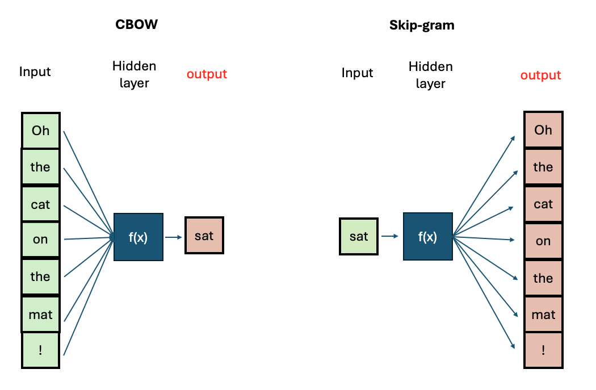

::: questions
-   How do I load text and do basic linguistic analysis?
-   How do I use words as features in a machine learning model?
-   What is a word2vec model?
-   What properties do word embeddings have?
-   What insights can I get from word embeddings?
-   How do I train a basic NLP classifier?
:::

::: objectives
After following this lesson, learners will be able to:

-   Implement a basic NLP Pipeline
-   Build a Document-Term Matrix
-   Understand the concept of word embeddings
-   Use and Explore Word2Vec models
-   Use word vectors as features for a classifier
:::

## Introduction

In this episode, we will expand on the idea of distributional semantics: “You shall know a word by the company it keeps”. We continue working with words as individual features of text by introducing the concept of Term-Document matrix, one of the most basic techniques to transform words into features that represent documents, which can be fed directly it into Machine Learning classifiers.

We will then visit the Word2Vec vector space, a method to represent words proposed in 2013 by [Mikolov et al](https://arxiv.org/pdf/1301.3781). They trained a neural network on large amounts of text in order to obtain continuous vectors that represent words, which hold interesting semantic properties. We will also use such vectors as features for our first NLP classifier: a senitment analysis recognizer for short sentences. An optional advanced challenge shows how to train your own Word2Vec models.

## Term-Document Matrix

A Term-Document Matrix (TDM) is a 2-dimensional matrix representing the prescence/abscence of each term (usually individual words) that occur in a collection of documents. Is a direct method to convert unstructured text documents into a structured numeric format that algorithms can process, especially Machine Learning classifiers:

-   Each **row** is a unique word (term) in the corpus
-   Each **column** is a document in the corpus
-   Each **cell** $(i,j)$ has a value of 1 if the $term_i$ appears in $column_j$ or 0 otherwise

This is also sometimes known as a bag-of-words as it ignores grammar and word sequences in exchange of emphasizing content, where each document is characterized by the words that appear in it. Similar documents will contain similar bags of words and documents that talk about different topics will be associated with numerical columns that are different from each other. Let's look at a small example:

-   Doc 1: “Natural language processing is exciting”
-   Doc 2: “Processing natural language helps computers understand”
-   Doc 3: “Language processing with computers is NLP”
-   Doc 4: "Today it rained a lot"

| Term       | Doc1 | Doc2 | Doc3 | Doc4 |
|------------|------|------|------|------|
| natural    | 1    | 1    | 0    | 0    |
| language   | 1    | 1    | 1    | 0    |
| processing | 1    | 1    | 1    | 0    |
| is         | 1    | 0    | 1    | 0    |
| exciting   | 1    | 0    | 0    | 0    |
| helps      | 0    | 1    | 0    | 0    |
| computers  | 0    | 1    | 1    | 0    |
| understand | 0    | 1    | 0    | 0    |
| with       | 0    | 0    | 1    | 0    |
| NLP        | 0    | 0    | 1    | 0    |
| today      | 0    | 0    | 0    | 1    |
| it         | 0    | 0    | 0    | 1    |
| rained     | 0    | 0    | 0    | 1    |
| a          | 0    | 0    | 0    | 1    |
| lot        | 0    | 0    | 0    | 1    |

If you look at the columns you can treat each document as a numerical vector of 0's and 1's. The vector is of fixed size (in this case the vocabulary size is 15), therefore suitable for traditional ML classifiers.

:::: challenge
Take a look at the Term-Document matrix. Can you explain which documents are more similar by just looking at the vectors? What can be some drawbacks of representing documents this way? What would happen if I want to add a new document? Hint: think of levels of language, sparsity and scalability to answer these questions.

::: solution
-   With TDM there is a problem of scalability, as the matrix size grows with the amount of documents times the vocabulary found in the documents we are processing. This means that if we have 100 documents in which 5,000 unique words appear, we would have to store a matrix of 500,000 numbers!
-   We also have the problem of sparsity present: document "vectors" will have mostly 0's.
-   This representation does not take into account any syntactic or semantic property of the original documents. It relies directly on documents mentioning exactly the same terms, this means for example that paraphrased documents will appear to be very different.
-   Adding a new document would need to compute a bigger matrix, which means we would have to re-train our classifier because most likely the size of the vectors will be larger (since there might be new words in the matrix). this also shows that the TDM are corpus-dependent and struggle to generalize
:::
::::

TDM is also a good solution to characterize documents based on their vocabulary, and there are more advanced versions of term-document matrices, including frequency metrices and TF-IDF. However we will now look at the converse possibility: to characterize words based on the context where they appear, so we can study words independently of their documents of origin, and more importantly, we can measure how do they relate to each other. We enter the world of word embeddings!

## What are word embeddings?

As we have seen, count-base methods can be directly applied to learn statistical co-occurrences in raw texts. Count-based methods are limited because they rapidly become unmanageable. The idea behind word embeddings is built on top of exploiting statistical co-occurrences in context but **instead of holding explicit counts for every single word and document, a neural network is trained to predict missing words in context**. The neural network is optimized with the task of language modelling and the final trained network holds vectors of a fixed size whose values can be mapped into linguistic properties (since the training objective was language modelling). Since similar words occur in similar contexts, or have same characteristics, a properly trained model will learn to assign similar vectors to similar words.

By representing words with vectors, we can mathematically manipulate them through vector arithmetic and express semantic similarity in terms of vector distance. Because the size of the learned vectors is not proportional to the amount of documents we can learn the representations from larger collections of texts, obtaining more robust representations, that are less corpus-dependent.

## Explore the Word2Vec Vector Space

There are two main architectures for training Word2Vec:

-   Continuous Bag-of-Words (CBOW): Predicts a target word based on its surrounding context words.
-   Continuous Skip-Gram: Predicts surrounding context words given a target word.



::: callout
CBOW is faster to train, while Skip-Gram is more effective for infrequent words. Increasing context size improves embeddings but increases training time.
:::

The python module `gensim` offers a very usgul interface to interact with pre-trained word2vec models and also to train our own. First we will explore the model from the original Word2Vec paper, which was trained on a big corpus from Google News. We will see what functionalities are available to explore a vector space. Then we will step by step prepare our own text to train our own word2vec models and save them.

### Load the embeddings and inspect them

The library `gensim` has a repository with English pre-trained models. We can take a look at the models:

``` python
import gensim.downloader
available_models = gensim.downloader.info()['models'].keys()
print(list(available_models))
```

We will download the google News model with:

``` python
w2v_model = gensim.downloader.load('word2vec-google-news-300')
```

We can do some basic checkups such as showing how many words are in the vocabulary (i.e. for how many words do we have an available vector), what is the dimension of each vector and pick at how the vectors look inside:

``` python
print(len(w2v_model.key_to_index.keys())) # 3 million words
print(w2v_model.vector_size) # 300 dimensions. This can be chosen when training your own model
print(w2v_model['car'][:10]) # The first 10 dimensions of the vector representing 'car'.
print(w2v_model['cat'][:10]) # The first 10 dimensions of the vector representing 'cat'.
```

``` output
3000000
300
[ 0.13085938  0.00842285  0.03344727 -0.05883789  0.04003906 -0.14257812
  0.04931641 -0.16894531  0.20898438  0.11962891]
[ 0.0123291   0.20410156 -0.28515625  0.21679688  0.11816406  0.08300781
  0.04980469 -0.00952148  0.22070312 -0.12597656]
```

This is a very big model with 3 million words and the dimensionality chosen at training time was 300, thus all words will have a 300-dimension vector associated to it. Even with such a big vocabulary we can always find a word that won't be in there:

``` python
print(w2v_model['bazzinga'][:10]) # The first 10 dimensions of the vector representing 'cat'.
```

This will throw a `KeyError` as the model does not know that word. Unfortunately this is a limitation that word2vec cannot solve.

Now let's talk about the vectors themselves. They are not easy to interpret as they are a bunch of floating point numbers. These are the weights that the network learned when optimizing for language modelling. As the vectors are hard to interpret, we rely on a mathematical method to compute how similar two vectors are. The best metric for measuring similarity between two high-dimensional vectors is cosine similarity.

::: callout
[cosine similarity](https://en.wikipedia.org/wiki/Cosine_similarity) ranges between [`-1` and `1`]. It is the cosine of the angle between two vectors, divided by the product of their length. Mathematically speaking, when two vectors point in exactly the same direction their cosine will be 1, and when they point in the opposite direction their cosine will be -1. In python we can use Numpy to compute the cosine similarity of vectors.

{alt=""}
:::

``` python
from sklearn.metrics.pairwise import cosine_similarity

car_vector = w2v_model['car']
cat_vector = w2v_model['cat']

similarity = cosine_similarity([car_vector], [cat_vector])
print(f"Cosine similarity between 'car' and 'cat': {similarity[0][0]}")

similarity = cosine_similarity([w2v_model['hamburger']], [w2v_model['pizza']])
print(f"Cosine similarity between 'hamburger' and 'pizza': {similarity[0][0]}")
```

``` python

Cosine similarity between 'car' and 'cat': 0.21528185904026031
Cosine similarity between 'hamburger' and 'pizza': 0.6153676509857178
```

The higher similarity score between the hamburger and pizza indicates they are more similar based on the contexts where they appear in the training data. Even though is hard to read all the floating numbers in the vectors, we can trust this metric to always give us a hint of which words are semantically closer than others

:::: challenge
Think of different word pairs and try to guess how close or distant they will be from each other. Use the similarity measure from the word2vec module to compute the metric and discuss if this fits your expectations. If not, can you come up with a reason why this was not the case?

::: solution
Interesting cases are synonyms, antonyms and morphologically related words:

``` python
print(w2v_model.similarity('democracy', 'democratic'))
print(w2v_model.similarity('queen', 'princess'))
print(w2v_model.similarity('love', 'hate')) #!! (think of "I love X" and "I hate X")
print(w2v_model.similarity('love', 'lover'))
```
```output
0.86444813
0.7070532
0.6003957
0.48608577
```
:::
::::

### Vector Neighborhoods

Now that we have a metric we can trust, we can retrieve neighborhoods of vectors that are close to a given word. This is analogous to retrieving semantically related terms to a target term. Let's explore the neighborhood around \`pizza\` using the `most_similar()` method:

``` python
print(w2v_model.most_similar('pizza', topn=10))
```
This returns a list of ranked tuples with the form (word, similarity_score). The list is already ordered in descent, so the first element is the closest vector in the vector space, the second element is the second closest word and so on...
```output
[('pizzas', 0.7863470911979675), 
('Domino_pizza', 0.7342829704284668), 
('Pizza', 0.6988078355789185), 
('pepperoni_pizza', 0.6902607083320618), 
('sandwich', 0.6840401887893677), 
('burger', 0.6569692492485046), 
('sandwiches', 0.6495091319084167), 
('takeout_pizza', 0.6491535902023315), 
('gourmet_pizza', 0.6400628089904785), 
('meatball_sandwich', 0.6377009749412537)]
```

Exploring neighborhoods can helps us understand why some vectors are closer (or not so much). Take the case of *love* and *lover*, originally we might think these should be very close to each other but by looking at their neighborhoods we understant why this is not the case:

``` python
print(w2v_model.most_similar('love', topn=10))
print(w2v_model.most_similar('lover', topn=10))
```
This returns a list of ranked tuples with the form (word, similarity_score). The list is already ordered in descent, so the first element is the closest vector in the vector space, the second element is the second closest word and so on...
```output
[('loved', 0.6907791495323181), ('adore', 0.6816874146461487), ('loves', 0.6618633270263672), ('passion', 0.6100709438323975), ('hate', 0.6003956198692322), ('loving', 0.5886634588241577), ('Ilove', 0.5702950954437256), ('affection', 0.5664337873458862), ('undying_love', 0.5547305345535278), ('absolutely_adore', 0.5536840558052063)]
[('paramour', 0.6798686385154724), ('mistress', 0.6387110352516174), ('boyfriend', 0.6375402212142944), ('lovers', 0.6339589953422546), ('girlfriend', 0.6140860915184021), ('beau', 0.609399676322937), ('fiancé', 0.5994566679000854), ('soulmate', 0.5993717312812805), ('hubby', 0.5904166102409363), ('fiancée', 0.5888950228691101)]
```
The first word is a noun or a verb (depending on the context) that denotes affection to someone/something , so it is associated with other concepts of affection (positive or negative). The case of *lover* is used to describe a person, hence the associated concepts are descriptors of people with whom the lover can be associated.

### Word Analogies with Vectors

Another powerful property that word embeddings show is that vector algebra can preserve semantic analogy. An analogy is a comparison between two different things based on their similar features or relationships, for example king is to queen as man is to woman. We can mimic this operations directly on the vectors using the `most_similar()` method with the `positive` and `negative` parameters:

```python
# king is to man as what is to woman?
# king + woman - man = queen
w2v_model.most_similar(positive=['king', 'woman'], negative=['man'])
```

```output
[('queen', 0.7118192911148071),
 ('monarch', 0.6189674735069275),
 ('princess', 0.5902431011199951),
 ('crown_prince', 0.5499460697174072),
 ('prince', 0.5377321243286133),
 ('kings', 0.5236844420433044),
 ('Queen_Consort', 0.5235945582389832),
 ('queens', 0.5181134343147278),
 ('sultan', 0.5098593235015869),
 ('monarchy', 0.5087411403656006)]
```

## Train your Word2Vec model

### Preprocessing Text

NLP models work by learning the statistical regularities within the constituent parts of the language (i.e, letters, digits, words and sentences) in a text. Text contains also other types of information that humans find useful to convey meaning. To signal pauses, give emphasis and convey tone, for instance, we use punctuation. Articles, conjunctions and prepositions also alter the meaning of a sentence. The machine does not know the difference among all of these linguistic units, as it treats them all as equal.

We have already done some basic data pre-processing in the introduction. Here we will analyze with more detail the most common pre-processing steps when dealing with structured data. Whether you need to perform certain steps will depend on your task at hand. This is analogue to the data cleaning and sanitation step in any Machine Learning task.

In the case of linguistic data, we are interested in getting rid of unwanted components (such as rare punctuation or formatting characters) that can confuse a model. As we already know, an NLP library such as SpaCy comes in handy to deal with the preprocessing of text, here is the list of the recommended (always optional!) steps:

-   **Tokenization:** splitting strings into meaningful/useful units. This step also includes a method for "mapping back" the segments to their character position in the original string.
-   **Lowercasing:** removing uppercases to e.g. avoid treating "Dog" and "dog" as two different words
-   **Punctuation and Special Character Removal:** if we are interested in *content only,* we can filter out anything that is not alphanumerical. We can also explicitly exclude symbols that are just noise in our dataset. Note that getting rid of punctuation can significantly change meaning! A special mention is that new lines are a character in text, sometimes we can use them in our benefit (for example to separate paragraphs) but many times they are just noise.
-   **Stop Word Removal:** as we've seen, the most frequent words in texts are those which contribute little semantic value on their own: articles ('the', 'a' , 'an'), conjunctions ('and', 'or', 'but'), prepositions ('on', 'by'), auxiliary verbs ('is', 'am'), pronouns ('he', 'which'), or any highly frequent word that might not be of interest in several *content only* related tasks. A special case is the word 'not' which carries the significant semantic value of negation.
-   **Lemmatization:** although it has become less frequent, normalizing words into their *dictionary form* can help to focus on relevant aspects of text. Think how "eating", "ate", "eaten" are all a variation of the verb "eat".

::: callout
-   Preprocessing approaches affect significantly the quality of the training when working with word embeddings. For example, [Rahimi & Homayounpour (2022)](https://link.springer.com/article/10.1007/s10579-022-09620-5) demonstrated that for text classification and sentiment analysis, the removal of punctuation and stopwords leads to higher performance.

-   You do not always need to do all the preprocessing steps, and which ones you should do depends on what you want to do. For example, if you want to segment text into sentences then characters such as '.', ',' or '?' are the most important; if you want to extract Named Entities from text, you explicitly do not want to lowercase the text, as capitals are a component in the identification process, and if you are interested in gender bias you definitely want to keep the pronouns, etc...

-   Note that preprocessing can differ significantly if you work with different languages. This is both in terms of which steps to apply, but also which methods to use for a specific step.
:::

In the case of this episode, we are interested in preparing the data for training Word2Vec models. This means we are interested on having vectors for content words only, so even though our preprocessing will unfortunately loose a lot of the original information, in exchange we will be able manipulate the most relevant conceptual words as individual numeric representations. Therefore the preprocessing includes: loading the text, tokenizing, lowercasing words, removing punctuation, lemmatizing words and removing stop words. Let's apply this step by step.

### 1. Loading the text

We start by opening the file containing the text. Note that python loads the whole file into one single string variable, this includes the new lines as special characters.

``` python

filename = "data/84_frankenstein_or_the_modern_prometheus.txt"
with open(filename, 'r', encoding='utf-8') as file:
    text = file.read()

print(type(text))  # Should be <class 'str'>
print(text)
```

We could use python code to clean unwanted characters. In this case we know that we do not cant the newlines so we can replace them:

``` python
text_flat = text.replace('\n', ' ')
print(text_flat)
```

however this process is not scalable because we would have to inspect the text in order to find more "noisy characters" on our own. This is where using a library like `spaCy` shows its perks. `SpaCy` structures the text for us and allow to manipulate it with attributes.

``` python
import spacy
nlp = spacy.load("en_core_web_sm")

doc = nlp(text)
print(type(doc))  # Should be <class 'spacy.tokens.doc.Doc'>
print(len(doc))
print(doc)
```

now we can manipulate the `Doc` object directly to continue the preprocessing in a cleaner way. If we print the length of the document we obtain the amount of tokens in it, in this case it is 94,553 counting special characters and new lines. For more information on what you can do with this object you can visit the [spacy documentation](https://spacy.io/api/doc/)

### 2. Tokenizing

Tokenization is essential in NLP, as it helps to create structure from raw text. It involves the segmentation of the text into smaller units referred as `tokens`. Tokens can be sentences (e.g. `'the happy cat'`), words (`'the', 'happy', 'cat'`), subwords (`'un', 'happiness'`) or characters (`'c','a', 't'`). The choice of tokens depends by the requirement of the model used for training, and the text. This step is carried out by a pre-trained model (called tokeniser) that has been fine-tuned for the target language. In our case, this is `en_core_web_sm` loaded before.

::: callout
A good word tokeniser for example, does not simply break up a text based on spaces and punctuation, but it should be able to distinguish:

-   abbreviations that include points (e.g.: *e.g.*)
-   times (*11:15*) and dates written in various formats (*01/01/2024* or *01-01-2024*)
-   word contractions such as *don't*, these should be split into *do* and *n't*
-   URLs

Many older tokenisers are rule-based, meaning that they iterate over a number of predefined rules to split the text into tokens, which is useful for splitting text into word tokens for example. Modern large language models use subword tokenisation, which learn to break text into pieces that are statistically convenient, this makes them more flexible but less human-readable.
:::

We can access the tokens by iterating the document and getting its `.text` property:

``` python
tokens_txt = [token.text for token in doc]
print(tokens_txt[:15])
```

``` output
['Letter', '1', '\n\n\n', 'St.', 'Petersburgh', ',', 'Dec.', '11th', ',', '17', '-', '-', '\n\n', 'TO', 'Mrs.']
```

This shows us the the individual tokens, including new lines and punctuation. In our case we are not interested in the newlines, punctuation nor in numeric tokens so in one single step we can keep only the token objects that are alphabetical:

``` python
tokens = [token for token in doc if token.is_alpha]
print(tokens[:15])
```

``` output
[Letter, Petersburgh, TO, Saville, England, You, will, rejoice, to, hear, that, no, disaster, has, accompanied]
```

Note that this time we are keeping the whole token object so we can keep using their properties in our pre-processing stages.

### 3. Stop word removal

For some NLP tasks only the important words in the text are needed. A text however often contains many `stop words`: common words such as `de`, `het`, `een` that add little meaningful content compared to nouns and words. In those cases, it is best to remove stop words from your corpus to reduce the number of words to process.

``` python
tokens_nostop = [token for token in tokens if not token.is_stop]
print(tokens[:15])
```

``` output
[Letter, Petersburgh, Saville, England, rejoice, hear, disaster, accompanied, commencement, enterprise, regarded, evil, forebodings, arrived, yesterday]
```

Now we have mostly nouns, verbs and other content words. In out final step we will only keep the token lemmas (beware of the lowerscore on `token.lemma_` to obtain the string), this merges all words into their dictionary entry, so we can have one vector per dictionary word in our text:

``` python
tokens_lower_nostop = [token.lemma_ for token in tokens_nostop]
print(tokens_lower_nostop[:15])
```

``` output
['letter', 'Petersburgh', 'Saville', 'England', 'rejoice', 'hear', 'disaster', 'accompany', 'commencement', 'enterprise', 'regard', 'evil', 'foreboding', 'arrive', 'yesterday']
```

After these steps we end up with a list of strings: the lemmatized content words of the Frankenstein book. We have a total of 30,500 lemmas, as opposed to the original 94,553 tokens in the book. We are ready to train a Word2Vec model with this clean tokens.

::: callout
## Dataset size in training

To obtain your own high-quality embeddings, the size/length of the training dataset plays a crucial role. Generally [tens of thousands of documents](https://cs.stanford.edu/~quocle/paragraph_vector.pdf) are considered a reasonable amount of data for decent results.

Is there however a strict minimum? Not really. Things to keep in mind is that `vocabulary size`, `document length` and `desired vector size` interacts with each other. The higher the dimensional vectors (e.g. 200-300 dimensions) the more data is required, and of high quality, i.e. that allows the learning of words in a variety of contexts.

While word2vec models typically perform better with large datasets containing millions of words, using a single page is sufficient for demonstration and learning purposes. This smaller dataset allows us to train the model quickly and understand how word2vec works without the need for extensive computational resources.
:::

## Train your own Word2Vec model

We will be using CBOW. We are interested in having vectors with 300 dimensions and a context size of 5 surrounding words. We include all words present in the corpora, regardless of their frequency of occurrence and use 4 CPU cores for training. Thankfully, the python package \`gensim\` has already implemented all of these for us, thus we can execute the requirements in only one line of code:

``` python
import gensim 
from gensim.models import Word2Vec 

model = Word2Vec([tokens_lower_nostop], vector_size=300, window=5, min_count=1, workers=4, sg=0)
```

See the Gensim [documentation](https://radimrehurek.com/gensim/models/word2vec.html) for more training options.

### Save and Retrieve your model

Once your model is trained it is useful to save the checkpoint in order to retrieve it next time instead of having to train it every time. You can save it with:
```python
model.save("word2vec_frankenstein.model")
```

And the way to load back the pre-trained vectors is with:
```python
model = Word2Vec.load("word2vec_frankenstein.model")
w2v_frankenstein = model.wv
# Test:
w2v_frankenstein.most_similar('monster')
```


### Use Word2Vec vectors as features for a classifier

TODO: Here step-bystep a very simple sentiment logistic regression classifier using word2vec as input. Maybe this is too advanced ???


::: keypoints
-   The first step for working with text is to run a preprocessing pipeline to obtain clear features
-   We can represent text as vectors of numbers (which makes it interpretable for machines)
-   One of the most efficient and useful ways is to use word embeddings
-   We can easily compute how words are similar to each other with the cosine similarity
:::
