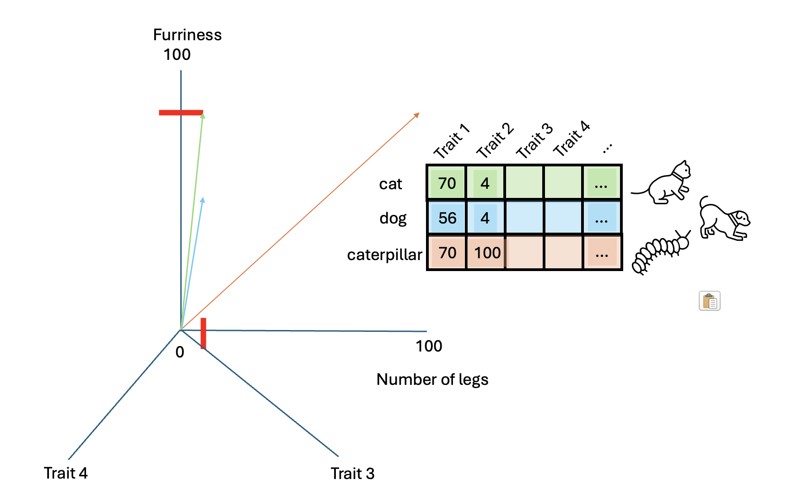

::: questions
-   How do I load text and do basic linguistic analysis?
-   Why do we need to prepare a text for training?
-   How do I use words as features in a machine learning model?
-   What is a word2vec model?
-   What properties do word embeddings have?
-   What insights can I get from word embeddings?
-   How do we train a word2vec model?
:::

::: objectives
After following this lesson, learners will be able to:

-   Implement a full preprocessing pipeline on a text
-   Use Word2Vec to train a model
-   Inspect word embeddings
:::

## Introduction

In the previous episode we emphasized how text is different from structured datasets. Given the linguistic properties embedded in unstructured text, we also learned how to use existing libraries such as SpaCy for segmenting text and accessing basic linguistic properties.

We learned the different levels of language and that it is ambiugous, compositional and discrete. Because of this, it is hard to know how words relate with each other, therefore obtaining meaning from text alone is possible only through proxies that can be quantified. We made our first attempt to approach word meaning by using co-occurrences of words in a fixed text window around specific target words of interest.

In this episode, we will expand on this idea and continue working with words as individual features of text. We will introduce the concept of Term-Document matrix, one of the most basic techniques to use words as features that represent the texts where they appear, which can be fed directly it into Machine Learning classifiers.

We will then visit the distributional hypothesis, which the linguist J.R. Firth, in the 1950s, summarized with the phrase: “You shall know a word by the company it keeps”. Based on this hypothesis, Mikolov et. al. decided to train neural networks on large amounts of text in order to predict a word based on it's surrounding context or viceversa, in the famous Word2Vec model. We will learn how to use these models, and understand how do they map discrete words into numerical vectors that capture the semantic similarity of words in a continuous space. By representing words with vectors, we can mathematically manipulate them through vector arithmetic and exploit the similarity patterns that emerge from a collection of texts. Finally, we will show how to train your own Word2Vec models.

## Preprocessing Text

NLP models work by learning the statistical regularities within the constituent parts of the language (i.e, letters, digits, words and sentences) in a text. However, text contains also other type of information that humans find useful to convey meaning. To signal pauses, give emphasis and convey tone, for instance, we use punctuation. Articles, conjunctions and prepositions also alter the meaning of a sentence. The machine does not know the difference among all of these linguistic units, as it treats them all as equal.

We have already done some basic data pre-processing in the introduction. Here we will formalize this initial step and present some of the most common pre-processing steps when dealing with structured data. This is analogue to the data cleaning and sanitation step in any Machine Learning task. In the case of linguistic data, we are interested in getting rid of unwanted components (such as rare punctuation or formatting characters) that can confuse a tokenizer and, depending on the task at hand, we might also be interested in normalizing our tokens to avoid possible noise in our final results. As we already know, an NLP module such as SpaCy comes in handy to deal with the preprocessing of text, here is the list of the recommended (always optional!) steps:

-   **Tokenization:** splitting strings into meaningful/useful units. This step also includes a method for "mapping back" the segments to their character position in the original string.
-   **Lowercasing:** removing uppercases to e.g. avoid treating "Dog" and "dog" as two different words)
-   **Punctuation and Special Character Removal:** if we are interested in *content only,* we can filter out anything that is not alphanumerical. We can also explicitly exlude symbols that are just noise in our dataset. Note that getting rid of punctuation can significantly change meaning! A special mention is that new lines are a character in text, sometimes we can use them in our benefit (for example to separate paragraphs) but many times they are just noise.
-   **Stop Word Removal:** as we've seen, the most frequent words in texts are those which contribute little semantic value on their own: articles ('the', 'a' , 'an'), conjunctions ('and', 'or', 'but'), prepositions ('on', 'by'), auxiliary verbs ('is', 'am'), pronouns ('he', 'which'), or any highly frequent word that might not be of interest in several *content only* related tasks. A special case is the word 'not' which carries the significant semantic value of negation.
-   **Lemmatization:** although it has become less frequent, normalizing words into their *dictionary form* can help to focus on relevant aspects of text. Think how "eating", "ate", "eaten" are all a variation of the verb "eat".

``` python
 "Here my python code using spacy... Here we load the 'Dirty Book of Frankenstein' and the task is to arrive to the clean tokens to train Word2Vec"
```

::: callout
-   Preprocessing approaches affect significantly the quality of the training when working with word embeddings. For example, [Rahimi & Homayounpour (2022)] (<https://link.springer.com/article/10.1007/s10579-022-09620-5>) demonstrated that for text classification and sentiment analysis, the removal of punctuation and stopwords leads to higher performance.

-   You do not always need to do all the preprocessing steps, and which ones you should do depends on what you want to do. For example, if you want to segment text into sentences then characters such as '.', ',' or '?' are the most important; if you want to extract Named Entities from text, you explicitly do not want to lowercase the text, as capitals are a component in the identification process, and if you are interested in gender bias you definitely want to keep the pronouns, etc...

-   Preprocessing can be very diffent for different languages. This is both in terms of which steps to apply, but also which methods to use for a specific step.
:::

We will prepare the data for the two experiments in this episode 1. Build a Term-Document Matrix 2. Train a Word2Vec model

For both taska we need to prepare our texts by applying the same preprocessing steps. We are focusing on content words for now, so even though our preprocessin will unfortunately loose a lot of the original information, in exchange we will be able manipulate words as individual numeric representations. Therefore the preprocessing includes: cleaning the text, tokenizing, lowercasing words, removing punctuation, lemmatizing words and removing stop words. Let's apply this step by step.

### 1. Cleaning the text

We start by importing the `spaCy` library that will help us go through the preprocessing steps. SpaCy is a popular open-source library for NLP in Python and it works with pre-trained languages models that we can load and use to process and analyse the text efficiently. We can then load the SpaCy model into the pipeline function.

``` python
import spacy
doc = nlp(corpus)
```

Next, we'll eliminate the triple dashes that separate different news articles, as well as the vertical bars used to divide some columns.

### 2. Tokenizing

Tokenization is essential in NLP, as it helps to create structure from raw text. It involves the segmentation of the text into smaller units referred as `tokens`. Tokens can be sentences (e.g. `'the happy cat'`), words (`'the', 'happy', 'cat'`), subwords (`'un', 'happiness'`) or characters (`'c','a', 't'`). The choice of tokens depends by the requirement of the model used for training, and the text. This step is carried out by a pre-trained model (called tokeniser) that has been fine-tuned for the target language. In our case, this is `en_core_web_sm` loaded before.

::: callout
A good word tokeniser for example, does not simply break up a text based on spaces and punctuation, but it should be able to distinguish:

-   abbreviations that include points (e.g.: *e.g.*)
-   times (*11:15*) and dates written in various formats (*01/01/2024* or *01-01-2024*)
-   word contractions such as *don't*, these should be split into *do* and *n't*
-   URLs

Many older tokenisers are rule-based, meaning that they iterate over a number of predefined rules to split the text into tokens, which is useful for splitting text into word tokens for example. Modern large language models use subword tokenisation, which are more flexible.
:::

``` python
spacy_corpus = nlp(corpus_clean)
# Get the tokens from the pipeline
tokens = [token.text for token in spacy_corpus]

tokens[:10]
```

`['mens', 'op', 'maan', '\n ', '„', 'de', 'eagle', 'is', 'geland', '”']`

As one can see the tokeniser has split each word in a token, however it has considered also blank spaces `\n` and also punctuation.

### 3. Lowercasing

Our next step is to lowercase the text. Our goal here is to generate a list of unique words from the text, so in order to not have words twice in the list - once normal and once capitalised when it is at the start of a sentence for example - we can lowercase the full text.

corpus_lower = corpus_clean.lower()

print(corpus_lower)

mens op maan \n „ de eagle is geland ” reisduur : 102 uur , uitstappen binnen 20 iuli , 21.17 uur 45 [...]

### 4. Remove punctuation

The next step we will apply is to remove punctuation. We are interested in training our model to learn the meaning of the words. This task is highly influenced by the state of our text and punctuation would decrease the quality of the learning as it would add spurious information. We'll see how the learning process works later in the episode.

The punctuation symbols are defined in:

``` python
import string
string.punctuation
```

We can loop over these symbols to remove them from the text:

``` python
# remove punctuation from set
tokens_no_punct = [token for token in tokens if token not in string.punctuation]

# remove also blank spaces
tokens_no_punct = [token for token in tokens_no_punct if token.strip() != '']
```

``` python
print(tokens_no_punct[:10])
```

`['mens', 'op', 'maan', 'de', 'eagle', 'is', 'geland', 'reisduur', '102', 'uur']`

#### Visualise the tokens

This was the end of our preprocessing step. Let's look at what tokens we have extracted and how frequently they occur in the text.

``` python
import matplotlib.pyplot as plt
from collections import Counter

# count the frequency of occurrence of each token
token_counts = Counter(tokens_no_punct)

# get the top n most common tokens (otherwise the plot would be too crowded) and their relative frequencies
most_common = token_counts.most_common(100)
tokens = [item[0] for item in most_common]
frequencies = [item[1] for item in most_common]

plt.figure(figsize=(12, 6))
plt.bar(tokens, frequencies)
plt.xlabel('Tokens')
plt.ylabel('Frequency')
plt.title('Token Frequencies')
plt.xticks(rotation=90)
plt.tight_layout()
plt.show()
```

As one can see, words in the text have a very specific [skewed distribution](https://link.springer.com/article/10.3758/s13423-014-0585-6), such that there are few very high-frequency words that account for most of the tokens in text (e.g., articles, conjunctions) and many low frequency words.

### 5. Stop word removal

For some NLP tasks only the important words in the text are needed. A text however often contains many `stop words`: common words such as `de`, `het`, `een` that add little meaningful content compared to nouns and words. In those cases, it is best to remove stop words from your corpus to reduce the number of words to process.

## Term-Document Matrix

A Term-Document Matrix (TDM) is a matrix where:

-   Each **row** is a unique word (term) in the corpus
-   Each **column** is a document in the corpus
-   Each **cell** $(i,j)$ has a value of 1 if the $term_i$ appears in $column_j$ or 0 otherwise

This is also sometimes known as a bag-of-words as it ignores grammar and word sequences in exchange of emphazising content, where each document is characterized by the words that appear in it. Similar documents will contain similar bags of words and documents that talk about different topics will be associated with numerical columns that are different from each other. Let's look at a quick example:

-   Doc 1: “Natural language processing is exciting”
-   Doc 2: “Processing natural language helps computers understand”
-   Doc 3: “Language processing with computers is NLP”
-   Doc 4: "Today it rained a lot"

| Term       | Doc1 | Doc2 | Doc3 | Doc3 |
|------------|------|------|------|------|
| natural    | 1    | 1    | 0    | 0    |
| language   | 1    | 1    | 1    | 0    |
| processing | 1    | 1    | 1    | 0    |
| is         | 1    | 0    | 1    | 0    |
| exciting   | 1    | 0    | 0    | 0    |
| helps      | 0    | 1    | 0    | 0    |
| computers  | 0    | 1    | 1    | 0    |
| understand | 0    | 1    | 0    | 0    |
| with       | 0    | 0    | 1    | 0    |
| NLP        | 0    | 0    | 1    | 0    |
| today      | 0    | 0    | 0    | 1    |
| it         | 0    | 0    | 0    | 1    |
| rained     | 0    | 0    | 0    | 1    |
| a          | 0    | 0    | 0    | 1    |
| lot        | 0    | 0    | 0    | 1    |

We can represent each document by taking its column and treating it as a vector of 0's and 1's. The vector is of fixed size (in this case the vocabulary size is 15), therefore suitable for traditional ML classifiers. With TDM there is a problem of scalability, as the matrix size grows with the amount of documents times the vocabulary found in the documents we are processing. This means that if we have 100 documents in which 5,000 unique words appear, we would have to store a matrix of 500,000 numbers! We also have the problem of sparsity present: document "vectors" will have mostly 0's. TDM is also a good solution to characterize documents based on their vocabulary, however the converse is even more desirable: to characterize words based on the context where they appear, so we can study words independently of their documents of origin, and more importantly, how do they relate to each other. To solve these and other limitations we enter the world of word embeddings!

## What are word embeddings?

A Word Embedding is a word representation type that maps words in a numerical manner (i.e., into vectors) in a multidimensional space, capturing their meaning based on characteristics or context. Since similar words occur in similar contexts, or have same characteristics, the system automatically learns to assign similar vectors to similar words.

Let's illustrate this concept using animals. This example will show us an intuitive way of representing things into vectors.

Suppose we want to represent a `cat` using measurable characteristics:

-   Furriness: Let's assign a score of 70 to a cat
-   Number of legs: A cat has 4 legs

``` python
import numpy as np

cat = np.array([[70, 4]])
```

So the vector representation of a cat becomes: `[70 (furriness), 4 (legs)]`


This vector doesn't fully describe a cat but provides a basis for comparison with other animals.

Let's add vectors for a dog and a caterpillar:

-   Dog: [56, 4]
-   Caterpillar: [70, 100]

``` python

dog = np.array([[56, 4]])
caterpillar = np.array([[70, 100]])
```


To determine which animal is more similar to a cat, we use `cosine similarity`, which measures the cosine of the angle between two vectors.

::: callout
[cosine similarity](https://en.wikipedia.org/wiki/Cosine_similarity) ranges between [`-1` and `1`]. It is the cosine of the angle between two vectors, divided by the product of their length. It is a useful metric to measure how similar two vectors are likely to be.

{alt=""}
:::

``` python
from sklearn.metrics.pairwise import cosine_similarity

similarity_cat_dog = cosine_similarity(cat, dog)[0][0]
similarity_cat_caterpillar = cosine_similarity(cat, caterpillar)[0][0]

print(f"Cosine similarity between cat and dog: {similarity_cat_dog}")
print(f"Cosine similarity between cat and caterpillar: {similarity_cat_caterpillar}")
```

``` python

Cosine similarity between cat and dog: 0.9998987965747193
Cosine similarity between cat and caterpillar: 0.6192653797321375
```

The higher similarity score between the cat and the dog indicates they are more similar based on these characteristics. Adding more characteristics can enrich our vectors, detecting more semantic nuances.



:::: challenge
-   Add one of two other dimensions. What characteristics could they map?
-   Add another animal and map their dimensions
-   Compute again the cosine similarity among those animals and find the couple that is the least similar and the most similar

::: solution
1.  Add one of two other dimensions

We could add the dimension of "velocity" or "speed" that goes from 0 to 100 meters/second.

-   Caterpillar: 0.001 m/s
-   Cat: 1.5 m/s
-   Dog: 2.5 m/s

(just as an example, actual speeds may vary)

``` python
cat = np.asarray([[70, 4, 1.5]])
dog = np.asarray([[56, 4, 2.5]])
caterpillar = np.asarray([[70, 100, .001]])
```

Another dimension could be weight in Kg:

-   Caterpillar: .05 Kg
-   Cat: 4 Kg
-   Dog: 15 Kg

(just as an example, actual weight may vary)

``` python
cat = np.asarray([[70, 4, 1.5, 4]])
dog = np.asarray([[56, 4, 2.5, 15]])
caterpillar = np.asarray([[70, 100, .001, .05]])
```

Then the cosine similarity would be:

``` python
cosine_similarity(cat, caterpillar)

cosine_similarity(cat, dog)
```

Output:

``` python
array([[0.61814254]])
array([[0.97893809]])
```

2.  Add another animal and map their dimensions

Another animal that we could add is the Tarantula!

``` python
cat = np.asarray([[70, 4, 1.5, 4]])
dog = np.asarray([[56, 4, 2.5, 15]])
caterpillar = np.asarray([[70, 100, .001, .05]])
tarantula = np.asarray([[80, 6, .1, .3]])
```

3.  Compute again the cosine similarity among those animals - find out the most and least similar couple

Given the values above, the least similar couple is the dog and the caterpillar, whose cosine similarity is `array([[0.60855407]])`.

The most similar couple is the cat and the tarantula: `array([[0.99822302]])`
:::
::::

By representing words as vectors with multiple dimensions, we capture more nuances of their meanings or characteristics.

::: keypoints
-   We can represent text as vectors of numbers (which makes it interpretable for machines)
-   The most efficient and useful way is to use word embeddings
-   We can easily compute how words are similar to each other with the cosine similarity
:::

When semantic change occurs, words in their context *also* change. We can trace how a word evolves semantically over time through comparison of that word with other similar words. The idea is that the most similar words are not always fixed in each different year, if a word acquires a new meaning.

## Train the Word2Vec model

### Load the embeddings and inspect them

We proceed to load our models. We will load all pre-trained model files from the original Word2Vec paper, which was trained on a big corpus from Google News. The library `gensim` contains a method called `KeyedVectors` which allows us to load them.

### Prepare the data to be ingested by the model (preprocessing)

Also, the decision to remove or retain these parts of text is quite crucial for training our model, as it affects the quality of generated word vectors.

::: callout
### Dataset size in training

To obtain high-quality embeddings, the size/length of your training dataset plays a crucial role. Generally [tens of thousands of documents](https://cs.stanford.edu/~quocle/paragraph_vector.pdf) are considered a reasonable amount of data for decent results.

Is there however a strict minimum? Not really. Things to keep in mind is that `vocabulary size`, `document length` and `desired vector size` interacts with each other. The higher the dimensional vectors (e.g. 200-300 dimensions) the more data is required, and of high quality, i.e. that allows the learning of words in a variety of contexts.

While word2vec models typically perform better with large datasets containing millions of words, using a single page is sufficient for demonstration and learning purposes. This smaller dataset allows us to train the model quickly and understand how word2vec works without the need for extensive computational resources.
:::

For the purpose of this episode and to make training easy on our laptop, we'll train our word2vec model using **just one book**. Subsequently, we'll load pre-trained models for tackling our task.

Now we will train a two-layer neural network to transform our tokens into word embeddings. We will be using the library `gensim` and the model we will be using is called `Word2Vec`, developed by Tomas Mikolov et al. in 2013.

Import the necessary libraries:

``` python
import gensim
from gensim.models import Word2Vec

# import logging to monitor training
import logging

# set up logging
logging.basicConfig(format='%(asctime)s : %(levelname)s : %(message)s', level=logging.INFO)
```

There are two main architectures for training Word2Vec:

-   Continuous Bag-of-Words (CBOW): Predicts a target word based on its surrounding context words.
-   Continuous Skip-Gram: Predicts surrounding context words given a target word.


::: callout
CBOW is faster to train, while Skip-Gram is more effective for infrequent words. Increasing context size improves embeddings but increases training time.
:::

We will be using CBOW. We are interested in having vectors with 300 dimensions and a context size of 5 surrounding words. We include all words present in the corpora, regardless of their frequency of occurrence and use 4 CPU cores for training. All these specifics are translated in only one line of code.

Let's train our model then:

``` python
model = Word2Vec([tokens_no_stopwords], vector_size=300, window=5, min_count=1, workers=4, sg=0)
```

We can inspect already what's the output of this training, by checking the top 5 most similar words to "maan" (moon):

``` python
word_vectors.most_similar('maan', topn=5)
```

`[('plek', 0.48467501997947693), ('ouders', 0.46935707330703735), ('supe|', 0.3929591178894043), ('rotterdam', 0.37788015604019165), ('verkeerden', 0.33672046661376953)]`

We have trained our model on one page only of the newspaper and the training was very quick. However, to approach our problem it's best to train our model on the entire dataset. We dont' have the resources for doing that on our local laptop, but luckily for us, [Wevers, M (2019)](https://zenodo.org/records/3237380) did that already for us and released it publicly. Let's download this dataset on our laptop and let's save them in a folder called `w2v`.

``` python
folder_path = 'data/w2v/'
```
