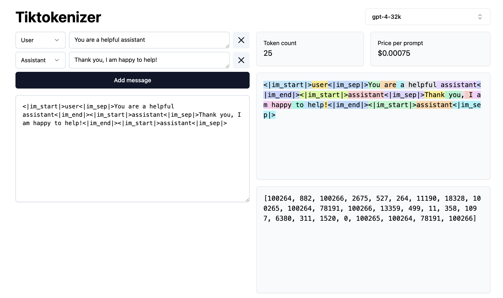

:::::: questions 
1. What is the relation between Transformers and "LLM's"? [**partially**]

2. Relation between BERT and LLMs? [**partially**]

3. What kinds of tasks can LLMs solve? How can NLP help? [**partially**]

4.  What are the criteria for selecting LLMs to use? What aspects to consider? [**draft**]

5. What are some common prompt strategies? [**Not yet**]

6. How to use HuggingFace to use local LLMs for inference? [**TODO**]

7. How to use LLMs Responsibly? (drawbacks, errors and biases) [**Not yet**]

8. How to build a simple "Chatbot"? -> try to use command input in Jupyter itself instead of command line [**TODO**]

9. How can we evaluate the responses that we get? [**Not yet**]

10. Could mention Ethics and sustainability of training models? [**Not yet**]

::::::

:::::: objectives
After following this lesson, learners will be able to:

1. Explain the relation between Transformer architecture and LLMs
2. Judge which LLMs are most suitable for a particular task
3. Explain how LLMs can be used to solve established NLP tasks
4. Evaluate the efficacy of LLMs to solve common NLP tasks
5. Use Python and HuggingFace to load and employ LLMs to perform basic inference
6. Explain what Retrieval Augmented Generation (RAG) is and its relation to LLMs
7. Understand the impact of LLMs in modern AI and language processing

**To do:**

1. Diagram transformers vs. LLMs (post-training step)
2. BERT diagram showing different between BERT and LLMs [easy]
3. Input in Jupyter notebooks for chat style interaction [easy]


## Background

Chat assistants like [ChatGPT](https://chatgpt.com/) and [Claude](http://claude.ai), which are based on Large Language Models (LLMs) are widely used today for tasks such as content generation, question answering, research and software development. The rapid rise of such models has had quite a disruptive and strong impact. But what are these models exactly? How do they work 'under the hood'? And how can one use them programmatically, in a responsible and effective way?

This episode is a gentle introduction to LLMs which aims to equip you with knowledge of the underpinnings of LLMs based on transformers architecture, as well as practical skills to programmatically work with LLMs in your own projects.

     

   

## 1. What are Large Language Models (LLMs)?
Large language models (LLMs) are transformer-based language models that are specialised to interpret and generate text, and to converse in a conversational-like manner with humans. The text that they generate are mostly natural language but can, in theory, constitute any character or symbol sequence such as software code. They represent a significant advancement in AI and NLP. and are trained on vast amounts of textual data mostly obtained from the internet.

### 1.1 Examples of LLMs 

Many different LLMs have been, and continue to be, developed. There are both proprietary and open-source varieties. Open-source varieties often make the data that their LLMs are trained on free, open and accessible online. Some even make the code they use to train these models open-source as well. Below is a summary of some current LLMs together with their creators, chat assistant interfaces, and proprietary status:


### 1.2 Applications of LLMs

LLMs can be used for many different helpful tasks. Some common tasks include:

1. **Question answering:** 
    - answering general knowledge questions
    ```
    Human: What is the longest river in the world?
    LLM: The Nile River in Africa is traditionally considered the longest river in the world, stretching about 6,650 km (4,130 miles) through 11 countries before emptying into the Mediterranean Sea.
    ```
    - expert advice in a particular domain or scientific field
    ```
    Human: What are good strategies for film-making on a budget in Night conditions?
    LLM: Night filmmaking can be both creatively rewarding and technically challenging, especially on a budget. Here are some strategies that indie filmmakers often use to maximize image quality and mood without expensive gear:...
    ```
2. **Text generation:**
    - Writing essays, business plans and other documents
    ```
    Human: Write a template cover letter for a mid-level software engineering position at a large AI startup.
    LLM: Dear [Hiring Manager’s Name], I am excited to apply for the Software Engineer position at [Company Name]...
    ```
    - Creative writing (slogans, poems, fiction, jokes)
    ```
    Human: Write a two sentence comedy sketch.
    LLM: [Scene: A man sits in a job interview.] Interviewer: "Your resume says you’re fluent in Python?" Candidate: pulls out a snake from his briefcase "She does most of the talking."
    ```
3. **Text summarisation**
```
Human: Shorten: "Amsterdam, the capital of the Netherlands, is a city celebrated for its rich history, cultural diversity, and iconic canals. Known as the “Venice of the North,” it is home to a vast network of waterways lined with elegant 17th-century houses, giving the city its distinct charm. Amsterdam seamlessly blends old-world character with modern vibrancy, attracting millions of visitors each year."
LLM: Amsterdam, the capital of the Netherlands, is known for its history, canals, and 17th-century houses, combining old charm with modern vibrancy that attracts millions each year.
```
4. **Sentiment or text classification**
```
Sentiment analysis
Human: Is this a positive, neutral or negative statement about the movie: "Incredible and not in a good way."
LLM: That’s a negative statement about the movie. The phrase “Incredible” usually suggests something impressive, but the qualifier “not in a good way” makes it clear the speaker means the film was bad or shockingly poor.
```
```
Text classification
Human: Categorise this statement into either sports, business, or science: "Lionel Messi scored twice to lead Argentina to victory in the World Cup qualifier."
LLM: This statement falls under Sports. It talks about a soccer player and a match result, which clearly relates to athletic competition.
```
5. Language translation
```
Human: Translate "I have recently naturalised as a Dutch citizen" into Dutch.
LLM: Ik ben onlangs genaturaliseerd als Nederlands staatsburger.
```
6. Generating software code
```
Human: Write a short Python function to demonstrate bubble sort
LLM: ...
```
```python
def bubble_sort(arr):
    n = len(arr)
    for i in range(n):
        # Last i elements are already in place
        for j in range(0, n - i - 1):
            if arr[j] > arr[j + 1]:
                # Swap if the element is greater than the next
                arr[j], arr[j + 1] = arr[j + 1], arr[j]
    return arr

# Example usage
numbers = [64, 34, 25, 12, 22, 11, 90]
sorted_numbers = bubble_sort(numbers)
print(sorted_numbers)
```

### 1.3 LLM selection criteria

- Open-source vs. Proprietary?
- Available compute: do you have a modern GPU or not?
- Multilingual performance? https://mmluprox.github.io/
- Other task performances? https://huggingface.co/spaces/open-llm-leaderboard/open_llm_leaderboard#/
- Do you have a scientific, commercial or personal purpose for using an LLM?
- Do you want to integrate an LLM into a software application? 
- Do you have resources to host or serve an LLM?


### 1.4 General transformer-based LMs vs. LLMs
LLMs are also trained using the transformer neural network architecture, making use of the self-attention mechanism discussion in Lesson 02. This means that an LLM is also a transformer-based language model. However, they are distinct from _general_ transformer-based language models in three main characteristics:

1. **Scale:** there are two dimensions in which current LLMs exceed general transformer language models in terms of scale. The most important one is the number of _training parameters_ (weights) that are used for training models. In current models there are hundreds of billions of parameters up to trillions. The second factor is the _amount of training data_ (raw text sequences) used for training. Current LLMs use snapshots of the internet (upwards of hundreds of terabytes in size) as a base for training and possibly augment this with additional manually curated data. The sheer scale characteristic of LLMs mean that such models require extremely resource-intensive computation to train. State-of-the-art LLMs require multiple dedicated Graphical Processing Units (GPUs) with tens or hundreds of gigabytes of memory to load and train in reasonable time. GPUs offer high parallelisability in their architecture for data processing which makes them more efficient for training these models.

2. **Post-training:** After training a base language model on textual data, there is an additional step of fine-tuning for enabling conversation in a prompt style of interaction with users, which current LLMs are known for. After the pre-training and neural network training stages we end up with what is called a _base_ model. The base model is a language model which is essentially a token sequence generator. This model by itself is not suitable for the interaction style we see with current LLMs, which can do things like answer questions, interpret instructions from the user, and incorporate feedback to improve responses in conversations.

3. **Generalization:** LLMs can be applied across a wide range of NLP tasks such as summarization, translation, question answering, etc., without necessarily the need for fine-tuning or training separate models for different NLP tasks.


### 2. How are LLMs trained?

Training LLMs involves a series of steps. There are two main phases: pretraining and post training. Pretraining generally involves the following substeps:

#### 2.1 Obtaining and pre-processing textual data for training

- _Downloading and pre-processing text:_ State-of-the-art LLMs include entire snapshots of the internet as the core textual data for training. This data can be sourced from efforts such as [CommonCrawl](https://commoncrawl.org/). Proprietary LLMs may augment or supplement this training data with additional licensed or proprietary textual data (e.g., books) from other sources or companies. The raw web pages are not usable by themselves, we need to extract the raw text from those HTML pages. This requires a preprocessing or data cleaning step.
- _Tokenization:_  As we saw in Lesson 01, the raw text itself cannot be used in the training step, we need a way to tokenize and encode the text for processing by the neural network. 

#### 2.2 Neural network training
With LLMs the training goal is to predict the next token in a one-dimensional sequence of tokens. This is different from BERT where the goal is to predict masked tokens in the input sequence. BERT is therefore not natively developed for generating text, whereas LLMs are. In the internals of the transformer architecture, this is illustrated by the fact that BERT only makes use of the Encoder component to create its contextualised word embeddings. It does not use the Decoder component to generate new tokens for the input sequence.

After training we obtain a _base_ LLM which is predicts or generates token sequences that resemble its training data. However, a post training step is required in order 

3. **Post training**
    - _Creating and processing conversation data_
    - _Tokenization or encoding of data_
    - _Training_ or _fine-tuning_

Difference with BERT?

After training a base LLM model, an additional post training step is required to fine-tune LLMs for conversational style interaction with users. Why is such a step necessary? They are trained on such What would happen if you skip this post training step and just use the base model for inference? You may encounter conversations like this:

#### Not Following Instructions

```
Human: Summarize this paragraph in one sentence: The Nile is the longest river in Africa and flows through 11 countries before emptying into the Mediterranean Sea.
Raw LLM: The Nile is the longest river in Africa and flows through 11 countries before emptying into the Mediterranean Sea.
```

The model was trained to predict text, not to follow instructions, and so it might not give expected or correct responses (although statistically the next most likely tokens would be the one's it gives).

#### Regurgitation

```
Human: Donald John Trump (born June 14, 1946) is an American politician,
Raw LLM: media personality, and businessman who is the 47th president of the United States. A member of the Republican Party, he served as the 45th president from 2017 to 2021...
```


Here the model just "regurgitates" verbatim a response from Wikipedia (part of it's training data), instead of creatively formulating a response in its own words.

Therefore, to avoid issues like this and to be useful as conversational assistants, LLMs generally have to be fine-tuned on additional unseen conversation datasets (containing on the order of hundreds of thousands of conversations). These datasets are manually created and validated by humans. For proprietary models, these humans are hired professionally to contribute to this dataset from platforms such as Upwork and ScaleAI. There are also open-source efforts to create such datasets such as [OpenAssistant](https://huggingface.co/datasets/OpenAssistant/oasst2).

Once such a dataset is obtained, the conversations need to be represented as a one-dimensional token sequence. Conversations therefore have to be encoded into such representations before being used as input for training. The encoding method for these conversations currently differ among LLMs. The figure below shows how GPT-4 tokenizes and encodes input conversations as one dimensional token sequences ([TikTokenizer](https://tiktokenizer.f2api.com/) is a page for visualizing and experimenting with tokenization approaches used by OpenAI LLMs).



After encoding or tokenization, the conversational data is supplied as input for fine-tuning the base model (replacing the original training data). I.e., the base model's weights or parameters are updated.

Some examples of conversational data that one might use to fine-tune an LLM (in general, you want multi-turn conversations where each participant in the conversation gets the opportunity to respond multiple times):

```
**Conversation 1 (Travel Planning):**
Human: Can you suggest a weekend getaway near Amsterdam?
LLM: Sure! Giethoorn – Known as the “Venice of the North,” this village has canals, thatched-roof houses, and a peaceful atmosphere. Utrecht, a charming city with medieval streets, beautiful canals, and cozy cafés.
Human: Which one would be better for a quiet, relaxing trip?
LLM: Giethoorn would be the quieter option. Unlike Utrecht, which is a bustling city, Giethoorn is a small village with a calm, serene atmosphere, ideal for a peaceful getaway.

**Conversation 2 (Math Help):**
Human: What's the derivative of 3ùë•^2 + 5ùë• ‚àí 7?
LLM: The derivative is 6ùë• + 5.
Human: Great, and what about the second derivative?
LLM: The second derivative is 6.

**Conversation 3 (Creative Writing):**
Human: Give me a one-line horror story.
LLM: The reflection in the mirror smiled back before I did.
Human: Can you make it even creepier?
LLM: The reflection winked, though I was alone in the room.
```

### Starting up a simple chat 
Let's explore how these LLMs work by doing a simple chat demonstration.

Imagine asking a computer a question and getting a human-like response. An LLM, like GPT-4, can generate responses that feel natural, informative, and tailored to your question by analyzing the context and meaning of your input. In the demonstration below, you'll see how an LLM responds to a prompt and how it builds upon previous information to maintain the conversation.

### Example Chat

- *User*: "What's the tallest mountain in the world?"

- *LLM*: "The tallest mountain in the world is Mount Everest, which stands at 8,848 meters (29,029 feet)."

- *User*: "How long does it take to climb it?"

- *LLM*: "Climbing Mount Everest typically takes around two months, due to the acclimatization process needed to adjust to high altitudes. Expeditions often start from Base Camp in Nepal, where climbers spend several weeks preparing."

- *User*: "Could someone with no climbing experience try it?"

- *LLM*: "Climbing Mount Everest is extremely challenging and requires significant training and experience due to the harsh conditions, high altitudes, and technical aspects of the climb. Most climbers spend years training and gaining experience on other mountains before attempting Everest."

This example shows how LLMs can maintain context across multiple questions. Notice how the model connects information across each question, keeping the conversation relevant and informed.

This quick chat example introduces you to the conversational abilities of LLMs, demonstrating their ability to respond contextually, provide coherent answers, and follow up on earlier parts of the conversation.

### Model architecture
- LLMs: Use the Transformer architecture, particularly self-attention, to analyze relationships between words regardless of position. This allows them to capture long-range dependencies and context better than traditional models.
- Traditional NLP: Often use simpler models like bag-of-words, TF-IDF (term frequency-inverse document frequency), RNNs (recurrent neural networks), and LSTMs (long-short-term memory models),  which treat words independently or consider only local context, missing the complex, global relationships.

### Learning from unlabeled data
- LLMs: Leverage unsupervised or self-supervised learning during pretraining, enabling them to learn language patterns from raw text without human-labeled data.
- Traditional NLP: are often supervised models, relying on labeled data for training (e.g., labeled sentiment or part-of-speech tags), which can be costly and time-consuming to create at scale.

### Adaptability and fine-tuning
- LLMs: Easily adaptable to new tasks or domains with fine-tuning, making them versatile across different applications.
- Traditional NLP: Less flexible, often requiring retraining from scratch or heavy feature engineering to adapt to new domains or tasks.

## What LLMs are good at
- *Language generation*: Creating coherent and contextually appropriate text, making them ideal for creative writing, chatbots, and automated responses.
- *Summarization and translation*: Quickly summarizing articles, books, and translating text between languages with reasonable accuracy.
- *Information retrieval and answering questions*: LLMs can recall and apply general knowledge from their training data to answer questions, though they don’t actually “know” facts.
- *Sentiment and text classification*: LLMs can classify text for tasks like sentiment analysis, spam detection, and topic categorization.

## What LLMs struggle with
- *Fact-based accuracy*: Since LLMs don’t “know” facts, they may generate incorrect or outdated information and are prone to hallucinations (making up facts).
- *Understanding context over long passages*: LLMs can struggle with context over very long texts and may lose track of earlier details, affecting coherence.
- *Mathematical reasoning and logic*: Though improving, LLMs often find complex problem-solving and detailed logical reasoning challenging without direct guidance.
- *Ethical and sensitive issues*: LLMs may produce biased or offensive text based on biases present in the training data, making content moderation necessary in sensitive applications.

- *Transformers and self-attention*: The transformer architecture, especially the self-attention mechanism, is at the heart of LLMs. Self-attention enables these models to understand the importance of each word in relation to others in a sequence, regardless of their position.
- *Pretraining and fine-tuning*: LLMs are first pre-trained on large text datasets using tasks like predicting the next word in a sentence, learning language patterns. They are then fine-tuned on specific tasks (e.g., translation, summarization) to enhance performance for targeted applications.
- *Generative vs. discriminative models*: LLMs can be applied to both generative tasks (e.g., text generation) and discriminative tasks (e.g., classification).


In practice, this attention mechanism helps LLMs produce coherent responses by establishing relationships between words as each new token is generated. Here’s how it works: 

- *Understanding word relationships*. Self-attention enables the model to weigh the importance of each word in a sentence, no matter where it appears, to make sense of the sentence as a whole.

- *Predicting next words based on context*. With these relationships mapped out, the model can predict the next word in a sequence. For example, in “The fox,” self-attention allows the model to anticipate that “jumps” or “runs” might come next rather than something unrelated like “table.”

- *Structuring responses*. As each word is generated, the model assesses how each new token impacts the entire sentence, ensuring that responses are relevant, logically sound, and grammatically correct. This ability to “structure” language is why LLMs can produce responses that are contextually meaningful and well-organized.
  


Training a large language model is extremely resource intensive. For example, llama's model Llama 3.1 405B is a model that has 405 billion parameters. It was trained on 15 trillion tokens, uses 31 million GPU hours (H100 gpus), and emitted almost 9000 tons of CO_2 (for the training process only).

Inference also consumes considerable resources and has a significant environmental impact. Large models require large memory for storing and loading the model weights (storing weights alone can require _hundreds_ of gigabytes), and need high-performance GPUs to achieve reasonable runtimes. As a result, many models operate on cloud-based servers, increasing power consumption, especially when scaled accomodate large numbers of users.

## Which one to chose when?

With so many available models the question arises "which model you should use when"? One thing to consider here is whether you want to use an open source model or not. But another important aspect is that it depends on the task at hand. There are various leaderboards (for example: [HuggingFace](https://huggingface.co/spaces/open-llm-leaderboard/open_llm_leaderboard#/, [HELM](https://crfm.stanford.edu/helm/lite/latest/)) that track which tasks specific models are good at, based on widely used benchmarks. Also, which language are you using? Most models are fully trained on English, not many models are trained on Dutch text. So if you are using Dutch texts, you may want to look for a model that is trained on or finetuned for Dutch. Additionally, some LLMs are multimodal models, meaning they can process various forms of input; text, images, timeseries, audio, videos and so on.

## Building a chatbot
It is time to start using an LLM! We are not going to train our own LLM, but use Meta's open source Llama model to set up a chatbot. 

#### Starting Ollama
Ollama is a platform that allows users to run various LLM locally on your own computer. This is different from for example using chatgpt, where you log in and use the online api. ChatGPT collects the input you are providing and uses this to their own benefit. Running an LLM locally using Ollama thus preserves your privacy. It also allows you to customize a model, by setting certain parameters, or even by finetuning a model. 

To start Ollama:
```
ollama serve
```

Next, download the large language model to be used. In this case use the smallest open source llama model, which is llama3.1:8b. Here 3.1 is the version of the model and 8b stands for the number of parameters that the model has. 
```
!ollama pull llama3.1:8b
```
In general, a bigger version of the same model (such as Llama3.1:70b) is better in accuracy, but since it is larger it takes more resources to run and can hence be too much for a laptop.

Import the packages that will be used:
```python
from langchain_ollama import ChatOllama
from langchain_core.messages import HumanMessage, SystemMessage
```

### Create a model instance

Here, `model` defines the LLM to be used, which is set to the model just downloaded, and `temperature` sets the randomness of the mode, using the value zero ensures that repeating a question will give the same model output (answer).
```
llm = ChatOllama(model="llama3.1:8b", temperature=0)
```

Now that the model is set up, it can be invoked - ask it a question.

```python
question = "When was the moon landing?"
chatresult = llm.invoke([HumanMessage(content=question)])
print(chatresult.content)
```

:::::::::::: challenge 

Play around with the chat bot by changing the questions.
- How is the quality of the answers? 
- Is it able to answer general questions, and very specific questions?
- Which limitations can you identify?
- How could you get better answers?

:::::: solution

::::::

This Llama chat bot, just like ChatGPT, is quite generic. It is good at answering general questions; things that a lot of people know. Going deeper and asking very specific questions often leads to vague or inaccurate results. 

::::::::::::


### Use context
To improve on what to expect the LLM to return, it is also possible to provide it with some context. For example, add:
```python
context = "You are a highschool history teacher trying to explain societal impact of historic events."
messages = [
    SystemMessage(content=context),
    HumanMessage(content=question),
]
```

```python
chatresult = llm.invoke(messages)
print(chatresult.content)
```

The benefit here is that your answer will be phrased in a way that fits your context, without having to specify this for every question.

### Use the chat history
With this chatbot the LLM can be invoked to generate output based on the provided input and context. However, what is not possible in this state, is to ask followup questions. This can be useful to refine the output that it generates. The next step is therefore to implement message persistence in the workflow.

```python
from langgraph.checkpoint.memory import MemorySaver
from langgraph.graph import START, MessagesState, StateGraph
from IPython.display import Image, display
```

The package LangGraph is a library that is designed to build LLM agents using workflows represented as graphs. The workflows you create consist of connected components, which allows you to build multi-step processes. The workflow graphs can be easily visualised which makes them quite insightful. LangGraph also has a build-in persistence layer, exactly what we want right now!

First, define an empty workflow graph with the StateGraph class with the MessageState schema (a simple schema with messages as only key)
```python
workflow = StateGraph(state_schema=MessagesState)
```

Then define a function to invoke the llm with a message

```python
def call_llm(state: MessagesState):
    response = llm.invoke(state["messages"])
    return {"messages": response}
```

Then add the call_llm function as a node to the graph and connect it with an edge to the start point of the graph. This start node sends the user input to the graph, which in this case only contains the LLM element.

```python
workflow.add_node("LLM", call_llm)
workflow.add_edge(START, "LLM")
```

Initialise a memory that will preserve the messages state in a dictionary while going though the graph multiple times asking followup questions.
```python
memory = MemorySaver()
```

Then compile and visualise the graph with the memory as checkpoint.
```python
graph = workflow.compile(checkpointer=memory)

display(Image(graph.get_graph().draw_mermaid_png()))
```


Define a memory id for the current conservation.

```python
config = {"configurable": {"thread_id": "moonconversation"}}
```

Then call the workflow with memory we created with the original question
```python
question = 'Who landed on the Moon?'
messages = [HumanMessage(question)]
output = graph.invoke({"messages": messages}, config)

output["messages"][-1].pretty_print()
```

The question and answer are now saved in the graph state with this config, and followup questions and answers with the same config will be added to it.

Everything that is saved can be found in the config state
```python
graph.get_state(config)
```

The workflow can now be used to ask followup questions without having to repeat the original question, and based on the previous generated answer.
```python
# Followup
followup = "Shorten the answer to 20 words"
input_messages = [HumanMessage(followup)]
output = graph.invoke({"messages": input_messages}, config)

# print the last output
output["messages"][-1].pretty_print()
```


```python
# Followup instruction
followup2 = "Translate the answer to Dutch"
input_messages = [HumanMessage(followup2)]
output = graph.invoke({"messages": input_messages}, config)

# print the last output
output["messages"][-1].pretty_print()
```

## Retrieval Augmented Generation - Build a RAG
A chatbot tends to give quite generic answers. A more specific chatbot can be made by building a Retrieval Augmented Generation agent. This is an information that you yourself provide with a knowledge base: a large number of documents. When prompted with a questions, the agent first retrieves relevant sections of the data that is in the knowledge base, and then generates and answer based on that data. In this way you can build an agent with very specific knowledge.

The simplest form of a rag consists of two parts, a retriever and a generator. The retriever part will collect data from the provided data, so first a knowledge base has to be created for the retriever.

To generate text in the RAG the trained Llama model will be used, which works well for English text. Because this model was not trained on Dutch text, the RAG will work better for an English knowledge base.

Three newspaper pages will be used for the example RAG, these are pages from a Curacao newspaper. This is a Dutch newspaper with an additional page in English. The text versions of the newspapers can be downloaded to only get these specific English pages. Save them in a folder called "rag_data" for further processing:
- [page1](https://www.delpher.nl/nl/kranten/view?query=the+moon&coll=ddd&identifier=ddd:010460545:mpeg21:p012&resultsidentifier=ddd:010460545:mpeg21:a0134&rowid=4)
- [page2](https://www.delpher.nl/nl/kranten/view?query=moon+landing&coll=ddd&page=1&facets%5Bspatial%5D%5B%5D=Nederlandse+Antillen&identifier=ddd:010460616:mpeg21:a0146&resultsidentifier=ddd:010460616:mpeg21:a0146&rowid=1)
- [page3](https://www.delpher.nl/nl/kranten/view?query=moon+landing&coll=ddd&page=1&facets%5Bspatial%5D%5B%5D=Nederlandse+Antillen&identifier=ddd:010460520:mpeg21:a0167&resultsidentifier=ddd:010460520:mpeg21:a0167&rowid=7)

#### The knowledge base - a vector store
Language models all work with vectors - embedded text. Instead of saving text, a the data has to be stored in embedded versions in a vector store, where the retriever can shop around for the relevant text.

There a number of packages to be used in this section to build the RAG.
```python
import os
from IPython.display import Image, display
from typing_extensions import List, TypedDict

from langchain_ollama import ChatOllama, OllamaEmbeddings
from langchain_core.messages import HumanMessage
from langchain_core.documents import Document
from langchain_core.vectorstores import InMemoryVectorStore
from langchain_text_splitters import RecursiveCharacterTextSplitter
from langgraph.graph import START, StateGraph
from langchain_nomic.embeddings import NomicEmbeddings
```

Define the large language model to be used to generate an answer based on provided context:
```python
llm = ChatOllama(model="llama3.1:8b", temperature=0)
```

Define the embeddings model, this is the model to convert our knowledge base texts into vector embeddings and will be used for the retrieval part of the RAG:
```python
embeddings=NomicEmbeddings(model="nomic-embed-text-v1.5", inference_mode="local")
```

::::::::::::::::::::::::::::::::::::::::::::::::::::::::::::::::::::: instructor
For more on Nomic embeddings see: https://python.langchain.com/api_reference/nomic/embeddings/langchain_nomic.embeddings.NomicEmbeddings.html

using inference_model="local" uses (Embed4All)[https://docs.gpt4all.io/old/gpt4all_python_embedding.html]


::::::::::::::::::::::::::::::::::::::::::::::::::::::::::::::::::::::::::::::::

In the text files, the articles are split by '---'. This information can be used to store the individual articles into a list. Store the filename of the articles in a list as well, so that one can find easily in from which file a text snippet was taken.

```python
dir = "./rag_data"
articles = []
metadata = []

# Iterate over files and add individual articles and corresponding filenames to lists
for file in os.listdir(dir):
    file_path = os.path.join(dir, file)
    with open(file_path, "r") as f:
        content = f.read().split('---')
        articles.extend(content)
        metadata.extend([file_path] * len(content))
```

The generator will in the end provide an answer based on the text snippet that is retrieved from the knowledge base. If the fragment is very long, it may contain a lot of irrelevant information, which will blur the generated answer. Therefor it is better to split the data into smaller parts, so that the retriever can collect very specific pieces of text to generate an answer from. It is useful to keep some overlap between the splits, so that information does not get lost because of for example splits in the middle of a sentence.

```python
text_splitter = RecursiveCharacterTextSplitter(
    chunk_size=500, chunk_overlap=50
)

documents = text_splitter.create_documents(articles, metadatas=[{'filename': file} for file in files])

print(documents)
```

This text splitter splits text based on the defined character chunk size, but also takes into account spaces and newlines to slit in "smart" chunks, so the chunks will not be exactly of length 500.

Finally, convert each text split into a vector, and save all vectors in a vector store. The text is converted into embeddings using the earlier defined embeddings model.

```python
vectorstore = InMemoryVectorStore.from_texts(
    [doc.page_content for doc in documents],
    embedding=embeddings,
)
```

The contents of the vectorstore can be printed as
```python
print(vectorstore.store)
```
It shows that for each text fragment that was given, a vector is created and it is saved in the vectorstore together with the original text.

#### Setting up the retriever and generator
Define the structure of a dictionary with the keys `question`, `context`, and `answer`.

```python
class State(TypedDict):
    question: str
    context: List[Document]
    answer: str
```

Define the retriever function of the RAG. It takes in the question and does a similarity search in the created vectorstore and returns the text snippets that were found to be similar. The similarity search converts the question into an embeddings vector and uses the cosine similarity to determine the similarity between the question and snippets. It then returns the top 4 snippets with the highest cosine similarity score. The snippets are returned in the original text form, i.e. the retrieved vectors are transformed back into text.

```python
def retrieve(state: State):
    "Retrieve documents that are similar to the question."
    retrieved_docs = vectorstore.similarity_search(state["question"], k=4)
    return {"context": retrieved_docs}
```

Define the generator function of the RAG. In this function a prompt is defined for the RAG using the context and question. The large language model (the Llama model, defined above) is then invoked with this question and generates an answer for the provided prompt, which is returned as the answer key of the dictionary.

```python
def generate(state: State):
    docs_content = "\n\n".join(doc.page_content for doc in state["context"])
    
    rag_prompt = """You are an assistant for question-answering tasks.
    Here is the context to use to answer the question:
    {context}
    Think carefully about the above context.
    Now, review the user question:
    {question}
    Provide an answer to this questions using only the above context.
    Use 10 sentences maximum and keep the answer concise.
    Answer:"""

    rag_prompt_formatted = rag_prompt.format(context=docs_content, question=State["question"])
    
    generate = llm.invoke([HumanMessage(content=rag_prompt_formatted)])
    return {"answer": generate.content}
```

#### Build the workflow
The retriever and generator are combined into a workflow graph. The workflow is defined as a StateGraph that uses the dictionary structure (with the keys `question`, `context`, and `answer`) defined above. The retriever and generator are added as nodes, and the two are connected via the edge. The retrieve is set as the start point of the workflow, and finally the graph is compiled into an executable.
```
workflow = StateGraph(State)
workflow.add_node("retrieve", retrieve)
workflow.add_node("generate", generate)
workflow.add_edge("retrieve", "generate")
workflow.set_entry_point("retrieve")

graph = workflow.compile()
```
```python
display(Image(graph.get_graph().draw_mermaid_png()))https://scikit-learn.org/1.5/modules/grid_search.html
```


That's it! The RAG can now be asked questions. Let's see what it can tell about the moon landing:

```python
response = graph.invoke({"question": "Who landed on the Moon?"})
print(response["answer"])
```

This is quite a specific answer. It can be seen why by looking at the text snippets that were used:
```
print(response["context"])
```

While a general chatbot uses all the information in the material that it was trained on, the RAG only uses the information that was stored in the vectorstore to generate the answer.

:::::::::::: challenge 
Try generating more answers with the RAG based on other questions, perhaps also looking at the newspaper texts that are used. What stands out?

:::::: solution
For example:
- The RAG returns in some cases that no answer can be generated on the context it was provided with
- For some questions, the LLM returns that it cannot provide an answer because of safety precautions that are inherent to the LLM used, such as information about violent acts.
::::::

::::::::::::

This is the simplest form of a RAG, with a retriever and a generator. However, one can make the RAG more complex by adding more components and options to the workflow, for example one to check the relevance of the retrieved documents, removing those that turn out to be irrelevant to be used for the answer generation, or having a component that can  reformulate the question. Another example is to add a hallucination checker step after the generator that checks if the generated answer can actually be found in the provided context. 

# Pitfalls, limitations, privacy
While LLMs are very powerful and provide us with many great possibilities and opportunities, they also have limitations. 

- Training data: LLMs are trained on large data sets. These are often collected from the internet and books, but these come with downsides 
  - They have a date cutoff; LLMs are trained on a static data set, meaning they are trained on information up to a certain date. They therefor do not have the latest information. They are definitely not useful for recent news events (often they mention this), but also lack behind in for example technological advancements. Always consider how old the model is that you are using.s
  - There is no fact checking involved in the training data. If the training data contains a lot of incorrect information or fake news, this will affect the answers generated.
  - The training data is often biased, including social and cultural biases. This can lead to harmful responses that are stereotyping or racist. Training LLMs does involve a human review for fine-tuning the models, such that they are prevented from answering questions on illegal activities, political advice, advice on harming yourself or others, or generating violent or sexual content. When for example prompted with questions about politics it does provide generic factual information, but will also say that it will not give advice or opinionated answers.
  - For GPT-4, there is no exact information provided as to which data it is trained on, meaning that the data might be breaking privacy laws or copyright infringement.
  - The data an LLM is trained on is generic, resulting in that it is not good at generating answers for specialised questions. There are however already a lot of models that are finetuned for specific fields.
  - Language: LLMs are primarily trained on data collected from the internet, resulting in that they are 'best' in the most spoken languages. ChatGPT is trained on many languages, but languages that are less widely spoken will automatically have smaller data to train on, which makes the LLM less accurate in these languages.
- Multi-step thinking: LLMs are generally not good at multi-step thinking. They are very good at providing bullet point lists of information, but reasoning like humans do, drawing a conclusion from combined logic is something they are not good at (yet).
- Hallucinations: LLMs tend to hallucinate. When it 'does not know the answer', it will often still try to provide an answer. You should therefore not blindly use the answers from an LLM, but still check the given information yourself.
- Privacy: when using a language model locally, such as done above with Llama, your privacy is preserved. The model is only on your laptop, and the data you provide is not uploaded to any server. But when you for example use ChatGPT via the web interface, there is no privacy. Any information you provide, questions, provided context and so on will be used by ChatGPT. It will be used (ao) for improving the model, which may be considered a good thing, but other things it is used for are not necessarily known. This means that you should be careful in what you provide to the LLM. Never provide sensitive information or private data to an LLM that you do not run fully locally.

::::::::::::::::::::::::::::::::::::: keypoints

## Key points to remember


# References

Comprehensive overview of LLMs:
https://dl.acm.org/doi/abs/10.1145/3744746

Andrej Karpathy deep dive into LLMs:
https://www.youtube.com/watch?v=7xTGNNLPyMI

Multilingual benchmark for LLMs:
https://mmluprox.github.io/

:::::::::::::::::::::::::::::::::::::