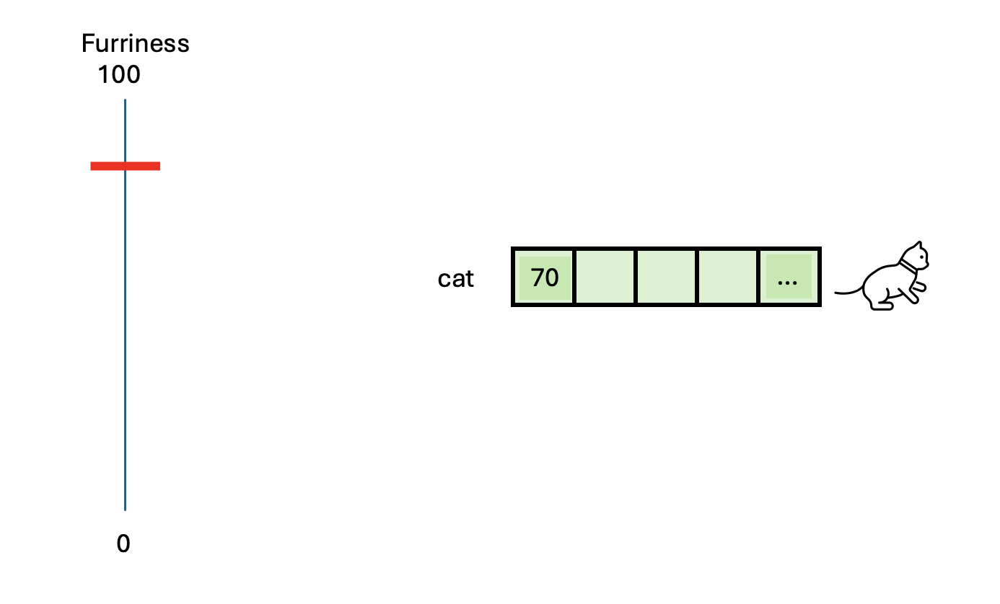
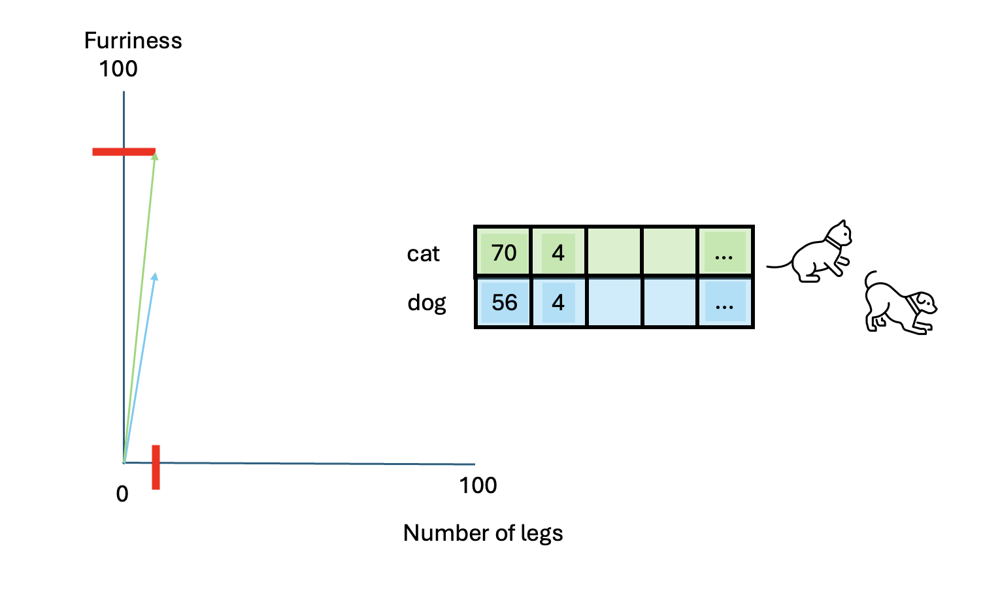
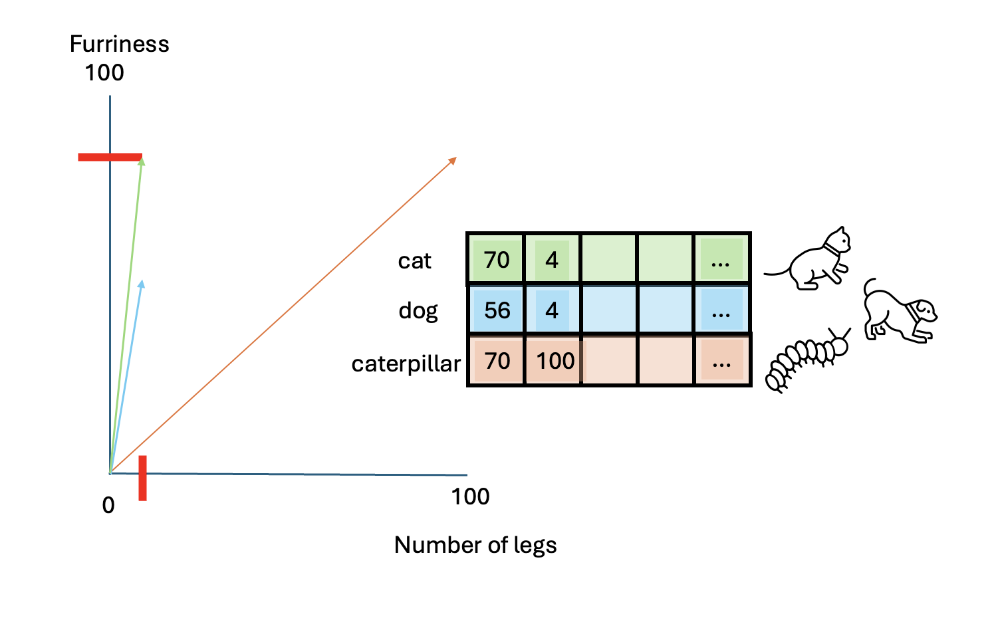

:::::::::::::::::::::::::::::::::::::::::::::::: questions

- What are word embeddings?
- What is a word2vec model?

:::::::::::::::::::::::::::::::::::::::::::::::: 

:::::::::::::::::::::::::::::::::::::::::::::::: objectives

After following this lesson, learners will be able to:

- Explain what word embeddings are
- Use Word2vec to generate word embeddings
- Extract words that are similar 
- Get familiar with using vectors to represent things


::::::::::::::::::::::::::::::::::::::::::::::::

# What are word embeddings?

**You shall know a word by the company it keeps** - J. R. Firth, 1957

In this episode, we’ll go over the concept of embedding, and the mechanics of generating word embeddings with Word2vec. 

We know that computers understand the language of numbers, so in order to let the computer process natural language, we must encode words in a sentence to numbers (i.e., vectors). Ideally, you can "transform" text in numbers in many ways. For instance, take the sentence `the cat sat on the mat`.

We could transform this sentence into a matrix in Python. The matrix will have the number of columns equals to the length of unique words in the corpus (i.e., 5 in our case) and number of words we are encoding (i.e., 6 in this example). 

```python
import numpy as np
import matplotlib.pyplot as plt

words = ["the", "cat", "sat", "on", "the","mat"]

sentence = ["cat", "mat", "on", "sat", "the"]

data = np.array([
    [0, 0, 0, 0, 1],
    [1, 0, 0, 0, 0],
    [0, 0, 0, 1, 0],
    [0, 0, 1, 0, 0],
    [0, 0, 0, 0, 1],
    [0, 1, 0, 0, 0],
])

fig, ax = plt.subplots()

table = ax.table(cellText=data, rowLabels=words, colLabels=sentence, cellLoc='center', loc='center')
ax.axis('off')
plt.title('the cat sat on the mat')
plt.show()
```

and count how many times we encounter a word by putting 1s (present) and 0s (absent). This approach is described as one-hot encoding:


|     | cat | mat | on  | sat | the |
|-----|-----|-----|-----|-----|-----|
| the |  0  |  0  |  0  |  0  |  1  |
| cat |  1  |  0  |  0  |  0  |  0  |
| sat |  0  |  0  |  0  |  1  |  0  |
| on  |  0  |  0  |  1  |  0  |  0  |
| the |  0  |  0  |  0  |  0  |  1  |
| mat |  0  |  1  |  0  |  0  |  0  |


To encode the word `cat` into a vector, you may concatenate each value in the vector cat = [1, 0, 0, 0, 0]. This would give us a unique fingerprint describing the word cat, and differentiating it from the other ones in the sentence. The downside of this approach is that you get a vector that is very sparse, i.e., it will contain a lot of 0s and only very few 1s. For very long documents (imagine billion of words) this approach becomes inefficient very quickly. In addition, we don't get any information about the syntactic and semantic relationship of the words.

Another strategy, is to map each word to a number. This approach is referred to as ordinal encoding:

| cat | mat | on  | sat | the |
|-----|-----|-----|-----|-----|
|   0 |  1  |  2  |  3  |  4  | 

So that the sentence can be mapped as:

```python
sentence = [4, 0, 3, 2, 4, 1]
```

This approach is much more efficient as it links each word to one numeric identifier. However, the choice for this identifier is quite arbitrary -- why does it mean that cat is 0? Does it change anything if it is encoded as 2? Moreover, there is no way to represent the relationship among words, e.g., how `cat`/0 relates to `mat`/1 ? So with this approach we gain in efficiency, but still we don't solve the problem of encoding semantic and syntactic information present in the text.

## Word embeddings
A Word Embedding is a word representation type that maps words (and whole sentences) in a numerical manner, however, differently from the approaches above, it organises information into an *efficient*, i.e., *dense*, representation in which semantic and syntactic features in the text are preserved. In this representation, words are described in a multidimensional space whereby similar words have a similar encoding. This allows us to describe them fully, and make comparisongs among words.

Let's see an example to get familiar with the concept of word embeddings. Let's use again the word `cat`. We want to describe this animal based on its characteristics. For instance, its furriness. Let's say that we measure the cat's furriness (in some magical way) and we found out that a cat has a score of `70` in furriness.

{alt=""}


Do you think we have described sufficiently this animal? Perhaps we can add another characteristic: Number of legs.

{alt=""}

We have now at least two characteristics that describe this animal. This is certainly not enough to describe this animal in **full**, however this approximation becomes helpful when we have to compare other animals, such as a dog.

{alt=""}

And what about a caterpillar?

{alt=""}

Which of these two animals (dog vs caterpillar) is more similar to a cat? We can compute the similarity among those vectors with the function `cosine_similarity()` in Python, from the `sklearn` library.


```python
from sklearn.metrics.pairwise import cosine_similarity

cat = np.asarray([[70, 4]])
dog = np.asarray([[56, 4]])
caterpillar = np.asarray([[70, 100]])

cosine_similarity(cat, dog)

cosine_similarity(cat, caterpillar)

```

Output:

```python
array([[0.9998988]])

array([[0.61926538]])
```

- Cosine similarity between cat and dog: 0.9998988
- Cosine similarity between cat and caterpillar: 0.61926538

So the similarity between a cat and a dog is *higher* than a cat and a caterpillar. Therefore, based on these two traits, we can conclude that a cat is much more similar to a dog than a caterpillar. 

We can of course add other dimensions to describe these animals:

{alt=""}

:::::::::::::::::::: challenge
- Add one of two other dimensions. What characteristics could they map?
- Add another animal and map their dimensions
- Compute again the cosine similarity among those animals and find the couple that is the least similar and the most similar

:::::: solution

1. Add one of two other dimensions

We could add the dimension of "velocity" or "speed" that goes from 0 to 100 meters/second. 

- Caterpillar: 0.001 m/s
- Cat: 1.5 m/s
- Dog: 2.5 m/s

(just as an example, actual speeds may vary)

```python
cat = np.asarray([[70, 4, 1.5]])
dog = np.asarray([[56, 4, 2.5]])
caterpillar = np.asarray([[70, 100, .001]])

```

Another dimension could be weight in Kg:

- Caterpillar: .05 Kg
- Cat: 4 Kg
- Dog: 15 Kg

(just as an example, actual weight may vary)

```python
cat = np.asarray([[70, 4, 1.5, 4]])
dog = np.asarray([[56, 4, 2.5, 15]])
caterpillar = np.asarray([[70, 100, .001, .05]])

```

Then the cosine similarity would be:

```python
cosine_similarity(cat, caterpillar)

cosine_similarity(cat, dog)
```

Output:

```python
array([[0.61814254]])
array([[0.97893809]])
```
2. Add another animal and map their dimensions

Another animal that we could add is the Tarantula!

```python
cat = np.asarray([[70, 4, 1.5, 4]])
dog = np.asarray([[56, 4, 2.5, 15]])
caterpillar = np.asarray([[70, 100, .001, .05]])
tarantula = np.asarray([[80, 6, .1, .3]])
```

3. Compute again the cosine similarity among those animals - find out the most and least similar couple

Given the values above, the least similar couple is the dog and the caterpillar, whose cosine similarity is `array([[0.60855407]])`. 

The most similar couple is the cat and the tarantula: `array([[0.99822302]])`

::::::

::::::::::::::::::::

Once we add multiple dimensions the animals' description become more complex, but also richer, therefore our comparisons become much more precise. 

The downside with this approach is that once we get more than 3 dimensions it becomes very difficult to represent the relationships among words with little arrows. However, the `cosine_similarity()` will always work, regardless of the number of dimensions.


:::: callout

In this example we have built our "embeddings" of a cat, dog and caterpillar with dimensions that we chose arbitrarily. Those dimensions were chosen because they were easy to measure and to see with our own eyes. However, when we deal with word embeddings trained on a corpus, it's difficult to know what the dimensions stand for. These can be many (the number must be limited by us) and it's unknown what they map to in the text. 

::::

::::::::::::::::::::::::::::::::::::: keypoints

- We can represent text as vectors of numbers (which makes it interpretable for machines)
- The most efficient and useful way is to use word embeddings
- We can easily compute how words are similar to each other with the cosine similarity
- Dimensions in word embeddings are many and not transparent

:::::::::::::::::::::::::::::::::::::

# Word2vec model
Let's look now at a trained word2vec example (that is, pre-computed *word embeddings*) and at some of their properties.

Word2Vec is a two-layer neural network that processes raw text and returns us the respective word-vectors (i.e., *word embeddings*). Word embeddings become better and better at representing the words within the text with the size of the training material. Think of all the books, articles, Wikipedia content, and other forms of text data we have lying around (our books from the Gutenberg's project are an example). These can be used to train a word2vec model and extract the relative embeddings. To do this, we would need the raw text, a powerful machine to process it, and some spare time to wait for the model to complete training. However, luckily for us someone else has done this training already, and we can load the output of this training (i.e., their pretrained word2vec model) on our local machine. 

We use the trained word2vec model named `GloVe` from the `gensim` library. The GloVe embeddings was trained on an English Wikipedia dump and English Gigaword 5th Edition dataset. It has 6B tokens. The original source of the embeddings can be found here: https://nlp.stanford.edu/projects/glove/

We can download this model locally with this code:

```python
import gensim.downloader
google_vectors = gensim.downloader.load('glove-wiki-gigaword-50')
```

::::::: callout

You can see how many (and which) pretrained model the `gensim` library contains with the following code snippet:

```python
print(list(gensim.downloader.info()['models'].keys()))
```

Output:

```python
['fasttext-wiki-news-subwords-300', 'conceptnet-numberbatch-17-06-300', 'word2vec-ruscorpora-300', 'word2vec-google-news-300', 'glove-wiki-gigaword-50', 'glove-wiki-gigaword-100', 'glove-wiki-gigaword-200', 'glove-wiki-gigaword-300', 'glove-twitter-25', 'glove-twitter-50', 'glove-twitter-100', 'glove-twitter-200', '__testing_word2vec-matrix-synopsis']
```
:::::::

Next, we can look at the embedding of the word `king`:

```python
print(google_vectors['king'])
```

Output:
```python
[ 0.50451   0.68607  -0.59517  -0.022801  0.60046  -0.13498  -0.08813
  0.47377  -0.61798  -0.31012  -0.076666  1.493    -0.034189 -0.98173
  0.68229   0.81722  -0.51874  -0.31503  -0.55809   0.66421   0.1961
 -0.13495  -0.11476  -0.30344   0.41177  -2.223    -1.0756   -1.0783
 -0.34354   0.33505   1.9927   -0.04234  -0.64319   0.71125   0.49159
  0.16754   0.34344  -0.25663  -0.8523    0.1661    0.40102   1.1685
 -1.0137   -0.21585  -0.15155   0.78321  -0.91241  -1.6106   -0.64426
 -0.51042 ]
```

This vector has 50 entries, i.e., 50 dimensions. We can't say much about what those dimensions map, and therefore about the numbers. 

```python
import matplotlib.pyplot as plt
import matplotlib.colors as mcolors

vectors= google_vectors['king']

fig, ax = plt.subplots(1, 1, figsize=(15, 1))

cmap = ax.imshow([vectors], aspect='auto',cmap=plt.cm.coolwarm)
ax.set_yticks([0])
ax.set_xticks([])
ax.set_yticklabels(['king'])
ax.set_xlabel('Embedding dimension')
plt.colorbar(cmap)

plt.tight_layout()

plt.show()

```
{alt=""}


However, what we can do is to compare it with other words, like "queen":

```python
vectors= google_vectors['king','queen']


fig, ax = plt.subplots(1, 1, figsize=(15, 1))

cmap = ax.imshow(vectors, aspect='auto',cmap=plt.cm.coolwarm)
ax.set_yticks([0,1])
ax.set_xticks([])
ax.set_yticklabels(['king','queen'])
ax.set_xlabel('Embedding dimension')
plt.axhline(y=.5, c='k', linestyle='--')
plt.colorbar(cmap)

plt.tight_layout()

plt.show()
```

{alt=""}


:::::::::::::::::::: challenge
- Add the vectors for ['boy','king','man', 'queen', 'woman', 'girl', 'daughter'] and plot it using the code above
- Compare the vectors by vertically scanning the columns looking for columns with similar colors. What similarities do you see?
- Can you find the column that in your opinion points to `royalty`? and the one that codes for `gender`?

:::::: solution

Code for plotting:

```python

vectors= google_vectors['boy', 'king', 'man', 'queen', 'woman', 'girl', 'daughter']

fig, ax = plt.subplots(1, 1, figsize=(15, 3))

cmap = ax.imshow(vectors, aspect='auto',cmap=plt.cm.coolwarm)
ax.set_yticks([0,1,2,3, 4, 5, 6])
ax.set_xticks([])
ax.set_yticklabels(['boy','king','man', 'queen', 'woman', 'girl', 'daughter'])
ax.set_xlabel('Embedding dimension')
plt.axhline(y=.5, c='k', linestyle='--')
plt.axhline(y=1.5, c='k', linestyle='--')
plt.axhline(y=2.5, c='k', linestyle='--')
plt.axhline(y=3.5, c='k', linestyle='--')
plt.axhline(y=4.5, c='k', linestyle='--')
plt.axhline(y=5.5, c='k', linestyle='--')

plt.colorbar(cmap)

plt.tight_layout()

plt.show()
```

While we don't know which dimension code for what, we can see that some columns are similar for all words, while other distinguish the royalty and gender. We could add more words and get a better understanding of what they code, however ultimately these would be always guesses.

{alt=""}

::::::

::::::::::::::::::::

## Analogies


# Training a word2vec model on our dataset


