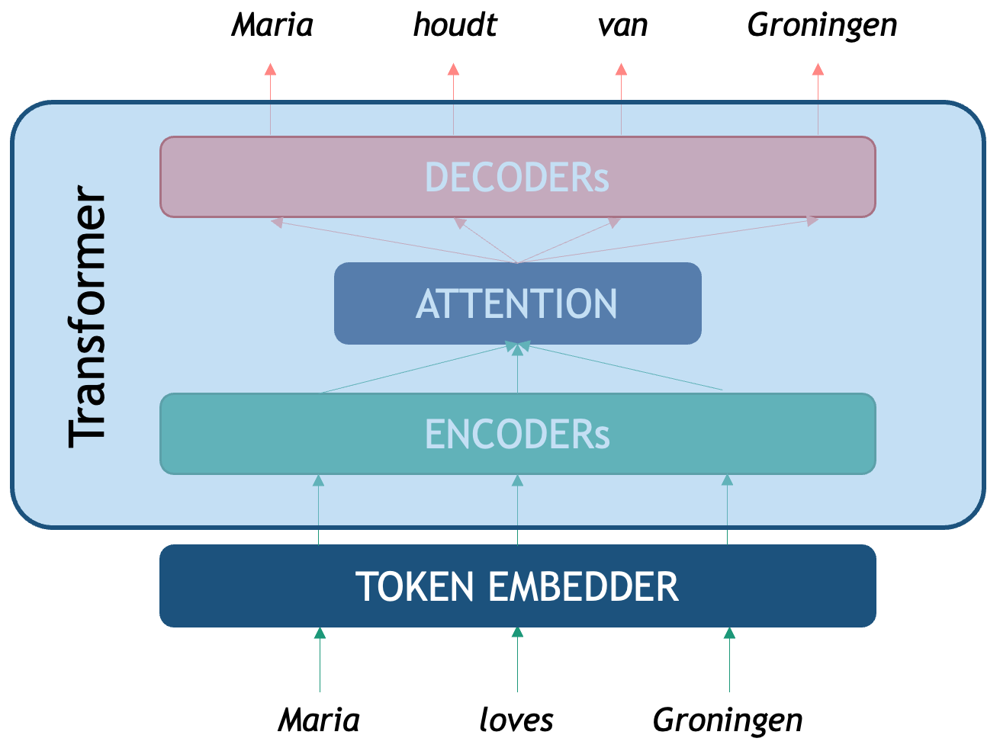

::: questions
- What are some drawbacks of static word embeddings?
- What are Transformers?
- What is BERT and how does it work?
- How can I use BERT to solve supervised NLP tasks?
- How should I evaluate my classifiers?
::: 

::: objectives
- Understand how a Transformer works and recognize their main components.
- Understand how to use pre-trained transformers (Use Case: BERT)
- Use BERT to predict words in context.
- Use BERT to classify texts.
- Learn to evaluate your NLP Classifier.
- Understand assumptions and basic evaluation for NLP outputs.
:::


Word embeddings such as Word2Vec can be used to represent words as unique vectors instead of Python strings. These vector representations give us numerical "proxy" representations for words. And these allow us to provide mathematical definitions for attributing semantics or meaning to words. They also enable metrics and measures for studying linguistic relationships with words. For example, one can devise metrics for similarity and semantic closeness of words, by defining a measure of distance between their corresponding vectors. This has proven to be quite useful for downstream lexical-related tasks.

However, a big drawback of Word2Vec is that **each word is represented in isolation**, which means that once we finished training a model, each word has exactly one vector associated with it, regardless of the different contexts in which it appears in the corpus text. This is what is called *static word embedding*, and unfortunately that is a serious limitation in expressing finer-grained complexities in language. Words derive their meaning *dynamically*, based on the specific context in which they are used. Think of syntactic information, which is relevant to understand the difference between "the dog bit the man" and "the man bit the dog". Another case is polysemy, where the same word can have very different meanings depending on the context, for example, "bit" in "the dog bit the man" and "in this bit of the book". Therefore, we would like to have richer vectors of words that are themselves sensitive to their context in order to obtain finer-grained representations of word meaning. 

:::: challenge
### Polysemy in Language

Think of words (at least 2) that can have more than one meaning depending on the context. Come up with one simple sentence per meaning and explain what they mean in each context. Discuss: How do you know which of the possible meanings does the word have when you see it?

::: solution

Two possible examples can be the words 'fine' and 'run'

Sentences for 'fine':
- She has a fine watch (fine == high-quality)
- He had to pay a fine (fine == penalty)
- I am feeling fine (fine == not bad)

Sentences for 'run':
- I had to run to catch the bus (run == moving fast)
- Stop talking, before you run out of ideas (run (out) == exhaust)

Note how in the "run out" example we even have to understand that the meaning of run is not literal but goes accompanied with a preposition that changes its meaning.

:::
::::


::: callout

### Bridging Word Embeddings and Contextualized Models

The limitations of Word2Vec became apparent as researchers tackled more complex natural language understanding tasks. BERT, the model we will describe below, was not the first attempt to improve upon the drawbacks of Word2Vec. Several intermediate models emerged to address the shortcomings. Some prominent models were: 

- **FastText** [(Joulin, et. al., 2016)](https://arxiv.org/pdf/1607.01759), developed by Facebook, extended Word2Vec by representing words as bags of character n-grams rather than atomic units. This subword tokenization approach enabled the model to generate embeddings for previously unseen words by combining learned subword representations—for instance, understanding "unhappiness" through its components "un-," "happiness," and "-ness." FastText proved particularly valuable for morphologically rich languages and handling misspellings or rare word forms.

- **ELMo** [(Peters, et. al., 2018)](https://aclanthology.org/N18-1202.pdf) marked a paradigm shift by integrating context into the word representations. Unlike Word2Vec's static embeddings, ELMo generated different representations for the same word based on its surrounding context using bidirectional LSTM networks. The model was pretrained on large text corpora using a language modeling objective—predicting words from both left and right contexts simultaneously—and crucially introduced effective transfer learning to NLP. BERT would basically replicate this concept but using a more powerful neural network architecture: the Transformer, which allowed for the scaling of training material. 

- **ULMFiT** [(Howard & Ruder, 2018)](https://aclanthology.org/P18-1031.pdf). Universal Language Model Fine-tuning, also tackled the problem via transfer learning; that is, *re-using the same model* for learning several different tasks and hence enriching word representations after each task was learned. This idea also enriched BERT post-training methodologies.

These intermediate models established several crucial concepts: that subword tokenization could handle vocabulary limitations, that context-dependent representations were superior to static embeddings, that deep bidirectional architectures captured richer linguistic information, and most importantly, that large-scale pretraining followed by task-specific fine-tuning could dramatically improve performance across diverse NLP applications.

:::


In late 2018, the [BERT](https://aclanthology.org/N19-1423.pdf) language model was introduced. Using a novel architecture called [Transformer](https://arxiv.org/pdf/1706.03762) (2017), BERT was specifically designed to scale the amount of training data and integrate context into word representations. To understand BERT, we will first look at what a transformer is and we will then directly use some code to make use of BERT.


## Transformers

The Transformer is a deep neural network architecture proposed by Google researchers in a paper called *Attention is all you Need*. They tackled specifically the NLP task of Machine Translation (MT), which is stated as: how to generate a sentence (sequence of words) in target language B given a sentence in source language A? We all know that translation cannot be done word by word in isolation, therefore integrating the context from both the source language and the target language is necessary. In order to translate, first one neural network needs to _encode_ the whole meaning of the sentence in language A into a single vector representation, then a second neural network needs to _decode_ that representation into tokens that are both coherent with the meaning of language A and understandable in language B. Therefore we say that translation is modeling language B _conditioned_ on what language A originally said.



As seen in the picture, the original Transformer is an Encoder-Decoder network that tackles translation. We first need a token embedder which converts the string of words into a sequence of vectors that the Transformer network can process. The first component, the __Encoder__, is optimized for creating **rich representations** of the source sequence (in this case an English sentence) while the second one, the __Decoder__ is a **generative network** that is conditioned on the encoded representation. The third component we see is the infamous attention mechanism, a third neural network what computes the correlation between source and target tokens (*which word in Dutch should I pay attention to, to decide a better next English word?*) to generate the most likely token in the target sequence (in this case Dutch words). 

:::: challenge
### Emulate the Attention Mechanism

Pair with a person who speaks a language different from English (we will call it language B). Think of 1 or 2 simple sentences in English and come up with their translations in the second language. In a piece of paper write down both sentences (one on top of the other with some distance in between) and try to:

1. Draw a mapping of words or phrases from language B to English. Is it always possible to do this one-to-one for words?
2. Think of how this might relate to attention in transformers?

::: solution
Here is an example of a sentence in English and its translation into Spanish. We can look at the final mapping and observe that:

1. Even though they are closely related languages, the translation is not linear
2. There is also not a direct word-to-word mapping between the sentences
3. Some words present in the source are not present in the target (and vice versa)
4. Some words are not translations of each other but they are still very relevant to understand the context


:::
::::

Next, we will see how BERT exploits the idea of a **Transformer Encoder** to perform the NLP Task we are interested in: generating powerful word representations.

## BERT

[BERT](https://aclanthology.org/N19-1423.pdf) is an acronym that stands for **B**idirectional **E**ncoder **R**epresentations from **T**ransformers. The name describes it all: the idea is to use the power of the Encoder component of the Transformer architecture to create powerful token representations that preserve the contextual meaning of the whole input segment, instead of each word in isolation. The BERT vector representations of each token take into account both the left context (what comes before the word) and the right context (what comes after the word). Another advantage of the transformer Encoder is that it is parallelizable, which made it possible for the first time to train these networks on millions of datapoints, dramatically improving model generalization. 

::: callout
### Pretraining BERT
To obtain the BERT vector representations the Encoder is pre-trained with two different tasks:

- **Masked Language Model:** for each sentence, mask one token at a time and predict which token is missing based on the context from both sides. A training input example would be "Maria [MASK] Groningen" and the model should predict the word "loves".

- **Next Sentence Prediction:** the Encoder gets a linear binary classifier on top, which is trained to decide for each pair of sequences A and B, if sequence A precedes sequence B in a text. For the sentence pair: "Maria loves Groningen." and "This is a city in the Netherlands." the output of the classifier is "True" and for the pair "Maria loves Groningen." and "It was a tasty cake." the output should be "false" as there is no obvious continuation between the two sentences.

Already the second pre-training task gives us an idea of the power of BERT: after it has been pretrained on hundreds of thousands of texts, one can plug-in a classifier on top and re-use the *linguistic* knowledge previously acquired to fine-tune it for a specific task, without needing to learn the weights of the whole network from scratch all over again. In the next sections we will describe the components of BERT and show how to use it. This model and hundreds of related transformer-based pre-trained encoders can also be found on [Hugging Face](https://huggingface.co/google-bert/bert-base-cased).
:::

## BERT Architecture

The BERT Architecture can be seen as a basic NLP pipeline on its own:

1. **Tokenizer:** splits text into tokens that the model recognizes
2. **Embedder:** converts each token into a fixed-sized vector that represents it. These vectors are the actual input for the Encoder.
3. **Encoder** several neural layers that model the token-level interactions of the input sequence to enhance meaning representation. The output of the encoder is a set of **H**idden layers, the vector representation of the ingested sequence.
5. **Output Layer:** the final encoder layer (which we depict as a sequence **H**'s in the figure) contains arguably the best token-level representations that encode syntactic and semantic properties of each token, but this time each vector is already contextualized with the specific sequence.
6. *OPTIONAL* **Classifier Layer:** an additional classifier can be connected on top of the BERT token vectors which are used as features for performing a downstream task. This can be used to classify at the text level, for example sentiment analysis of a sentence, or at the token-level, for example Named Entity Recognition.


BERT uses (self-) attention, which is very useful to capture longer-range word dependencies such as co-reference, where, for example, a pronoun can be linked to the noun it refers to previously in the same sentence. See the following example:


## BERT for Word-Based Analysis

Let's see how these components can be manipulated with code. For this we will be using the HuggingFace's _transformers_ Python library.
The first two main components we need to initialize are the model and tokenizer. The HuggingFace hub contains thousands of models based on a Transformer architecture for dozens of tasks, data domains and also hundreds of languages. Here we will explore the vanilla English BERT which was how everything started. We can initialize this model with the next lines:

```python
from transformers import BertTokenizer, BertModel
tokenizer = BertTokenizer.from_pretrained('bert-base-cased')
model = BertModel.from_pretrained("bert-base-cased")
```

### BERT Tokenizer

We start with a string of text as written in any blog, book, newspaper etcetera. The `tokenizer` object is responsible of splitting the string into recognizable tokens for the model and embedding the tokens into their vector representations

```python
text = "Maria loves Groningen"
encoded_input = tokenizer(text, return_tensors='pt')
print(encoded_input)
```

The print shows the `encoded_input` object returned by the tokenizer, with its attributes and values. The `input_ids` are the most important output for now, as these are the token IDs recognized by BERT

```
{
    'input_ids': tensor([[  101,  3406,  7871,   144,  3484, 15016,   102]]), 
    'token_type_ids': tensor([[0, 0, 0, 0, 0, 0, 0]]), 
    'attention_mask': tensor([[1, 1, 1, 1, 1, 1, 1]])
}

```

 NOTE: the printing function shows transformers objects as dictionaries; however, to access the attributes, you must use the Python object syntax, such as in the following example:

```python
print(encoded_input.input_ids.shape)
```
Output:

`torch.Size([1, 7])`

The output is a 2-dimensional tensor where the first dimension contains 1 element (this dimension represents the batch size), and the second dimension contains 7 elements which are equivalent to the 7 tokens that BERT generated from our string input.

In order to see what these Token IDs represent, we can _translate_ them into human readable strings. This includes converting the tensors into ```numpy``` arrays and converting each ID into its string representation:

```python
token_ids = list(encoded_input.input_ids[0].detach().numpy())
string_tokens = tokenizer.convert_ids_to_tokens(token_ids)
print("IDs:", token_ids)
print("TOKENS:", string_tokens)
```

```
IDs: [101, 3406, 7871, 144, 3484, 15016, 102]

TOKENS: ['[CLS]', 'Maria', 'loves', 'G', '##ron', '##ingen', '[SEP]']

```

First we feed the tokenized input into the model:

```python
output = model(**encoded_input)
```

Now we can explore the representations in the model.

::: callout

In the case of wanting to obtain a single vector for *Groningen*, you can average the three vectors that belong to the token pieces that ultimately form that word. For example:

```python
import numpy as np
tok_G = output.last_hidden_state[0][3].detach().numpy()
tok_ron = output.last_hidden_state[0][4].detach().numpy()
tok_ingen = output.last_hidden_state[0][5].detach().numpy()

tok_groningen = np.mean([tok_G, tok_ron, tok_ingen], axis=0)
print(tok_groningen.shape)
print(tok_groningen[:10])
```

We obtain the output:

```
(768,)
[ 0.00990007 -0.44266668  0.05274092  0.08865168  0.71115637 -0.4092603
  0.18841815  0.19883917  0.24680579 -0.07899686]
```

We use the functions `detach().numpy()` to bring the values from the Pytorch execution environment (for example a GPU) into the main Python thread and treat it as a ```Numpy``` vector for convenience. Then, since we are dealing with three ```Numpy``` vectors we can average the three of them and end up with a single `Groningen` vector of 768-dimensions representing the average of `'G', '##ron', '##ingen'`.

:::


### Analyzing polysemy with BERT
We can encode two sentences containing the word *note* to see how BERT actually handles polysemy (*note* means something very different in each sentence) thanks to the representation of each word now being contextualized instead of isolated as was the case with Word2vec.


```python
# We tokenize the sentence and identify the two different 'note' tokens inside the sentence
text_note = "Please note that this bank note is fake!"
tokenized_text = tokenizer(text_note, return_tensors='pt')
token_ids = list(tokenized_text.input_ids[0].detach().numpy())
string_tokens = tokenizer.convert_ids_to_tokens(token_ids)
print(string_tokens)
```

We are printing the BERT tokens extracted from the sentence, and displaying them:

```
['[CLS]', 'Please', 'note', 'that', 'this', 'bank', 'note', 'is', 'fake', '!', '[SEP]']
```

We then manually count which token indices in the list belong to `note`, so we can extract their vectors later

```python
note_index_1 = 2 # first occurrence of `note`
note_index_2 = 6 # second occurrence of `note`
print(string_tokens[note_index_1], string_tokens[note_index_2])
```

We now pass the sentence through the BERT encoder and extract the encoded vectors belonging to each `note` token:

```python
import torch
# Encode the sentence and extract the vector belonging to each 'note' token
with torch.no_grad():
    bert_output = model(**tokenized_text)
note_vector_1 = bert_output.last_hidden_state[0][note_index_1].detach().numpy()
note_vector_2 = bert_output.last_hidden_state[0][note_index_2].detach().numpy()

print(note_vector_1[:5])
print(note_vector_2[:5])
```
```
[1.0170387  0.93691176 0.30571502 0.33091038 0.73093796]
[0.17840035 0.65847856 0.22412607 0.21162085 0.5393072 ]
```

By printing the first 5 dimensions of the vectors we can see that, even though both vectors technically belong to the same string input `note`, they have different numeric representations. This is the case because the BERT encoder takes into account the position of the token as well as all the previous and following tokens when computing the representation for each token.

To be sure, we can compute the cosine similarity of the word `note` in the first sentence and the word *note* in the second sentence confirming that they are indeed two different representations, even when both cases have the same token-id and they are the 12th token of the sentence:

```python
from sklearn.metrics.pairwise import cosine_similarity
import numpy as np

vector1 = np.array(note_vector_1).reshape(1, -1)  # Reshape to 2D array
vector2 = np.array(note_vector_2).reshape(1, -1)  # Reshape to 2D array

similarity = cosine_similarity(vector1, vector2)
print(f"Cosine Similarity 'note' vs 'note': {similarity[0][0]}")
```

With this small experiment, we have confirmed that the Encoder produces context-dependent word representations, as opposed to Word2Vec, where *note* would always have the same vector no matter where it appeared.

::: callout

When running examples in a BERT pre-trained model, it is advisable to wrap your code inside a `torch.no_grad():` context. This is linked to the fact that BERT is a Neural Network that has been trained (and can be further fine-tuned) with the Backpropagation algorithm. Essentially, this wrapper tells the model that we are not in training mode, and we are not interested in _updating_ the weights (as it would happen when training any neural network), because the weights are already optimal enough. By using this wrapper, we make the model more efficient as it does not need to calculate the gradients for an eventual backpropagation step, since we are only interested in what _comes out_ of the Encoder. So the previous code can be made more efficient like this:

```python
import torch 

with torch.no_grad():
    output = model(**encoded_input)
    print(output)
    print(output.last_hidden_state.shape)
```

:::


## BERT as a Language Model

As mentioned before, the main pre-training task of BERT is Language Modelling (LM): calculating the probability of a word based on the known neighboring words (yes, Word2Vec was also a kind of LM!). Obtaining training data for this task is very cheap, as all we need is millions of sentences from existing texts, without any labels. In this setting, BERT encodes a sequence of words, and predicts from a set of English tokens, what is the most likely token that could be inserted in the `[MASK]` position


We can therefore start using BERT as a predictor for word completion. From now own, we will learn how to use the `pipeline` object, this is very useful when we only want to use a pre-trained model for predictions (no need to fine-tune or do word-specific analysis). The `pipeline` will internally initialize both model and tokenizer for us and also merge word pieces back into complete words. 

::: callout
The `pipeline` object is very convenient to test all the out-of-the-box models that you can find in the HuggingFace platform, and if you are lucky and you like what you see, this is the fastest way to get model predictions. 

But consider that for some tasks you will want more control over the tokenization and how the model merges the predictions. If that is the case, initializing the tokenizer, encoding the texts into word-vectors and running the model inference yourself might be the way to go (like it is shown in the *Polysemy in BERT* section).

Even if you *like what you see*, it is important that you evaluate the performance of the models in **your data and use case** regardless of what the model performance claims to be. We will show an example with a couple of evaluation metrics in the *BERT for Text Classification* section.
:::

In this case again we use `bert-base-cased`, which refers to the vanilla BERT English model. Once we declared a pipeline, we can feed it with sentences that contain one masked token at a time (beware that BERT can only predict one word at a time, since that was its training scheme). For example:


```python
from transformers import pipeline

def pretty_print_outputs(sentences, model_outputs):
    for i, model_out in enumerate(model_outputs):
        print("\n=====\t",sentences[i])
        for label_scores in model_out:
            print(label_scores)


nlp = pipeline(task="fill-mask", model="bert-base-cased", tokenizer="bert-base-cased")
sentences = ["Paris is the [MASK] of France", "I want to eat a cold [MASK] this afternoon", "Maria [MASK] Groningen"]
model_outputs = nlp(sentences, top_k=5)
pretty_print_outputs(sentences, model_outputs)
```

```
=====	 Paris is the [MASK] of France
{'score': 0.9807965755462646, 'token': 2364, 'token_str': 'capital', 'sequence': 'Paris is the capital of France'}
{'score': 0.004513159394264221, 'token': 6299, 'token_str': 'Capital', 'sequence': 'Paris is the Capital of France'}
{'score': 0.004281804896891117, 'token': 2057, 'token_str': 'center', 'sequence': 'Paris is the center of France'}
{'score': 0.002848200500011444, 'token': 2642, 'token_str': 'centre', 'sequence': 'Paris is the centre of France'}
{'score': 0.0022805952467024326, 'token': 1331, 'token_str': 'city', 'sequence': 'Paris is the city of France'}

=====	 I want to eat a cold [MASK] this afternoon
{'score': 0.19168031215667725, 'token': 13473, 'token_str': 'pizza', 'sequence': 'I want to eat a cold pizza this afternoon'}
{'score': 0.14800849556922913, 'token': 25138, 'token_str': 'turkey', 'sequence': 'I want to eat a cold turkey this afternoon'}
{'score': 0.14620967209339142, 'token': 14327, 'token_str': 'sandwich', 'sequence': 'I want to eat a cold sandwich this afternoon'}
{'score': 0.09997560828924179, 'token': 5953, 'token_str': 'lunch', 'sequence': 'I want to eat a cold lunch this afternoon'}
{'score': 0.06001955270767212, 'token': 4014, 'token_str': 'dinner', 'sequence': 'I want to eat a cold dinner this afternoon'}

=====	 Maria [MASK] Groningen
{'score': 0.24399833381175995, 'token': 117, 'token_str': ',', 'sequence': 'Maria, Groningen'}
{'score': 0.12300779670476913, 'token': 1104, 'token_str': 'of', 'sequence': 'Maria of Groningen'}
{'score': 0.11991506069898605, 'token': 1107, 'token_str': 'in', 'sequence': 'Maria in Groningen'}
{'score': 0.07722211629152298, 'token': 1306, 'token_str': '##m', 'sequence': 'Mariam Groningen'}
{'score': 0.0632941722869873, 'token': 118, 'token_str': '-', 'sequence': 'Maria - Groningen'}

```

When we call the `nlp` pipeline, requesting to return the `top_k` most likely suggestions to complete the provided sentences (in this case `k=5`). The pipeline returns a list of outputs as Python dictionaries. Depending on the task, the fields of the dictionary will differ. In this case, the `fill-mask` task returns a score (between 0 and 1, the higher the score the more likely the token is), a tokenId, and its corresponding string, as well as the full "unmasked" sequence. 

In the list of outputs we can observe: the first example shows correctly that the missing token in the first sentence is _capital_, the second example is a bit more ambiguous, but the model at least uses the context to correctly predict a series of items that can be eaten (unfortunately, none of its suggestions sound very tasty); finally, the third example gives almost no useful context so the model plays it safe and only suggests prepositions or punctuation. This already shows some of the weaknesses of the approach.

::: challenge
Play with the `fill-mask` pipeline and try to find examples where the model gives bad predictions and examples where the predictions are very good. You can try: 

- Changing the `top_k` parameter
- Test the multilingual BERT model to compare. To do this, you should change the `model` and `tokenizer` parameter name to `bert-base-multilingual-cased`
- Search for bias in completions. For example, compare predictions for "This man works as a [MASK]." vs. "This woman works as a [MASK].".

:::: solution
This is a free exercise, so anything works. But even by running the same cases with the multilingual models we see some interesting aspects. For example, the predictions are of less quality in English. This is due to the "spread" of information across other languages, including a worse tokenization, since this model tries do predict for around 200 languages.

Another interesting example is searching for **bias in the completions**, these can be bias in many areas. In this case, comparing the outputs you get for the sentences "This man works as a [MASK]." and "This woman works as a [MASK]." exposes the huge gender biases inside BERT word representations: for 'man' BERT predicts `['lawyer', 'carpenter', 'doctor', 'waiter', 'mechanic']` and for woman it predicts `['nurse', 'waitress', 'teacher', 'main', 'prostitute']`.
::::

:::

We will next see the case of combining BERT with a classifier on top.


## BERT for Text Classification

The task of text classification is assigning a label to a whole sequence of tokens, for example a sentence. With the parameter `task="text_classification"` the `pipeline()` function will load the base model and automatically add a linear layer with a softmax on top. This layer can be fine-tuned with our own labeled data or we can also directly load the fully pre-trained text classification models that are already available in HuggingFace.


Let's see the example of a ready pre-trained emotion classifier based on `RoBERTa` model. This model was fine-tuned in the Go emotions [dataset](https://huggingface.co/datasets/google-research-datasets/go_emotions), taken from English Reddit and labeled for 28 different emotions at the sentence level. The fine-tuned model is called [roberta-base-go_emotions](https://huggingface.co/SamLowe/roberta-base-go_emotions). This model takes a sentence as input and outputs a probability distribution over the 28 possible emotions that might be conveyed in the text. For example:

```python

classifier = pipeline(task="text-classification", model="SamLowe/roberta-base-go_emotions", top_k=3)

sentences = ["I am not having a great day", "This is a lovely and innocent sentence", "Maria loves Groningen"]
model_outputs = classifier(sentences)

pretty_print_outputs(sentences, model_outputs)
```

```
=====	 I am not having a great day
{'label': 'disappointment', 'score': 0.46669483184814453}
{'label': 'sadness', 'score': 0.39849498867988586}
{'label': 'annoyance', 'score': 0.06806594133377075}

=====	 This is a lovely and innocent sentence
{'label': 'admiration', 'score': 0.6457845568656921}
{'label': 'approval', 'score': 0.5112180113792419}
{'label': 'love', 'score': 0.09214121848344803}

=====	 Maria loves Groningen
{'label': 'love', 'score': 0.8922032117843628}
{'label': 'neutral', 'score': 0.10132959485054016}
{'label': 'approval', 'score': 0.02525361441075802}
```

This code outputs again a list of dictionaries with the `top-k` (`k=3`) emotions that each of the two sentences convey. In this case, the first sentence evokes (in order of likelihood) *disappointment*, *sadness* and *annoyance*; whereas the second sentence evokes *love*, *neutral* and *approval*. Note however that the likelihood of each prediction decreases dramatically below the top choice, so perhaps this specific classifier is only useful for the top emotion.

::: callout

Fine-tuning BERT is very cheap, because we only need to train the _classifier_ layer,  a very small neural network, that can learn to choose between the classes (labels) for your custom classification problem, without needing a big amount of annotated data. This classifier is a one-layer neural layer that assigns a score that can be translated to the probability over a set of labels, given the input features provided by BERT, which already _encodes_ the meaning of the entire sequence in its hidden states. Unfortunately fine-tuning is out of the scope of this course but you can learn more about fine-tuning BERT-like models in [this HuggingFace tutorial](https://huggingface.co/docs/transformers/v4.57.1/en/training#fine-tuning)
:::


## Model Evaluation

Model evaluation is a critical step in any machine learning project, and it is also the case for NLP. While it may be tempting to rely on the accuracy scores observed during training, or the model descriptions provided on the web, this approach can be misleading and often results in models that fail in real-world applications, and that includes your data.

::: callout
The fundamental principle of model evaluation is to test your model on data it has never seen before. **If you are training your own models, this is typically achieved by splitting your dataset into training, validation, and test sets**. The training set is used to teach the model, the validation set helps tune hyperparameters or other aspects of model development, and the test set provides a less biased assessment of the final model's performance. Without this separation, you risk overfitting, where your model memorizes the training data rather than learning generalizable patterns.

If you are using out-of-the-box models, evaluation is also mandatory, as you must be sure that the outputs you obtain behave in the manner that you would expect. In this case you only need to design the test set (with human annotators) and measure the performance. **It doesn't matter how broadly a model was tested, you must always confirm that it is suitable for your intended usage**. It is also not enough to use semi-automated evaluation, designing human-labeled data will also provide insightful information for shaping your own task and judging the predictions you get.
:::

### Evaluation Metrics

Several metrics are commonly used to evaluate NLP models, each offering different insights into performance. Here we will describe the 4 most used in suervised learning classifiers

Let's give the toy example of classifying photographs of cats and dogs. In this task, there are 2 classes: `cat` and `dog`, and we have a model that return the label `cat` or `dog` given an input photograph. If we want to evaluate how good is our model at recognizing `dog`s (our *positive class* in this example), there are 4 possibilities when comparing with the ground truth (your labeled data): 

1. **True Positives (TP):** the number of `dog` photographs the model *correctly* labeled as `dog`. 
2. **True Negatives (TN):** the number of non-`dog` photographs *correctly* labeled as something else.
3. **False Positives (FP):** the number of non-`dog` photographs the model *mistakenly* labeled as `dog`.
4. **False Negatives (FN):** the number of `dog` photographs *mistakenly* labeled as something else.

Based on this simple counts, we can derive four metrics that inform us at scale about the performance of our classifiers: 

- **Accuracy:** measures the global proportion of correct predictions, regardless of the class they hold. This is al true cases (TP + TN) divided by all tested instances (TP+TN+FP+FN).
- **Precision:**  This answers the following question: "Of all the predictions the model made for a particular class, how many were actually correct?". This is TP divided by (TP+FP). 
- **Recall:** This answers the following question: "Of all the actual instances of a class, how many did the model successfully identify?". This is TP divided by (TP+FN).
- **F1-score:** provides a harmonic mean of precision and recall, offering a single metric that balances both concerns. 

Deciding which metric is the most relevant to your case depends on your specific task, but having a view at all of the metrics is always insightful.


**It's important to remember that a high accuracy score doesn't always indicate a good model**. For example, if you're classifying rare events that occur only 5% of the time, a naive model that always predicts "no event" would achieve 95% accuracy while being completely useless. This is why examining multiple metrics and understanding your data's characteristics is essential for proper model evaluation.

In Python, the `scikit-learn` package already provides us with these (and many other) evaluation metrics. All we need to do is prepare an ordered list with the `true_labels` and a list with the corresponding `predicted_labels` for each example in our data. 

To illustrate the usage of evaluation, we will use a simpler sentiment model that predicts 5 classes: `Very positive`, `positive`, `neutral`, `negative` and `very negative`. Here is an example of the model predictions for four toy examples:

```python
from transformers import pipeline

# Load the classification pipeline with the specified model
pipe = pipeline("text-classification", model="tabularisai/multilingual-sentiment-analysis")

# Classify a new sentence
sentences = [
    "I love this product! It's amazing and works perfectly.",
    "The movie was a bit boring, I could predict the ending since minute 1.",
    "Mary Shelley wrote this book around 1816.",
    "Everything suuuucks!"
]
gold_labels = [
    "Very Positive",
    "Negative",
    "Neutral",
    "Very Negative"
]

# The pipeline can also run on a batch of examples
result = pipe(sentences)

# Print the result
predicted_labels = []
for res in result:
    print(res)
    predicted_labels.append(res['label'])
```

```
{'label': 'Very Positive', 'score': 0.5586304068565369}
{'label': 'Negative', 'score': 0.9448591470718384}
{'label': 'Neutral', 'score': 0.9229359030723572}
{'label': 'Very Negative', 'score': 0.36225152015686035}
```

We can see that the model predicts correctly the 4 examples we gave. This is unsurprising as they are incredibly obvious examples. We can also print the results and inspect them because they are only 4 instances, but it is clearly not a scalable approach. 

::: callout
Note that many models will provide a confidence `score`, with their predictions. It is very tempting to interpret these scores as a proxy to "how certain is the model of prediction X". However, you should be very careful, this score is only a relative confidence measure with respect to the training data, and it does not always translate well to unseen data. Most of the times it is better to just ignore it, especially if it is a model that you didn't train yourself.
:::

We can obtain an automated evaluation report, including the basic evaluation metrics, from `scikit-learn` by calling:

```python
from sklearn.metrics import classification_report

print(classification_report(y_true=gold_labels, y_pred=predicted_labels))
```

The output is a table showing a breakdown of metrics by class. The column `support` shows how many examples per class were present in the gold data.

```
               precision    recall  f1-score   support

     Negative       1.00      1.00      1.00         1
      Neutral       1.00      1.00      1.00         1
Very Negative       1.00      1.00      1.00         1
Very Positive       1.00      1.00      1.00         1

     accuracy                           1.00         4
    macro avg       1.00      1.00      1.00         4
 weighted avg       1.00      1.00      1.00         4
```

These 4 metrics range from 0 to 1 (note that sometimes people multiply the scores by 100 to gain more granularity with decimal places). In this case, because we had a *perfect* score everything amounts to 1. In the most catastrophic scenario all scores would be zero.


::: challenge
### Evaluate Sentiment Classifier

Now it is time to scale things a little bit more... Use the same pipeline from the given toy example to run predictions over 100 examples of short book reviews. Then print the classification report for the given *test set*. These examples are given in the `data/sentiment_film_data.tsv` file.

You can use the following helper functions, the first one helps you read the file and the second one normalizes the 5-class predictions into the 3-class annotations given in the test set:

``` python
def load_data(filename):
    with open(filename, 'r') as f:
        lines = f.readlines()[1:] # skip header
    sentences, labels = zip(*(line.strip().split('\t') for line in lines))
    return list(sentences), list(labels)

def get_normalized_labels(predictions):
    # predicitons is a list with dicts such as {'label': 'positive', 'score': 0.95}
    # We also need to normalize the labels to match the true labels (which are only 'positive' and 'negative')
    normalized = []
    for pred in predictions:
        label = pred['label'].lower()
        if 'positive' in label:
            normalized.append('positive')
        elif 'negative' in label:
            normalized.append('negative')
        else:
            normalized.append('neutral')
    return normalized
```

:::: solution

``` python
from sklearn.metrics import classification_report, precision_recall_fscore_support
import matplotlib.pyplot as plt

sentences, labels = load_data('data/sentiment_film_data.tsv')
# The labels from our dataset
y_true = labels
# Run the model to get predictions per sentence
y_pred = pipe(sentences)
# Normalize the labels to match the gold standard
y_pred = get_normalized_labels(y_pred)

# Detailed report with all metrics
print(classification_report(y_true, y_pred))
```

Here is the classification report:

```output
              precision    recall  f1-score   support

    negative       0.57      1.00      0.73        23
     neutral       0.53      0.22      0.31        37
    positive       0.69      0.78      0.73        40

    accuracy                           0.62       100
   macro avg       0.60      0.66      0.59       100
weighted avg       0.61      0.62      0.57       100
```

::::

:::

### Confusion Matrix

The confusion matrix is another direct and informative tool for understanding your model's performance, by offering an intuitive visualization of your model's behavior in detail. It is a table that compares your model's predictions against the true labels. The **rows typically represent the actual classes, while the columns show the predicted classes**. Each cell contains the count of instances that fall into that particular combination of true and predicted labels. Perfect predictions would result in all counts appearing along the diagonal of the matrix, with zeros everywhere else.


```python
from sklearn.metrics import ConfusionMatrixDisplay

def show_confusion_matrix(y_true, y_pred, labels=None):
    ConfusionMatrixDisplay.from_predictions(y_true, y_pred, display_labels=labels, cmap='Blues')
    plt.show()

show_confusion_matrix(y_true, y_pred)
```

This code shows the following matrix:


Some of the insights from a confusion matrix include:

- Observe which classes your model handles well and which ones it struggles with.
- Observe confusion patterns between classes. By examining the off-diagonal cells, you can identify systematic errors your model makes. For example, perhaps your sentiment classifier consistently confuses neutral statements with positive ones, but rarely mistakes neutral for negative.
- Detect Bias, for example by exposing a tendency to over-predict certain classes while ignoring others.
- Detect class imbalance. Even if your overall accuracy seems high, the confusion matrix might reveal that your model achieves this by simply predicting the majority class most of the time. 


## BERT for Token Classification

Just as we plugged in a trainable text classifier layer, we can add a token-level classifier that assigns a class to each of the tokens encoded by a transformer (as opposed to one label for the whole sequence). A specific example of this task is Named Entity Recognition, but you can basically define any task that requires to *highlight* sub-strings of text and classify them using this technique.

### Named Entity Recognition

Named Entity Recognition (NER) is the task of recognizing mentions of real-world entities inside a text. The concept of **Entity** includes proper names that unequivocally identify a unique individual (PER), place (LOC), organization (ORG), or other object/name (MISC). Depending on the domain, the concept can expanded to recognize other unique (and more conceptual) entities such as DATE, MONEY, WORK_OF_ART, DISEASE, PROTEIN_TYPE, etcetera... 

In terms of NLP, this boils down to classifying each token into a series of labels (`PER`, `LOC`, `ORG`, `O`[no-entity] ). Since a single entity can be expressed with multiple words (e.g. New York) the usual notation used for labeling the text is IOB (**I**nner **O**ut **B**eginnig of entity) notations which identifies the limits of each entity tokens. For example:


This is a typical sequence classification problem where an imput sequence must be fully mapped into an output sequence of labels with global constraints (for example, there can't be an inner I-LOC label before a beginning B-LOC label). Since the labels of the tokens are context dependent, a language model with attention mechanism such as BERT is very beneficial for a task like NER.

Because this is one of the core tasks in NLP, there are dozens of pre-trained NER classifiers available in HuggingFace that you can use right away. We use once again the `pipeline()` wrapper to directly run the model for predictions , in this case with `task="ner"`. For example:


```python
from transformers import AutoTokenizer, AutoModelForTokenClassification
from transformers import pipeline

# We can also pass to the pipeline the initialized model & tokenizer. 
# This way we have access to both separately if we need them later
tokenizer = AutoTokenizer.from_pretrained("dslim/bert-base-NER")
model = AutoModelForTokenClassification.from_pretrained("dslim/bert-base-NER")

ner_classifier = pipeline("token-classification", model=model, tokenizer=tokenizer, aggregation_strategy="first")
example = "My name is Wolfgang Schmid and I live in Berlin"

ner_results = ner_classifier(example)
for nr in ner_results:
    print(nr)
```
The code now prints the following:
```
{'entity_group': 'PER', 'score': 0.9995944, 'word': 'Wolfgang Schmid', 'start': 11, 'end': 26}
{'entity_group': 'LOC', 'score': 0.99956733, 'word': 'Berlin', 'start': 41, 'end': 47}
```

As you can see, the outputs contain already the entities aggregated at the Span Leven (instead of the Token Level). Word pieces are merged back into *human words* and also multiword entities are assigned a single entity unified label. Depending on your use case you can request the pipeline to give different `aggregation_strateg[ies]`. More info about the pipeline can be found [here](https://huggingface.co/docs/transformers/main_classes/pipelines).

The same evaluation metrics you learned for the text classifier can also be applied to this classification task. A common Python library to deal with token classification is [seqeval](https://github.com/chakki-works/seqeval) or [evaluate](https://github.com/huggingface/evaluate?tab=readme-ov-file). Remember to always test on a significant human-labeled dataset to assess if the predictions you are getting make sense. If they don't, more advances use of the models, including fine-tuning should be used.


What did we learn in this lesson?


::: keypoints
- Static word representations, such as word2vec, still lack of enough context to do more advanced tasks, we made this weakness evident by studying polysemy.

- The transformer architecture consists of three main components: an **Encoder** to create powerful text representations (embeddings), an **Attention Mechanism** to learn more from the full sequence context, and a **Decoder**, a generative model to predicts the next token based on the context it has so far.

- BERT is a deep encoder that creates rich contextualized representations of words and sentences. These representations are very powerful features that can be re-used by other machine Learning and deep learning models.

- Several of the core NLP tasks can be solved using Transformer-based models. In this episode we covered language modeling (fill-in the mask), text classification (sentiment analysis) and token classification (named entity recognition).

- Evaluating the model performance using your own data **for your own use case** is crucial to understand possible drawbacks when using this model for unknown predictions
:::