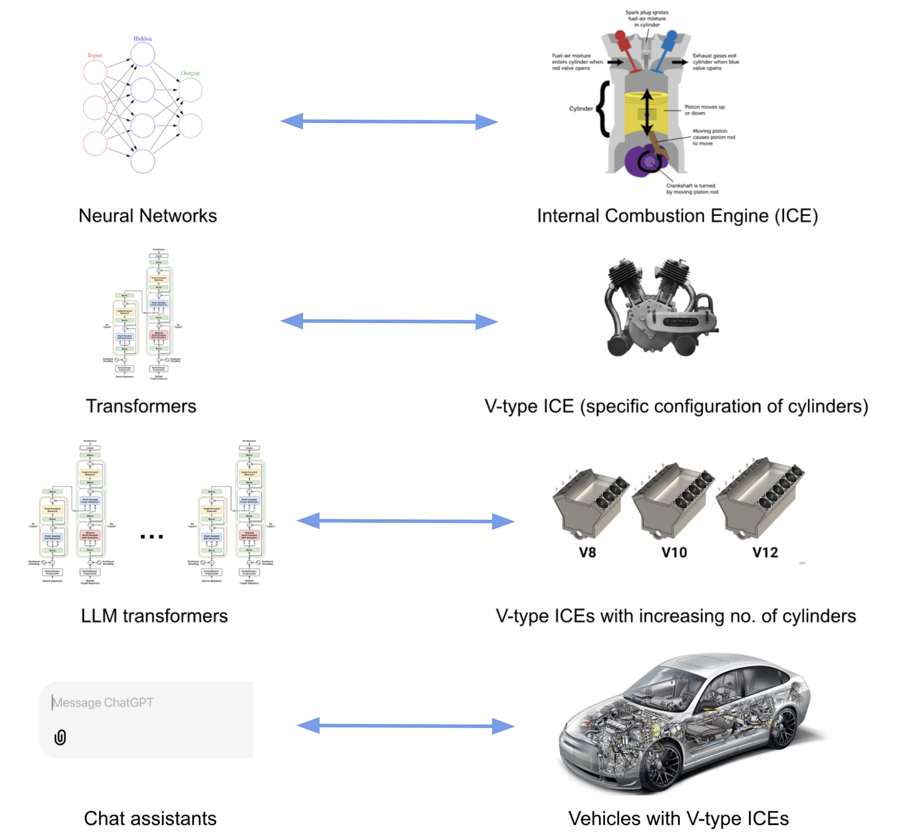
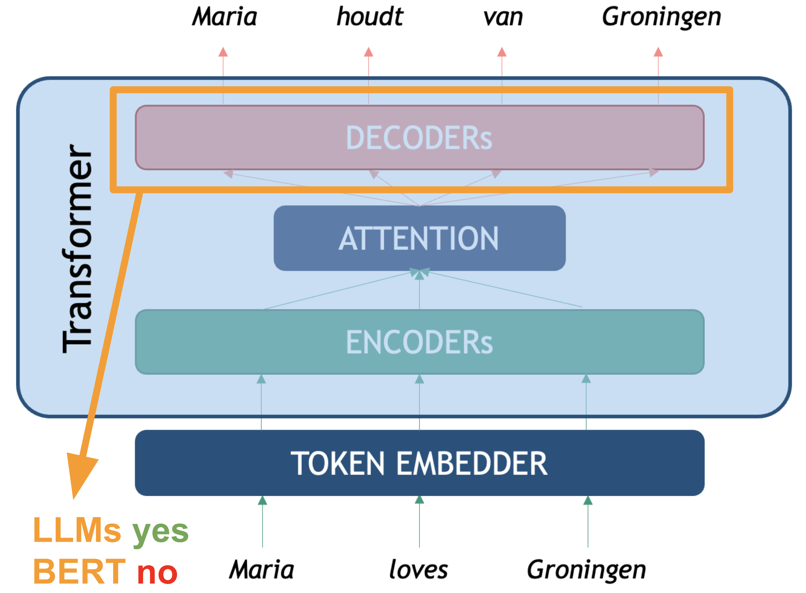
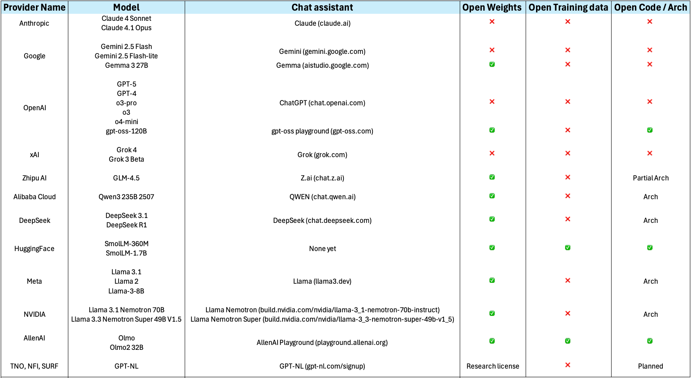
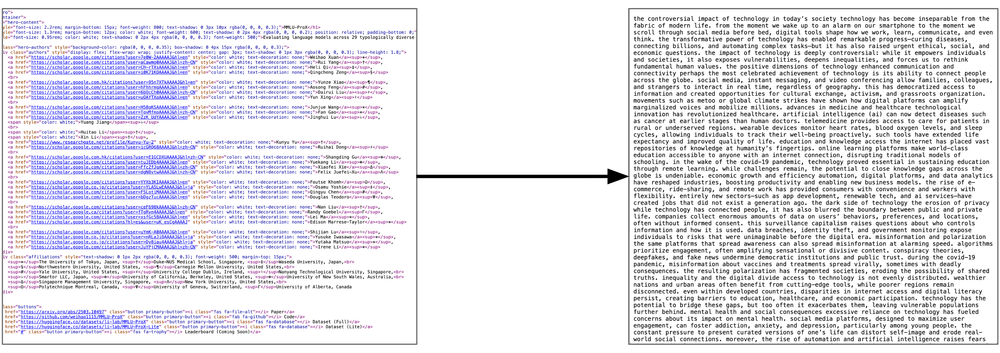
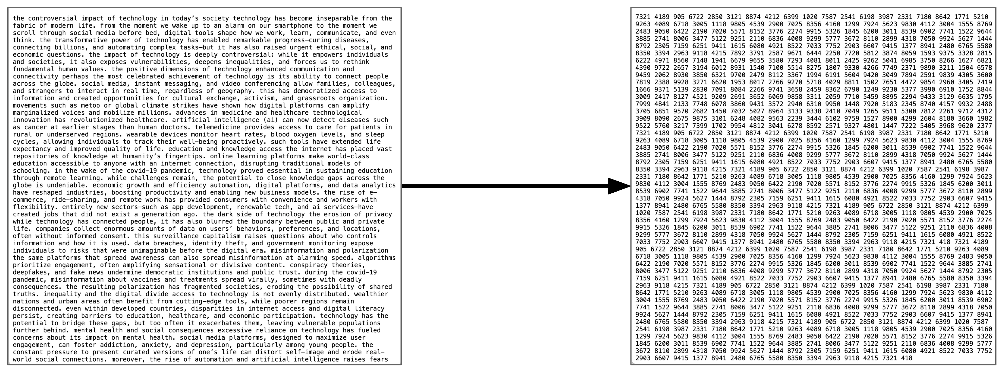
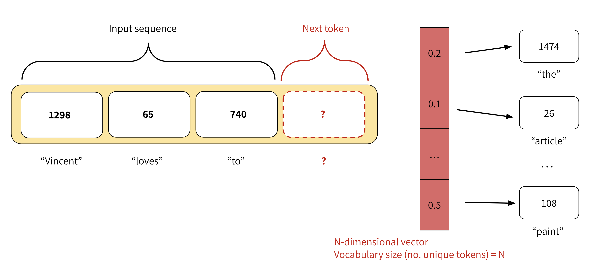
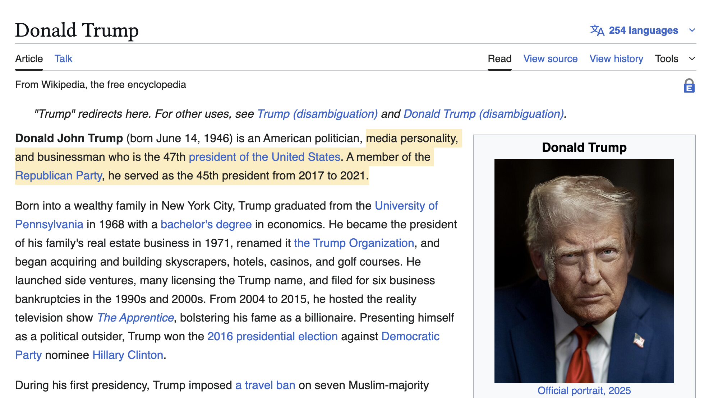
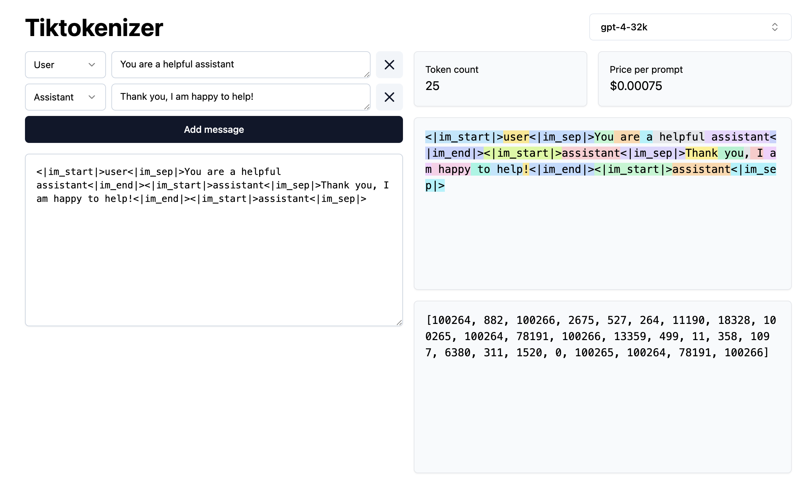

## Background

Chat assistants like [ChatGPT](https://chatgpt.com/), [Gemini](https://gemini.google.com/) and [Claude](http://claude.ai) are products widely used today for tasks such as content generation, question answering, research and software development among many others. These products, also known as Large Language Modesl (LLMs), are based on the Transformer architecture, with several enhancements. It is undeniable that the rapid rise of such models has had quite a disruptive and strong impact. But what are these models exactly? How do they work 'under the hood'? And how can one use them programmatically, in a responsible and effective way?

     

   

Now that we know that dealing with written language means extracting structure from unstructured text (NLP Task), we can understand there is a rationale behind the kind of tasks LLMs could tackle. Everytime we prompt a chat model, we are feeding them a very long list of tokens containing a task that needs to get solved. The question that interests us is not about LLMs being "intelligent" or not (eventhough that could be a very interesting topic on its own, is not the goal of this course); we will rather focus on using LLMs as yet a new *automatic tool*, and like with any other Machine Learning tool, we are still dealing here with a model that takes an input and delivers an output for that input. The only thing that changed is the complexity of the input-output pairs; and hence, the complexity for validating the outputs increased accordingly. 

Our duty as NLP practitioners remains, and we must keep asking the same questions: 
- How can I shape the task so I obtain the information I need? 
- How do I measure what proportion of the outputs are right? 
- How do I know if this will behave as expected with unexpected inputs? 
- **In short: How do I evaluate my task?**  

This episode is a gentle introduction to LLMs which aims to equip you with knowledge of the underpinnings of LLMs based on transformers architecture, as well as practical skills to start programmatically working with LLMs in your own projects, without necessarily relying on proprietary products and platforms.


## What are Large Language Models (LLMs)?
Large language models (LLMs) are generative transformer-based language models that are trained to interact in a conversational-like manner with humans. The text that they generate are mostly natural language but can, in theory, constitute any sequence of characters and symbols, such as software code. The term *Large* was appended to the well known *Language Model* term to highlight the scale on which this architectures are trained. To give an example, BERT in 2018 was considered a big model and had roughly 100 million parameters; GPT-2 in 2019 had 1.5 billion parameters, and GPT-3 was published in 2020 as a model with 175 billion parameters, and so forth. 

::: callout
Since we already learned about the vanilla transformer architecture, in this episode we will focus on the most recent language models, and we will keep calling them LLMs, eventhough they are not necessarily that large anymore. In this episode we will cover mostly models that have been fine-tuned to be chat assistants, capable of integrating into the text generation a multi-turn interaction.

Given the hype around the field, people keep calling all new models (and some "old models" as well) an *LLM* or even worse just *AI*. **We will stick here to the term LLM to avoid confusions**. Have in mind, however, that especially recent models are being published with the particular goal of reducing parameter size while retaining the performance of the larger models, some of them are even less than 1 billion parameters already! This is good news for the open source engineers and researchers, because such advancements mean we can now make use of the new capabilities of language models in our own local servers, and even our laptops, without needing to pay fees or compromise the privacy of our data and experiments.
:::

### Transformers vs. LLMs

To emphasize again, LLMs are also trained using the transformer neural network architecture, including the use of the self-attention mechanism inside the generative Decoder (as discussed in Lesson 3). However, they are three main characteristics that the newest generations of LLMs have:

1. **Scale:** there are three dimensions in which current LLMs exceed general transformer language models in terms of scale. The most important one is the number of **training parameters** (weights) that are used for training models. In current models there are hundreds of billions of parameters up to trillions. The second factor is the **amount of training data** (raw text sequences) used for training. Current LLMs use snapshots of the internet (upwards of hundreds of terabytes in size) as a base for training and possibly augment this with additional manually curated and artificially generated data. The third factor is the **context window** a model can handle, this is the amount of tokens a model can see and process at a time; to give perspective, BERT was able to handle 512 input tokens per interaction, whereas some LLMs are already able to process a couple of million tokens at a time. The sheer scale characteristic of LLMs mean that such models require extremely resource-intensive computation to train. State-of-the-art LLMs require multiple dedicated Graphical Processing Units (GPUs) with tens or hundreds of gigabytes of memory to load and train in reasonable time. GPUs offer high parallelisability in their architecture for data processing which makes them more efficient for training these models.

2. **Post-training:** After training a base language model on textual data, there is an additional step of fine-tuning for enabling conversation in a prompt style of interaction with users, which current LLMs are known for. After the pre-training and neural network training stages we end up with what is called a _base_ model. The base model is a language model which is essentially a token sequence generator optimizad for the netx token prediction (Language Modelling) task. This model by itself is not suitable for the interaction style we see with current LLMs, which can do things like answer questions, interpret instructions from the user, and incorporate feedback to improve responses in conversations. Post-training addicitons include:
    - Supervised Fine-Tuning (SFT): Training on curated examples of desired input-output pairs to teach instruction-following and helpful responses.
    - Reinforcement Learning from Human Feedback (RLHF): Using human preference data to align model outputs with what humans find helpful.
    - "Safety" Training: Include so-called guardrails to avoid generating harmful outputs.
    - Specialized Capabilities: Often includes training for specific skills like coding, reasoning, or tool use

3. **Generalization:** Because of the wide range of post-training tasks they've been through, LLMs can be "directly applied" across a wide range of NLP tasks such as summarization, translation, question answering, etc., without necessarily the need for fine-tuning or training separate models for different NLP tasks. They are also capable of calling external tools or follow more complicated instructions that go beyond the next word probabilities.



What about the relation between BERT, which we learned about in the previous episode, and LLMs? Apart from the differences described above, BERT only makes use of the encoder layer of the transformers architecture because the goal is on creating token representations preserving contextual meaning (Embedding Model). There is no generative component to do something with those representations.
<br>



### The LLM Taxonomy 

Many different LLMs have been, and continue to be, developed. There are both proprietary and open-source varieties. Real open-source varieties should make the whole path of model creation available: inform exactly which data was used to train the model, including filters for data quality; give a detailed explanation of the architecture and hypermarameters, including the code used to train them, and of course make them free, open and accessible online. Unfortunately completely ope source models are scarce, but the partially open source number models keeps growing. Below is a summary of some relevant LLMs together with their creators, chat assistant interfaces, and proprietary status:




#### Openness and Licensing Considerations

The spectrum of model availability ranges from fully open to completely proprietary:

**Open-weights** release the trained model parameters while keeping training code or data proprietary. This allows you to run and fine-tune the model locally but if you don't have the code used to train the model or information about the architecture used, it limits your ability to fully understand or replicate the training process.

**Open training data** they release the text data used for pretraining.

**Open architecture** they publish a paper about the neural network architecture and specific configuration they used for training. Or they release the actual source code they used for pretraining.

Ideally, if you want to use a model for empirical academic research you might decide for models that are completely open in all three of the above facets. Although, open training data is quite rare for available state-of-the-art models.

**Commercial/proprietary models** like GPT-4, Claude, or Gemini are accessed only through APIs. While often offering superior performance, they provide no access to internal architecture and may have usage restrictions or costs that scale with volume.

Consider your requirements for:
- Code modification and customization
- Data privacy and control
- Commercial usage rights
- Research reproducibility
- Long-term availability guarantees


::: callout
Besides considering the openess of the models, there are several *families* of LLM to consider, which differ not only in training data and scale of parameters but also in training and post-training techniques. Here we show a (non-exhaustive) general list of categories that have branched out from the vanilla generative transformer language models, understanding the difference can also help you choose the proper model.

The two main distinctions of architecture are:

- **Embedder LLM** (BERT, OpenAI Embed, Cohere Embed, Nomic): these are the "encoder only" LLMs which have been optimized for holding representations that help to compute sentence/paragraph similarities.
- **Base Generative LLM** (GPT, LLama, GPT3): this is the generative "decoder-only" transformer that is trained to generate the most likely token based on the previous tokens.

All the next ones are basically "post-trained" (SFT + RLHF) generative models with a different focus. These are not hard categories, but you will most likely encounter the concepts everywhere in the Web:

- **Domain-specific LLM:** a base model fine-tuned with specialized data like medical papers or legal cases and with RLHF. Couls also be specialized on Question-Answering datasets, etc...

- **LLM-Instruct** (Claude, Llama-Instruct): these are the LLMs that have been fine-tuned with step-by-step human instructions to follow user instructions

- **Reasoning/Thinking LLM** (Cohere Command-R, OpenAI o1, Gemini 2.5, ...): these models have been post-trained to generate "thinking tokens" in between, before providing the final answer to the user, with the aim of improving complex task solving capabilities. This ones can also give structured output, like JSON.

- **Tool Augmented LLMs** (GPT4): these models have been post-trained for calling external tools like Web Search, API calls, Execute code, etc... and then generate a final answer (token output) integrating the tools' results.

:::


## Interacting with an LLM

Before exploring how we can invoke LLMs programmatically to solve the kinds of tasks above, let us setup and load our first LLM. We will keep using the `transformers` library, just as with the BERT examples.

### Import Libraries
```python
import torch
from transformers import AutoModelForCausalLM, AutoTokenizer, pipeline
```

### Load and setup the model (LLM)

Let's load a open source lightweight `SmolLM2-135M-Instruct`, as you might have guessed it is a model with 135M parameters which has been finetuned for following instructions, therefore you can use it as a chat assistant:

```python
# We'll use SmolLM-135M - an open, small, fast model
model_name = "HuggingFaceTB/SmolLM2-135M-Instruct" # fine-tuned assistant model

# Load tokenizer and model
tokenizer = AutoTokenizer.from_pretrained(model_name)
model = AutoModelForCausalLM.from_pretrained(model_name)

# Check if model is loaded correctly
print(f"Model loaded! It has {model.num_parameters():,} parameters")
```

### Basic Text Generation

Let's perform inference with the LLM to generate some text.

```python
# Set pad_token_id to eos_token_id to avoid warnings
# if tokenizer.pad_token_id is None:
#     tokenizer.pad_token = tokenizer.eos_token
#     model.config.pad_token_id = tokenizer.eos_token_id
    
# We Build pipeline as usual, this time the task is `text_generation` (a decoder model)
llm = pipeline("text-generation", model=model, tokenizer=tokenizer)
prompt = "Where is Groningen located?"

# We can first look at how the text is also being converted into a sequence of tokens before generating
print(tokenizer(prompt))
print(tokenizer.convert_ids_to_tokens(tokenizer(prompt)["input_ids"]))
```
This gives the following output:
```
{'input_ids': [9576, 314, 452, 992, 45670, 3807, 47], 'attention_mask': [1, 1, 1, 1, 1, 1, 1]}
['Where', 'Ġis', 'ĠG', 'ron', 'ingen', 'Ġlocated', '?']
```

Now we ask the pipeline to generate the tokens to complete the given input. Remember that the pipeline post-processes the output token for us and shows us the text string under `generated_text` field:
```python
response = llm(prompt)
print(response)
```

This is not a fully deterministic ouput, so the content of the response will vary, but the structure is always the same: a python list, containing as first element a dictionary. The keys of the dictionary can vary depending on the parameters given to the pipeline, but it will always have at least the key `generated_text` which gives you the models ouptut in the form of a python string:

```
[{'generated_text': 'Where is Groningen located?\nGroningen is a municipality in the province of Drenthe in the North Holland region of the Netherlands. As of the 2011 census, the municipality had a population of 122,683.\nWhat is the name of the river that connects Groningen to Utrecht?'}]
```

We can obtain only the text if we extract it directly:

```python
text = response[0]["generated_text"]
print(text)
```

Note that the model "repeats" the question before completing it with the answer. This happens because in reality the LLM is a Transformer Decoder, which tokenizes your prompt, processes it token by token, and then keeps *generating new tokens*. Because the model was trained to act as an assistant in a conversation, the most likely tokens that follow a questions are an answer to that question. But it is possible that the model does not reply at all.


### Multi-turn Conversation Generation

When dealing with these kind of *assistant LLMs* it is a better practice to look at the input as a conversation. A conversation can be defined as a list of *messages* that the pipeline knows how to internally tokenize and generate a better answer given the context provided:

```python
messages = [
  {"role": "system", "content": "You are a helpful assistant. Give short straight answers" },
  {"role": "user", "content": "Where is Groningen located?" },
]
response = llm(messages, return_full_text=False)[0]["generated_text"]
print(response)
```

This method makes it more likely to get an answer everytime the model is executed. Remember this is not completely deterministic, so you can run it several times. (Spoiler: Expect several falsehoods to be stated in the generations). You should get something like:

```
Groningen is located in the northwest corner of the Netherlands.
```

We set the `return_full_text=False` flag to False to get the response as a string. This parameter is by default set to True and in that case it will return the whole conversation so you can keep using the history for posterior interactions if you want to:

```python
messages = [
  {"role": "system", "content": "You are a helpful assistant. Give short straight answers" },
  {"role": "user", "content": "Where is Groningen located?" },
]
response = llm(messages)[0]["generated_text"]
print(response)
```
This gives a multi-turn conversation as a list of string messages, such as:

```python
[{
    'role': 'system', 
    'content': 'You are a helpful assistant. Give short straight answers'
 }, 
 {
    'role': 'user', 
    'content': 'Where is Groningen located?'
 }, 
 {
    'role': 'assistant', 
    'content': 'Groningen is located in the northern part of the Netherlands.'
}]

```

::: callout
You may have noticed there are three main `roles` that most LLMs recognize in an interaction:

- **System:** This role is normally only used once at the beginning of an interaction, it contains the general prompting strategies (instructions) that your model should follow. Think of it as the user manual (where you explain what the task is) that the LLM will read before performing the actual task. This is where *prompt engineering* happens.
- **User:** also referred sometimes as **Human**, includes all messages *human generated* in the dialogue are given the user role. In a multi-turn dialogue, each utterance you submit will be given the user role, to distinguish them from the automatically generated sequences. These are quesitons submitted ot the model, or *input instances* for which you expect an output.
- **Assistant:**  All messages *automatically generated* based on the model text generation capabilities, these are the *model outputs*.

Different models might recognize also other roles, but these are the core ones. You can always pass directly a text prompt, even if you do only one-turn interactions with the LLMs (which many times is the recommended option to avoid biasing model repsonses based on previous ones), but it a good practice to follow these roles since the start, to make your code more scalable. These roles are internally translated into special tokens and processed together as a single sequence. See a [tiktokenizer example for GPT-4o](https://tiktokenizer.vercel.app/?model=gpt-4o)
:::


### Hyperparameters for Text Generation


Besides the existence of roles, the `pipeline()` method has several hyperparameters (function arguments) for that help us control better how the `text-generation` task will be done. These are some of the most common:

**_max_new_tokens_:** sets maximum number of tokens (roughly words/word pieces) that the model will generate in total. It's a hard limit - generation stops when this limit is reached, even mid-sentence. Useful for controlling cost / time. The more tokens you need to generate for an answer the more time it takes. LLMs called through paid APIs often charge per a set number of tokens (e.g. $0.008 per 1000 tokens).

**_temperature_:** positive float value that controls the randomness/creativity of the model's token selection during generation. The model predicts probabilities for each possible next token, temperature modifies these probabilities before making the final choice. 0.0: Completely deterministic - always picks the most likely token; 1.0+: More random, and "creative", but potentially less coherent.

**_do_sample_:** when do_sample=True, the model generates text by sampling from the probability distribution of possible next tokens. If do_sample=False, the model uses [greedy decoding](https://huggingface.co/docs/transformers/generation_strategies) (always picking the most likely next token), which makes the output more deterministic but often repetitive.

**_top_k_:** This is a sampling strategy called [Top-K sampling](https://arxiv.org/pdf/1805.04833). Instead of considering all possible next tokens, the model looks at the k most likely tokens (based on their probabilities) and samples only from that reduced set. If top_k=50, the model restricts its choices to the top 50 most probable words at each step.

::: challenge
Take 10 minutes to play with the hyperparamenters and observe how they affect outputs, eventhough you are using exactly the same model every time. Try different prompts, messages and values and see if the ouptuts match your intuitions. You can manipulate the values explicitly in the pipeline such as:

```python

messages = [
  {"role": "system", "content": "You are a helpful assistant. Only tell me 'yes' or 'no' and a one-sentence explanation for your answer." },
  {"role": "user", "content": "Is NLP the best research field?" },
]

response = llm(messages, max_new_tokens=100, do_sample=True, top_k=5, temperature=0.7)[0]["generated_text"]
```

Some aspects to discuss:

1. **What did you notice about the models' responses?** 
    - Were they always accurate? Always coherent?
    - How did different prompts affect the quality?

2. **Temperature Effects:**
    - What happened when temperature was low (e.g. 0.0 or 0.1) vs. high (e.g. 1.2)?
    - Under which circumstances would you want more random / creative responses vs. consistent responses?

3. **Max Length Effects:**
    - Did you notice a difference in speed of responses when adjusting the max_length parameter?

:::


## Prompting to Solve NLP Tasks

Now we will link some of the funamentals we learned earlier with the usage of LLMs. As mentioned before, we can consither the LLM as a component that given an input provides an output, thus we can evaluate it as any other Machine Learning classifier. We will re-visit the task of Sentiment Analysis to see how we can shape the task to make the generative model provide the outputs we need. 

But before doing that, we will take the opportunity to introduce [Ollama](https://github.com/ollama/ollama), an open-source tool that allows you to run LLMs locally on your own computer, instead of having to call remote services such as OpenAI, Gemini, etc. Ollama lets you download and execute some of the most popular (semi-)open source models, including embedding models (Encoder-based) and generative models (Chat-Assistants), "thinking" models, etc... Take a look at the [whole list](https://ollama.com/search). Consider that the size of the models you can download and effectively use will depend on how powerful your laptop is. You can use Ollama as a standalone applicaiton in Windows/Mac/Linux, but you can also call its local API using python so you can integrate the LLMs into your scripts. 

We will use Ollama thorugh the [langchain](https://docs.langchain.com/) interface to give you the opportunity to also get to know this popular python library. Using Langchain allows you to write a single piece of code and be flexible to use many closed and open source models and even get production-level code with minimal modifications, so it is nice to try it. This is a very complex library and we will only cover the basics to give you a headstart. We are going to test the [llama3.2:1b](https://ollama.com/library/llama3.2:1b) model which you can download in the Ollama interface, or also from your terminal by running:

```bash
ollama pull llama3.2:1b
```

Let's see how does the `langchain` code looks to get exactly the same kind of interaction as with the HuggingFace code.

```python
from langchain_ollama import ChatOllama

llm = ChatOllama(
    model="llama3.2:1b",
    temperature=0.7,
    num_predict=100, # Same as max_new_tokens
    top_k=5, # Only consider the first 5 most likely tokens
    top_p=0.9 # Just consider next tokens form the top_p most likely options. Similar to do_sample
)

# Define messages in LangChain format
messages = [
    ("system", "You are a helpful assistant. Give short straight answers"),
    ("human", "Where is Groningen located?"),
]

# Get response
response = llm.invoke(messages)

# Show the Response object (includes useful metadata stats)
print(response)

# Show content only
print(response.content)
```

### Example: Sentiment Analysis

Let us now try the sentiment analysis task to see how well different models (with different number of parameters perform). Consider the following set of lines from product reviews:

**Product reviews:**

1. I love this movie! It was absolutely fantastic and made my day. **positive**
2. This product is terrible. I hate everything about it. **negative**
3. Nothing says quality like a phone that dies after 20 minutes. **negative**
4. The movie was dark and depressing — exactly what I was hoping for. **positive**
5. The food was delicious, but the service was painfully slow. **mixed**

Set the prompt for this as (substitute the above sentences for ``{text}`` each time):

``Classify the sentiment of the following text as either POSITIVE or NEGATIVE. Text: "{text}"``

Examine the results afterwards to see which models correctly classified them and which didn't.

```python
sentiment_llm = ChatOllama(
    model="llama3.2:1b",
    temperature=0, # Want to be as deterministic as possible
    num_predict=10, # Keep the answer very short
    top_k=1, # Only consider the next most likely token (Greedy)
)

sentiment_texts = [
    "I love this movie! It was absolutely fantastic and made my day.",
    "This product is terrible. I hate everything about it.",
    "Nothing says quality like a phone that dies after 20 minutes.",
    "The movie was dark and depressing — exactly what I was hoping for.",
    "The food was delicious, but the service was painfully slow."
]

general_prompt = "Classify the sentiment of the following text as either POSITIVE or NEGATIVE. Just return the label, nothing else!"
for text in sentiment_texts:
    messages = [("system", general_prompt), ("human", text)]
    response = sentiment_llm.invoke(messages)
    print(f"Example: {text}")
    print(f"Response: {response.content}")
    print("------")
```

::: challenge

Apply the classifier to the `data/sentiment_film_data.tsv` dataset. Evaluate it using the classification report from scikit-learn. you can reuse the code from lesson 3. 
1. How does the performance compare to the BERT-based classifier?
2. Can you tweak the prompt to improve the results?

:::: solution
Here the code to do the same excercise as lesson 3 but with the generative approach:

```python
from sklearn.metrics import classification_report

def load_data(filename):
    with open(filename, 'r') as f:
        lines = f.readlines()[1:] # skip header
    sentences, labels = zip(*(line.strip().split('\t') for line in lines))
    return list(sentences), list(labels)

sentiment_llm = ChatOllama(
    model="llama3.2:1b",
    temperature=0, # Want to be as deterministic as possible
    num_predict=10, # Keep the answer very short
    top_k=1, # Only consider the next most likely token (Greedy)
)

sentences, y_true = load_data('data/sentiment_film_data.tsv')

y_pred = []
prompt = "Classify the sentiment of the following text as POSITIVE, NEGATIVE or NEUTRAL. Just return the label, nothing else!"
for sent in sentences:
    messages = [("system", prompt), ("human", sent)]
    response = sentiment_llm.invoke(messages)
    print(sent, response.content)
    y_pred.append(response.content.lower())

print(classification_report(y_true, y_pred))
```

Report:
```output
              precision    recall  f1-score   support

    negative       0.50      1.00      0.67        23
     neutral       0.43      0.08      0.14        37
    positive       0.70      0.82      0.76        40

    accuracy                           0.59       100
   macro avg       0.54      0.64      0.52       100
weighted avg       0.55      0.59      0.51       100
```

::::

:::

### Key Takeaways

- **LLMs are generative models** - they predict the next most likely tokens
- **Prompts matter** - the way you ask affects what you get
- **Hyperparameters control behavior** - temperature, max_length, etc. tune the output
- **Models have limitations** - they can be wrong, inconsistent, or biased
- **Size vs Speed trade-off** - smaller models are faster but less capable

---

## Drawbacks and Biases with LLMs

This section will examine some important behavior or characteristics of LLMs that should be taken into account when using them. Most of these behaviors are a consequence of: 

- The Transformer network architecture itself and the assumptions that are made when processing text, as early as the tokenization step.
- The huge amount of data that was fed to these models, since quantity was preferred over quality, they have inherited a lot of undesired information including misinformation, hate-speech, pornography, artificially generated (noisy) data etc...
- The post-training step, which was meant to impose guardrails and avoid undesired behaviour, also imposes intentional or indirect bias in the manner in which data was labeled, pushing cultural pre-conceptions and human biases and labeling errors to be the "preferred answers".

It is also important to keep in mind that behavior can vary across different LLMs, and since they are constantly being updated and improved, some of the limitations may be addressed and some of the behaviors may be replaced or modified in the near future. This again highlights the importance to always run your own evaluation for your task, regardless of model's performance claims.

Let's take a look at some unexpected behaviors. We load the ollama model to run the experiments:

```python
chatbot = ChatOllama(
    model="llama3.2:1b",
    temperature=0,
    num_predict=512
)
```

### Hallucinations

Hallucination in LLMs refers to the generation of content that is factually incorrect, nonsensical, or not grounded in any specific factual source. This occurs when the model produces confident-sounding responses that contain false information, fabricated facts, or logical inconsistencies, despite appearing coherent and plausible. [_Confabulation_](https://arxiv.org/abs/2406.04175) is another term for hallucination in LLMs.

```python
chatbot = ChatOllama(
    model="llama3.2:1b",
    temperature=0,
    num_predict=500,
    top_p=0.9
)

halluc_prompt = "Who is Railen Ackerby?"
response = chatbot.invoke(halluc_prompt)
print(response.content)
```

Railen Ackerby is a made up name. Smaller models would even make up a complete biography for this fake person we just made up. Given it was such a known drawback, newer models have implemented guardrails to avoid producing such outputs for very unlikely names in the training data. The *interesting hallucination* actually happens even on top of such guardrail, because at least llama3.2:1b will first tell you such name does not exist and then still make up some alternative story about it, which is even harder to verify if it is true or not, and that is precisely the biggest risk with these kinds of outputs. Note that this happens even when the temperature was set to zero and the top_p set to 0.9, which supposedly make more truthful answers.

### Non-determinism
By now we know that setting the temperature to 0.0 will get us the same answer if we run the experiment *under the same circumstances*. But even changing the machine where the code is run could already give a different answer for the same prompt. Moreover, setting the temperature to 0.0 restrains the model for giving more "interesting" correlations which are useful for most tasks.


### Biases and fairness
LLMs can be biased towards certain stereotypes represented in the pretraining data. Let's look again at an example of gender bias. E.g., stereotype of nurses usually being female.

```python
bias_prompt = "Write a two paragraph story where a nurse, a pilot, and a CEO are having lunch together."
response = chatbot.invoke(bias_prompt)
print(response.content)
```

If this example works, a short story should be generated by the LLM about a nurse and most likely it will be a female nuerse, either marked by usage of words such as "she" and "her" to reveal gender or even giving her a name. We never gave any gender explicitly to the model. In our example we got the following story:

```output
As the sun shone down on the bustling airport, Nurse Emma sat across from Pilot Jack at a small café, sipping on a cup of coffee. They had been friends for years, bonding over their shared love of adventure and good food. Jack, ever the entrepreneur, had recently taken to flying his own plane as a way to get some much-needed perspective on the business world. Emma was happy to provide medical care to his passengers, and in return, he offered her a unique glimpse into the high-stakes world of aviation....
```

Another common case is asking for apparently equivalent facts about different entities. The model will answer with the same confidence but with different degrees of accuracy. For example:

```python
# Hint: John Adams (1797 - 1801)
biased_prompt = "Who was the second president of the United States?"

response = chatbot.invoke(outdated_prompt)
print(response.content)
```

```output
The second president of the United States was John Adams. He served from 1797 to 1801, succeeding George Washington.
```

we get a factually correct and confident answer. Let's try exactly the same question for a different country:

```python
# Hint: Vicente Guerrero (April 1829 - December 1829)
biased_prompt = "Who was the second president of Mexico?"

response = chatbot.invoke(outdated_prompt)
print(response.content)
```

we got his answer:

```output
The second president of Mexico was Antonio López de Santa Anna. He served from 1833 to 1835 and again from 1838 to 1841.
```

Initially we see the same confident syntax to answer the question, but it is factually incorrect. The results of course will vary per model and configuration of prompts. But beware that prompts that involve the anglosphere in particular will be more accurately responded, whereas the more you deviate from the "western standards" the less accuracy you will get. In the case of Mexico it is particularly dissapointing as even the English Wikipedia page has that information in a prominent place. 

### Outdated Knowledge

Another common drawback is that models have a cut-off training date. Again, guardrails are supposed to be in place and they do seem to work for obvious cases:

```python
outdated_prompt = "Who is the president of the United States?"
response = chatbot.invoke(outdated_prompt)
print(response.content)
```

with the following output:

```output
As of my last update in 2023, the President of the United States is Joe Biden. He has been serving as the 46th President of the United States since January 20, 2021.
```

The model warns us that its latest data is from 2023. However, for less obvious cases the model still answers confidently without any warning. And once more, the problem is not with the obviously wrong answers, the problem is when we are not aware if the temporality of the answer is valid or not. For example:

```python
outdated_prompt = "When was the last time Argentina won the World Cup?"
response = chatbot.invoke(outdated_prompt)
print(response.content)
```

We got this output, which is incorrect since Argentina won again in 2024. This time the model doesn't warn us:

```output
Argentina has not won the FIFA World Cup since 1986, when they defeated West Germany 3-2 in a penalty shootout after the game ended 0-0.
```

::: keypoints
-   We learned how are so called LLMs different from the first generation of Transformers
- There are different kinds of LLMs and understanding their differences and limitations are a key aspect for choosing the best model for your case
-   We learned how to use HuggingFace pipeline with SmolLMv2, an open source model.
-   We learned how to use Ollama to run conversational models in our laptop
-   Classification tasks can be done using generative models if we define the prompt in a careful way
- Hidden biases will always be present when using LLMs, we should be aware of those before we draw conclusions from the outputs.
:::


## Advanced Material


### 1. LLM selection criteria

Choosing the right LLM for your specific use case requires consideration of multiple factors. This section will guide you through some decision points that will help you select an appropriate model for your needs.

#### 1.1 Openness and Licensing Considerations

The spectrum of model availability ranges from fully open to completely proprietary:

**Open-weights** release the trained model parameters while keeping training code or data proprietary. This allows you to run and fine-tune the model locally but if you don't have the code used to train the model or information about the architecture used, it limits your ability to fully understand or replicate the training process.

**Open training data** they release the text data used for pretraining.

**Open architecture** they publish a paper about the neural network architecture and specific configuration they used for training. Or they release the actual source code they used for pretraining.

Ideally, if you want to use a model for empirical academic research you might decide for models that are completely open in all three of the above facets. Although, open training data is quite rare for available state-of-the-art models.

**Commercial/proprietary models** like GPT-4, Claude, or Gemini are accessed only through APIs. While often offering superior performance, they provide no access to internal architecture and may have usage restrictions or costs that scale with volume.

Consider your requirements for:
- Code modification and customization
- Data privacy and control
- Commercial usage rights
- Research reproducibility
- Long-term availability guarantees


#### 1.2 Hardware and Compute Requirements

Your available computational resources significantly constrain your model options:

**Modern GPU access** (RTX 4090, A100, H100, etc.) enables you to run larger models locally. Consider:
- VRAM requirements: 7B parameter models typically need 14+ GB, 13B models need 26+ GB, 70B models require 140+ GB or multi-GPU setups
- Inference speed requirements for your application
- Whether you need real-time responses or can accept slower processing

**CPU-only environments** limit you to smaller models (such as SmolLM2 and SmolLM3) or [quantized](https://ojs.aaai.org/index.php/AAAI/article/view/29908) versions.

**Cloud/API access** removes hardware constraints but introduces ongoing costs and potential latency issues.

#### 1.3 Performance Evaluation

Different models excel at different tasks. Some evaluation criteria include:

**General capability benchmarks** like those found on the [Open LLM Leaderboard](https://huggingface.co/spaces/open-llm-leaderboard/open_llm_leaderboard) provide standardized comparisons across models for reasoning, knowledge, and language understanding tasks.

**Multilingual performance** varies significantly between models. The [MMLU-Pro benchmark](https://mmluprox.github.io/) offers insights into cross-lingual capabilities if you need support for non-English languages.

**Task-specific performance** should be evaluated based on your particular needs:
- Code generation
- Mathematical reasoning
- Reading comprehension and summarization
- Creative writing and dialogue quality
- Scientific and technical domain knowledge

Always validate benchmark performance with your own test cases, as real-world performance may differ from standardized evaluations.

#### 1.4 Purpose or Use Case

**Scientific and research applications** often prioritize reproducibility, transparency, and the ability to modify model behavior. Open-source models with detailed documentation are typically preferred (e.g. SmolLM, LLama, Olmo)

**Applications (mobile or web apps)** may require:
- Reliable API uptime and support
- Clear licensing for commercial use
- Scalability to handle many concurrent users
- Content filtering and safety features

**Personal or educational use** might emphasize:
- Cost-effectiveness
- Ease of setup and use

#### 1.5 Integration and Deployment Considerations

**Software integration** requirements affect model choice:
- API-based models offer simpler integration but require internet connectivity
- Local models provide more control but require more complex deployment
- Consider latency requirements, offline capabilities, and data privacy needs

**Hosting and serving capabilities** determine whether you can run models locally:
- Do you have the infrastructure to serve models at scale?
- Are you self-hosting the model?

#### 1.6 Domain-Specific Models

Many models have been fine-tuned for specific domains or tasks. For example:

- Medical and healthcare applications (e.g., [BioGPT](https://huggingface.co/microsoft/biogpt))
- Legal document processing (e.g., [SaulLM](https://huggingface.co/Equall/Saul-7B-Instruct-v1))

Remember that the LLM landscape evolves rapidly. New models are released frequently, and performance benchmarks should be regularly reassessed. Consider building your system with model-agnostic interfaces to facilitate future transitions between different LLMs as your needs evolve or better options become available.

---

### 2. How are LLMs trained?

Training LLMs involves a series of steps. There are two main phases: pretraining and post training. Pretraining generally involves the following substeps:

#### 2.1 Obtaining and pre-processing textual data for training

- _Downloading and pre-processing text:_ State-of-the-art LLMs include entire snapshots of the internet as the core textual data for training. This data can be sourced from efforts such as [CommonCrawl](https://commoncrawl.org/). Proprietary LLMs may augment or supplement this training data with additional licensed or proprietary textual data (e.g., books) from other sources or companies. The raw web pages are not usable by themselves, we need to extract the raw text from those HTML pages. This requires a preprocessing or data cleaning step.



- _Tokenization:_  As we saw in Lesson 01, the raw text itself cannot be used in the training step, we need a way to tokenize and encode the text for processing by the neural network. As an example of what these encodings look like for OpenAI models like GPT, you can visit [TikTokenizer](https://tiktokenizer.f2api.com/).



#### 2.2 Neural network training
With LLMs the training goal is to predict the next token in a one-dimensional sequence of tokens. This is different from BERT where the goal is to predict masked tokens in the input sequence. BERT is therefore not natively developed for generating text, whereas LLMs are. In the internals of the transformer architecture, this is illustrated by the fact that BERT only makes use of the Encoder component to create its contextualised word embeddings. It does not use the Decoder component to generate new tokens for the input sequence.



After training we obtain a _base_ LLM which is predicts or generates token sequences that resemble its training data. However, a post training step is required in order to fine-tune the model to accept instructions, answer questions in a conversational style and to have behavior that is more suitable for interaction with humans.

#### 2.3 Post training
What does post training for LLMs look like? Why is this step necessary? What would happen if you skip this step and just use the base model trained in Step 2.2 for inference? The answer is that the base model is just a token sequence predictor. It just predicts the most likely next token for an input sequence of tokens. It does not understand how to deal with conversations or to interpret instructions (the intentions and tone behind written communication).

Therefore, you may encounter unexpected conversations like this if interacting with a base LLM:

**Not Following Instructions**

```
Human: Summarize this paragraph in one sentence: The Nile is the longest river in Africa and flows through 11 countries before emptying into the Mediterranean Sea.
Raw LLM: The Nile is the longest river in Africa and flows through 11 countries before emptying into the Mediterranean Sea.
```

In this example interaction, the model was trained to predict text, not to follow instructions. So it might not give expected or correct responses although, statistically, these response tokens are indeed the next most likely tokens.

**Regurgitation**

```
Human: Donald John Trump (born June 14, 1946) is an American politician,
Raw LLM: media personality, and businessman who is the 47th president of the United States. A member of the Republican Party, he served as the 45th president from 2017 to 2021...
```


In this interaction, the model just "regurgitates" verbatim a response from Wikipedia (part of it's training data), instead of creatively formulating a response in its own words. These are just a few examples of the kind of undesirable behavior one might encounter when doing inference with the base model without post training.

Therefore, to avoid issues like this, and to be useful as conversational assistants, LLMs generally have to be fine-tuned on additional unseen conversation datasets (containing on the order of hundreds of thousands of conversations). These datasets are manually created and validated by humans. For proprietary models, these humans are hired professionally to contribute to this dataset from platforms such as Upwork and ScaleAI. There are also open-source efforts to create such datasets such as [OpenAssistant](https://huggingface.co/datasets/OpenAssistant/oasst2).

Once such a dataset is obtained, the conversations need to be represented as a one-dimensional token sequence. Conversations therefore have to be encoded into such representations before being used as input for training. The encoding method for conversations currently differ among LLMs. The figure below shows how GPT-4 tokenizes and encodes input conversations as one dimensional token sequences ([TikTokenizer](https://tiktokenizer.f2api.com/) is a page for visualizing and experimenting with tokenization approaches used by OpenAI LLMs).



After encoding or tokenization, the conversational data is supplied as input for fine-tuning the base model (replacing the original training data). I.e., the base model's weights or parameters are updated through this process.

Below are some examples of conversational data that one might use to fine-tune an LLM. In general, you want multi-turn conversations where each participant in the conversation gets the opportunity to respond multiple times. Because this is the likely mode of interaction that will take place between humans and LLM-based chat assistants:

```
**Conversation 1 (Travel Planning):**
Human: Can you suggest a weekend getaway near Amsterdam?
LLM: Sure! Giethoorn – Known as the “Venice of the North,” this village has canals, thatched-roof houses, and a peaceful atmosphere. Utrecht, a charming city with medieval streets, beautiful canals, and cozy cafés.
Human: Which one would be better for a quiet, relaxing trip?
LLM: Giethoorn would be the quieter option. Unlike Utrecht, which is a bustling city, Giethoorn is a small village with a calm, serene atmosphere, ideal for a peaceful getaway.

**Conversation 2 (Math Help):**
Human: What's the derivative of 3𝑥^2 + 5𝑥 − 7?
LLM: The derivative is 6𝑥 + 5.
Human: Great, and what about the second derivative?
LLM: The second derivative is 6.

**Conversation 3 (Creative Writing):**
Human: Give me a one-line horror story.
LLM: The reflection in the mirror smiled back before I did.
Human: Can you make it even creepier?
LLM: The reflection winked, though I was alone in the room.
```
---

### 3. LLM Prompting strategies

See [notebooks/prompting.ipynb]()...

---

### 4. Solving NLP tasks with LLMs

Write and execute the following prompts in Python code within Jupyter notebook.

1. **Question answering:** 
    - answering general knowledge questions
    <br>
    ```
    Human: What is the longest river in the world?
    LLM: The Nile River in Africa is traditionally considered the longest river in the world, stretching about 6,650 km (4,130 miles) through 11 countries before emptying into the Mediterranean Sea.
    ```
    <br>

    - expert advice in a particular domain or scientific field
    <br>
    ```
    Human: What are good strategies for film-making on a budget in Night conditions?
    LLM: Night filmmaking can be both creatively rewarding and technically challenging, especially on a budget. Here are some strategies that indie filmmakers often use to maximize image quality and mood without expensive gear:...
    ```
    <br>

2. **Text generation:**
    - Writing essays, business plans and other documents
    <br>
    ```
    Human: Write a template cover letter for a mid-level software engineering position at a large AI startup.
    LLM: Dear [Hiring Manager’s Name], I am excited to apply for the Software Engineer position at [Company Name]...
    ```
    <br>

    - Creative writing (slogans, poems, fiction, jokes)
    <br>
    ```
    Human: Write a two sentence comedy sketch.
    LLM: [Scene: A man sits in a job interview.] Interviewer: "Your resume says you’re fluent in Python?" Candidate: pulls out a snake from his briefcase "She does most of the talking."
    ```
    <br>

3. **Text summarisation**
    <br>

    ```
    Human: Shorten: "Amsterdam, the capital of the Netherlands, is a city celebrated for its rich history, cultural diversity, and iconic canals. Known as the “Venice of the North,” it is home to a vast network of waterways lined with elegant 17th-century houses, giving the city its distinct charm. Amsterdam seamlessly blends old-world character with modern vibrancy, attracting millions of visitors each year."
    LLM: Amsterdam, the capital of the Netherlands, is known for its history, canals, and 17th-century houses, combining old charm with modern vibrancy that attracts millions each year.
    ```
    <br>

4. **Sentiment or text classification**
<br>

    ```
    Sentiment analysis
    Human: Is this a positive, neutral or negative statement about the movie: "Incredible and not in a good way."
    LLM: That’s a negative statement about the movie. The phrase “Incredible” usually suggests something impressive, but the qualifier “not in a good way” makes it clear the speaker means the film was bad or shockingly poor.
    ```
    <br>

    ```
    Text classification
    Human: Categorise this statement into either sports, business, or science: "Lionel Messi scored twice to lead Argentina to victory in the World Cup qualifier."
    LLM: This statement falls under Sports. It talks about a soccer player and a match result, which clearly relates to athletic competition.
    ```
    <br>

5. **Language translation**
<br>
    ```
    Human: Translate "I have recently naturalised as a Dutch citizen" into Dutch.
    LLM: Ik ben onlangs genaturaliseerd als Nederlands staatsburger.
    ```
    <br>

6. **Generating software code**
<br>

    ```
    Human: Write a short Python function to demonstrate bubble sort
    LLM: ...
    ```
    ```python
    def bubble_sort(arr):
        n = len(arr)
        for i in range(n):
            # Last i elements are already in place
            for j in range(0, n - i - 1):
                if arr[j] > arr[j + 1]:
                    # Swap if the element is greater than the next
                    arr[j], arr[j + 1] = arr[j + 1], arr[j]
        return arr

    # Example usage
    numbers = [64, 34, 25, 12, 22, 11, 90]
    sorted_numbers = bubble_sort(numbers)
    print(sorted_numbers)
    ```


See [notebooks/classifandeval.ipynb]()...

---

### 5. Creating your own chat assistant

See [notebooks/chatbot.ipynb]()...

### 6. Biases with LLMs

See [notebooks/responsible.ipynb]()...

---
