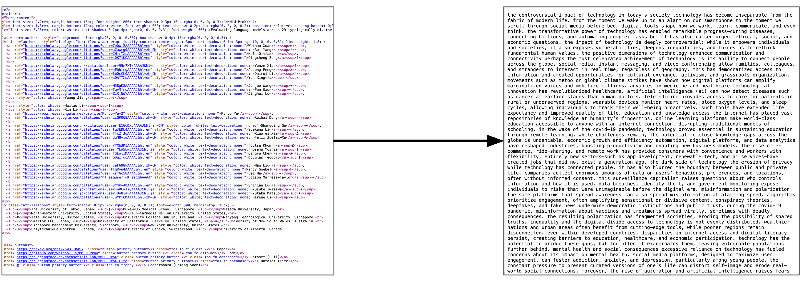

## Advanced Material

This document contains supplementary lesson material for Episode 4 on LLMs, which we could not cover due to time or mismatches with ILOs (Intended Learning Objectives).

### 1. LLM selection criteria

Choosing the right LLM for your specific use case requires consideration of multiple factors. This section will guide you through some decision points that will help you select an appropriate model for your needs.

#### 1.1 Openness and Licensing Considerations

The spectrum of model availability ranges from fully open to completely proprietary:

**Open-weights** release the trained model parameters while keeping training code or data proprietary. This allows you to run and fine-tune the model locally but if you don't have the code used to train the model or information about the architecture used, it limits your ability to fully understand or replicate the training process.

**Open training data** they release the text data used for pretraining.

**Open architecture** they publish a paper about the neural network architecture and specific configuration they used for training. Or they release the actual source code they used for pretraining.

Ideally, if you want to use a model for empirical academic research you might decide for models that are completely open in all three of the above facets. Although, open training data is quite rare for available state-of-the-art models.

**Commercial/proprietary models** like GPT-4, Claude, or Gemini are accessed only through APIs. While often offering superior performance, they provide no access to internal architecture and may have usage restrictions or costs that scale with volume.

Consider your requirements for:
- Code modification and customization
- Data privacy and control
- Commercial usage rights
- Research reproducibility
- Long-term availability guarantees


#### 1.2 Hardware and Compute Requirements

Your available computational resources significantly constrain your model options:

**Modern GPU access** (RTX 4090, A100, H100, etc.) enables you to run larger models locally. Consider:
- VRAM requirements: 7B parameter models typically need 14+ GB, 13B models need 26+ GB, 70B models require 140+ GB or multi-GPU setups
- Inference speed requirements for your application
- Whether you need real-time responses or can accept slower processing

**CPU-only environments** limit you to smaller models (such as SmolLM2 and SmolLM3) or [quantized](https://ojs.aaai.org/index.php/AAAI/article/view/29908) versions.

**Cloud/API access** removes hardware constraints but introduces ongoing costs and potential latency issues.

#### 1.3 Performance Evaluation

Different models excel at different tasks. Some evaluation criteria include:

**General capability benchmarks** like those found on the [Open LLM Leaderboard](https://huggingface.co/spaces/open-llm-leaderboard/open_llm_leaderboard) provide standardized comparisons across models for reasoning, knowledge, and language understanding tasks.

**Multilingual performance** varies significantly between models. The [MMLU-Pro benchmark](https://mmluprox.github.io/) offers insights into cross-lingual capabilities if you need support for non-English languages.

**Task-specific performance** should be evaluated based on your particular needs:
- Code generation
- Mathematical reasoning
- Reading comprehension and summarization
- Creative writing and dialogue quality
- Scientific and technical domain knowledge

Always validate benchmark performance with your own test cases, as real-world performance may differ from standardized evaluations.

#### 1.4 Purpose or Use Case

**Scientific and research applications** often prioritize reproducibility, transparency, and the ability to modify model behavior. Open-source models with detailed documentation are typically preferred (e.g. SmolLM, LLama, Olmo)

**Applications (mobile or web apps)** may require:
- Reliable API uptime and support
- Clear licensing for commercial use
- Scalability to handle many concurrent users
- Content filtering and safety features

**Personal or educational use** might emphasize:
- Cost-effectiveness
- Ease of setup and use

#### 1.5 Integration and Deployment Considerations

**Software integration** requirements affect model choice:
- API-based models offer simpler integration but require internet connectivity
- Local models provide more control but require more complex deployment
- Consider latency requirements, offline capabilities, and data privacy needs

**Hosting and serving capabilities** determine whether you can run models locally:
- Do you have the infrastructure to serve models at scale?
- Are you self-hosting the model?

#### 1.6 Domain-Specific Models

Many models have been fine-tuned for specific domains or tasks. For example:

- Medical and healthcare applications (e.g., [BioGPT](https://huggingface.co/microsoft/biogpt))
- Legal document processing (e.g., [SaulLM](https://huggingface.co/Equall/Saul-7B-Instruct-v1))

Remember that the LLM landscape evolves rapidly. New models are released frequently, and performance benchmarks should be regularly reassessed. Consider building your system with model-agnostic interfaces to facilitate future transitions between different LLMs as your needs evolve or better options become available.

---

### 2. How are LLMs trained?

Training LLMs involves a series of steps. There are two main phases: pretraining and post training. Pretraining generally involves the following substeps:

#### 2.1 Obtaining and pre-processing textual data for training

- _Downloading and pre-processing text:_ State-of-the-art LLMs include entire snapshots of the internet as the core textual data for training. This data can be sourced from efforts such as [CommonCrawl](https://commoncrawl.org/). Proprietary LLMs may augment or supplement this training data with additional licensed or proprietary textual data (e.g., books) from other sources or companies. The raw web pages are not usable by themselves, we need to extract the raw text from those HTML pages. This requires a preprocessing or data cleaning step.



- _Tokenization:_  As we saw in Lesson 01, the raw text itself cannot be used in the training step, we need a way to tokenize and encode the text for processing by the neural network. As an example of what these encodings look like for OpenAI models like GPT, you can visit [TikTokenizer](https://tiktokenizer.f2api.com/).


#### 2.2 Neural network training
With LLMs the training goal is to predict the next token in a one-dimensional sequence of tokens. This is different from BERT where the goal is to predict masked tokens in the input sequence. BERT is therefore not natively developed for generating text, whereas LLMs are. In the internals of the transformer architecture, this is illustrated by the fact that BERT only makes use of the Encoder component to create its contextualised word embeddings. It does not use the Decoder component to generate new tokens for the input sequence.


After training we obtain a _base_ LLM which is predicts or generates token sequences that resemble its training data. However, a post training step is required in order to fine-tune the model to accept instructions, answer questions in a conversational style and to have behavior that is more suitable for interaction with humans.

#### 2.3 Post training
What does post training for LLMs look like? Why is this step necessary? What would happen if you skip this step and just use the base model trained in Step 2.2 for inference? The answer is that the base model is just a token sequence predictor. It just predicts the most likely next token for an input sequence of tokens. It does not understand how to deal with conversations or to interpret instructions (the intentions and tone behind written communication).

Therefore, you may encounter unexpected conversations like this if interacting with a base LLM:

**Not Following Instructions**

```
Human: Summarize this paragraph in one sentence: The Nile is the longest river in Africa and flows through 11 countries before emptying into the Mediterranean Sea.
Raw LLM: The Nile is the longest river in Africa and flows through 11 countries before emptying into the Mediterranean Sea.
```

In this example interaction, the model was trained to predict text, not to follow instructions. So it might not give expected or correct responses although, statistically, these response tokens are indeed the next most likely tokens.

**Regurgitation**

```
Human: Donald John Trump (born June 14, 1946) is an American politician,
Raw LLM: media personality, and businessman who is the 47th president of the United States. A member of the Republican Party, he served as the 45th president from 2017 to 2021...
```


In this interaction, the model just "regurgitates" verbatim a response from Wikipedia (part of it's training data), instead of creatively formulating a response in its own words. These are just a few examples of the kind of undesirable behavior one might encounter when doing inference with the base model without post training.

Therefore, to avoid issues like this, and to be useful as conversational assistants, LLMs generally have to be fine-tuned on additional unseen conversation datasets (containing on the order of hundreds of thousands of conversations). These datasets are manually created and validated by humans. For proprietary models, these humans are hired professionally to contribute to this dataset from platforms such as Upwork and ScaleAI. There are also open-source efforts to create such datasets such as [OpenAssistant](https://huggingface.co/datasets/OpenAssistant/oasst2).

Once such a dataset is obtained, the conversations need to be represented as a one-dimensional token sequence. Conversations therefore have to be encoded into such representations before being used as input for training. The encoding method for conversations currently differ among LLMs. The figure below shows how GPT-4 tokenizes and encodes input conversations as one dimensional token sequences ([TikTokenizer](https://tiktokenizer.f2api.com/) is a page for visualizing and experimenting with tokenization approaches used by OpenAI LLMs).


After encoding or tokenization, the conversational data is supplied as input for fine-tuning the base model (replacing the original training data). I.e., the base model's weights or parameters are updated through this process.

Below are some examples of conversational data that one might use to fine-tune an LLM. In general, you want multi-turn conversations where each participant in the conversation gets the opportunity to respond multiple times. Because this is the likely mode of interaction that will take place between humans and LLM-based chat assistants:

```
**Conversation 1 (Travel Planning):**
Human: Can you suggest a weekend getaway near Amsterdam?
LLM: Sure! Giethoorn – Known as the “Venice of the North,” this village has canals, thatched-roof houses, and a peaceful atmosphere. Utrecht, a charming city with medieval streets, beautiful canals, and cozy cafés.
Human: Which one would be better for a quiet, relaxing trip?
LLM: Giethoorn would be the quieter option. Unlike Utrecht, which is a bustling city, Giethoorn is a small village with a calm, serene atmosphere, ideal for a peaceful getaway.

**Conversation 2 (Math Help):**
Human: What's the derivative of 3ùë•^2 + 5ùë• ‚àí 7?
LLM: The derivative is 6ùë• + 5.
Human: Great, and what about the second derivative?
LLM: The second derivative is 6.

**Conversation 3 (Creative Writing):**
Human: Give me a one-line horror story.
LLM: The reflection in the mirror smiled back before I did.
Human: Can you make it even creepier?
LLM: The reflection winked, though I was alone in the room.
```
---

### 3. LLM Prompting strategies

See [notebooks/prompting.ipynb]()...

---

### 4. Solving NLP tasks with LLMs

Write and execute the following prompts in Python code within Jupyter notebook.

1. **Question answering:** 
    - answering general knowledge questions
    <br>
    ```
    Human: What is the longest river in the world?
    LLM: The Nile River in Africa is traditionally considered the longest river in the world, stretching about 6,650 km (4,130 miles) through 11 countries before emptying into the Mediterranean Sea.
    ```
    <br>

    - expert advice in a particular domain or scientific field
    <br>
    ```
    Human: What are good strategies for film-making on a budget in Night conditions?
    LLM: Night filmmaking can be both creatively rewarding and technically challenging, especially on a budget. Here are some strategies that indie filmmakers often use to maximize image quality and mood without expensive gear:...
    ```
    <br>

2. **Text generation:**
    - Writing essays, business plans and other documents
    <br>
    ```
    Human: Write a template cover letter for a mid-level software engineering position at a large AI startup.
    LLM: Dear [Hiring Manager’s Name], I am excited to apply for the Software Engineer position at [Company Name]...
    ```
    <br>

    - Creative writing (slogans, poems, fiction, jokes)
    <br>
    ```
    Human: Write a two sentence comedy sketch.
    LLM: [Scene: A man sits in a job interview.] Interviewer: "Your resume says you’re fluent in Python?" Candidate: pulls out a snake from his briefcase "She does most of the talking."
    ```
    <br>

3. **Text summarisation**
    <br>

    ```
    Human: Shorten: "Amsterdam, the capital of the Netherlands, is a city celebrated for its rich history, cultural diversity, and iconic canals. Known as the “Venice of the North,” it is home to a vast network of waterways lined with elegant 17th-century houses, giving the city its distinct charm. Amsterdam seamlessly blends old-world character with modern vibrancy, attracting millions of visitors each year."
    LLM: Amsterdam, the capital of the Netherlands, is known for its history, canals, and 17th-century houses, combining old charm with modern vibrancy that attracts millions each year.
    ```
    <br>

4. **Sentiment or text classification**
<br>

    ```
    Sentiment analysis
    Human: Is this a positive, neutral or negative statement about the movie: "Incredible and not in a good way."
    LLM: That’s a negative statement about the movie. The phrase “Incredible” usually suggests something impressive, but the qualifier “not in a good way” makes it clear the speaker means the film was bad or shockingly poor.
    ```
    <br>

    ```
    Text classification
    Human: Categorise this statement into either sports, business, or science: "Lionel Messi scored twice to lead Argentina to victory in the World Cup qualifier."
    LLM: This statement falls under Sports. It talks about a soccer player and a match result, which clearly relates to athletic competition.
    ```
    <br>

5. **Language translation**
<br>
    ```
    Human: Translate "I have recently naturalised as a Dutch citizen" into Dutch.
    LLM: Ik ben onlangs genaturaliseerd als Nederlands staatsburger.
    ```
    <br>

6. **Generating software code**
<br>

    ```
    Human: Write a short Python function to demonstrate bubble sort
    LLM: ...
    ```
    ```python
    def bubble_sort(arr):
        n = len(arr)
        for i in range(n):
            # Last i elements are already in place
            for j in range(0, n - i - 1):
                if arr[j] > arr[j + 1]:
                    # Swap if the element is greater than the next
                    arr[j], arr[j + 1] = arr[j + 1], arr[j]
        return arr

    # Example usage
    numbers = [64, 34, 25, 12, 22, 11, 90]
    sorted_numbers = bubble_sort(numbers)
    print(sorted_numbers)
    ```


See [notebooks/classifandeval.ipynb]()...

---

### 5. Creating your own chat assistant

See [notebooks/chatbot.ipynb]()...

### 6. Biases with LLMs

See [notebooks/responsible.ipynb]()...

---
