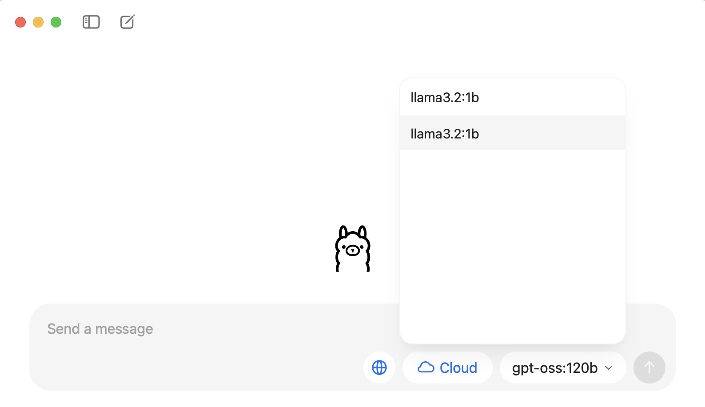

## Software Setup

::::::::::::::::::::::::::::::::::::::: discussion

## 1. Install Python

[Python](https://python.org) is a popular language for scientific computing, and a frequent choice for Natural Language Processing as well.

To install Python, follow the [Beginner's Guide](https://wiki.python.org/moin/BeginnersGuide/Download) or head straight to the [download page](https://www.python.org/downloads/). 

**Note:** We will support **Python 3.10 - 3.12** for this workshop.

Please set up your Python environment ***at least a day in advance*** of the workshop.

If you encounter problems with the installation procedure, ask your workshop organizers via e-mail for assistance so you are ready to go as soon as the workshop begins.

:::::::::::::::::::::::::::::::::::::::::::::::::::

## 2. Download the workshop materials

Follow these steps to download all the workshop materials:

1. Navigate to [https://github.com/carpentries-incubator/Natural-language-processing](https://github.com/carpentries-incubator/Natural-language-processing){:target="_blank"} in your browser.

2. Click on the large green button at the top right of the page called "Code". Make sure you are on the "Local" tab and click on the "Download ZIP" link at the bottom of the tab. This will download all the workshop materials in a ZIP archive.


3. Place the ZIP archive in a chosen location in your file system and extract its contents. A directory with the name "Natural-language-processing-main" will be extracted from the archive.

4. Open a terminal (Mac/Linux) or Command Prompt (Windows) and navigate to the newly extracted directory "Natural-language-processing-main" in the terminal or command prompt.

## 3. Create a Python Virtual Environment 

[Pip](https://pip.pypa.io/en/stable/) is the package management system built into Python. We will use this to install all required packages for the workshop. Pip should be available in your system once you installed Python successfully. **Please note:** installing the packages can take some time, in particular on Windows.

1. Create a [virtual environment](https://packaging.python.org/en/latest/guides/installing-using-pip-and-virtual-environments/#create-and-use-virtual-environments) called `nlp_workshop`:

::: spoiler

### On Linux/macOs

```shell
python3 -m venv nlp_workshop
```

:::

::: spoiler

### On Windows

```shell
py -m venv nlp_workshop
```

:::

2. Activate the newly created virtual environment:

::: spoiler

### On Linux/macOs

```shell
source nlp_workshop/bin/activate
```

:::

::: spoiler

### On Windows

```shell
nlp_workshop\Scripts\activate
```

:::

**Note:** you need to activate your environment every time you restart your terminal!

## 4. Install the required Python packages

Ensure that in your terminal or command prompt that your working directory is the newly extracted "Natural-language-processing-main". Then execute the following command:

::: spoiler

### On Linux/macOs

```shell
python3 -m pip install -r requirements.txt
```

:::

::: spoiler

### On Windows

```shell
py -m pip install -r requirements.txt
```

:::

## 5. Download the required NLP models

To download models required for the workshop with one simple platform-independent command:

```shell
invoke init-models
```

If this command fails for whatever reason, download them separately as follows. Download the Word2Vec model first:

::: spoiler

### On Linux/macOs

```shell
python3 -m gensim.downloader --download word2vec-google-news-300 
```

:::

::: spoiler

### On Windows

```shell
py -m gensim.downloader --download word2vec-google-news-300
```

:::

Then, download the [trained pipelines for English from Spacy](https://spacy.io/models/en/):

::: spoiler

### On Linux/macOs

```shell
python3 -m spacy download en_core_web_sm
```

:::

::: spoiler

### On Windows

```shell
py -m spacy download en_core_web_sm
```

:::

We will use [Ollama](https://ollama.com/) to run large language models in Episode 4 of the workshop. The installer (available for Linux/Windows/Mac OS) can be downloaded here:

https://ollama.com/download

Run the installer and follow the instructions on screen.

Next, download the model that we will be using from a terminal (Mac/Linux) or Command Prompt (Windows) by typing the command:

```shell
ollama pull llama3.2:1b
```

**Note:** if the previous command fails, you can download the model manually inside the Ollama graphic interface. Open Ollama and on the right side of the "Send a message" prompt you will see a dropdown. Type "llama3.2:1b" there and send any message so Ollama can download (pull) the model for you.



## 6. Start Jupyter Lab

We will teach using Python in [Jupyter Lab](http://jupyter.org/), a programming environment that runs in a web browser.

Jupyter Lab is compatible with Firefox, Chrome, Safari and Chromium-based browsers. Note that Internet Explorer and Edge are *not* supported.

See the [Jupyter Lab documentation](https://jupyterlab.readthedocs.io/en/latest/getting_started/accessibility.html#compatibility-with-browsers-and-assistive-technology) for an up-to-date list of supported browsers.

To start Jupyter Lab, navigate to the "Natural-language-processing-main" directory you just extracted in a terminal (Mac/Linux) or Command Prompt (Windows). Then type the command:

```shell
jupyter lab
```
